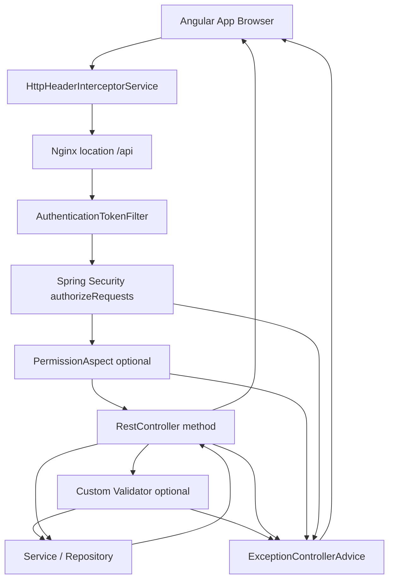

# OpenCBS API Standards

## 0. Plain Language Overview

This document explains how the OpenCBS banking application talks to its server over the web—what URLs look like, how lists are split into pages, how errors are returned, and how sign-in works. **Developers** (backend, frontend, integrations) should use it when building or calling APIs; **product managers, business analysts, and operations staff** should use it to understand what the system can do and what to expect when something fails. After reading, you will know where APIs live (`/api/…`), that there is no version number in the URL path, how pagination and search work, and the standard error message shape—without needing to read Java or TypeScript source code.

**System note:** This repository is a **modern web stack** (Angular client, Spring Boot 1.5.4 / Java 8 server). A scan for mainframe or desktop-era extensions (`.cbl`, `.cob`, `.jcl`, `.pli`, `.rpg`, `.vbp`, etc.) found **no such files** in the codebase. The backend version is legacy in the sense of **older Spring Boot / Java 8**, not mainframe code.

**Audience:** Developers · Product managers · Business analysts · API consumers · QA

---

## Architecture Context (Evidence-Based)

| Layer | Role | Source |
|-------|------|--------|
| Angular client | HTTP calls to `environment.API_ENDPOINT` | `client/src/environments/environment.ts`, `environment.prod.ts` |
| `HttpHeaderInterceptorService` | Adds `Authorization: Bearer …`, `Content-Type` / `Accept: application/json` | `client/src/app/core/services/http-header-interceptor.service.ts`, `app.module.ts` |
| Nginx (`web` service) | Proxies browser `/api` → Spring Boot on port 8080 | `client/default.conf`, `docker-compose.yml` |
| Spring Boot API | ~98 `@RestController` classes under `server/` | Glob search under `server/` |
| PostgreSQL, RabbitMQ | Data and messaging (not REST) | `docker-compose.yml` |

**Base URLs**

| Environment | `API_ENDPOINT` | `DOMAIN` |
|-------------|----------------|----------|
| Development | `http://localhost:8080/api/` | `http://localhost:8080` |
| Production build | `/api/` (relative, via Nginx) | `/` |

**Entry points traced**

- Client bootstrap: `client/src/main.ts` → `AppModule` → `HttpClientModule` + `HTTP_INTERCEPTORS` (`HttpHeaderInterceptorService`).
- Server bootstrap: `server/opencbs-server/src/main/java/com/opencbs/cloud/ServerApplication.java` (`@ComponentScan("com.opencbs")`).
- All documented REST controllers use a class-level path starting with **`/api`**.

---

## 1. REST Conventions

**Audience:** Developers (implementing or integrating endpoints) · Product managers (understanding resource names and workflows)

### 1.1 API style and prefix

OpenCBS exposes a **REST-style JSON HTTP API**. There is no separate API gateway product in `docker-compose.yml`; Nginx forwards `/api` to the Spring Boot container.

- **Prefix:** Every controller examined uses paths under **`/api`** (e.g. `/api/users`, `/api/loan-applications`).
- **Not found in codebase:** GraphQL, gRPC, or a global `/api/v1` path segment for business resources.

### 1.2 URL naming

Conventions observed in active controllers:

| Pattern | Example | Notes |
|---------|---------|--------|
| Plural kebab-case resources | `/api/loan-applications`, `/api/term-deposit-products` | `LoanApplicationController`, `TermDepositProductController` |
| Nested resources | `/api/profiles/people/{personId}/attachments` | `PersonAttachmentController` |
| Sub-resource actions | `/api/loan-applications/sorted`, `…/lookup`, `…/by-profile/{profileId}` | Action as path segment, not always HTTP verb only |
| Maker-checker | `/api/requests`, `POST …/approve` | `RequestController`, client calls in `user-maker-checker.service.ts` |
| Auth | `/api/login`, `/api/login/update-password`, `/api/login/password-reset` | `LoginController` `@RequestMapping("/api")` |
| Utilities / public reads | `GET /api/info`, `GET /api/system-settings`, `/api/utils/**` | Permitted without auth in `WebSecurityConfiguration` |

**Path parameters:** Numeric IDs are typical (`/{id}`, `{profileId}`, `{loanApplicationId}`).

**Query parameters:** Often **snake_case** (e.g. `show_all`) or camelCase for domain sorts (`sortType`, `isAsc` on loan applications).

### 1.3 HTTP methods

| Method | Typical use | Example |
|--------|-------------|---------|
| `GET` | List (often paginated), read one, lookup | `GET /api/profiles`, `GET /api/term-deposit-products/{id}` |
| `POST` | Create, actions, login | `POST /api/login`, `POST /api/users` (maker-checker request) |
| `PUT` | Update | `PUT /api/loan-applications/{id}` |
| `DELETE` | Remove | e.g. attachments `DELETE …/attachments/{attachmentId}` |

Older controllers sometimes use `@RequestMapping(method = RequestMethod.GET)` instead of `@GetMapping`; behavior is the same REST mapping.

### 1.4 Request and response bodies

- **JSON** is the default for API calls from the client (`Content-Type: application/json`, `Accept: application/json` in `HttpClientHeadersService`).
- **Login success** wraps the token in `ApiResponse`:

```json
{
  "data": "<JWT or token string>"
}
```

(`ApiResponse.java`, consumed in `auth.effect.ts` as `res.data`.)

- **Many list endpoints** return Spring Data **`Page`** JSON directly (not wrapped in `ApiResponse`). The Angular client expects fields such as `content`, `totalPages`, `totalElements`, `size`, `number`, `numberOfElements` (see `profile-list.reducer.ts`).

- **Some endpoints** return a plain `String` (e.g. password change messages) or domain DTOs directly.

### 1.5 Authentication header

- **Scheme:** `Authorization: Bearer <token>` (`AuthenticationTokenFilter.java`, `HttpClientHeadersService`, Swagger `apiKey` in header `Authorization`).
- **Token storage (client):** `localStorage` key `token` (`http-client-headers.service.ts`, `auth.effect.ts`).
- **Stateless sessions:** `SessionCreationPolicy.STATELESS` in `WebSecurityConfiguration.java`.

### 1.6 Authorization beyond login

1. **Spring Security:** Most `/api/**` routes require authentication (`anyRequest().authenticated()`).
2. **`@PermissionRequired`:** Method-level permission checks via `PermissionAspect` (e.g. `GET_PROFILES`, `CREATE_LOAN_APPLICATION`). Users with `id == 2` or `isSystemUser` bypass checks.
3. **Permitted without token (examples):** `POST /api/login`, `GET /api/info`, selected attachment GETs, `GET/POST /api/utils/**` — see `WebSecurityConfiguration.java`.

### 1.7 Real-time (non-REST)

STOMP over WebSocket to RabbitMQ (`message.service.ts`, `environment` STOMP heartbeat settings) is used for messaging—not part of the REST standards below.

### 1.8 Good vs bad examples (URL design)

**Good (matches codebase)**

```http
GET /api/profiles?search=smith&page=0&size=20&sort=createdAt,desc
GET /api/loan-applications/sorted?search=&sortType=CREATED_AT&isAsc=false&page=0&size=10
POST /api/login
Content-Type: application/json

{"username":"…","password":"…"}
```

**Bad (not used in this codebase)**

```http
GET /api/v2/getAllProfiles          # No /v2 business prefix; no verb-style getAll in path
GET /api/profile/list               # Resources use plural kebab-case, not singular + /list
POST /api/loan-applications/5/delete # Deletes use DELETE on resource path, not POST …/delete
```

### 1.9 OpenAPI / Swagger

**Not found in codebase:** A checked-in OpenAPI 3 YAML/JSON file.

**Found in codebase (runtime only):**

- Springfox Swagger **2.9.2** (`opencbs-core/pom.xml`, `SwaggerConfig.java`).
- Generated docs title **"OpenCBS API Documentation"**, metadata version **`0.1.0`** (documentation label, not URL versioning).
- JSON spec path permitted without auth: **`/v2/api-docs`** (`WebSecurityConfiguration.java`).
- Security scheme in Swagger: API key named **`Authorization`** in header.

**OpenAPI snippet:** Not applicable from a static repo file. When the server is running, inspect `/v2/api-docs` (Swagger 2 JSON). Exact Swagger UI path: **Not verified by running server in this task** (commonly `/swagger-ui.html` with Springfox 2.x).

---

## 2. Versioning

**Audience:** Developers · Product managers (release and compatibility planning)

### 2.1 URL versioning

**Not found in codebase:** Business REST paths such as `/api/v1/...` or `/api/v2/...`.

All controllers surveyed map under **`/api/<resource>`** without a version segment.

### 2.2 Documented API version metadata

| What | Value | Where |
|------|--------|--------|
| Swagger API title version | `0.1.0` | `SwaggerConfig.java` |
| Swagger spec path | `/v2/api-docs` | Springfox 2 convention + security ignore list |
| Deployed app package version | JAR implementation version or `DEBUG_MODE` | `GET /api/info` → `VersionDto` (`AbstractInfoController.java`) |

The `/v2/` in `/v2/api-docs` refers to **Swagger specification version 2**, not an OpenCBS API v2.

### 2.3 Client API base URL versioning

Development and production differ only by **host/path prefix**, not API version:

- Dev: `http://localhost:8080/api/`
- Prod: `/api/` (same relative paths behind Nginx)

### 2.4 Deprecation policy

**Not found in codebase:** Deprecation headers, sunset dates, or version negotiation.

---

## 3. Pagination

**Audience:** Developers · Product managers (list screens and export limits)

**Pagination** means splitting large lists into pages so clients load a manageable chunk at a time.

### 3.1 Server mechanism

List endpoints commonly accept Spring Data **`Pageable`** and return **`org.springframework.data.domain.Page`** (e.g. `ProfileController.get`, `TermDepositProductController.get`, `LoanApplicationController.get`).

Standard Spring Data Web query parameters apply (Spring Boot 1.5 defaults):

| Parameter | Role | Indexing |
|-----------|------|----------|
| `page` | Page number | **0-based** on the server |
| `size` | Page size | — |
| `sort` | Sort field and direction | e.g. `sort=id,asc` (see `TillListService`: `{sort: 'id,asc'}`) |

### 3.2 Response shape (Page JSON)

The Angular app maps the following fields (evidence: `profile-list.reducer.ts`, `picklist.component.ts`):

| Field | Meaning |
|-------|---------|
| `content` | Array of items for the current page |
| `totalPages` | Total number of pages |
| `totalElements` | Total item count |
| `size` | Page size |
| `number` | Current page index (**0-based** in responses) |
| `numberOfElements` | Items in current page |

**Not found in codebase:** A custom wrapper name (e.g. `items` / `meta`) replacing Spring’s `Page` structure for standard lists.

### 3.3 Client page index adjustment

`HttpClientHeadersService.buildQueryParams` **subtracts 1** from `page` when sending requests if the UI passed a 1-based page:

```typescript
if (queryParams['page']) {
  queryParams = {...queryParams, page: queryParams['page'] - 1};
}
```

UI components often use **1-based** display pages (e.g. `page: 1` in `term-deposit-list.component.ts`) and send `page + 1` when reading store state—then `buildQueryParams` converts to 0-based for the API.

**Exception:** Some picklist URLs build `page=` directly in the query string starting at `0` (`picklist.component.ts`) without `buildQueryParams`.

### 3.4 Endpoints without pagination

Many `GET` by id, action POSTs, and some list endpoints return **arrays or single DTOs** without `Page` (e.g. client `getLoanApplicationList` types response as `any[]` for non-paginated paths). Check each controller method.

### 3.5 Good vs bad (pagination)

**Good**

```http
GET /api/profiles?page=0&size=25&sort=createdAt,desc&search=acme
```

**Bad**

```http
GET /api/profiles?page=1&size=25
```

If the client does **not** apply the `buildQueryParams` offset, `page=1` requests the **second** server page (0-based), not the first.

---

## 4. Filtering & Sorting

**Audience:** Developers · Product managers (search boxes and list ordering)

### 4.1 Text search / filter

A very common optional query parameter is **`search`** (sometimes `searchString` in Java parameter names):

| Endpoint area | Parameter | Example controller |
|---------------|-----------|-------------------|
| Profiles | `search` | `ProfileController` |
| Loan applications | `search` | `LoanApplicationController` |
| Term deposits / products | `search` | `TermDepositController`, `TermDepositProductController` |
| Loans | `search` | `LoanController` |
| Lookups | `search` | `PayeeController`, `CurrencyController`, guarantor lookup |

**Not found in codebase:** A single global filter grammar (e.g. `filter[field]=value`) documented for all resources.

### 4.2 Include inactive / “show all”

Several product list endpoints support **`show_all`** (default `false`):

- `TermDepositProductController`: `@RequestParam(name = "show_all", defaultValue = "false")`
- `SavingProductController`, `LoanProductController` (same pattern)
- Client example: `users?show_all=${showAll}` in `user-list.service.ts`

When `show_all` is false, services typically restrict to active status types (implementation in respective `*Service` classes).

### 4.3 Sorting

**A) Spring `sort` query parameter** (via `Pageable`)

```http
GET /api/tills?sort=id,asc&page=0&size=20
```

**B) Domain-specific sort (loan applications)**

Dedicated endpoint and parameters (`LoanApplicationController`):

```http
GET /api/loan-applications/sorted?search=…&sortType=CREATED_AT&isAsc=false&page=0&size=10
```

`sortType` values come from enum **`SortType`**: `PROFILE`, `PROFILE_TYPE`, `CONTRACT_CODE`, `AMOUNT`, `INTEREST_RATE`, `PRODUCT_NAME`, `CREATED_AT`, `BRANCH_NAME`, `STATUS` (each maps to an internal sort field name).

Client switches URL between `/loan-applications` and `/loan-applications/sorted` when `sortType` is set (`loan-application-list.service.ts`).

### 4.4 Date-time query parameters

Some endpoints use ISO date-time request params, e.g. `@DateTimeFormat(iso = DateTimeFormat.ISO.DATE_TIME)` on `dateTime` / `openDate` (`TermDepositProductController`, `TermDepositController`).

### 4.5 Good vs bad (filtering)

**Good**

```http
GET /api/term-deposit-products?search=fixed&show_all=false&page=0&size=10
GET /api/loan-applications/sorted?sortType=AMOUNT&isAsc=true&page=0&size=20
```

**Bad**

```http
GET /api/term-deposit-products?showAll=true
```

Parameter name in code is **`show_all`**, not `showAll`.

---

## 5. Error Schema

**Audience:** Developers · Product managers · Support (interpreting failures)

### 5.1 Standard JSON error body

Application-thrown API errors handled by `ExceptionControllerAdvice` use **`ErrorResponse`**:

| Field | Type | Meaning |
|-------|------|---------|
| `httpStatus` | `int` | HTTP status code numeric value |
| `errorCode` | `string` | Machine-readable code (convention varies) |
| `message` | `string` | Human-readable explanation |

```java
// ErrorResponse.java — constructor sets all three fields
public ErrorResponse(int httpStatus, String errorCode, String message)
```

**Client consumption:** Typically `err.error.message` and sometimes `err.error.errorCode` (e.g. `auth.effect.ts`, `user-create.service.ts`).

### 5.2 Exception types → HTTP status (evidence)

| Exception | HTTP status | `errorCode` (typical) | Handler |
|-----------|-------------|------------------------|---------|
| `ValidationException` | 400 Bad Request | `invalid` (default) or custom code | Extends `ApiException` → `ApiException` handler |
| `IllegalArgumentException` | 400 | Converted via `ValidationException` | `ExceptionControllerAdvice` |
| `ResourceNotFoundException` | 404 | `"Not Found"` | `ApiException` handler |
| `ForbiddenException` | 403 | `forbidden` | `ApiException` handler |
| `InvalidCredentialsException` / `UnauthorizedException` | 401 | e.g. `invalid_credentials` | `ApiException` handler |
| Unhandled `Exception` | 500 | `internal_error` | Generic handler; logs stack trace |
| `PermissionAspect` failure | 500 | `internal_error` | Throws `RuntimeException` → generic handler (**not** 403 JSON) |

**Not found in codebase:** RFC 7807 `application/problem+json`, field-level `errors[]` array on all validation failures, or `@ControllerAdvice` handlers for `MethodArgumentNotValidException` / Bean Validation (`@Valid`).

Validation is largely **custom** (`@Validator` classes throwing `ValidationException`), not unified Bean Validation error lists.

### 5.3 Unauthenticated access (non-JSON)

When no valid authentication is present for a protected route, `EntryPointUnauthorizedHandler` uses:

```java
httpServletResponse.sendError(HttpServletResponse.SC_UNAUTHORIZED, "Access Denied");
```

This may **not** return the `ErrorResponse` JSON shape—clients should handle **401** with or without a JSON body (e.g. `auth.effect.ts` uses status and `err.error.message` when present).

### 5.4 Example error payloads

**Validation (400)**

```json
{
  "httpStatus": 400,
  "errorCode": "invalid",
  "message": "Description of validation failure"
}
```

**Not found (404)**

```json
{
  "httpStatus": 404,
  "errorCode": "Not Found",
  "message": "Profile not found (ID=123)."
}
```

**Invalid login (401)**

```json
{
  "httpStatus": 401,
  "errorCode": "invalid_credentials",
  "message": "Invalid username or password."
}
```

**Internal / permission RuntimeException (500)**

```json
{
  "httpStatus": 500,
  "errorCode": "internal_error",
  "message": "You don't have permissions - GET_PROFILES"
}
```

### 5.5 Good vs bad (client error handling)

**Good**

```typescript
// Expect ErrorResponse shape when body is JSON
const message = err.error?.message ?? 'Unknown error';
const code = err.error?.errorCode;
```

**Bad**

```typescript
// Assuming field-level errors array everywhere
err.error.errors[0].field  // Not found in codebase as standard schema
```

---

## Request Lifecycle (Evidence-Based)



**Diagram Description:** This flowchart shows how an HTTP call travels through OpenCBS from the Angular browser app to the database layer and back. The browser sends a request through the Angular HTTP interceptor, which adds JSON headers and a Bearer token when present. In Docker production, Nginx proxies paths under `/api` to the Spring Boot service on port 8080. The authentication token filter reads the Authorization header and may set the security context. Spring Security then checks whether the route is public or requires authentication. For methods annotated with permission requirements, PermissionAspect may block access before the controller runs. The controller may invoke custom validators, then services and repositories. Successful responses return JSON directly or as a Spring Page; failures are handled by ExceptionControllerAdvice, which maps exceptions to ErrorResponse JSON except for some 401 cases that use servlet sendError. Error responses flow back through the same chain to the browser.

---

## Quick Reference Tables

### Public / unauthenticated REST paths (partial list)

From `WebSecurityConfiguration.java` (active rules only):

| Method | Path pattern |
|--------|----------------|
| POST | `/api/login`, `/api/login/update-password`, `/api/login/password-reset` |
| GET | `/api/info`, `/api/system-settings`, `/api/utils/**` |
| POST | `/api/utils/**` |
| GET | Selected attachment URLs under profiles, loan-applications, loans |
| — | `/v2/api-docs/**`, `/swagger-resources/**` (documentation, not business API) |

### Technology versions (from `opencbs-core/pom.xml`)

| Component | Version |
|-----------|---------|
| Spring Boot | `1.5.4.RELEASE` |
| Java | `1.8` |
| springfox-swagger2 | `2.9.2` |

---

## Document Provenance

All statements in this file are derived from source files under `/home/vishal/repos/session_954f8999a61f/OpenCBS` read for this task. Commented-out code and unused legacy paths were not used. Where behavior was not present in code, the text explicitly states **Not found in codebase**.
