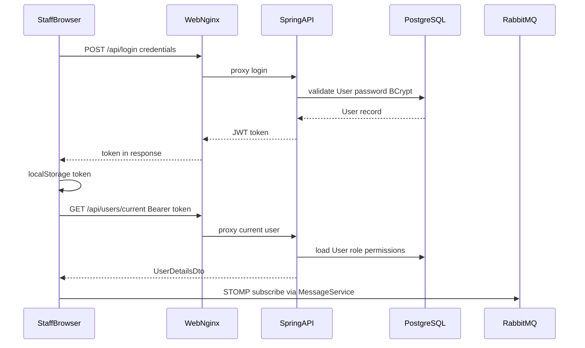
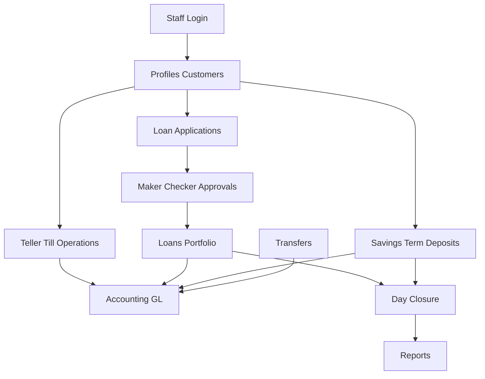
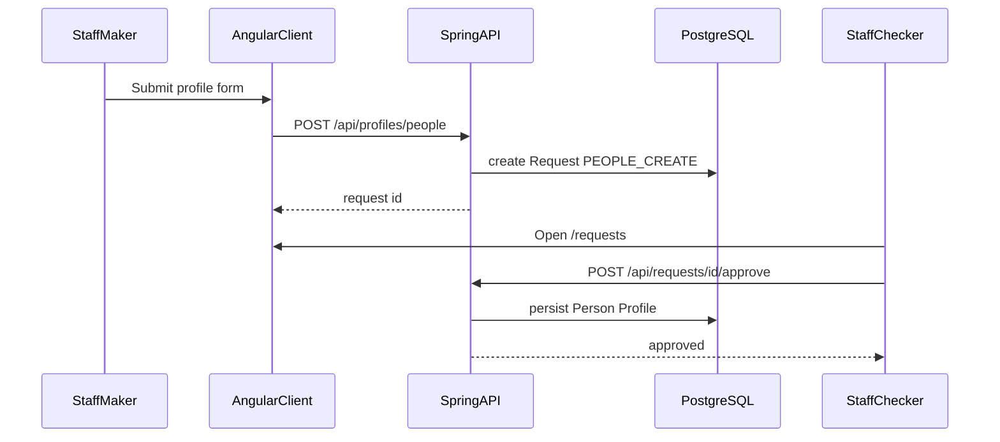
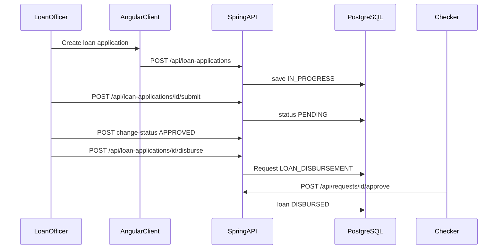
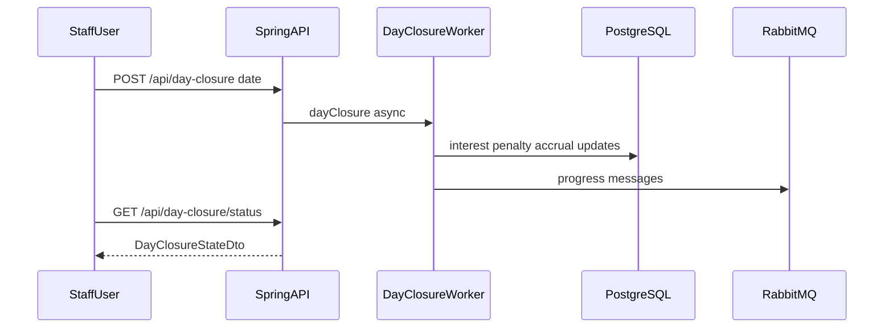

# OpenCBS Cloud — Business Processes

## 0. Plain Language Overview

This document explains how OpenCBS Cloud handles everyday banking work—from staff sign-in through customer profiles, loans, savings, cash at the teller window, and end-of-day processing. **Business analysts, product owners, and operations staff** can follow the flows to see who does what and which system parts are involved; **developers and architects** can trace each step to Angular routes, REST API endpoints, and backing services. After reading, you will understand that this is a **core banking** application for institution staff (not a public self-signup website), which major processes exist, and how the browser, API server, database, and message broker work together.

**System characteristic:** No mainframe or legacy COBOL/PL/I/RPG/JCL code was found under `OpenCBS/`. The stack is modern web (Angular 8, Spring Boot 1.5, Java 8, PostgreSQL 14, RabbitMQ 3) with versions that are mature and may need extra care during upgrades.

---

## 1. User Signup Flow

**Audiences:** Product owners and business analysts (to set expectations on access); developers (to implement or test authentication).

### 1.1 Public / self-service user signup

**Not applicable / Not found in codebase.** There is no public registration route, component, or API for end customers or anonymous users to create their own accounts.

Evidence:

- Client auth routing exposes only `login` (`client/src/app/containers/auth/auth.module.ts`).
- Grep for `signup`, `register`, and `sign-up` in client routing: no matches.
- `UserController.post` creates **staff users** via maker-checker (`POST /api/users`), not self-registration.

### 1.2 Staff sign-in (authentication)

Institution **staff** sign in with username and password. This is the primary entry flow for all business processes.

| Step | Actor | UI / route | API / service | Data store |
|------|--------|------------|---------------|------------|
| 1 | Staff | Opens app; hash route `#/login` (`auth.e2e-spec.ts` navigates to `#/login`) | — | — |
| 2 | Staff | Submits `cbs-auth-form` (`username-id`, `password-id`) | `AuthService.login` → `POST {API_ENDPOINT}login` (`auth.service.ts`) | — |
| 3 | API | Validates credentials | `LoginController.login` → `LoginServiceImpl.login` | PostgreSQL (`User` via `UserService`) |
| 4 | API | Returns JWT | `TokenHelper.tokenFor(user)` | — |
| 5 | Client | Stores token | `localStorage.setItem('token', …)` (`auth.effect.ts`) | Browser `localStorage` |
| 6 | Client | Loads profile & permissions | `GET /api/users/current` (`currentUser.service.ts`) | PostgreSQL |
| 7 | Client | Subscribes to notifications | `MessageService.init()` → STOMP over RabbitMQ config (`message.service.ts`) | RabbitMQ |
| 8 | Client | Redirect | `LoginSucceeded` → `/dashboard` or saved `redirectUrl` (`auth.effect.ts`); authenticated user visiting `/login` → `/profiles` (`no-auth-guard.service.ts`) | — |

**API endpoint (dev):** `http://localhost:8080/api/login` (`environment.ts`). **Production:** `/api/` relative to Nginx (`environment.prod.ts`, `client/default.conf` proxies `/api` to the API container).

**Edge cases (from `LoginServiceImpl` and `AuthComponent`):**

- Wrong password → `ResourceNotFoundException` / invalid credentials message.
- User not `ACTIVE` → `UnauthorizedException` ("User is disabled.").
- Password past `expireDate` → "Password expired".
- First-login policy (`SystemSettingsName.FIRST_LOG_IN`) with `user.firstLogin` → client opens change-password modal; `PUT /api/login/update-password`.
- Password recovery → `POST /api/login/password-reset?username=` sends email with generated password (`LoginServiceImpl.passwordReset`, `EmailService`).

**E2E verification (`auth.e2e-spec.ts`):** Valid `admin` / `admin` redirects to `#/profiles`; invalid password shows `.cbs-auth__error-message`.

**Diagram Description:** A staff member signs in through the browser. The login form posts credentials to `/api/login`, which Nginx forwards to the Spring API. The API checks the username and BCrypt password hash against PostgreSQL, enforces active status and password rules, and returns a JWT. The client saves the token, calls `/api/users/current` with a Bearer header to load permissions, then initializes a STOMP connection to RabbitMQ for real-time messages. Finally the app navigates to the dashboard or a saved return URL; users already signed in who open `/login` are sent to Profiles instead.

### 1.3 Staff user provisioning (administrative, not “signup”)

New **system users** are created by authorized staff under Configuration → Users, via maker-checker:

- `POST /api/users` → `RequestType.USER_CREATE` (`UserController.java`).
- Checker approves at `POST /api/requests/{id}/approve` (`RequestController.java`).

This is internal user administration, not a self-service signup funnel.

---

## 2. Core Business Flows

**Audiences:** Business analysts and product owners (process steps and approvals); developers (endpoint and module mapping).

OpenCBS Cloud is a **Core Banking System (CBS)** for profiles (customers), loans, savings, term deposits, bonds, borrowings, teller/cash, transfers, accounting, maker-checker, reports, and day closure. Navigation labels come from `client/src/assets/i18n/en.json` and `environment.ts` `NAVS.MAIN_NAV`.

### 2.1 Process overview

**Diagram Description:** The diagram shows high-level dependencies between major business areas. Staff must log in first. Customer profiles underpin loan applications, savings, and teller activity. Loan applications often require maker-checker approval before becoming live loans. Savings, loans, transfers, and till operations feed accounting. Day closure batch-processes interest, penalties, and related calculations across modules before reporting. Arrows indicate typical flow order, not strict technical coupling.

---

### 2.2 Customer profile creation (Person / Company / Group)

**Goal:** Register a customer **profile** (not a login account) with custom fields and optional current account.

| Step | Actor | UI | API | Persistence / notes |
|------|--------|-----|-----|------------------------|
| 1 | Staff | `/profiles` → create Person, Company, or Group (`profile-list.component.html`, routes in `profile-routing.module.ts`) | — | Permission: `MAKER_FOR_PEOPLE` etc. |
| 2 | Staff | Fills custom field sections | `LoadProfileFieldsMeta` | Custom field metadata |
| 3 | Staff | Submit | `POST /api/profiles/{people\|companies\|groups}` (`profile-create.service.ts`, `PersonController.post`) | Creates `RequestType.PEOPLE_CREATE` (or company/group) |
| 4 | Checker | Maker/Checker → `/requests` | `POST /api/requests/{id}/approve` | Profile persisted after approval |
| 5 | Staff | Optional current account | `POST /api/profiles/people/{id}/account?currencyId=` (`PersonController`) | Links profile to accounting account |

**Edge cases:**

- Create returns a **request id**, not immediate profile visibility until checker approves (maker-checker pattern).
- On success UI navigates to `/profiles` list (`profile-create.component.ts`); detail view requires approved profile.
- Types: `people`, `companies`, `groups` (i18n: `CREATE_PERSON`, `CREATE_COMPANIES`, `CREATE_GROUP`).

**Diagram Description:** A maker submits a new person (or company/group) profile through the Angular app. The API does not write the final profile immediately; it creates a maker-checker request. A checker reviews the request in the Requests area and calls approve, which persists the profile in PostgreSQL. Optional steps afterward can open a current account for the profile in the chosen currency.

---

### 2.3 Loan application lifecycle

**Statuses (code):** `IN_PROGRESS`, `PENDING`, `APPROVED`, `REJECTED`, `DISBURSED` (`LoanApplicationStatus.java`).

| Step | Actor | UI | API | Notes |
|------|--------|-----|-----|-------|
| 1 | Staff | `/loan-applications` create | `POST /api/loan-applications` (`LoanApplicationController.post`) | Permission `CREATE_LOAN_APPLICATION` |
| 2 | Staff | Edit while in progress | `PUT /api/loan-applications/{id}` | Only if status `IN_PROGRESS` |
| 3 | Staff | Preview schedule | `POST /api/loan-applications/preview` or `/{id}/preview` | Schedule calculation |
| 4 | Staff | Submit to credit committee | `POST /api/loan-applications/{id}/submit` | i18n: `LOAN_APP_SUBMIT_TEXT` |
| 5 | Committee | Approve / decline / refer | `POST /api/loan-applications/{id}/change-status` | Credit committee vote DTO |
| 6 | Staff | Disburse (maker) | `POST /api/loan-applications/{id}/disburse` | Requires `APPROVED`; creates `RequestType.LOAN_DISBURSEMENT` |
| 7 | Checker | Approve disbursement | `POST /api/requests/{id}/approve` | Becomes active loan (`DISBURSED`) |

**Edge cases:**

- Disburse requires profile current account in loan currency (`profileAccountRepository` check in `disburse`).
- Edit forbidden unless `IN_PROGRESS` (`ForbiddenException` in controller).
- Entry fees: `POST /api/loan-applications/calculate-entry-fee`.

**Diagram Description:** The loan officer creates an application and may preview the repayment schedule. Submitting moves the application toward credit committee review. Committee action changes status to approved or rejected. Disbursement is not immediate: the maker triggers a maker-checker request, and only after checker approval does the system mark the application disbursed and create the live loan records in the database.

---

### 2.4 Loan repayment

| Step | Actor | UI | API | Notes |
|------|--------|-----|-----|-------|
| 1 | Staff | Loan detail → repay | `POST /api/loans/{loanId}/repayment/preview` | Validates amount/date |
| 2 | Staff | Confirm repay | `POST /api/loans/{loanId}/repayment/repay` | `RequestType.LOAN_REPAYMENT` (maker-checker) |
| 3 | Checker | Approve | `POST /api/requests/{id}/approve` | Posts accounting entries |

Repayment types exposed in UI strings include normal, early partial, early total (`NORMAL_REPAYMENT`, `EARLY_PARTIAL_REPAYMENT`, `EARLY_TOTAL_REPAYMENT` in `en.json`). Types list: `GET /api/repayment/types`.

**Edge case:** Loan must be **actualized** for repayment date (`ActualizeHelper.isActualized` in `AbstractLoanRepaymentController`).

---

### 2.5 Savings account lifecycle

| Step | UI area | API | Notes |
|------|---------|-----|-------|
| Create | Savings / profile | `POST /api/savings` | `SAVINGS_CREATE` |
| Open | Open saving | `POST /api/savings/{id}/open?initialAmount=` | `SAVING_OPEN` |
| Deposit / withdraw | Account operations | `POST .../deposit`, `.../withdraw` | Amount + date params |
| Lock / unlock | | `POST .../lock` | Requires actualized |
| Close | | `POST .../close?closeDate=` | `SAVING_CLOSE` |
| Actualize | | `POST /api/savings/actualize/{savingId}` | i18n `ACTUALIZE_SAVING` |

Teller path for savings cash: `POST /api/tills/{id}/operations/deposit-saving`, `withdraw-saving` (`TillSavingController.java`).

---

### 2.6 Teller management (till open, deposit, withdraw)

| Step | UI (`/till`) | API (`TillController`) | Notes |
|------|--------------|------------------------|-------|
| Open till | `OPEN_TILL` | `POST /api/tills/{id}/open?tellerId=` | Cashier assignment |
| Deposit cash | `DEPOSIT` | `POST /api/tills/{id}/operations/deposit` | Current account |
| Withdraw cash | `WITHDRAW` | `POST /api/tills/{id}/operations/withdraw` | |
| Transfer to/from vault | | `POST /api/tills/transfer/vault`, `transfer/till` | |
| Close till | `CLOSE_TILL` | `POST /api/tills/{id}/close?tellerId=` | |

i18n describes teller management as cash registers for teller transactions (`TELLER_MANAGEMENT_CONFIGURATION_DESCRIPTION`).

---

### 2.7 Transfers (bank ↔ vault, between members)

| Operation | API |
|-----------|-----|
| Bank to vault | `POST /api/transfers/from-bank-to-vault` |
| Vault to bank | `POST /api/transfers/from-vault-to-bank` |
| Between members | `POST /api/transfers/between-members` |

Returns `AccountingEntryDto` (`TransfersController.java`). Permissions: `BANK_TO_VAULT`, `VAULT_TO_BANK`, `BETWEEN_MEMBERS`.

---

### 2.8 Day closure (end-of-day processing)

| Step | Actor | API | Behavior |
|------|--------|-----|----------|
| 1 | Staff (permission `DAY_CLOSURE`) | `POST /api/day-closure?date=` | Starts async processing (`DayClosureProcessWorker`) |
| 2 | Staff | `GET /api/day-closure/status` | Poll process state |
| — | System | Module processors | Interest, penalty, analytics, auto-repayments (per controller description) |

Uses **RabbitMQ** and email notifications inside `DayClosureProcessWorker` (`AmqMessageHelper`, `EmailService`). i18n warns if daily closure was missed (`DAILY_CLOSURE_NOT_STARTED`).

**Diagram Description:** An authorized user triggers day closure with a business date. The API acknowledges start immediately while a background worker runs processors across loans, savings, term deposits, and related modules. The worker reads and updates PostgreSQL and may publish progress through RabbitMQ; staff poll the status endpoint until completion. This batch step aligns balances and scheduled calculations before the next operating day.

---

### 2.9 Maker-checker (cross-cutting approval)

Sensitive changes create a **Request** instead of applying immediately:

| Request type (sample) | Module |
|----------------------|--------|
| `PEOPLE_CREATE`, `PEOPLE_EDIT` | Profiles |
| `USER_CREATE`, `USER_EDIT` | Users |
| `LOAN_DISBURSEMENT` | Loan applications |
| `LOAN_REPAYMENT`, `LOAN_ROLLBACK` | Loans |

Flow: Maker `POST` → pending request → Checker `POST /api/requests/{id}/approve` (`RequestController`). UI: `/requests` (`MAKER_CHECKER` nav). i18n: `APPROVE`, `DECLINE`, `MAKER_CHECKER_STATUS`.

---

### 2.10 Additional modules (summary)

Documented in navigation and server modules; full step-by-step UI flows were not exhaustively traced in this pass but REST modules exist:

| Area | Client route (env NAV) | API prefix (representative) |
|------|------------------------|----------------------------|
| Term deposits | `/term-deposits` | `/api/term-deposits` (module `opencbs-term-deposits`) |
| Bonds | `/bonds` | bonds module |
| Borrowings | `/borrowings` | borrowings module |
| Accounting | `/accounting/...` | chart of accounts, accounting entries |
| Reports | `/report-list` | reports controllers |
| Configuration | settings/configuration routes | users, roles, products, branches, tills, vaults, etc. |

**SEPA loan import/repay:** `SepaIntegrationController` (`POST .../import/repay`) — institution integration, not a retail user flow.

---

## 3. Service Participation

**Audiences:** Architects and developers (deployment and integration); operations leads (runtime dependencies).

### 3.1 Runtime components (`docker-compose.yml`)

| Service (deployable part of the system) | Image / build | Role in business flows |
|----------------------------------------|---------------|-------------------------|
| **web** | `client/Dockerfile` (Node 14 build → Nginx 1.21) | Serves Angular SPA; proxies `/api` to API |
| **api** | `server/opencbs-server/Dockerfile` | Spring Boot REST (`ServerApplication`), all `/api/*` business logic |
| **db** | `postgres:14-alpine` | Primary data store (`POSTGRES_DB: opencbs`) |
| **rabbitmq** | `rabbitmq:3-management-alpine` | Async messaging, day-closure progress, balance calculation queues; STOMP to browser |

Volumes: `postgres_data`; API mounts `./server/templates`, `./server/attachments`.

### 3.2 Service participation matrix

| Business flow | Web (Angular) | API (Spring Boot) | PostgreSQL | RabbitMQ | Email |
|---------------|---------------|-------------------|------------|----------|-------|
| Staff login | ✓ Auth, guards | ✓ Login, JWT, users/current | ✓ Users | ✓ STOMP after login | ✓ Password reset |
| Profile create | ✓ Profile create | ✓ Person/Company/Group controllers | ✓ Profiles | — | — |
| Maker-checker | ✓ Requests UI | ✓ RequestController, MakerCheckerWorker | ✓ Requests | Optional notifications | — |
| Loan application | ✓ Loan application module | ✓ LoanApplicationController | ✓ Loans schema | — | — |
| Loan disburse / repay | ✓ Loans UI | ✓ Loans + maker-checker | ✓ | — | — |
| Savings | ✓ Savings module | ✓ SavingController | ✓ Savings | — | — |
| Teller / till | ✓ Teller management | ✓ TillController, TillSavingController | ✓ Tills, operations | — | — |
| Transfers | ✓ Transfers module | ✓ TransfersController | ✓ Accounting | — | — |
| Day closure | ✓ Settings / operation day | ✓ DayClosureController, worker | ✓ | ✓ Messages | ✓ On failure/completion |
| Accounting / GL | ✓ Accounting module | ✓ Accounting controllers | ✓ | ✓ Balance calc queue | — |

### 3.3 Backend module map (Maven modules in `server/pom.xml`)

| Module | Domain |
|--------|--------|
| `opencbs-core` | Users, profiles, auth, requests, tills, transfers, day closure, accounting base |
| `opencbs-loans` | Loan applications, loans, repayment |
| `opencbs-savings` | Savings products and accounts |
| `opencbs-term-deposits` | Term deposits |
| `opencbs-borrowings` | Borrowings |
| `opencbs-bonds` | Bonds |
| `opencbs-server` | Runnable Spring Boot application |

### 3.4 Verified technology versions (anti-hallucination)

| Component | Version (source) |
|-----------|------------------|
| Angular | `^8.1.4` (`client/package.json`) |
| Spring Boot parent | `1.5.4.RELEASE` (`opencbs-spring-boot-starter/pom.xml`) |
| Java | `1.8` (`java.version` in same POM) |
| PostgreSQL (Docker) | `14-alpine` (`docker-compose.yml`) |
| RabbitMQ (Docker) | `3-management-alpine` (`docker-compose.yml`) |
| Node (client build image) | `14-alpine` (`client/Dockerfile`) |

### 3.5 i18n locales

User-facing strings: `client/src/assets/i18n/en.json`, `fr.json`, `ar.json`, `ru.json` (labels such as Profiles, Loans, Savings, Day closure, Maker/Checker).

---

## Document control

| Item | Value |
|------|--------|
| Codebase root | `/home/vishal/repos/session_954f8999a61f/OpenCBS` |
| Generated from | Source, `docker-compose.yml`, e2e specs, i18n, environment files |
| Public customer signup | Not found in codebase |
| Legacy mainframe code | Not found in codebase |
