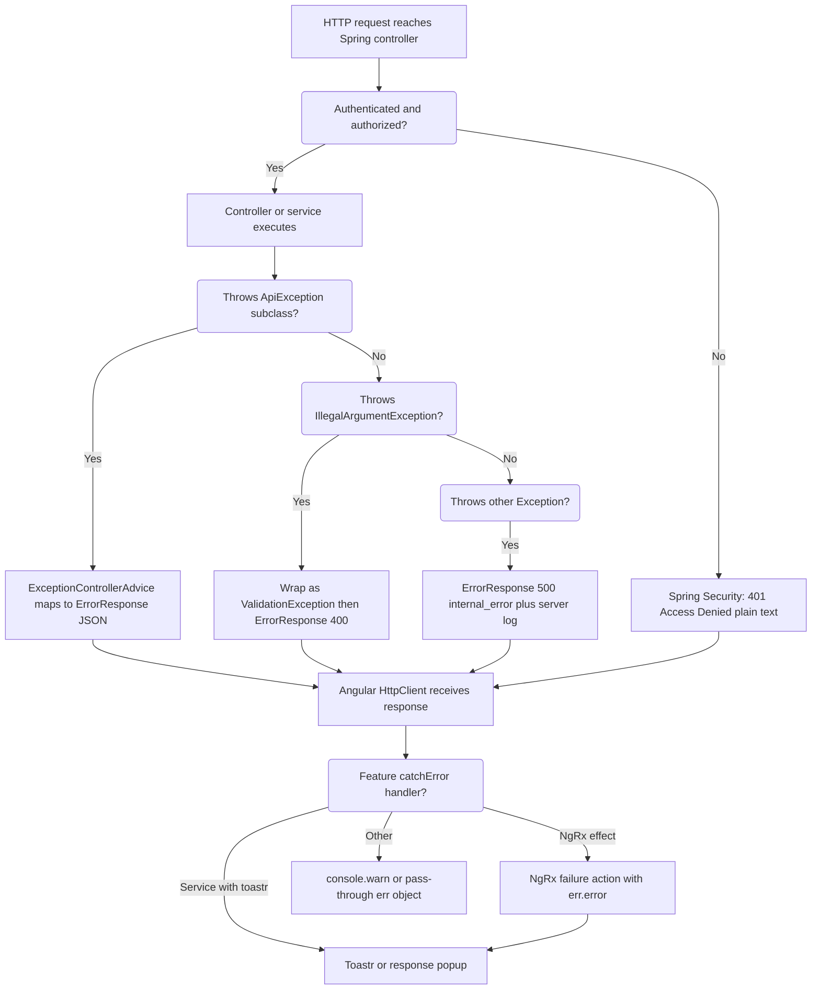

# OpenCBS — System-Wide Error Handling Standards

## Plain Language Overview

This document explains how OpenCBS detects, reports, and shows errors when something goes wrong—from the bank teller’s screen through the API to background messaging. It is written for **developers and technical leads** who implement or review error behavior, and for **product owners and business analysts** who need to understand what users see when operations fail and what reliability guarantees exist today. After reading it, technical readers will know the real error JSON shape, HTTP status usage, and where handling lives in code; non-technical readers will understand that most failures surface as short messages (toasts or form hints) without automatic “try again” logic, and that advanced protections like retries and circuit breakers are largely **not implemented** in this codebase yet.

**System note:** Active code paths are **Angular (TypeScript)** and **Spring Boot (Java 8)**. No mainframe or legacy COBOL/JCL/PHP assets were found under `OpenCBS/`. Spring Boot **1.5.4.RELEASE** and Java **1.8** are evidenced in `opencbs-core/pom.xml`.

**Entry points traced:** Browser bootstrap (`client/src/main.ts` → `AppModule`), HTTP API via Nginx (`client/default.conf` → `api:8080`), Spring Boot (`ServerApplication.java`), global advice (`ExceptionControllerAdvice.java`).

---

## (1) Error Response Format

**Audiences:** Backend developers, API integrators, product owners (what users indirectly see when the API returns structured errors).

### API JSON schema (verified)

All handled `ApiException` subclasses and the generic `Exception` fallback are converted to `ErrorResponse` in `ExceptionControllerAdvice`:

| Field | Type | Source |
|-------|------|--------|
| `httpStatus` | `int` | HTTP status numeric value |
| `errorCode` | `string` | Application-specific code |
| `message` | `string` | Human-readable text |

```java
// server/opencbs-core/src/main/java/com/opencbs/core/dto/responses/ErrorResponse.java
public ErrorResponse(int httpStatus, String errorCode, String message)
```

**Example (ApiException path):**

```json
{
  "httpStatus": 400,
  "errorCode": "invalid",
  "message": "Failed to store file example.pdf"
}
```

**Example (unhandled Exception → 500):**

```json
{
  "httpStatus": 500,
  "errorCode": "internal_error",
  "message": "<exception message from server>"
}
```

### Exception types mapped to `ErrorResponse`

| Type | Typical `httpStatus` | Typical `errorCode` | Notes |
|------|----------------------|---------------------|--------|
| `ValidationException` | 400 | `invalid` (default) or custom code | Includes `IllegalArgumentException` re-wrapped in advice |
| `ResourceNotFoundException` | 404 | `"Not Found"` | Widespread in services/controllers |
| `UnauthorizedException` / `InvalidCredentialsException` | 401 | e.g. `unauthorized_access`, `invalid_credentials` | Login flows |
| `ForbiddenException` | 403 | `forbidden` | Business rule denial |
| Custom `ApiException` | varies | e.g. `"404"`, `"403"`, `"406"` | Some validators use numeric strings as codes |
| Any other `Exception` | 500 | `internal_error` | Logged server-side; message returned to client |

**Not JSON — Spring Security entry point:** Unauthenticated requests hit `EntryPointUnauthorizedHandler`, which calls `sendError(401, "Access Denied")` — **not** the `ErrorResponse` body.

```java
// server/opencbs-core/src/main/java/com/opencbs/core/security/EntryPointUnauthorizedHandler.java
httpServletResponse.sendError(HttpServletResponse.SC_UNAUTHORIZED, "Access Denied");
```

**RuntimeException (e.g. day closure):** Caught by the generic `@ExceptionHandler(Exception.class)` handler → **500** with `internal_error` and the runtime message (e.g. day-closure validation text).

### Client consumption patterns (verified)

There is **no** global HTTP error interceptor. Patterns vary by feature:

1. **NgRx effects** — `catchError` on `HttpErrorResponse`, dispatch failure actions with `err.error` (expects API JSON body).
2. **Services** — Some return `{ error: true, message: err.error.message }` (e.g. `PaymentGatewayService`).
3. **Auth login** — Reads `res.error.errorCode` and `res.error.message` (e.g. `invalid_credentials`, password-reset flows).
4. **Teller operations** — `catchError(err => observableOf(err))` passes through raw error objects without normalizing.
5. **Forms (shared)** — Angular reactive validation (`slds-has-error`); API errors in picklists logged via `console.warn(err.error.message)`.

**Global Angular `ErrorHandler`:** `LoggingErrorHandler` + `ErrorLogService` exist but are **commented out** in `CORE_SERVICES.ts` — not active in default wiring.

### UI surfacing (product impact)

- **ngx-toastr** — `ERROR_TOAST_CONFIG` (100s timeout in config) for many mutations and login errors.
- **`cbs-response-popup`** — Shared component toggles success/error blocks via `status.showError` (content projected by parent).
- **NgRx state** — Reducers store `error: true` and `errorMessage` from `action.payload.message`.

**Not found in codebase:** Standard error envelope fields such as `traceId`, `timestamp`, `details[]`, or `Retry-After` headers.

---

## (2) HTTP Status Codes

**Audiences:** API developers, QA, product owners (mapping failures to user-visible outcomes).

### Status usage evidenced in server code

| Status | Meaning in OpenCBS | How it is produced |
|--------|-------------------|-------------------|
| **400** | Validation / bad input | `ValidationException`, `IllegalArgumentException` → wrapped as validation |
| **401** | Not authenticated / bad credentials | `UnauthorizedException`, `InvalidCredentialsException`; also Spring Security `sendError(401)` |
| **403** | Authenticated but not allowed | `ForbiddenException`, some `ApiException(FORBIDDEN, "403", ...)` |
| **404** | Missing entity | `ResourceNotFoundException` (`errorCode`: `"Not Found"`), some `ApiException(NOT_FOUND, "404", ...)` |
| **406** | Business rule not acceptable | `ApiException(NOT_ACCEPTABLE, "406", ...)` (e.g. loan application member type) |
| **500** | Unexpected server error | Generic `Exception` handler; `RuntimeException` (day closure, Rabbit health failure propagates as 500 if uncaught at controller layer) |

### Infrastructure / edge (Docker + Nginx)

| Layer | Behavior |
|-------|----------|
| **Nginx (`client/default.conf`)** | Proxies `/api` → `api:8080`; static SPA for `/`; `error_page 500 502 503 504` → `/50x.html` (HTML, not API JSON) |
| **PostgreSQL / RabbitMQ healthchecks** | `retries: 5` in `docker-compose.yml` — container orchestration only, not application HTTP retry |

### Client ↔ API routing

| Environment | `API_ENDPOINT` |
|-------------|----------------|
| Development | `http://localhost:8080/api/` (`environment.ts`) |
| Production build | `/api/` (relative; Nginx proxy) (`environment.prod.ts`) |

**Not found in codebase:** Documented policy for which status codes clients should retry; `MethodArgumentNotValidException` / Bean Validation handlers; dedicated `AccessDeniedHandler` returning JSON 403.

---

## (3) Retry Patterns

**Audiences:** Backend/frontend engineers, SRE, product owners (expectations for automatic recovery).

### Application-level HTTP retries

**Not found in codebase** for Angular `HttpClient` or Spring REST clients (no `rxjs/retry`, `@Retryable`, Spring Retry, or backoff configuration in server Java sources).

### Idempotency (safe to repeat a request without changing the result)

**Not found in codebase** — no idempotency keys, deduplication headers, or documented consumer ack/retry strategy for AMQP messages.

### Message broker (RabbitMQ)

| Behavior | Location | Retry? |
|----------|----------|--------|
| Publish JSON failure | `RabbitSenderServiceImpl.sendMessage` — logs `JsonProcessingException` | **No** — error logged only |
| Publish object failure | `sendObject` — logs generic `Exception` | **No** |
| Health check failure | `checkConnectionsHealth` — throws `RuntimeException("Connection to Message broker is failed!")` | **No** automatic retry; blocks flows that depend on health (e.g. day closure per integration docs) |

### Docker Compose healthchecks (infrastructure)

```yaml
# OpenCBS/docker-compose.yml (excerpt)
healthcheck:
  interval: 10s
  timeout: 5s
  retries: 5
```

Applies to **db** and **rabbitmq** services only — not HTTP API call retry.

### Client-side “soft” delays

`environment.RESPONSE_DELAY` (300 ms dev, 0 prod) pipes `delay()` after HTTP calls for UX — **not** error retry.

### To be configured (not implemented — placeholder)

| Capability | Suggested direction | Status |
|------------|---------------------|--------|
| HTTP 5xx retry with exponential backoff | API gateway or shared Angular interceptor / RestTemplate bean | **To be configured** |
| Idempotent POST for financial operations | `Idempotency-Key` header + server-side store | **To be configured** |
| RabbitMQ publish retry / DLQ | Spring AMQP retry + dead-letter exchange | **To be configured** |

---

## (4) Circuit Breaker Patterns

**Audiences:** Architects, SRE, product owners (cascading failure containment).

**Not found in codebase** — no Resilience4j, Hystrix, or similar dependencies in `opencbs-core/pom.xml`; no circuit breaker configuration in Java or TypeScript sources.

### Related resiliency that exists (not circuit breakers)

| Mechanism | What it does |
|-----------|----------------|
| STOMP heartbeats | `STOMP_HEARTBEAT_OUT: 1000`, `STOMP_HEARTBEAT_IN: 40000` in `environment.ts` / `environment.prod.ts` |
| Rabbit health publish | `RabbitSenderServiceImpl.checkConnectionsHealth()` — fail-fast `RuntimeException` |
| Nginx upstream | Single `api_upstream` → `api:8080` — no load-balanced failover in `default.conf` |

### To be configured (not implemented — placeholder)

| Capability | Status |
|------------|--------|
| Circuit breaker on external payment gateway / bank integration HTTP | **To be configured** |
| Circuit breaker on RabbitMQ / DB access | **To be configured** |
| Fallback responses (degraded read-only mode) | **To be configured** |

---

## Error classification and response flow



**Diagram Description:** This top-down flowchart traces an HTTP request from the Spring controller through security and exception handling to the Angular client. If authentication fails, Spring Security returns a plain 401 before business logic runs. Otherwise, the controller/service may throw an `ApiException` (mapped to JSON `ErrorResponse` with the exception’s status and code), an `IllegalArgumentException` (re-wrapped as validation and returned as 400), or any other exception (logged and returned as 500 with `internal_error`). The browser receives the response and each feature’s own `catchError` logic decides whether to dispatch NgRx failure state, show a toast, or only log to the console—there is no single global client error pipeline.

---

## Reference: key source locations

| Area | Path |
|------|------|
| API global handler | `OpenCBS/server/opencbs-core/src/main/java/com/opencbs/core/controllers/ExceptionControllerAdvice.java` |
| Error DTO | `OpenCBS/server/opencbs-core/src/main/java/com/opencbs/core/dto/responses/ErrorResponse.java` |
| Exception hierarchy | `OpenCBS/server/opencbs-core/src/main/java/com/opencbs/core/exceptions/` |
| Security 401 entry | `OpenCBS/server/opencbs-core/src/main/java/com/opencbs/core/security/EntryPointUnauthorizedHandler.java` |
| Rabbit publish errors | `OpenCBS/server/opencbs-core/src/main/java/com/opencbs/core/services/messages/impl/RabbitSenderServiceImpl.java` |
| Client bootstrap | `OpenCBS/client/src/main.ts` |
| HTTP interceptor (headers only) | `OpenCBS/client/src/app/core/services/http-header-interceptor.service.ts` |
| Inactive global error handler | `OpenCBS/client/src/app/core/services/error-handler/logging-error-handler.ts`, `CORE_SERVICES.ts` (commented) |
| Nginx / API proxy | `OpenCBS/client/default.conf` |
| Compose topology | `OpenCBS/docker-compose.yml` |

---

## Summary for product owners

- Users usually see a **short error message** (toast or inline form state), not a technical code—unless developers surface `errorCode` in a specific screen (e.g. login password reset uses `errorCode` as user id in special cases).
- **Transient failures** (network blips, 503 from proxy) are **not** automatically retried by the app; users may need to repeat the action manually.
- **Day closure and messaging** can hard-fail if RabbitMQ is unhealthy; there is no circuit breaker to degrade gracefully.
- Improving reliability requires **new** cross-cutting policies (retries, idempotency, circuit breakers) marked **To be configured** above—not present in the current verified codebase.

*Document generated from repository source inspection. Last verified against workspace at `OpenCBS/`.*
