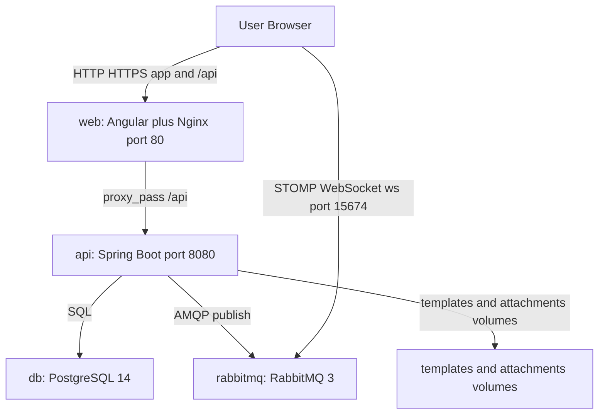

# OpenCBS Cloud — Executive Summary

## (0) Plain Language Overview

**Audience:** Executives, board members, operations leaders (non-technical), and CTOs, architects, and engineering managers (technical).

This document explains what **OpenCBS Cloud** is, which parts of the system work together, who uses it, and what business work it supports. After reading it, non-technical readers will understand the platform’s purpose and major capabilities; technical readers will see how the verified runtime components connect and where each capability lives in the stack.

---

## (1) What This Platform Does

**Audience:** Business stakeholders (non-technical) and product/engineering leadership (technical).

**OpenCBS Cloud** (also referred to in the repository as **OpenCBS-Cloud**) is an open-source **Core Banking System** (software that runs day-to-day banking operations such as loans, savings, and accounting) designed for cloud deployment. The project README states it was developed from 2017 onward and is positioned as simpler and faster to deploy than traditional core banking systems.

The platform is intended for **financial institutions**—specifically microfinance institutions, cooperative financial institutions, digital lenders, and medium-sized banks—and is built so **employees of those institutions** can perform front-office and back-office work through a user-centric web interface.

Verified high-level functional areas from the root README include:

- Client management  
- Loan management  
- Savings management  
- Collateral management  
- Loan schedule generation  
- Loan portfolio tracking  
- Custom fields  
- Accounting  
- Reports  

The web application’s navigation and labels (from `en.json` and `environment.ts` / `environment.prod.ts`) further confirm operational areas: customer **profiles**, **loan applications** and **loans**, **borrowings**, **savings**, **term deposits**, **bonds**, **teller management**, **transfers**, **accounting** (general ledger and chart of accounts), **maker/checker** approvals, and **reports**.

**Legacy / mainframe code:** No COBOL, JCL, RPG, PL/I, VB6, or similar legacy source files were found in this codebase. The stack does use **older but still common enterprise versions** (Java 8, Spring Boot 1.5.4, Angular 8); teams should treat upgrades and security patching as a planning priority.

---

## (2) Key Services

**Audience:** Operations and infrastructure owners (technical) and program managers who need a service inventory (non-technical, with plain-language notes).

These are the **runtime services** defined in `OpenCBS/docker-compose.yml` for a typical Docker deployment:

| Service name (compose) | Technology (evidenced) | One-line description |
|------------------------|------------------------|----------------------|
| **db** | PostgreSQL 14 (`postgres:14-alpine`) | Database (where the system stores its records); database name `opencbs` |
| **rabbitmq** | RabbitMQ 3 with management UI (`rabbitmq:3-management-alpine`) | Message broker for real-time notifications between backend and browser |
| **api** | Spring Boot API (built from `server/opencbs-server/Dockerfile`, Java 8 JRE) | Core banking business logic and REST API on port 8080 (internal to compose network) |
| **web** | Angular app served by Nginx (`client/Dockerfile`, `nginx:1.21-alpine`) | Web user interface; published on host port **80** (`http://localhost`) |

**Supporting volumes (not separate containers):** API mounts `./server/templates` and `./server/attachments` for document/template and attachment storage.

**Not found in codebase:** `application-docker.properties` is referenced in `server/opencbs-server/Dockerfile` but no `application*.properties` files were present under `OpenCBS/server/` in this workspace snapshot.

---

## (3) Who Are the Users

**Audience:** HR, operations, and compliance (non-technical) and security/access-management teams (technical).

### Organizations that adopt the platform

From `OpenCBS/README.md`, the system targets:

- Microfinance Institutions  
- Cooperative Financial Institutions  
- Digital lenders  
- Medium-sized banks  

### People who work inside the institution (staff)

The README describes **financial institution employees** as the primary operators. User-facing labels and permission concepts in `en.json` include job-related roles and functions such as:

| Role / function (UI label) | Evidence |
|---------------------------|----------|
| **User** / **Users** | Account sign-in, user create/edit, settings |
| **Role** / **Roles** | Role-based permissions |
| **Teller** / **Teller management** / **Head teller** | Cash operations, tills, vaults |
| **Cashier** | Till operations |
| **Loan officer** | Loan portfolio work |
| **Credit committee** | Loan application approve/decline/review |
| **Saving officer** / **Term deposit officer** / **Bond officer** | Liability product operations |
| **Maker / Checker** | Dual-control approval workflow (`MAKER_CHECKER`, maker/checker permissions) |

Granular permission strings in `en.json` (e.g., `CREATE_LOAN_APPLICATION`, `SAVING_DEPOSIT`, `CHECKER_FOR_LOAN_DISBURSEMENT`) indicate that access is enforced by **role permissions**, not only by job title labels.

### Customers managed in the system (banking clients)

The application manages **profiles** for **Person**, **Company**, and **Group** customers (`en.json`, Profiles navigation). These are institutional **clients/borrowers/depositors**, not anonymous public website visitors.

### End-user authentication

Sign-in, password recovery, and session concepts appear in `en.json` (`SIGN_IN`, `RECOVER`, `REMEMBER`). The API endpoint `users/current` is used after login for messaging setup (`rabbit.service.ts`).

**Not found in codebase:** A formal marketing persona document (e.g., named personas with demographics) beyond README institution types and UI role labels.

---

## (4) High-Level Architecture

**Audience:** Enterprise architects and DevOps (technical) and executives who need a topology picture (non-technical).

### Active execution flow (entry points)

1. **Browser** loads the Angular app from the **web** (Nginx) service on port 80.  
2. **`client/src/main.ts`** bootstraps `AppModule` via `platformBrowserDynamic().bootstrapModule(AppModule)`.  
3. **`AppComponent`** initializes translation, checks authentication (`CheckAuth`), and loads system settings.  
4. **HTTP API** calls go to `environment.API_ENDPOINT` — development: `http://localhost:8080/api/`; production build: relative `/api/` proxied by Nginx to the **api** service (`client/default.conf`).  
5. **Real-time messages** (when a user is logged in): client fetches RabbitMQ credentials from `configurations/rabbit-credential` and connects via STOMP WebSocket (`message.service.ts`, `rabbit.service.ts`).

**Diagram Description:** The diagram shows how a user’s browser interacts with the OpenCBS Cloud deployment. The user opens the web front end (Angular application served by Nginx on port 80). API requests under `/api` are forwarded from Nginx to the Spring Boot API on port 8080. The API reads and writes data in PostgreSQL and can publish messages to RabbitMQ. The browser may also connect directly to RabbitMQ over STOMP WebSockets (port 15674 in client code) for live notifications. The API container can read/write template and attachment files from mounted volumes. Together, these components form the critical path for day-to-day banking operations in the UI.

### Critical services (summary)

| Component | Role in operations |
|-----------|-------------------|
| **web** | All staff-facing screens and workflows |
| **api** | Business rules, transactions, approvals, reporting backend |
| **db** | Authoritative financial and customer data |
| **rabbitmq** | Push-style updates to connected users (via STOMP) |

---

## (5) Key Capabilities

**Audience:** Product owners and business analysts (non-technical) mapping features to systems; solution architects (technical).

Capabilities below are **verified** from `OpenCBS/README.md`, navigation in `environment.ts` / `environment.prod.ts`, `client/src/app/app.module.ts` module imports, and `en.json` terminology. Mapping indicates which **runtime or Maven module** primarily supports each area.

| Business capability | Primary support (evidenced) |
|--------------------|-----------------------------|
| Customer profiles (person, company, group) | **web** (`ProfileModule`); **api** / **opencbs-core** |
| Loan applications and credit committee workflow | **web** (`LoanApplicationModule`); **api** / **opencbs-loans** |
| Active loans, schedules, disbursement, repayment, reschedule, write-off | **web** (`LoanModule`, `EventManagerModule`); **api** / **opencbs-loans** |
| Collateral and guarantors | **web** / **api** (loan UI labels); **opencbs-loans** |
| Savings accounts and products | **web** (`SavingsModule`); **api** / **opencbs-savings** |
| Term deposits | **web** (`TermDepositModule`); **api** / **opencbs-term-deposits** |
| Borrowings | **web** (`BorrowingModule`); **api** / **opencbs-borrowings** |
| Bonds | **web** (`BondsModule`); **api** / **opencbs-bonds** |
| Teller, till, vault, cash deposit/withdraw | **web** (`TellerManagementModule`); **api** |
| Transfers (e.g., bank/vault/members) | **web** (`TransfersModule`); **api** |
| Accounting — chart of accounts, general ledger entries | **web** (`AccountingModule`); **api** |
| Maker/checker approvals | **web** (`MakerCheckerModule`); **api** |
| Reports and print/export | **web** (`ReportsModule`); **api** (JasperReports dependency in server POM) |
| Dashboard | **web** (`DashboardModule`); default route redirects to `dashboard` |
| System configuration (branches, holidays, products, fees, etc.) | **web** (`ConfigurationModule`, `SettingsModule`); **api** |
| Audit trail (business objects, events, transactions, sessions) | **web** (labels in `en.json`); **api** |
| Real-time user notifications | **rabbitmq** + **web** STOMP client; credentials from **api** |
| Custom fields on profiles, loan applications, branches, groups | **web** / **api** (`FIELD_TYPES` in environment files) |
| Multi-language UI | **web** — `en`, `ru`, `fr`, `ar` JSON under `client/src/assets/i18n/`; `AppComponent` loads `en`, `ru`, `fr` by default |

**Server Maven modules** (from `server/pom.xml`): `opencbs-core`, `opencbs-loans`, `opencbs-borrowings`, `opencbs-savings`, `opencbs-term-deposits`, `opencbs-bonds`, packaged into `opencbs-server`.

---

## (6) Technology at a Glance

**Audience:** CTO office and engineering (technical); procurement and risk reviewers who need a factual stack list (non-technical summaries inline).

| Layer | Evidenced technology | Notes |
|-------|---------------------|--------|
| **Front end** | Angular 8.x, TypeScript ~3.4, NgRx 8, ngx-translate, Salesforce Lightning Design System (`@salesforce-ux/design-system`), PrimeNG 7 | `client/package.json`, `client/README.md` (Angular CLI 1.2.0 project template) |
| **Front-end build** | Node 14 Alpine | `client/Dockerfile` |
| **Web server** | Nginx 1.21 Alpine | `client/Dockerfile`, `client/default.conf` |
| **Back end** | Java 8, Spring Boot **1.5.4.RELEASE**, Spring Cloud Dalston.SR1 | `server/opencbs-spring-boot-starter/pom.xml` |
| **Back-end entry** | `com.opencbs.cloud.ServerApplication` | `@SpringBootApplication`, scans `com.opencbs` |
| **Database** | PostgreSQL 14 | `docker-compose.yml` |
| **Messaging** | RabbitMQ 3 (management image); STOMP from browser via `@stomp/ng2-stompjs` | `docker-compose.yml`, `message.service.ts` |
| **API integration (dev)** | `http://localhost:8080/api/` | `environment.ts` |
| **API integration (prod build)** | Relative `/api/` behind Nginx | `environment.prod.ts`, `default.conf` |
| **Container orchestration (local)** | Docker Compose | `docker-compose.yml` |
| **Reporting library** | JasperReports 6.10.0 (dependency) | `opencbs-spring-boot-starter/pom.xml` |

**Internationalization:** UI strings in `en.json`, `ru.json`, `fr.json`, `ar.json`.

**Not found in codebase:** Kubernetes/Helm manifests, Terraform, or cloud-provider-specific deployment definitions at the OpenCBS root (only Docker Compose evidenced for runtime topology).

---

## Evidence References (source files)

| Topic | File path |
|-------|-----------|
| Product purpose and features | `OpenCBS/README.md` |
| Runtime services | `OpenCBS/docker-compose.yml` |
| UI capabilities and roles | `OpenCBS/client/src/assets/i18n/en.json` |
| Navigation / modules | `OpenCBS/client/src/environments/environment.ts`, `environment.prod.ts` |
| App bootstrap | `OpenCBS/client/src/main.ts`, `client/src/app/app.module.ts`, `app-routing.module.ts` |
| API proxy | `OpenCBS/client/default.conf` |
| Server modules and versions | `OpenCBS/server/pom.xml`, `server/opencbs-spring-boot-starter/pom.xml` |
| Server application class | `OpenCBS/server/opencbs-server/src/main/java/com/opencbs/cloud/ServerApplication.java` |

---

## FILE REPORT

| Item | Detail |
|------|--------|
| **Created file** | `EXECUTIVE_SUMMARY.md` |
| **Location** | Repository root: `/home/vishal/repos/session_954f8999a61f/EXECUTIVE_SUMMARY.md` |
| **Purpose** | Executive entry-point documentation for OpenCBS Cloud |
| **Verification** | Run `ls -lh EXECUTIVE_SUMMARY.md` from repository root (see command output below) |
