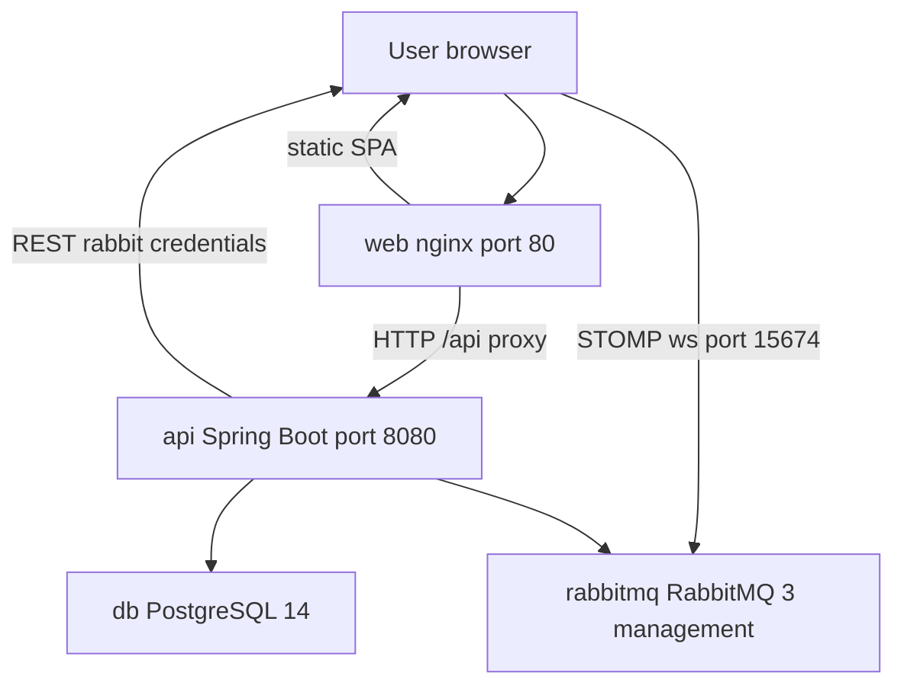
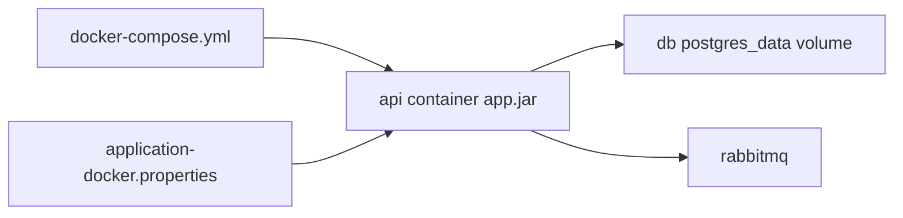

# OpenCBS Cloud — Infrastructure Overview

## 0. Plain Language Overview

This document explains how OpenCBS Cloud is packaged, built, and run on servers or laptops: which programs run in containers (packaged applications), how they talk to each other, and what configuration you must supply yourself. **DevOps engineers, SREs, and developers** get concrete file paths, images, ports, and build steps; **product owners and managers** get enough context to understand that deployment is Docker Compose–based today, not a managed cloud stack defined in this repository. After reading, you will know what runs in production-like local stacks, what is missing from the repo (CI/CD, cloud IaC, committed secrets/config), and where legacy technology versions need extra care.

---

## 1. Infrastructure Stack

**Audience — Technical:** DevOps, SRE, platform engineers, backend/frontend developers deploying or operating the system.  
**Audience — Non-technical:** Engineering managers and product owners who need to know *what* runs (web app, API, database, message broker) without reading YAML.

### 1.1 Active execution flow (from application entry points)

Tracing starts at the user-facing entry points defined in source (not commented-out or unused paths).

| Layer | Entry point (evidence) | What happens next |
|-------|------------------------|-------------------|
| Browser UI | `client/src/index.html` loads `<cbs-app-root>` | `client/src/main.ts` bootstraps `AppModule` via `platformBrowserDynamic().bootstrapModule(AppModule)` |
| HTTP API (browser) | Production: `environment.prod.ts` — `API_ENDPOINT: '/api/'` | Nginx in `web` proxies `location /api` to `http://api:8080` (`client/default.conf`) |
| HTTP API (dev) | `environment.ts` — `API_ENDPOINT: 'http://localhost:8080/api/'` | Direct to API when using `ng serve` on port 4200 (`client/README.md`) |
| REST + jobs | `server/opencbs-server/src/main/java/com/opencbs/cloud/ServerApplication.java` — `SpringApplication.run(ServerApplication.class, args)` | Spring Boot scans `com.opencbs`, JPA entities, scheduling, async (`@SpringBootApplication`, `@ComponentScan`, `@EntityScan`) |
| Real-time UI | `MessageService.init()` → `GET .../configurations/rabbit-credential` then STOMP WebSocket (`client/src/app/core/store/message-broker/message.service.ts`, `rabbit.service.ts`) | Browser connects to `ws://{host}:15674/ws` or `wss://...` using credentials from API (`RabbitProperties` / `ConfigService` on server) |



**Diagram Description:** The flowchart shows the runtime path for OpenCBS Cloud. A user opens the application on port 80 served by the `web` container (Nginx plus the built Angular app). API calls under `/api` are proxied from Nginx to the `api` container on port 8080. The Spring Boot API reads and writes the `db` PostgreSQL service and publishes messages to `rabbitmq`. Separately, after login, the browser may open a STOMP WebSocket to RabbitMQ on port 15674 (hardcoded in the Angular client), using host and credentials returned by the API. This matches `docker-compose.yml` service names, `client/default.conf`, and `ServerApplication.java` as the server entry point.

### 1.2 Container orchestration approach

| Topic | Finding |
|-------|---------|
| Orchestration | **Docker Compose** only — single file `OpenCBS/docker-compose.yml` |
| Kubernetes / Helm | **Not found in codebase** |
| Cloud provider (AWS/Azure/GCP) | **Not found in codebase** as deployment IaC; S3 URLs appear only in email HTML assets (`server/opencbs-core/src/main/resources/email/password_reset.html`), not as infrastructure definitions |
| Legacy mainframe (COBOL, JCL, RPG, etc.) | **Not found in codebase** |

**Legacy / special-attention stack (active code, not mainframe):** The running stack uses **Java 8** (`java.version` `1.8` in `server/opencbs-spring-boot-starter/pom.xml`), **Spring Boot 1.5.4.RELEASE**, and **Angular 8** (`client/package.json`). These are older but actively built and run via Dockerfiles; plan security patching and upgrade paths accordingly.

### 1.3 Docker Compose services (`OpenCBS/docker-compose.yml`)

| Service | Image / build | Role | Host ports | Depends on |
|---------|---------------|------|------------|------------|
| `db` | `postgres:14-alpine` | PostgreSQL database | None published | — |
| `rabbitmq` | `rabbitmq:3-management-alpine` | Message broker + management UI | `15672:15672` | — |
| `api` | Build: `server/opencbs-server/Dockerfile`, context `.` | Spring Boot API JAR | `8080` exposed on Docker network only (`expose`, not `ports`) | `db`, `rabbitmq` (healthy) |
| `web` | Build: `client/Dockerfile`, context `.` | Angular production build + Nginx | `80:80` | `api` |

**Restart policy:** `unless-stopped` on all four services.

**Health checks:**

| Service | Test | Interval / timeout / retries |
|---------|------|------------------------------|
| `db` | `pg_isready -U postgres` | 10s / 5s / 5 |
| `rabbitmq` | `rabbitmq-diagnostics ping` | 10s / 5s / 5 |
| `api`, `web` | None in compose file | — |

**Environment variables (PostgreSQL only, in compose):**

| Variable | Value |
|----------|--------|
| `POSTGRES_DB` | `opencbs` |
| `POSTGRES_USER` | `postgres` |
| `POSTGRES_PASSWORD` | `postgres` |

RabbitMQ credentials are **not** set in `docker-compose.yml`. Compose comment notes management UI at `http://localhost:15672` with default **guest / guest** (image default).

**Volumes:**

| Name / path | Used by | Purpose |
|-------------|---------|---------|
| Named volume `postgres_data` | `db` | Persistent PostgreSQL data at `/var/lib/postgresql/data` |
| Bind `./server/templates` → `/app/templates` | `api` | Report/template files |
| Bind `./server/attachments` → `/app/attachments` | `api` | Uploaded attachments |

**Networks:** No custom `networks:` block — Compose creates a **default bridge network** so services resolve each other by service name (`api`, `db`, `rabbitmq`).

**Operational gap (verified):** The Angular client uses STOMP WebSocket port **15674** (`message.service.ts`). `docker-compose.yml` publishes only **15672** (management UI), not **15674**. Real-time messaging from a browser on the host may require publishing `15674` or routing WebSocket traffic — **To be configured** for full Docker Compose parity with client code.

### 1.4 Container images and build pipelines (Dockerfiles)

**API — `OpenCBS/server/opencbs-server/Dockerfile`**

| Stage | Base image | Actions |
|-------|------------|---------|
| Builder | `maven:3.8-eclipse-temurin-8` | Copies `server/`, runs Maven `clean install` / `package` on modules in order: `opencbs-spring-boot-starter`, `opencbs-core`, `opencbs-loans`, `opencbs-borrowings`, `opencbs-savings`, `opencbs-term-deposits`, `opencbs-bonds`, then `opencbs-server` with `-DskipTests`, `-DBUILD_VERSION=1.0.0`, `-Dexec.skip=true` |
| Runtime | `eclipse-temurin:8-jre-alpine` | Copies JAR to `app.jar`, copies `application-docker.properties` to `/app/application.properties`, `EXPOSE 8080`, `java -jar` with `-Dspring.config.location=file:/app/application.properties` |

**Web — `OpenCBS/client/Dockerfile`**

| Stage | Base image | Actions |
|-------|------------|---------|
| Builder | `node:14-alpine` | `npm install --legacy-peer-deps`, `npm run build-prod` |
| Runtime | `nginx:1.21-alpine` | Serves `/usr/share/nginx/html` from `dist`, config `client/default.conf` |

**Nginx routing (`OpenCBS/client/default.conf`):** Upstream `api:8080`; `/` serves static files; `/api` proxies to API.

### 1.5 Technology versions (only where stated in files)

| Component | Version / image |
|-----------|-----------------|
| PostgreSQL (Compose) | `postgres:14-alpine` |
| RabbitMQ (Compose) | `rabbitmq:3-management-alpine` |
| Maven (API build image) | `3.8` (with `eclipse-temurin-8`) |
| JRE (API runtime) | Temurin 8 (`eclipse-temurin:8-jre-alpine`) |
| Node (client build) | `14-alpine` |
| Nginx (client runtime) | `1.21-alpine` |
| Spring Boot | `1.5.4.RELEASE` (`opencbs-spring-boot-starter/pom.xml`) |
| Spring Cloud | `Dalston.SR1` (same POM) |
| Java | `1.8` |
| Angular / CLI | `^8.1.4` / `^8.3.20` (`client/package.json`) |
| TypeScript (client) | `~3.4.1` (`client/package.json`) |
| Flyway | `4.0.3` (starter POM) |
| PostgreSQL JDBC | `42.2.2` (starter POM) |

### 1.6 Client build configuration (deploy-related only)

| File | Deploy relevance |
|------|------------------|
| `client/angular.json` | Production build `outputPath`: `dist`; `fileReplacements` swap `environment.ts` → `environment.prod.ts` (`API_ENDPOINT` `/api/`) |
| `client/package.json` | `build-prod`: `ng build --prod` with increased Node heap; used by `client/Dockerfile` |
| `client/tsconfig.json` | Compiler `target`: `es5`; not the primary deploy artifact path (Angular emits to `dist` per `angular.json`) |
| `client/karma.conf.js` | **Unit tests only** (Karma/Jasmine, port 9876); not part of container or Compose deployment |

Alternative server-driven client build: `server/opencbs-server/pom.xml` runs `yarn` / `yarn build-prod` in `../../client` via `exec-maven-plugin` — useful for non-Docker Maven releases; Docker path uses `npm` in `client/Dockerfile`.

### 1.7 How to run the stack

From repository root `OpenCBS/`:

```bash
docker compose up --build
```

(`docker-compose up --build` also works on older installations.)

| Endpoint | URL / note |
|----------|------------|
| Web application | `http://localhost` (port 80) |
| RabbitMQ management | `http://localhost:15672` (compose comment: guest / guest) |
| API from host | Not published in compose; reach via Nginx `/api` on port 80 |

### 1.8 Spring configuration for Docker

`server/opencbs-server/Dockerfile` expects `server/opencbs-server/src/main/resources/application-docker.properties` at build time. `server/.gitignore` excludes `application.properties` and `**/application-*.properties`. **That properties file is not found in tracked codebase** — datasource URL, RabbitMQ host (`spring.rabbitmq.*` consumed by `RabbitProperties`), and JWT secrets are **To be configured** before a successful API container build/run.

Server-side Rabbit settings are bound via `@ConfigurationProperties(prefix = "spring.rabbitmq")` on `RabbitProperties.java` (`host`, `frontHost`, `port`, `username`, `password`, `virtualHost`, `directExchange`, `fanoutExchange`). The API exposes credentials to the UI through `ConfigService.getRabbitProperties()` using `frontHost` for the browser.



**Diagram Description:** This diagram shows configuration dependencies for the API container. Docker Compose defines `db` and `rabbitmq` and builds `api`, but the API still needs `application-docker.properties` baked or mounted at runtime (referenced in the Dockerfile, not present in git). The JAR connects to PostgreSQL using the named volume `postgres_data` and to RabbitMQ over the Compose network. Without a valid properties file, the `api` service cannot start correctly even when Compose health checks pass for dependencies.

---

## 2. Infrastructure as Code

**Audience — Technical:** DevOps and SRE staff evaluating automation, reproducibility, and gaps.  
**Audience — Non-technical:** Managers assessing whether cloud provisioning and CI are already defined in the repo (they are largely not).

### 2.1 IaC inventory

| Tool / artifact | Present? | Location / notes |
|-----------------|----------|------------------|
| Docker Compose | Yes | `OpenCBS/docker-compose.yml` |
| Dockerfiles | Yes | `OpenCBS/server/opencbs-server/Dockerfile`, `OpenCBS/client/Dockerfile` |
| Terraform (`.tf`, `.hcl`) | **Not found in codebase** (searched workspace) |
| Kubernetes manifests | **Not found in codebase** |
| CloudFormation / Ansible / Helm | **Not found in codebase** |
| `.dockerignore` | **Not found in codebase** |
| GitHub Actions / GitLab CI / Jenkins | **Not found in codebase** (no `.github/workflows`, `Jenkinsfile`, `.gitlab-ci.yml`) |

### 2.2 Module and repository organization

| Path | Purpose |
|------|---------|
| `OpenCBS/docker-compose.yml` | Defines full local/production-like stack |
| `OpenCBS/server/pom.xml` | Parent Maven aggregator (`opencbs-cloud` `0.0.1-SNAPSHOT`) — modules: `opencbs-core`, `opencbs-spring-boot-starter`, `opencbs-server`, `opencbs-borrowings`, `opencbs-savings`, `opencbs-term-deposits`, `opencbs-bonds`, `opencbs-loans` |
| `OpenCBS/build.sh` | Shell script: requires two args (build version, instance name); runs same Maven module install order then `opencbs-$2/pom_backend.xml` — alternate packaging path, not wired to Compose |
| `OpenCBS/server/opencbs-server/Dockerfile` | Canonical API image build for Compose |
| `OpenCBS/client/Dockerfile` | Canonical web image build for Compose |

**How to run IaC today:** `docker compose up --build` from `OpenCBS/`. There is no documented Terraform/Kubernetes apply workflow in the repository.

### 2.3 CI/CD

| Item | Status |
|------|--------|
| Automated build/test/deploy pipelines | **Not found in codebase** |
| Compose as deployment definition | Manual or external orchestration of `docker compose` — **To be configured** in your environment |
| Tests in release builds | Docker API build uses `-DskipTests`; client image runs `build-prod` only (no `npm test` in Dockerfile) |

### 2.4 Related documentation in repo

Other markdown files under `OpenCBS/` (e.g. `ARCHITECTURE.md`, `README.md`, `INTEGRATIONS.md`) describe behavior; **this file is the root-level infrastructure summary** for the session workspace, grounded in compose, Dockerfiles, and entry-point source.

---

## 3. Resource Management

**Audience — Technical:** DevOps/SRE planning capacity, persistence, backups, and config secrets.  
**Audience — Non-technical:** Managers understanding data durability and what the repo does *not* define (cost tags, cloud quotas).

### 3.1 Persistence and state

| Resource | Type | Management |
|----------|------|------------|
| PostgreSQL data | Docker named volume `postgres_data` | Managed by Docker; backup/restore procedures **Not found in codebase** |
| Templates | Host bind mount `OpenCBS/server/templates` | Survives API container rebuild; lives on host filesystem |
| Attachments | Host bind mount `OpenCBS/server/attachments` | Same; directory also listed in `server/.gitignore` (`/attachments`) |
| Application logs | `server/.gitignore` includes `/logs` | Log path/configuration **Not found in codebase** in committed properties |

### 3.2 Compute and scaling

| Topic | Finding |
|-------|---------|
| Replica counts / autoscaling | **Not found in codebase** (single replica per Compose service) |
| CPU/memory limits (`deploy.resources`) | **Not found in codebase** in `docker-compose.yml` |
| Resource quotas (K8s/cloud) | **Not found in codebase** |

### 3.3 Cost allocation and tagging

| Topic | Finding |
|-------|---------|
| Cloud cost tags / labels | **Not found in codebase** |
| FinOps or chargeback metadata | **Not found in codebase** |

(Account *tagging* in the banking sense exists in domain migrations, e.g. `account_tags` in database docs — not infrastructure cost tagging.)

### 3.4 Secrets and configuration management

| Secret / config | In repo? | Notes |
|-----------------|----------|-------|
| Postgres password in Compose | Yes | `postgres` — development defaults only |
| RabbitMQ credentials | Partial | Compose comment only; Spring properties **To be configured** |
| `application.properties` / `application-*.properties` | Gitignored | Must be supplied locally or in image build context |
| API rate limits / quotas | **Not found in codebase** (per API documentation scan) |

**Recommendation (not in repo):** Externalize secrets via environment-specific property files, secret stores, or orchestrator secrets; replace default Compose passwords before any shared or production deployment.

### 3.5 Non-Docker resource paths

| Mechanism | Evidence |
|-----------|----------|
| `build.sh` | Manual Maven JAR build with version and instance arguments; does not start services |
| Maven `integration` profile | `id: integration` in `opencbs-spring-boot-starter/pom.xml` — skip flags for unit/js/integration tests; full CI usage **Not found in codebase** |

---

## FILE REPORT

| File | Path | Description |
|------|------|-------------|
| Created | `INFRASTRUCTURE_OVERVIEW.md` | Root-level infrastructure overview for OpenCBS Cloud (this document) |

Verification command output:

```
ls -lh INFRASTRUCTURE_OVERVIEW.md
```

*(Run after save to confirm size and timestamp.)*

---

*Generated from tracked source under `OpenCBS/` and workspace search. Values marked **Not found in codebase** or **To be configured** were not inferred.*
