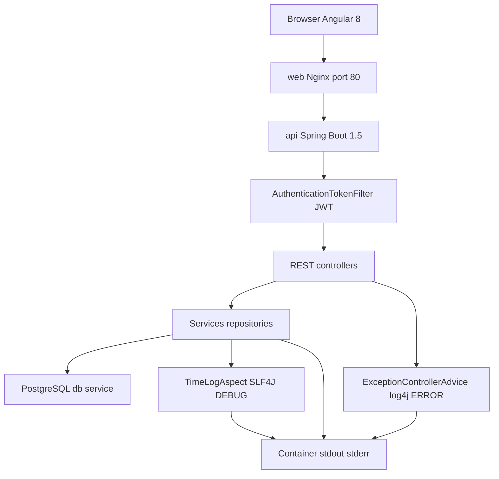
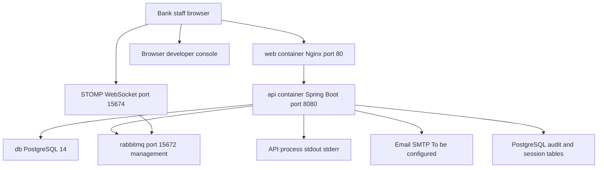

# OpenCBS Cloud — Logging and Monitoring Standards

## 0. Plain Language Overview

This document describes how the OpenCBS Cloud banking application records errors and operational events **as implemented in the repository today**, and what is **not** present in source or Docker configuration. **Developers, SREs, and DevOps engineers** will see which logging libraries and patterns the code uses, where logs go in Docker, and gaps for production observability. **Team leads and managers** will understand that monitoring today relies mainly on container health checks, database-backed audit trails, and email on day-closure failure—not a full centralized logging or metrics platform. After reading, you will know what the system logs automatically, what must be configured outside the repo, and which standards are recommended but not yet implemented.

**Legacy / aging stack note:** No mainframe code (COBOL, JCL, RPG, PL/I, VB6, etc.) was found under `OpenCBS/`. The stack uses **older-generation** technologies requiring extra operational care: **Java 8**, **Spring Boot 1.5.4.RELEASE**, and **Angular 8** (see `server/opencbs-core/pom.xml`, `client/package.json`).

---

## 1. Logging Standards

**Audience — Technical:** Backend and frontend developers implementing or reviewing log statements.  
**Audience — Non-technical:** Managers ensuring failures are visible and sensitive data is not exposed in logs.

### 1.1 Application entry points and active execution flow

| Tier | Entry point | Evidence |
|------|-------------|----------|
| API server | `ServerApplication.main` → `SpringApplication.run` | `server/opencbs-server/src/main/java/com/opencbs/cloud/ServerApplication.java` |
| Web UI | `platformBrowserDynamic().bootstrapModule(AppModule)` | `client/src/main.ts` |
| Docker API | `java -jar app.jar` with `-Dspring.config.location=file:/app/application.properties` | `server/opencbs-server/Dockerfile` |
| Docker web | Nginx serves `dist/` and proxies `/api` → `api:8080` | `client/Dockerfile`, `client/default.conf` |

Typical authenticated API request path (logging touchpoints in **bold**):

1. Browser → Nginx `web` (`location /api` → `api_upstream`)
2. Spring Security `AuthenticationTokenFilter` (JWT) — **no request logging in filter source**
3. Controller → service → JPA/PostgreSQL
4. Unhandled exception → **`ExceptionControllerAdvice.logError`** (Log4j 1.x)
5. Methods annotated `@TimeLog` → **`TimeLogAspect`** at DEBUG



**Diagram Description:** The flowchart traces the active request path from a bank staff browser through the Nginx web container to the Spring Boot API. The authentication token filter validates JWTs before controllers invoke services and the database. When an unhandled exception occurs, ExceptionControllerAdvice writes ERROR-level logs via Apache Log4j. Methods marked with the TimeLog annotation are wrapped by TimeLogAspect, which writes method duration at SLF4J DEBUG. Most other service logging also uses SLF4J and typically lands on the API container standard output. There is no centralized log collector in this repository diagram.

### 1.2 What exists in the codebase today

| Area | Evidence | Notes |
|------|----------|--------|
| Server logging API | Lombok `@Slf4j` on **27** Java classes under `server/` | SLF4J facade; Spring Boot 1.5 default binding is typically Logback, but **no `logback.xml` or committed `logging.*` properties** |
| Mixed logger | `ExceptionControllerAdvice.java` uses `org.apache.log4j.Logger` | Only grep hit for Log4j 1.x direct usage in server Java sources |
| Method timing | `@TimeLog` + `TimeLogAspect.java` | DEBUG: `{}.{} completed in {} ms`; used on `ProfileService`, `AccountBalanceService` |
| Global API errors | `ExceptionControllerAdvice.java` | Banner + message + stack at ERROR |
| Day closure | `DayClosureProcessWorker.java` | INFO progress; ERROR on failure; email + RabbitMQ system message |
| Message broker | `RabbitSenderServiceImpl.java` | ERROR on send failures; INFO on health check |
| Flyway startup | `CoreFlywayMigrationStrategy.java` | INFO migration start per config |
| Jasper reports | `JasperReportService.java` | WARN if report directory/report missing |
| SEPA import | `SepaIntegrationServiceImpl.java` | ERROR messages; also `printStackTrace()` |
| Client errors | `console.*` in components; `ErrorLogService` / `LoggingErrorHandler` | Handlers **implemented but not registered** (commented in `CORE_SERVICES.ts`) |
| Runtime log config | `application.properties`, `**/application-*.properties` | **Not found in codebase** — `server/.gitignore` ignores them; Dockerfile copies `application-docker.properties` which is **also not in tracked source** |

### 1.3 Log levels observed in source

| Level | Where used (examples) |
|-------|------------------------|
| `debug` | `TimeLogAspect` (method duration) |
| `info` | Day closure, Flyway, Jasper init, balance recalculation, RabbitMQ health check, `AccountBalanceService` recalculate |
| `warn` | Jasper report directory/reload warnings |
| `error` | `ExceptionControllerAdvice`, RabbitMQ failures, SEPA import, day closure failures |

**Not found in codebase:** Project-wide enforced log levels, JSON structured logging schemas, or PII/token masking in logging code.

### 1.4 Server error log format (actual code)

```35:40:OpenCBS/server/opencbs-core/src/main/java/com/opencbs/core/controllers/ExceptionControllerAdvice.java
    private void logError(Exception e){
        log.error("-------------- ERROR --------------");
        log.error(" MESSAGE: " + e.getMessage());
        log.error("Stacktrace: ", e);
        log.error("-----------------------------------");
    }
```

API clients receive JSON `ErrorResponse` (status, `errorCode`, `message`) — not the stack trace (same class).

### 1.5 Method timing (actual code)

```19:22:OpenCBS/server/opencbs-core/src/main/java/com/opencbs/core/aspects/TimeLogAspect.java
        log.debug("{}.{} completed in {} ms",
                proceedingJoinPoint.getSignature().getDeclaringType().getSimpleName(),
                proceedingJoinPoint.getSignature().getName(),
                duration);
```

### 1.6 Day closure logging (actual code)

```100:134:OpenCBS/server/opencbs-core/src/main/java/com/opencbs/core/dayclosure/DayClosureProcessWorker.java
            log.info("Day closure was started from {} to {}", DateHelper.convert(dayClosureDate), DateHelper.convert(launchDate));
            // ... per-date and per-container INFO lines ...
            log.info("Day closure was successful done");
        } catch (Exception e) {
            log.error("Day closure was done with error: {}",e.getMessage());
            // ... persist failure, RabbitMQ ERROR system message, email ...
```

On failure: `dayClosureService.createDayClosure(...)`, `amqMessageHelper.sendSystemMessage(SystemMessageType.ERROR, ...)`, `sendDayClosureError` using `day-closure.errorToEmails` from `DayClosureProperties`.

### 1.7 Client logging behavior

| Mechanism | Status |
|-----------|--------|
| `environment.STOMP_DEBUG` | `false` in `environment.ts` and `environment.prod.ts` |
| `ErrorLogService` | Browser **console** only; New Relic `noticeError` **commented out** |
| `LoggingErrorHandler` | Providers **commented out** in `CORE_SERVICES.ts` (lines 399–407) |
| Production mode | `main.ts` calls `enableProdMode()` when `environment.production` is true |
| Remote logging endpoint in `environment` | **Not found in codebase** (only `API_ENDPOINT`, `DOMAIN`, UI config) |

```49:52:OpenCBS/client/src/app/core/services/error-handler/error-log.service.ts
  private sendToNewRelic(error: any): void {
    // Read more: https://docs.newrelic.com/docs/browser/new-relic-browser/browser-agent-apis/report-data-events-browser-agent-api
    // newrelic.noticeError( error );
  }
```

### 1.8 Non-structured / discouraged patterns found

These bypass the SLF4J pipeline:

- `DayClosureProcessWorker.java` — `exception.printStackTrace()` (line 185)
- `SepaIntegrationServiceImpl.java` — `e.printStackTrace()` (lines 161, 202)
- `ImportPaymentHistoryServiceImpl.java` — `e.printStackTrace()` (line 72)

### 1.9 Sensitive data masking

**Not found in codebase:** Explicit masking of passwords, JWTs, or national IDs in log statements.

**To be configured:** Operational policy to avoid logging credentials, full payment data, or JWTs; restrict stack traces to authorized operators.

---

## 2. Correlation and Tracing

**Audience — Technical:** Engineers debugging cross-service requests.  
**Audience — Non-technical:** Managers asking whether support can follow one user action across logs — today that is limited.

### 2.1 Correlation ID

**Not found in codebase:** HTTP headers such as `X-Request-Id` or `X-Correlation-Id`, SLF4J MDC, Spring Cloud Sleuth, OpenTelemetry, or Zipkin.

Client headers from `HttpClientHeadersService` / `HttpHeaderInterceptorService`:

```11:18:OpenCBS/client/src/app/core/services/http-client-headers.service.ts
    const headersConfig = {
      'Content-Type': 'application/json',
      'Accept': 'application/json'
    };
    if (token) {
      headersConfig['Authorization'] = `Bearer ${token}`;
    }
```

### 2.2 Session and user context (related, not distributed tracing)

| Mechanism | Purpose |
|-----------|---------|
| `UserSessionHandler` + `UserSessionService` | Persists login/session records on POST (including `/login`) — business session audit, not log correlation |
| JWT in `localStorage` key `token` | Authentication on API calls |
| Hibernate Envers (`@Audited` entities; `spring-data-envers` in `opencbs-core/pom.xml`) | Entity revision history in DB — business audit |

Audit API for operators (`AuditTrailController.java`):

- `GET /api/audit-trail/report/BUSINESS_OBJECT`
- `GET /api/audit-trail/report/EVENTS`
- `GET /api/audit-trail/report/TRANSACTIONS`
- `GET /api/audit-trail/report/USER_SESSIONS`

### 2.3 Recommended standards (**To be configured** — not in repo)

- Generate a UUID per inbound HTTP request (filter/interceptor).
- Return `X-Correlation-Id` on responses; bind to SLF4J MDC on all log lines.
- Propagate correlation ID in RabbitMQ message headers for async work.

---

## 3. Centralized Logging

**Audience — Technical:** SRE/DevOps designing log aggregation and retention.  
**Audience — Non-technical:** Managers defining retention and access policy.

### 3.1 Docker Compose (`OpenCBS/docker-compose.yml`)

Services: `db` (PostgreSQL 14), `rabbitmq` (management image), `api` (Spring Boot), `web` (Nginx + Angular).

| Component | Logging / monitoring in compose |
|-----------|----------------------------------|
| Log collectors (Fluent Bit, Filebeat, etc.) | **Not found** |
| Metrics stack (Prometheus, Grafana) | **Not found** |
| Logging-related environment variables | **Not found** (only `POSTGRES_DB`, `POSTGRES_USER`, `POSTGRES_PASSWORD` on `db`) |
| `db` / `rabbitmq` | `healthcheck`: `pg_isready` / `rabbitmq-diagnostics ping` |
| `api` | `expose: 8080` only — no healthcheck or logging sidecar |
| `rabbitmq` | `15672:15672` — comment: Management UI → `http://localhost:15672` (guest / guest) |
| `web` | `80:80` — comment: App → `http://localhost` |

### 3.2 Nginx access logs

`client/default.conf` — access logging **commented out**:

```9:10:OpenCBS/client/default.conf
    #charset koi8-r;
    #access_log  /var/log/nginx/host.access.log  main;
```

### 3.3 Server log file location

`server/.gitignore` includes `/logs` and `application.properties`, `**/application-*.properties`.

**Not found in codebase:** ELK, Loki, CloudWatch, Splunk, retention policies, or log-shipping sidecars.

### 3.4 Application-level records in PostgreSQL (business audit, not log aggregation)

| Store | Role |
|-------|------|
| `accounting_entries_logs` | Links accounting entries to user and effective date (`AccountingEntryLog.java`, migration `V217__Create_accounting_entry_logs.sql`) |
| Envers `audit.*` tables | Entity revision history |
| `user_sessions` | Login/session audit via `UserSessionHandler` |
| Day closure rows | Persisted success/failure with exception message |

### 3.5 Alerting via email (operational signal)

Day closure failure emails use `day-closure.errorToEmails` (`DayClosureProperties.java`, prefix `day-closure`). Template `day_closure_error.html`:

```1:5:OpenCBS/server/opencbs-core/src/main/resources/email/day_closure_error.html
Day closure was failed<br/>
Instance: <pre>${instance}</pre><br/>
Date: ${date}<br/>
With message: ${message}<br/>
Trace: <pre>${trace}</pre>
```

Mail configuration: `EmailServiceImpl` uses `${email.sender}` and `${spring.mail.username}` — **values not in tracked properties files**.

### 3.6 Recommended centralized logging (**To be configured**)

- Ship API stdout/stderr and Nginx access/error logs to a central store.
- Define retention and access controls for security and support roles.

---

## 4. Metrics Standards

**Audience — Technical:** SRE/DevOps defining SLIs/SLOs and dashboards.  
**Audience — Non-technical:** Managers tracking uptime and batch success — only partially supported today.

### 4.1 Metrics libraries and endpoints

**Not found in codebase:**

- `spring-boot-starter-actuator`
- Micrometer, Prometheus exporters, custom `/metrics` HTTP endpoints
- Application-defined metric counters/histograms

### 4.2 Health checks that exist

| Check | Type | Location |
|-------|------|----------|
| PostgreSQL ready | Docker healthcheck | `docker-compose.yml` → `pg_isready -U postgres` |
| RabbitMQ ping | Docker healthcheck | `docker-compose.yml` → `rabbitmq-diagnostics ping` |
| RabbitMQ publish probe | Application | `RabbitSenderServiceImpl.checkConnectionsHealth()` → exchange `amq.topic`, routing key `healthQueue` |
| Public API version/info | HTTP GET | `GET /api/info` (permitAll in `WebSecurityConfiguration.java`) → `ServerInfoController` / `AbstractInfoController` |

```58:74:OpenCBS/server/opencbs-core/src/main/java/com/opencbs/core/services/messages/impl/RabbitSenderServiceImpl.java
    public void checkConnectionsHealth() {
        try {
            rabbitTemplate.convertAndSend(
                    "amq.topic",
                    "healthQueue",
                    "check",
                    ...
            );
            log.info("Message broker health check");
        } catch (Exception e) {
            log.error(e.getMessage());
            throw new RuntimeException("Connection to Message broker is failed!");
        }
    }
```

Invoked from `DayClosureValidator.validateTryCloseDay` via `AmqMessageHelper.checkConnectionHealth()` — **not** exposed as a dedicated HTTP health endpoint in this repo.

### 4.3 Test / build metrics (non-production)

`client/karma.conf.js` uses `karma-coverage-istanbul-reporter` with output under `coverage/` — unit test coverage only.

### 4.4 Recommended metrics (**To be configured**)

| Metric (suggested name) | Type | Rationale |
|------------------------|------|-----------|
| `opencbs_http_server_requests_seconds` | Histogram | API latency and status |
| `opencbs_day_closure_duration_seconds` | Histogram | End-of-day batch SLA |
| `opencbs_day_closure_failures_total` | Counter | Alert on failed closures |
| `opencbs_rabbitmq_publish_errors_total` | Counter | Messaging health |

---

## 5. Observability Stack

**Audience — Technical:** Engineers and SREs wiring tools and URLs.  
**Audience — Non-technical:** Managers understanding what operators can open today vs. what must be procured.

### 5.1 Runtime components (source-backed)

| Component | Version / image | Role |
|-----------|-----------------|------|
| Angular client | `@angular/core` `^8.1.4` (`client/package.json`) | UI; console-based errors |
| Spring Boot API | `1.5.4.RELEASE` (`opencbs-core/pom.xml`) | Business logic; SLF4J → process stdout |
| PostgreSQL | `postgres:14-alpine` (`docker-compose.yml`) | Primary datastore |
| RabbitMQ | `rabbitmq:3-management-alpine` | Messaging + STOMP to browser |
| Nginx | `nginx:1.21-alpine` (`client/Dockerfile`) | Static assets; proxy `/api` → `api:8080` |
| Java runtime (API image) | `eclipse-temurin:8-jre-alpine` (`server/opencbs-server/Dockerfile`) | JRE 8 |

### 5.2 URLs documented in repository

| URL | Purpose | Source |
|-----|---------|--------|
| `http://localhost` | Web app (port 80) | `docker-compose.yml` comment |
| `http://localhost:15672` | RabbitMQ Management UI (guest/guest) | `docker-compose.yml` comment |
| `ws://{host}:15674/ws` or `wss://...` | STOMP WebSocket | `client/src/app/core/store/message-broker/message.service.ts` |
| `http://localhost:8080/api/` | Dev API base | `client/src/environments/environment.ts` |
| `/api/` | Prod API base (same origin) | `environment.prod.ts` |
| `GET /api/info` | Version/title/instance metadata | `AbstractInfoController.java` |

**Not found in codebase:** Grafana, Kibana, Jaeger, Prometheus, or active New Relic browser agent (stub only).

### 5.3 Real-time user notifications (not operational metrics)

After login, `MessageService` connects via STOMP with `STOMP_HEARTBEAT_IN: 40000`, `STOMP_HEARTBEAT_OUT: 1000` from environment. This is **user-facing messaging**, not infrastructure monitoring.

### 5.4 End-to-end observability flow (Docker layout in repo)



**Diagram Description:** Bank staff use a browser loading the Angular app from the Nginx web container on port 80. API calls under `/api` are proxied to the Spring Boot api service on port 8080, which uses PostgreSQL and publishes to RabbitMQ. The browser may open a STOMP WebSocket on port 15674 for live notifications. API application logs go to container stdout/stderr with no centralized collector in this repo. Client errors mostly go to the browser developer console because Angular error-handler providers are disabled. Day closure failures can email operators when SMTP and `day-closure.errorToEmails` are configured. Longer-lived evidence lives in PostgreSQL audit, session, and accounting log tables, queryable via `/api/audit-trail/...` rather than log search tools.

### 5.5 Gaps summary for leadership

| Capability | Status |
|------------|--------|
| Centralized log search | **Not found in codebase** |
| Request correlation across services | **Not found in codebase** |
| HTTP metrics / Actuator health URL | **Not found in codebase** |
| Dashboards and alert rules | **Not found in codebase** |
| Container health for DB and RabbitMQ | **Present** in `docker-compose.yml` |
| Business audit trail API | **Present** (`/api/audit-trail/...`) |
| Day closure failure email | **Present** (template + worker; mail config gitignored) |
| `GET /api/info` | **Present** (version metadata, not deep health) |

---

## Appendix A — Technology versions referenced (source-backed)

| Item | Value | File |
|------|-------|------|
| Spring Boot | 1.5.4.RELEASE | `server/opencbs-core/pom.xml` |
| Java (compile) | 1.8 | `server/opencbs-server/pom.xml` |
| PostgreSQL image | 14-alpine | `OpenCBS/docker-compose.yml` |
| RabbitMQ image | 3-management-alpine | `OpenCBS/docker-compose.yml` |
| Angular | ^8.1.4 | `OpenCBS/client/package.json` |
| Node (client build) | 14-alpine | `OpenCBS/client/Dockerfile` |

---

## Appendix B — Document provenance

Statements in sections 1–5 are derived from files under `OpenCBS/` unless marked **To be configured** or **Not found in codebase**. Commented-out and unused legacy paths were excluded. `application-docker.properties` is referenced by the API Dockerfile but is **not present in tracked source** (`server/.gitignore` excludes `**/application-*.properties`).

---

## FILE REPORT

| Field | Value |
|-------|-------|
| Filename | `LOGGING_AND_MONITORING.md` |
| Relative path | `LOGGING_AND_MONITORING.md` (repository root) |
| Absolute path | `/home/vishal/repos/session_954f8999a61f/LOGGING_AND_MONITORING.md` |
| File size | 21K (verified: `ls -lh LOGGING_AND_MONITORING.md`, May 20 2026) |
