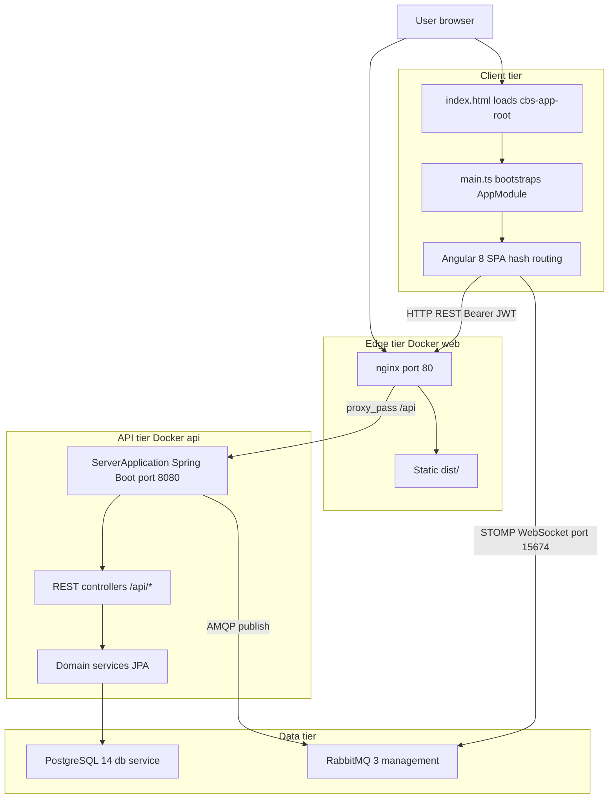
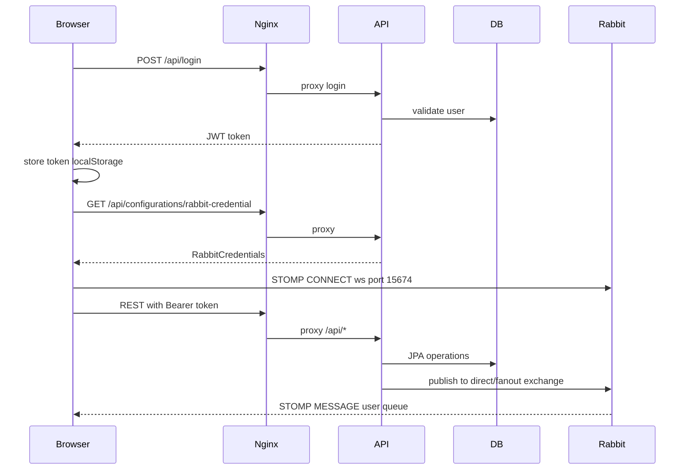
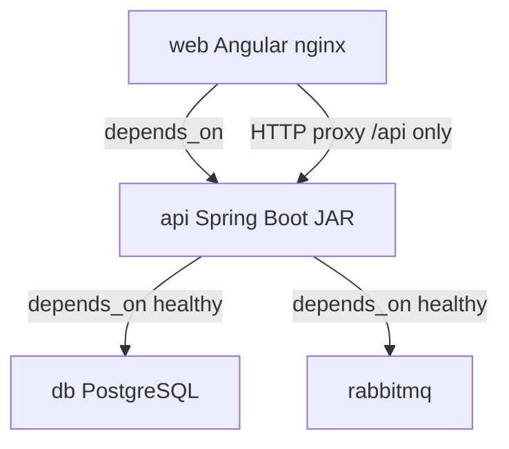
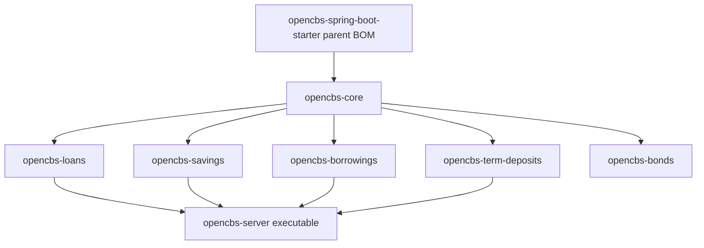

# OpenCBS Cloud — Overall System Architecture

## 0. Plain Language Overview

This document explains how **OpenCBS Cloud** is built and how its parts work together: the web application users see, the API that processes banking operations, the database where data is stored, and the message broker used for live updates. **Architects, developers, and tech leads** will find module layout, communication patterns, and deployment topology; **product owners and managers** will understand that this is a single integrated core banking product (not many separate microservices in production) and which business areas (loans, savings, profiles, accounting, etc.) map to which parts of the system. After reading, you will know how a user action flows from the browser to the server and database, what external infrastructure is required, and where the codebase uses older technologies that need extra care.

---

## 1. Architecture Overview

**Audience — Technical:** Solution architects, backend/frontend leads, DevOps engineers mapping deployable units and module boundaries.  
**Audience — Non-technical:** Product owners and program managers who need a accurate mental model of “one app vs many services” and major business domains.

### Architectural style

Evidence from `docker-compose.yml`, `ServerApplication.java`, and `server/pom.xml` shows a **modular monolith**:

- **One runnable API process:** Spring Boot application `com.opencbs.cloud.ServerApplication` with `@ComponentScan("com.opencbs")` and `@EntityScan("com.opencbs")` loads all domain JARs into a single JVM.
- **One deployable frontend:** Angular SPA built and served by nginx (`client/Dockerfile`, `client/default.conf`).
- **Not microservices:** No Spring Cloud service discovery, API gateway, or Feign clients were found in the server codebase. `spring.cloud.version` (`Dalston.SR1`) appears in POM properties but is not wired to deployable services.

This is **not** an event-sourced or CQRS (Command Query Responsibility Segregation — a pattern that separates read and write models) system: **Not found in codebase**.

### System purpose

OpenCBS Cloud is a **Core Banking System (CBS)** — software used by financial institutions for customer profiles, loans, savings, term deposits, borrowings, bonds (UI present), teller/cash operations, accounting, maker-checker approvals, and reports. The root `README.md` describes targets such as microfinance institutions and cooperative lenders.

### Bounded contexts / domain decomposition

Maven modules in `server/pom.xml` map to business domains. All are packaged into the same API unless noted:

| Maven module | Primary responsibility | REST prefix examples (from controllers) |
|--------------|------------------------|----------------------------------------|
| `opencbs-core` | Profiles (people, companies, groups), users, roles, branches, accounting, tills/vaults, transfers, day closure, maker-checker requests, reports, system settings | `/api/profiles`, `/api/accounting`, `/api/tills`, `/api/transfers`, `/api/requests`, `/api/day-closure` |
| `opencbs-loans` | Loan applications, loans, collateral, schedules, repayments, credit lines | `/api/loan-applications`, `/api/loans`, `/api/credit-lines` |
| `opencbs-savings` | Savings products and accounts, till savings | `/api/savings`, `/api/saving-products`, `/api/tills` |
| `opencbs-term-deposits` | Term deposit products and contracts | `/api/term-deposits`, `/api/term-deposit-products` |
| `opencbs-borrowings` | Institution borrowings | `/api/borrowings` |
| `opencbs-bonds` | Bonds lifecycle | `/api/bonds` |
| `opencbs-server` | Executable shell: depends on loans, borrowings, savings, term-deposits (see coupling note below) | N/A (boot entry only) |
| `opencbs-spring-boot-starter` | Parent POM / shared dependency BOM | N/A |

**Coupling note (bonds):** `opencbs-bonds` is listed in `server/pom.xml` and built in `server/opencbs-server/Dockerfile`, but **`opencbs-bonds` is not declared as a dependency in `opencbs-server/pom.xml`**. The Angular client includes a bonds area (`environment.ts` navigation). Bond REST controllers exist under `opencbs-bonds`, but they may not be active in the default server JAR unless the dependency is added. Treat bonds as **partially integrated** until verified in your build.

### Active execution flow (entry points)

**Diagram Description:** The flowchart shows the end-to-end path for an active user session. The browser loads the Angular app via nginx (`web` service). `main.ts` bootstraps `AppModule`, which drives UI navigation (hash-based routes). Business operations call REST endpoints under `/api`, proxied by nginx to the Spring Boot `api` service on port 8080. The API uses JPA services against PostgreSQL. For real-time notifications, the browser also opens a STOMP connection to RabbitMQ (Web STOMP plugin on port 15674), while the server publishes messages to RabbitMQ exchanges. PostgreSQL and RabbitMQ are separate Docker services depended on by `api`.

**Step-by-step (verified in source):**

1. **Browser entry:** `client/src/index.html` → `client/src/main.ts` → `platformBrowserDynamic().bootstrapModule(AppModule)`.
2. **Routing:** `client/src/app/app-routing.module.ts` — `useHash: true`, default redirect to `dashboard`.
3. **HTTP API base:** Dev: `http://localhost:8080/api/` (`environment.ts`). Docker/production build: `/api/` (`environment.prod.ts`) via nginx `location /api` → `api:8080` (`client/default.conf`).
4. **Auth header:** `HttpClientHeadersService` adds `Authorization: Bearer <token>` from `localStorage` (`client/src/app/core/services/http-client-headers.service.ts`).
5. **Server entry:** `ServerApplication.main` → `SpringApplication.run` with async and scheduling enabled (`@EnableAsync`, `@EnableScheduling`).
6. **Security:** Stateless JWT filter (`WebSecurityConfiguration`, `AuthenticationTokenFilter`) — login at `POST /api/login` returns token (`LoginController`).

### Design principles evident in code

- **Modular packaging, monolithic runtime:** Clear Maven boundaries per banking domain; single Spring context at runtime.
- **Synchronous request/response default:** Controllers return DTOs over HTTP; primary integration style is REST.
- **Push notifications via messaging:** Server publishes JSON messages to RabbitMQ; client subscribes with STOMP (not server-push SSE).
- **Schema evolution via Flyway:** Per-module SQL migrations with separate Flyway history tables (see Section 3).
- **Maker-checker:** Approval workflow centralized in `opencbs-core` (`/api/requests`, `MakerCheckerWorker`).

### Legacy and special-attention flags

| Category | Finding |
|----------|---------|
| Mainframe (COBOL, RPG, JCL, PL/I, etc.) | **Not found in codebase** |
| Legacy web (PHP, Classic ASP, etc.) | **Not found in codebase** |
| “Walking dead” / dated active stack | **Java 8**, **Spring Boot 1.5.4.RELEASE**, **Angular 8** — supported stacks from ~2017–2019; plan security upgrades and dependency maintenance |
| Gitignored runtime config | `application.properties` and `**/application-*.properties` are gitignored (`server/.gitignore`); `application-docker.properties` is copied in Dockerfile but **no tracked copy exists in the repository** — datasource URLs, Rabbit hosts, and JWT secrets are **Not found in codebase** (environment-specific) |

---

## 2. Communication Patterns

**Audience — Technical:** Integration engineers and full-stack developers defining API and messaging contracts.  
**Audience — Non-technical:** Managers coordinating with vendors — understand that most work is “web form → API → database,” with optional live notifications.

### Synchronous communication (primary)

| Mechanism | From | To | Details |
|-----------|------|-----|---------|
| HTTP REST | Angular `HttpClient` | Spring `@RestController` | Base path `/api/...`; JSON; Swagger 2 documented (`SwaggerConfig`, title “OpenCBS API Documentation”, version `0.1.0`) |
| Reverse proxy | nginx (`web`) | Spring Boot (`api`) | `location /api { proxy_pass http://api_upstream; }` — only `/api` is proxied; static files served from `/usr/share/nginx/html` |

**API gateway / service mesh:** **Not found in codebase** (no Kong, Zuul, Envoy, Istio, or similar configuration).

### Asynchronous communication

| Mechanism | Direction | Purpose (from code) |
|-----------|-----------|---------------------|
| RabbitMQ AMQP | API → broker | `RabbitSenderServiceImpl.convertAndSend` — user-specific and fanout messages (`AmqMessageHelper`) |
| STOMP over WebSocket | Browser → broker | `@stomp/ng2-stompjs` in `MessageService` — subscribes to `/exchange/{directExchange}/{userId}` and fanout exchange |
| Config for STOMP | API → browser | `GET /api/configurations/rabbit-credential` (`ConfigController`) supplies host, credentials, virtual host, exchange names |

**Message consumption on server:** `@RabbitListener` — **Not found in codebase**. The API appears to **publish** notifications (e.g. day closure progress via `DayClosureProcessWorker` + `AmqMessageHelper`); the **browser is the subscriber**. A `balanceCalculationQueue` bean is declared (`RabbitMQConfiguration`) with topic exchange binding — **no in-repo consumer** was found for that queue.

**Spring Cloud Stream / Kafka:** **Not found in codebase**.

### Authentication and session pattern

- **JWT (JSON Web Token)** — stateless API: `TokenHelper` uses `jjwt` `0.9.1`; filter reads Bearer token (`WebSecurityConfiguration`: `SessionCreationPolicy.STATELESS`).
- Permitted without auth: `/api/login`, password reset paths, selected GET attachments, `/api/info`, `/api/system-settings`, `/api/utils/**`, Swagger static paths.
- **CORS / API mesh:** **Not found in codebase** beyond standard Spring Security CSRF disabled for API usage.

### Real-time client initialization

After login, `MessageService.init()` zips current user (`GET .../users/current`) and Rabbit config, then connects STOMP to `ws://{host}:15674/ws` or `wss://` (`message.service.ts`). Heartbeats come from `environment.ts` (`STOMP_HEARTBEAT_IN` / `OUT`).

**Diagram Description:** This sequence diagram shows login and subsequent dual-channel usage. The browser logs in through nginx to obtain a JWT, stores it, then fetches RabbitMQ connection settings from the API (authenticated). It opens a parallel STOMP WebSocket to RabbitMQ for notifications. Normal banking operations use REST through nginx with the Bearer token; the API reads and writes PostgreSQL. When the server needs to notify the user (for example day closure), it publishes to RabbitMQ and the browser receives the message on its subscribed exchange routes.

---

## 3. Data Architecture

**Audience — Technical:** Data architects, DBAs, and backend developers responsible for migrations and consistency.  
**Audience — Non-technical:** Managers overseeing data residency — all domains share one database instance in the default Docker layout.

### Data store

| Store | Technology | Evidence |
|-------|------------|----------|
| Primary relational DB | PostgreSQL 14 (`postgres:14-alpine` in `docker-compose.yml`) | Database name `opencbs`, user `postgres` (compose environment) |
| Message broker | RabbitMQ 3 with management plugin | `rabbitmq:3-management-alpine`; management UI port `15672` published |
| File attachments | Filesystem volumes | `./server/templates`, `./server/attachments` mounted into `api` container |

**Separate database per service:** **No** — single `db` service; all modules use Flyway with schema `public` (each `*FlywayConfig.getSchema()` returns `"public"`).

### Schema management (Flyway)

`CoreFlywayMigrationStrategy` runs migrations in order:

1. Core: `classpath:db/migration/core`, history table `schema_version_core`, schema `public`.
2. Each Spring bean implementing `FlywayConfig` (loans, savings, borrowings, term deposits, bonds, etc.) with its own history table, e.g. `schema_version_loans`, `schema_version_savings`, locations `db/migration/loans`, etc.

This is **logical modularization** of SQL scripts into one physical PostgreSQL database, not database-per-bounded-context.

### Persistence layer

- **Spring Data JPA** (`spring-boot-starter-data-jpa` in `opencbs-core/pom.xml`).
- **Hibernate Envers** dependency present; `@Audited` used on some domain entities (e.g. loan/saving/term deposit products) for change history.
- **Querydsl** `4.2.1` for type-safe queries — **found in POM**; used in custom repositories where implemented.

### Consistency model

- **ACID transactions (typical monolith):** Service-layer `@Transactional` patterns implied by JPA usage; distributed transactions across services — **N/A** (single service).
- **Event sourcing:** **Not found in codebase**.
- **CQRS:** **Not found in codebase**.
- **Cross-module consistency:** Enforced in-process via shared database and core services (e.g. `accountService.getAccountBalance` used from loans, savings, term deposits).

### Caching / read replicas

**Not found in codebase**.

---

## 4. Service Dependencies

**Audience — Technical:** Architects assessing build order, deployment risk, and module coupling.  
**Audience — Non-technical:** Managers tracking which product areas depend on shared “core” capabilities (profiles, accounting, users).

### Runtime dependency graph (deployed stack)

**Diagram Description:** The diagram shows Docker Compose service dependencies. The `web` container depends on `api` but only proxies HTTP API traffic; it does not connect to the database directly. The `api` container waits for healthy `db` and `rabbitmq` before starting. There is no direct link from `web` to PostgreSQL or RabbitMQ in compose, though the browser connects to RabbitMQ separately for STOMP as configured by the API.

### Maven module dependency graph (build-time)

**Diagram Description:** All domain modules depend on `opencbs-core`, which holds shared entities, security, accounting, profiles, and infrastructure configuration. `opencbs-server` aggregates loans, savings, borrowings, and term-deposits into the runnable application. `opencbs-bonds` is compiled in the Docker build chain but is **not** shown connecting to `opencbs-server` because that dependency is missing from `opencbs-server/pom.xml` — a critical path gap for bonds features in the default artifact.

### Critical paths

1. **User login → JWT → authorized REST** — `LoginController` → `TokenHelper` → `AuthenticationTokenFilter` → business controllers.
2. **Financial posting** — domain services in loans/savings/etc. → core accounting (`/api/accounting`, account balances) → PostgreSQL.
3. **Day closure** — `DayClosureController` / `DayClosureProcessWorker` (`@Scheduled`, `@Async`) → processors in multiple modules → optional RabbitMQ user notifications.
4. **Maker-checker approval** — changes staged as `Request` entities → `/api/requests` → `MakerCheckerWorker` on approve.

### Circular dependencies

**No circular Maven module dependencies** were identified: domain modules depend on `opencbs-core` only; `opencbs-server` depends on domain modules, not vice versa.

### Coupling characteristics

| Coupling type | Assessment |
|---------------|------------|
| Domain ↔ core | **High** — shared accounts, profiles, branches, currencies, day closure |
| Domain ↔ domain | **Medium** — via core services and shared `public` schema, not separate APIs |
| Client ↔ API | **Medium** — REST contract per feature module; environment-based base URL |
| Client ↔ RabbitMQ | **Tight** — requires broker reachable at `frontHost:15674` from browser; credentials exposed to authenticated clients via API |

---

## 5. Scalability & Resilience

**Audience — Technical:** SREs, platform engineers, and architects planning HA and capacity.  
**Audience — Non-technical:** Managers setting expectations — default repo layout is a **single-node demo stack**, not a production HA blueprint.

### Scaling

| Capability | Status |
|------------|--------|
| Horizontal scaling of API (multiple replicas) | **Not found in codebase** — Compose defines one `api` service, port `expose` only (not host-published) |
| Load balancer in front of API | **Not found in codebase** — nginx in `web` proxies to single `api:8080` upstream |
| Stateless API design | **Partial** — JWT stateless HTTP aids scaling; STOMP subscriptions are per-user and broker-affinitized |
| Database read replicas / sharding | **Not found in codebase** |
| Kubernetes / Helm | **Not found in codebase** |

### Resilience patterns

| Pattern | Status |
|---------|--------|
| Circuit breaker (Hystrix, Resilience4j, etc.) | **Not found in codebase** |
| Bulkhead / thread pool isolation | **Not found in codebase** |
| Retry policies (client or server) | **Not found in codebase** |
| Docker `restart: unless-stopped` | **Yes** — all compose services (`docker-compose.yml`) |
| Health checks | **Yes** — `db` (`pg_isready`), `rabbitmq` (`rabbitmq-diagnostics ping`); **api/web have no healthcheck** in compose |
| RabbitMQ connection health | `RabbitSenderServiceImpl.checkConnectionsHealth()` publishes test message — used for broker connectivity checks |
| Message publish failure handling | Errors logged in `RabbitSenderServiceImpl`; no retry/backoff visible |

### Background processing

- `@EnableScheduling` on `ServerApplication` — e.g. `DayClosureProcessWorker` with `@Scheduled(cron="${day-closure.auto-start-time}")` (cron value **Not found in codebase** — property gitignored).
- `@EnableAsync` — async day closure steps (`DayClosureContainerExecutor`, `DayClosureProcessWorker`).

### Security resilience notes

- JWT secret and token TTL: **Not found in codebase** (configuration gitignored).
- PostgreSQL and RabbitMQ default credentials in compose are suitable for **local development only** (`postgres`/`postgres`, RabbitMQ comment `guest`/`guest` for management UI).

---

## Appendix A — Technology versions (source-evidenced only)

| Component | Version / image |
|-----------|-----------------|
| Java | 1.8 |
| Spring Boot | 1.5.4.RELEASE |
| PostgreSQL (Docker) | 14-alpine |
| RabbitMQ (Docker) | 3-management-alpine |
| Angular | ^8.1.4 |
| Node (client build) | 14-alpine |
| nginx (client runtime) | 1.21-alpine |
| Flyway | 4.0.3 |
| PostgreSQL JDBC | 42.2.2 |
| jjwt | 0.9.1 |

---

## Appendix B — Representative API surface (non-exhaustive)

Prefix for all: `/api` (plus dev host `http://localhost:8080` when not behind nginx).

| Area | Example paths |
|------|----------------|
| Auth | `POST /login`, `PUT /login/update-password` |
| Profiles | `/profiles`, `/profiles/people`, `/profiles/companies`, `/profiles/groups` |
| Loans | `/loan-applications`, `/loans`, `/loan-products` |
| Savings | `/savings`, `/saving-products` |
| Term deposits | `/term-deposits`, `/term-deposit-products` |
| Borrowings | `/borrowings` |
| Bonds | `/bonds` (module may be omitted from server JAR — see Section 1) |
| Accounting | `/accounting`, `/accounting/accounting-entries` (client routes) |
| Operations | `/tills`, `/vaults`, `/transfers`, `/day-closure` |
| Governance | `/requests` (maker-checker) |
| Config / messaging | `/configurations/rabbit-credential` |
| Reports | `/reports` |

Full enumeration: use Swagger UI when the server is running, or grep `@RequestMapping(value = "/api` under `server/`.

---

## Appendix C — Related documentation in repository

| Document | Path |
|----------|------|
| Repository README | `OpenCBS/README.md` |
| Business overview | `OpenCBS/BUSINESS_OVERVIEW.md` |
| User journeys | `OpenCBS/USER_JOURNEYS.md` |

---

*Generated from source files under `OpenCBS/`. Configuration values in gitignored `application*.properties`, production HA patterns, and several resilience mechanisms are explicitly marked **Not found in codebase** where absent.*
