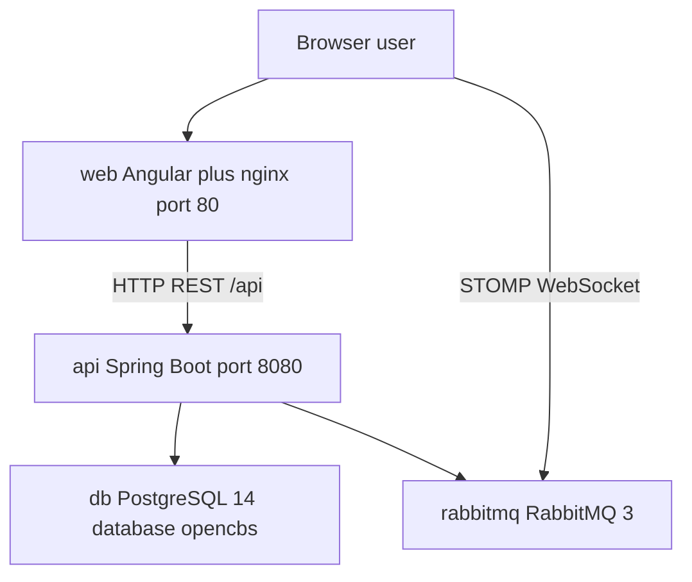
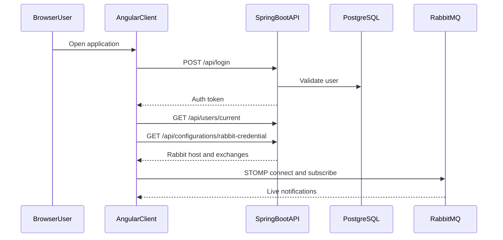
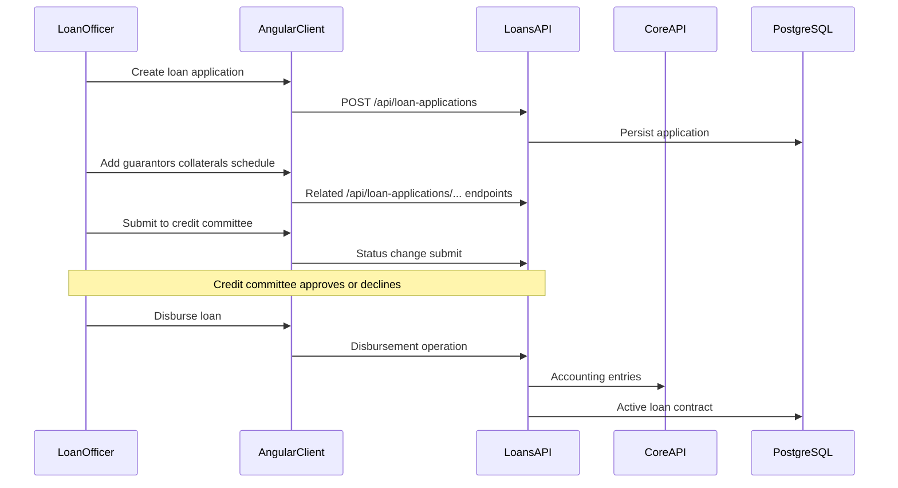
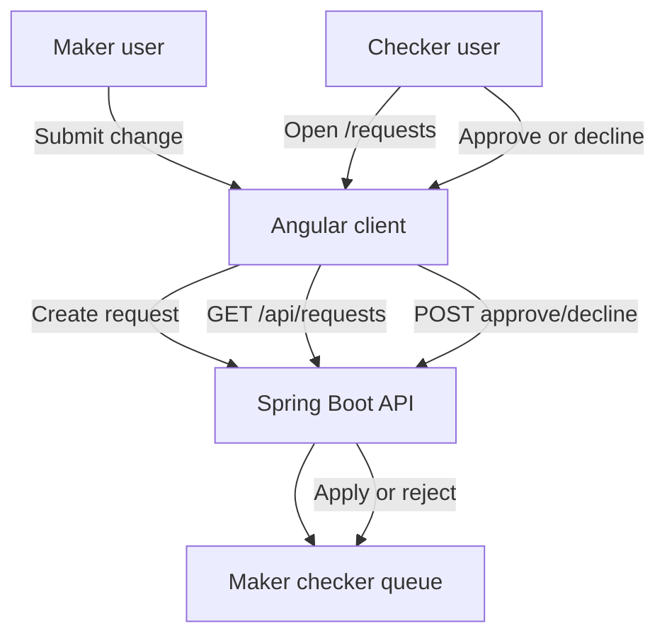
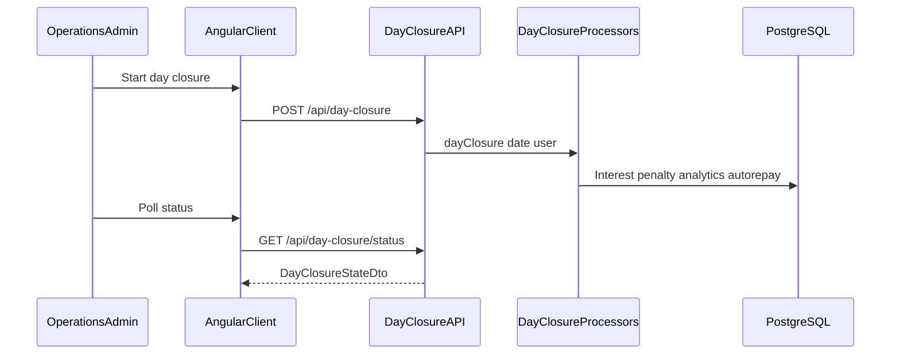
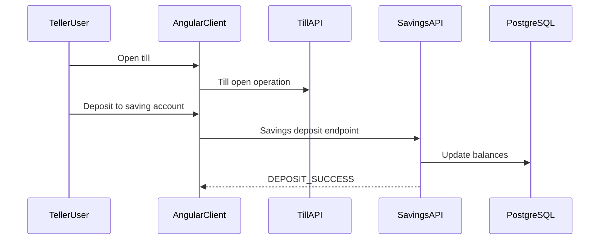
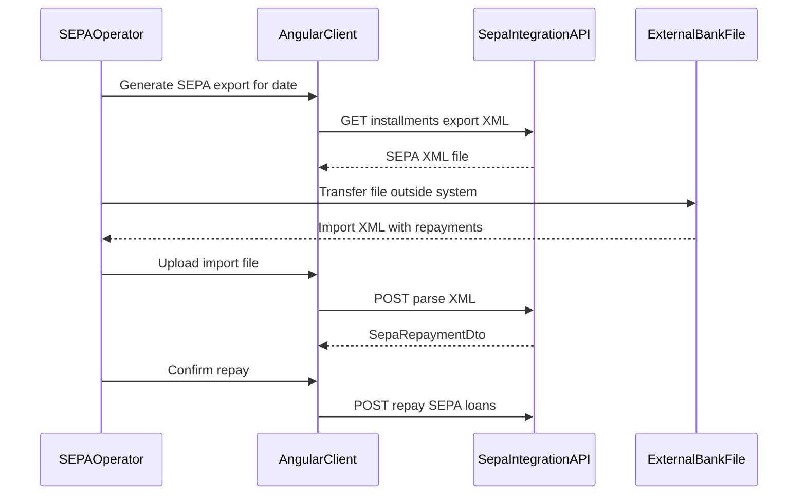

# OpenCBS Cloud — Product Overview

## 0. Plain Language Overview

This document describes **OpenCBS Cloud**, an open-source core banking system (software that runs a financial institution’s customer accounts, loans, savings, cash desks, and accounting). **Technical readers** (developers, architects, DevOps) will see how the web app, API, database, and message broker fit together, which modules own each feature, and which integration endpoints exist. **Non-technical readers** (product owners, executives, branch managers, compliance staff) will understand what the product does, who uses it, and how major workflows connect—without reading code. After reading, you will have a feature catalogue, user personas, cross-service flows, integration points, and a glossary—all tied to evidence in this repository.

**Audiences:** Developers and architects; product owners and business analysts; operations and branch staff leads; finance and accounting managers; compliance and audit reviewers.

---

## 1. Product Vision

**Audiences — Technical:** Architects and engineering leads scoping modules and upgrades.  
**Audiences — Non-technical:** Executives and product owners evaluating fit for microfinance, cooperatives, digital lenders, or medium-sized banks.

### What OpenCBS Cloud is

OpenCBS Cloud is a **Core Banking System (CBS)**—software financial institutions use to manage customers (**profiles**), lending (**assets**), deposits and funding (**liabilities**), branch cash (**teller management**), internal **transfers**, **accounting**, controlled **approvals** (maker/checker), and **reports**. The root `README.md` describes it as a “simple, scalable open-source Core Banking System optimised for the Cloud,” developed from **2017 onwards**, targeting microfinance institutions, cooperative financial institutions, digital lenders, and medium-sized banks.

The browser title and branding are **OpenCBS Cloud** (`client/src/index.html`).

### How the system runs (active execution flow)

Staff use a **web application** in the browser. The app calls a **REST API** for business operations and may subscribe to **real-time messages** over STOMP/WebSocket to RabbitMQ after login.

**Diagram Description:** This top-to-bottom flowchart shows the runtime path for a typical user session. The browser loads the Angular single-page application from the `web` service (nginx on port 80). User actions trigger REST calls to `/api`, which nginx proxies to the Spring Boot `api` service on port 8080 inside Docker. Separately, after authentication, the client can open a STOMP connection to RabbitMQ for live notifications. The API persists data in PostgreSQL (`opencbs` database) and publishes or consumes messages on RabbitMQ. Evidence: `docker-compose.yml`, `client/src/main.ts`, `ServerApplication.java`, `client/default.conf`, `message.service.ts`.

| Step | Component | Evidence |
|------|-----------|----------|
| 1 | Browser loads SPA | `client/src/index.html` → `<cbs-app-root>` |
| 2 | Angular bootstrap | `client/src/main.ts` → `bootstrapModule(AppModule)` |
| 3 | Default route | `app-routing.module.ts` → redirect to `dashboard` (hash routing) |
| 4 | Auth check on load | `app.component.ts` → `CheckAuth` |
| 5 | Login | Route `/login` (`auth.module.ts`); API `POST /api/login` (`LoginController.java`) |
| 6 | API base URL | Dev: `http://localhost:8080/api/` (`environment.ts`); Docker prod: `/api/` (`environment.prod.ts`, nginx proxy) |
| 7 | Server start | `ServerApplication.java` — `@SpringBootApplication`, `@ComponentScan("com.opencbs")` |

### Technology boundaries (from source only)

| Layer | Technology | Version / image (evidence) |
|-------|------------|----------------------------|
| Frontend | Angular | `^8.1.4` (`client/package.json`) |
| Client package | `opencbs-client` | `0.1.0` |
| Backend | Java 8, Spring Boot | `1.5.4.RELEASE` (`server/opencbs-spring-boot-starter/pom.xml`) |
| Maven artifact | `opencbs-cloud` | `0.0.1-SNAPSHOT` (`server/pom.xml`) |
| Database (Docker) | PostgreSQL | `postgres:14-alpine` (`docker-compose.yml`) |
| Message broker | RabbitMQ | `rabbitmq:3-management-alpine` |
| API docs | Springfox Swagger | title version `0.1.0` (`README.md` cites `SwaggerConfig.java`) |
| Reports engine | JasperReports | `6.10.0` / `6.9.0` (`README.md`) |
| License (repo root) | GNU GPL v3 | `LICENSE` |

### Legacy and special-attention characteristics

| Finding | Detail |
|---------|--------|
| Mainframe / COBOL / RPG / JCL / VB6 / Delphi / etc. | **Not found in codebase** (no matching legacy extensions under `OpenCBS/`) |
| Older active stack | **Java 8**, **Spring Boot 1.5.4**, and **Angular 8** are in active use—plan security patches and upgrade paths accordingly |
| External ECB feed for FX | `DefaultExchangeRateService` in `opencbs-bonds` fetches European Central Bank XML (`http://www.ecb.europa.eu/stats/eurofxref/...`) on a schedule and via manual update |

### Server modules (`server/pom.xml`)

| Maven module | Primary domain |
|--------------|----------------|
| `opencbs-core` | Profiles, users, roles, accounting, tills, vaults, transfers, maker-checker, day closure, reports, audit, global settings |
| `opencbs-loans` | Loan applications, loans, credit lines, SEPA integration, payment-gateway (OXUS) |
| `opencbs-savings` | Savings accounts and products |
| `opencbs-term-deposits` | Term deposits and products |
| `opencbs-borrowings` | Institution borrowings |
| `opencbs-bonds` | Bonds; scheduled exchange-rate ingestion |
| `opencbs-server` | Executable Spring Boot application |
| `opencbs-spring-boot-starter` | Shared Spring Boot configuration |

### Shared UI building blocks (`client/src/app/shared/shared.module.ts`)

Reusable client capabilities exported across product areas:

| Shared module | Purpose (from structure / names) |
|---------------|----------------------------------|
| `cbs-tree-table` | Hierarchical data tables |
| `cbs-file-upload` | File attachments |
| `cbs-custom-field-builder` | Configurable custom fields |
| `cbs-chips` | Tag/chip UI |
| `cbs-form` | Dynamic forms (dates, lookups, grids, etc.) |
| `schedule` | Loan/savings schedule display |
| Shared `COMPONENTS` | Navigation, payees, entry fees, installments table, activity/history logs, etc. (`shared/COMPONENTS.ts`) |

Internationalization: `en`, `ru`, `fr`, `ar` under `client/src/assets/i18n/` (`app.component.ts`).

---

## 2. Feature Catalogue

**Audiences — Technical:** Developers mapping routes and API prefixes to modules.  
**Audiences — Non-technical:** Product and operations teams aligning capabilities to job roles.

Each row lists the **plain-English name**, **owning service/module**, **primary persona** (from UI labels and permission groups), and **evidence**.

| # | Feature (plain English) | Owning module / area | Primary persona | Evidence |
|---|-------------------------|----------------------|-----------------|----------|
| 1 | **Sign-in and session** | `opencbs-core` + `client/.../auth` | All staff users | `SIGN_IN`, `/login`, `LoginController` `POST /api/login`, `AuthGuard` |
| 2 | **Dashboard** | `client/.../dashboard` | All authenticated users | Route `dashboard` (`dashboard-routing.module.ts`); label `DASHBOARD` |
| 3 | **Profiles** (person, company, group) | `opencbs-core` + `client/.../profile` | Front-office, loan officers, profile maker/checker | Nav `/profiles`; APIs `/api/profiles/people`, `/companies`, `/groups`; `PROFILE_*` i18n |
| 4 | **Profile attachments & custom fields** | `opencbs-core` + shared modules | Profile administrators | `ATTACHMENTS`, `CUSTOM_FIELDS`; attachment controllers under profiles |
| 5 | **Current accounts on profile** | `opencbs-core` + profile routes | Operations, tellers | Route `current-accounts`; `CURRENT_ACCOUNTS` |
| 6 | **Credit lines** | `opencbs-loans` + profile credit-line routes | Loan officers | `CREDIT_LINES`; `CreditLineController` `/api/credit-lines` |
| 7 | **Loan applications** | `opencbs-loans` + `loan-application` | Loan officers, credit committee | Nav `/loan-applications`; `LoanApplicationController`; guarantors, collaterals, committee |
| 8 | **Loans (active contracts)** | `opencbs-loans` + `loan` | Loan officers, tellers (repay at till) | Nav `/loans`; `LoanController` `/api/loans`; disburse, repay, reschedule, write-off |
| 9 | **Loan schedules** | `opencbs-core` + shared `schedule` | Loan officers | `SCHEDULE`, `ScheduleController`; `schedule.module` |
| 10 | **Loan payees** | `opencbs-loans` + `loan-payee` | Loan operations | `PAYEES`; `LoanApplicationsPayeeController` |
| 11 | **Savings accounts** | `opencbs-savings` + `savings` | Saving officer, tellers | Nav `/savings`; `SavingController` `/api/savings`; open/close/deposit/withdraw |
| 12 | **Term deposits** | `opencbs-term-deposits` + `term-deposit` | Term deposit officer | Nav `/term-deposits`; `TermDepositController` |
| 13 | **Borrowings** (institution liabilities) | `opencbs-borrowings` + `borrowing` | Finance / treasury staff | Nav `/borrowings`; `BorrowingController` |
| 14 | **Bonds** | `opencbs-bonds` + `bonds` | Bond officer | Nav `/bonds`; `BondController`; `BOND_OFFICER` |
| 15 | **Teller management (tills)** | `opencbs-core` + `teller-management` | Teller, cashier, head teller | Nav `/till`; `TillController` `/api/tills`; pay in/out, loan repay at till |
| 16 | **Vaults** | `opencbs-core` + configuration | Cash management, head teller | `VAULTS`; `VaultController` `/api/vaults` |
| 17 | **Transfers** (bank↔vault, between members) | `opencbs-core` + `transfers` | Operations, tellers | Nav `/transfers`; `TransfersController` |
| 18 | **Accounting — chart of accounts** | `opencbs-core` + `accounting` | Accountants, finance | Nav `/accounting/chart-of-accounts`; `AccountController` |
| 19 | **Accounting — general ledger / entries** | `opencbs-core` + `accounting` | Accountants, finance | Nav `/accounting/accounting-entries`; `AccountingController` |
| 20 | **Maker / checker requests** | `opencbs-core` + `maker-checker` | Makers and checkers (all domains) | Nav `/requests`; `RequestController` `/api/requests`; `MAKER_CHECKER` |
| 21 | **Reports** | `opencbs-core` (Jasper/Excel) + `reports` | Management, finance, operations | Nav `/report-list`; `ExcelReportsController` `/api/reports` |
| 22 | **Event manager / tasks** | `opencbs-core` + `event-manager` | Staff with task permissions | Route `event-manager`; `TASKS_MANAGEMENT`; `TaskEventController` |
| 23 | **Configuration hub** | Multiple `opencbs-*` + `configuration` | System administrators | Route `/configuration`; list in `configuration.component.ts` |
| 24 | **Branches** | `opencbs-core` | Administrators | `BRANCHES`; `BranchController` |
| 25 | **Users & roles** | `opencbs-core` | Administrators | `USERS`, `ROLES`; `UserController`, `RoleController` |
| 26 | **Loan / saving / term deposit / borrowing products** | Respective server modules + configuration | Product administrators | Configuration links; product controllers |
| 27 | **Credit committee rules** | `opencbs-loans` | Credit committee, admins | `CREDIT_COMMITTEE`; amount-range and vote-history controllers |
| 28 | **Collateral types, entry fees, penalties, holidays, etc.** | `opencbs-core` / `opencbs-loans` | Administrators | Configuration list + matching `/api/*` controllers |
| 29 | **Transaction templates** | `opencbs-core` | Accounting administrators | `TRANSACTION_TEMPLATES`; `TransactionTemplateController` |
| 30 | **Payment methods** | `opencbs-core` | Administrators | `PAYMENT_METHODS`; `PaymentMethodController` |
| 31 | **System settings** (password, regional formats) | `opencbs-core` | Administrators | `SYSTEM_SETTINGS`, `PASSWORD_SETTINGS`, `REGIONAL_FORMATS` |
| 32 | **Operation day / day closure** | `opencbs-core` | Operations admin | Settings `operation-day`; `DayClosureController` `/api/day-closure` |
| 33 | **Exchange rates** | `opencbs-core` + `opencbs-bonds` | Operations / finance | Settings `exchange-rate`; ECB XML ingestion in `DefaultExchangeRateService` |
| 34 | **Audit trail** | `opencbs-core` | Compliance, auditors | Settings `audit-trails`; `AuditTrailController` |
| 35 | **Integration with bank (SEPA files)** | `opencbs-loans` | Operations with `SEPA` permission | Settings `integration-with-bank`; `SepaIntegrationController` `/api/sepa/integration` |
| 36 | **Payment gateway (OXUS)** | `opencbs-loans` | Operations with `OXUS` permission | Settings `payment-gateway`; `ImportPaymentHistoryController` `/api/payment-gateway` |
| 37 | **Live chat** | `opencbs-core` | Staff (permission not enumerated here) | `ChatController` `/api/chat` |
| 38 | **Printing forms** | `opencbs-core` | Staff generating documents | `PrintingFormController` `/api/printing-forms` |
| 39 | **Analytics (loans)** | `opencbs-loans` | Loan management / risk | `AnalyticsController` `/api/analytics` |
| 40 | **Batch loan repayment** | `opencbs-loans` | Loan operations | `BATCH_REPAYMENT`; `LoanBatchRepaymentController` |
| 41 | **Group loans** | `opencbs-loans` | Loan officers (group lending) | `GroupLoanController` `/api/group-loans` |
| 42 | **Live notifications** | `opencbs-core` + client message broker | All logged-in users | `MessageService`, `RabbitSenderServiceImpl`, `GET /api/configurations/rabbit-credential` |

**Not found in codebase:** End-customer (borrower/saver) self-service portal as a separate application; specific regulatory regime or country licensing.

**Note on exchange rates API:** The Angular client calls `GET` and `POST` `${API_ENDPOINT}exchange-rates` (`exchange-rate.service.ts`). A dedicated `@RestController` mapped to `/api/exchange-rates` was **not found in codebase**; exchange-rate logic exists in `AbstractExchangeRateService` and `DefaultExchangeRateService` (including scheduled ECB fetch).

---

## 3. User Personas

**Audiences — Technical:** Implementers mapping `RouteGuard` permission groups and `@PermissionRequired` names.  
**Audiences — Non-technical:** HR, operations, and executives understanding who uses which areas.

OpenCBS is used by **authorized employees of a financial institution** who sign in (`SIGN_IN`, `USERS`). Access is controlled by **roles** and **permission groups** (`RouteGuard` checks `groupName` or specific `roles`; admins bypass checks when `isAdmin` is true).

### Personas evidenced in the product

| Persona | Typical activities | Permission / UI evidence |
|---------|-------------------|-------------------------|
| **System administrator** | Users, roles, branches, products, system settings, vaults, tills config | `CONFIGURATIONS` group; configuration hub; `USERS`, `ROLES` |
| **Front-office / profile staff** | Create and maintain person, company, and group profiles | `PROFILES`; `MAKER_FOR_PROFILE` / `CHECKER_FOR_PROFILE` |
| **Loan officer** | Loan applications, loans, schedules, reassignment | `LOAN_OFFICER`; `LOAN_APPLICATIONS`, `LOANS`; loan permissions in i18n |
| **Credit committee member** | Review, approve, or decline loan applications | `CREDIT_COMMITTEE`; submit/approve/decline flows in loan-application module |
| **Saving officer** | Savings accounts on profiles and savings nav | `SAVING_OFFICER`; `SAVINGS`, `SAVING_*` permissions |
| **Term deposit officer** | Term deposits | `TERM_DEPOSIT_OFFICER`; `TERM_DEPOSITS` |
| **Bond officer** | Bonds | `BOND_OFFICER`; `BONDS` |
| **Teller / cashier** | Open/close till, deposits, withdrawals, pay in/out | `TELLER`, `CASHIER`; `TELLER_MANAGEMENT`; till routes |
| **Head teller** | Oversight of teller operations | `HEAD_TELLER` (i18n label) |
| **Finance / accountant** | Chart of accounts, GL entries, reports | `ACCOUNTING`, `REPORTS`; accounting routes |
| **Operations administrator** | Day closure, exchange rates, audit, integrations | `SETTINGS` group; settings hub (`settings.component.ts`) |
| **Maker (various entities)** | Submit changes pending approval | `MAKER_FOR_*` labels across profiles, loans, users, products, accounts |
| **Checker (various entities)** | Approve or decline pending requests | `CHECKER_FOR_*`; `/requests` maker-checker queue |
| **SEPA integration operator** | Export/import bank XML for loan repayments | Route guard `groupName: 'SEPA'` on integration-with-bank child routes |
| **Payment gateway (OXUS) operator** | Import repayment history, export Excel | Permissions `OXUS`, `OXUS_CLIENT`, `OXUS_EXPORT`, `OXUS_CREATE` on `ImportPaymentHistoryController` |

### Profile types (customers in the system)

| Type | Description |
|------|-------------|
| **Person** | Individual client (`PROFILE_PERSON`) |
| **Company** | Corporate client (`PROFILE_COMPANY`) |
| **Group** | Group lending / membership (`PROFILE_GROUP`, `MEMBERS`) |

**Not found in codebase:** Named personas for external auditors as a separate login type (audit trail is a feature for authorized users).

---

## 4. Cross-Service Flows

**Audiences — Technical:** Developers tracing HTTP, messaging, and batch paths.  
**Audiences — Non-technical:** Operations and product owners understanding end-to-end business processes.

### 4.1 Authentication and real-time messaging

**Diagram Description:** This sequence shows login and setup of real-time updates. The user opens the Angular app, which posts credentials to `/api/login`. The API validates against PostgreSQL and returns a token used on subsequent REST calls. The client loads the current user, fetches RabbitMQ connection settings from `/api/configurations/rabbit-credential`, opens a STOMP session to RabbitMQ, and subscribes to user-specific exchanges for notifications. Evidence: `LoginController`, `rabbit.service.ts`, `message.service.ts`, `ConfigController`.

**Steps:**

1. User navigates to the app; `AppComponent` dispatches `CheckAuth`.
2. Unauthenticated users go to `#/login` (`auth.module.ts`).
3. Successful login hits `POST /api/login` (`LoginController.java`).
4. `MessageService.init()` loads current user and Rabbit config, then connects via STOMP (`message.service.ts`).
5. API can publish messages via `RabbitSenderServiceImpl` when backend events occur.

---

### 4.2 Loan application through credit committee to disbursement

**Diagram Description:** This sequence follows a lending workflow from origination to live loan. A loan officer creates an application via the loan-applications UI, which calls loan-application REST endpoints. Related data (guarantors, collateral, schedule preview) uses nested `/api/loan-applications/{id}/...` resources. Submitting sends the application to the credit committee (`LOAN_APP_SUBMIT_TEXT`, credit committee components). After approval, disbursement creates the loan contract and triggers accounting through the core module. Evidence: `loan-application-routing.module.ts`, `LoanApplicationController`, `CreditCommitteeVoteHistoryController`, disbursement labels in `en.json`.

**Steps:**

1. List/create at `/loan-applications` (`LoanApplicationListComponent`, create child routes for info and schedule).
2. Attach guarantors (`GuarantorController`), collateral (`CollateralController`), payees (`LoanApplicationsPayeeController`).
3. Submit to credit committee (`CREDIT_COMMITTEE`, `SUBMIT_LOANS_APPLICATIONS` permission label).
4. Committee votes recorded (`credit-committee-vote-history` API).
5. Disburse (`DISBURSE`, `LOAN_DISBURSEMENT`); active loan managed under `/loans` (`LoanController`).

---

### 4.3 Maker / checker approval

**Diagram Description:** This flowchart shows the dual-control pattern. A maker submits a change through the UI; the API records a pending request. Checkers open the Requests area (`/requests`, `MAKER_CHECKER` nav) and list items from `/api/requests`. Approve or decline actions complete or reject the change (`APPROVE`, `DECLINE` i18n, `MakerCheckerWorker` in `RequestController`). Many entity types have paired `MAKER_FOR_*` and `CHECKER_FOR_*` permission labels in `en.json`.

**Steps:**

1. Maker performs an action that requires approval (profiles, loans, users, products, etc.).
2. Request appears in maker-checker queue (`maker-checker` module, `/requests`).
3. Checker with appropriate permissions approves or declines.
4. Success toasts: `APPROVE_SUCCESS`, `DECLINE_SUCCESS`.

---

### 4.4 Day closure (operation day)

**Diagram Description:** This sequence covers end-of-day processing. An operations administrator starts day closure from settings (`OPERATION_DAY`, `DAY_CLOSURE`). The client calls `POST /api/day-closure` with a date; `DayClosureProcessWorker` runs calculations described in the permission text: interest, penalty, analytics, and auto-repayments. The UI can poll `GET /api/day-closure/status` for progress. Evidence: `DayClosureController`, `settings.component.ts` operation-day link.

---

### 4.5 Teller cash deposit to savings

**Diagram Description:** This sequence shows branch cash handling linked to deposit accounts. The teller opens a till from teller management (`/till`, `OPEN_TILL`). A deposit operation invokes savings/till APIs (`TillSavingController` under `/api/tills`, `SavingController` `/api/savings`) to credit the saving account and record the till transaction. UI strings include `DEPOSIT_TO_SAVING_ACCOUNT`, `DEPOSIT_SUCCESS`. Evidence: `teller-management-routing.module.ts`, savings i18n, till controllers.

---

### 4.6 SEPA bank integration (export / import)

**Diagram Description:** This sequence describes bank file integration for loan repayments (labeled “Integration with bank” in settings, implemented as SEPA). The operator generates export data/XML for a date, sends the file to the bank outside the system, then imports the bank’s XML. The API parses the file and, on confirmation, posts repayments to loans. Routes use permission group `SEPA`. Evidence: `integration-with-bank-routing.module.ts`, `SepaIntegrationController` `/api/sepa/integration`.

---

## 5. Integration Points

**Audiences — Technical:** Integration engineers and DevOps.  
**Audiences — Non-technical:** IT managers and vendors coordinating external systems.

| Integration | Type | Direction | Evidence | External party name |
|-------------|------|-----------|----------|-------------------|
| **PostgreSQL** | Database | API ↔ DB | `docker-compose.yml` service `db`, database `opencbs` | Not applicable (infrastructure) |
| **RabbitMQ** | Message broker (AMQP); client uses **STOMP** | API → MQ; Browser → MQ | `docker-compose.yml`, `spring-rabbit`, `message.service.ts` | Not applicable (infrastructure) |
| **REST API** | HTTP JSON under `/api` | Browser → API | `environment.ts` `API_ENDPOINT`, `client/default.conf` proxy | Internal OpenCBS API |
| **JWT / token auth** | Security | Browser → API | `LoginController`, `TokenHelper` (referenced in login flow) | Internal |
| **European Central Bank FX XML** | HTTP XML feed | Inbound to API (scheduled + manual) | `DefaultExchangeRateService` URLs `ecb.europa.eu/stats/eurofxref/...` | European Central Bank |
| **SEPA bank files** | XML import/export | Bidirectional via UI | `SepaIntegrationController`, integration-with-bank UI | **Not found in codebase:** specific bank vendor name |
| **Payment gateway (OXUS)** | Repayment history import / Excel export | Bidirectional | `ImportPaymentHistoryController`, permissions `ModuleType.OXUS` | Label **OXUS** in code only; product vendor name beyond that: **Not found in codebase** |
| **JasperReports / Excel reports** | Report generation | API → files/HTML | `ExcelReportsController`, `JasperReportService` | Internal report templates |
| **Swagger / API documentation** | API metadata | Browser/docs consumer | `README.md` references `SwaggerConfig.java` | Internal |
| **Live chat** | REST | Browser → API | `ChatController` `/api/chat` | **Not found in codebase:** external chat provider |
| **File attachments** | Filesystem volume | API ↔ disk | `docker-compose.yml` mounts `./server/attachments` | Institution file storage |

**Docker Compose services (runtime components):**

| Service | Image / build | Host port (compose) |
|---------|---------------|---------------------|
| `web` | `client/Dockerfile` (Node 14 build, nginx 1.21) | `80` |
| `api` | `server/opencbs-server/Dockerfile` (Java 8) | `8080` (internal) |
| `db` | `postgres:14-alpine` | Not published |
| `rabbitmq` | `rabbitmq:3-management-alpine` | `15672` (management UI) |

**Configuration note:** `application.properties` and `application-*.properties` are gitignored under `server/`; Docker build references `application-docker.properties` — **not found in tracked codebase** (local deployment must supply configuration).

---

## 6. Glossary

**Audiences — Technical:** Developers and integrators.  
**Audiences — Non-technical:** Business readers; terms are plain English first, with technical expansions where helpful.

Entries are **alphabetical**. Acronyms are spelled out on first use in each entry.

| Term | Definition |
|------|------------|
| **Actualize** | Recalculate contract balances and schedules to the current business date so displayed amounts are up to date (`ACTUALIZE_LOAN`, `ACTUALIZE_SAVING`, etc.). |
| **AMQP** (Advanced Message Queuing Protocol) | Wire protocol used by RabbitMQ for messaging between API and broker. |
| **API** (Application Programming Interface) | HTTP endpoints under `/api` used by the Angular client (e.g. `/api/loans`, `/api/profiles`). |
| **Asset (nav)** | Menu grouping for lending products: loan applications and loans (`ASSETS` in `environment.ts`). |
| **Audit trail** | Log of business object changes, events, transactions, and user sessions (`AUDIT_TRAIL`, `/api/audit-trail`). |
| **Bond** | Institution liability instrument managed under `/bonds` and `BondController`. |
| **Borrowing** | Funding the institution borrows (liability), distinct from customer loans (`BORROWINGS`). |
| **Branch** | Physical office location for operations (`BRANCHES`, `BranchController`). |
| **CBS** (Core Banking System) | Integrated software for accounts, loans, deposits, and ledger operations—the category OpenCBS Cloud belongs to. |
| **Chart of accounts** | Structured list of GL accounts used for posting (`CHART_OF_ACCOUNTS`). |
| **Checker** | User who approves or rejects a maker’s pending change (maker/checker control). |
| **Collateral** | Security pledged for a loan (`COLLATERALS`, collateral controllers on loan applications). |
| **Credit committee** | Group that approves or declines loan applications (`CREDIT_COMMITTEE`). |
| **Credit line** | Committed lending facility on a profile (`CREDIT_LINES`, `/api/credit-lines`). |
| **Custom field** | User-defined data field on profiles, loan applications, branches, etc. (`CUSTOM_FIELDS`, `cbs-custom-field-builder`). |
| **Day closure** | End-of-day batch: interest, penalties, analytics, auto-repayments (`DAY_CLOSURE`, `/api/day-closure`). |
| **Disbursement** | Paying out loan funds to the borrower or payee (`DISBURSE`, `DISBURSEMENT`). |
| **Docker Compose** | Multi-container orchestration file at repo root defining `web`, `api`, `db`, `rabbitmq`. |
| **Entry fee** | Fee charged at product entry (e.g. loan processing) (`ENTRY_FEES`). |
| **Exchange rate** | Conversion rate between currencies (`EXCHANGE_RATE`); ECB XML used in `DefaultExchangeRateService`. |
| **General ledger (GL)** | Accounting record of debits and credits (`GENERAL_LEDGER`, accounting entries). |
| **Group (profile)** | Client group profile for group lending or membership (`PROFILE_GROUP`). |
| **Guarantor** | Third party guaranteeing a loan (`GUARANTORS`). |
| **Hash routing** | Angular routes prefixed with `#` (`useHash: true` in `app-routing.module.ts`). |
| **ISIN** (International Securities Identification Number) | Identifier field on bonds (`ISIN` in `en.json`). |
| **JasperReports** | Reporting library used server-side for PDF/HTML reports. |
| **Liability (nav)** | Menu grouping: borrowings, savings, term deposits, bonds (`LIABILITIES`). |
| **Loan application** | Pre-disbursement loan request workflow (`LOAN_APPLICATIONS`). |
| **Loan officer** | Role label for staff managing loans (`LOAN_OFFICER`). |
| **Maker** | User who creates or changes data pending checker approval. |
| **Maker / checker** | Dual-control pattern: one user proposes, another approves (`MAKER_CHECKER`, `/requests`). |
| **Maturing / maturity** | End date or term of a contract (`MATURITY`, `MATURITY_DATE`). |
| **ModuleType** | Server-side enum grouping permissions (e.g. `DAY_CLOSURE`, `OXUS`, `SEPA`) in `@PermissionRequired`. |
| **NgRx** | Angular state management library used in the client (`@ngrx/store` in `app.module.ts`). |
| **OLB** (Outstanding Loan Balance) | Remaining principal balance on a loan (`OLB`, `WRITE_OFF_OLB`). |
| **OpenCBS Cloud** | Product name for this repository’s web-based CBS (`OpenCBS-Cloud` / `opencbs-cloud`). |
| **Operation day** | Institution’s current business date settings (`OPERATION_DAY`). |
| **OXUS** | Code name for payment-gateway module permissions (`ModuleType.OXUS`); vendor branding beyond code: **Not found in codebase**. |
| **Payee** | Entity receiving disbursed loan funds (`PAYEES`). |
| **Permission group** | Named access bucket on routes (e.g. `LOAN_APPLICATIONS`, `SETTINGS`) checked by `RouteGuard`. |
| **PostgreSQL** | Relational database used in Docker (`postgres:14-alpine`). |
| **Profile** | Customer record: person, company, or group (`PROFILES`). |
| **Provisioning** | Loan-loss provisioning rules by days past due (`PROVISIONING`). |
| **RabbitMQ** | Message broker for async and real-time messaging. |
| **Repayment** | Paying installment or balance on a loan (`REPAYMENT`, `/api/loans/{loanId}/repayment`). |
| **Reschedule** | Change future installment schedule on a loan (`RESCHEDULE`). |
| **REST** (Representational State Transfer) | HTTP-based API style used by all `/api/*` controllers. |
| **Role** | Named set of permissions assigned to users (`ROLES`). |
| **Saving account** | Deposit account product (`SAVINGS`, `SavingController`). |
| **Schedule** | Installment timetable for loans or savings (`SCHEDULE`, shared `schedule` module). |
| **SEPA** (Single Euro Payments Area) | European payment standards; here, XML export/import for loan repayments (`SepaIntegrationController`). |
| **Spring Boot** | Java framework hosting the API (`ServerApplication`). |
| **STOMP** (Simple Text Oriented Messaging Protocol) | Protocol used by the browser client to subscribe to RabbitMQ (`@stomp/ng2-stompjs`). |
| **Term deposit** | Fixed-term deposit product (`TERM_DEPOSITS`). |
| **Till** | Branch cash register session (`TILL`, `TillController`). |
| **Top up** | Additional disbursement on an existing loan (`TOP_UP`, `LoanTopUpController`). |
| **Transfer** | Moving funds between accounts, vaults, or members (`TRANSFERS`). |
| **Vault** | Strong-room cash storage (`VAULTS`, `VaultController`). |
| **Write off** | Recognize loan (or fee) loss in accounting (`WRITE_OFF`). |

---

## Related documentation in this repository

| Document | Path |
|----------|------|
| Technical README | `OpenCBS/README.md` |
| Business overview | `OpenCBS/BUSINESS_OVERVIEW.md` |
| User journeys | `OpenCBS/USER_JOURNEYS.md` |
| API documentation | `OpenCBS/API_DOCUMENTATION.md` |

---

*Generated from source under `OpenCBS/`. Items marked **Not found in codebase** were not inferred. Mainframe/legacy extensions were not present; Java 8 / Spring Boot 1.5 / Angular 8 are flagged as an older but active stack requiring operational attention.*
