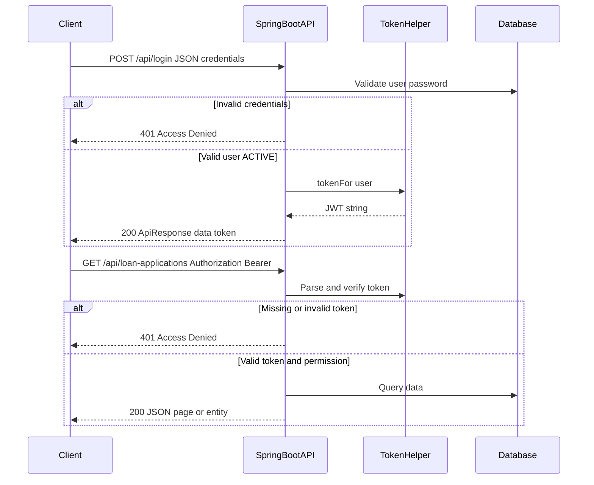
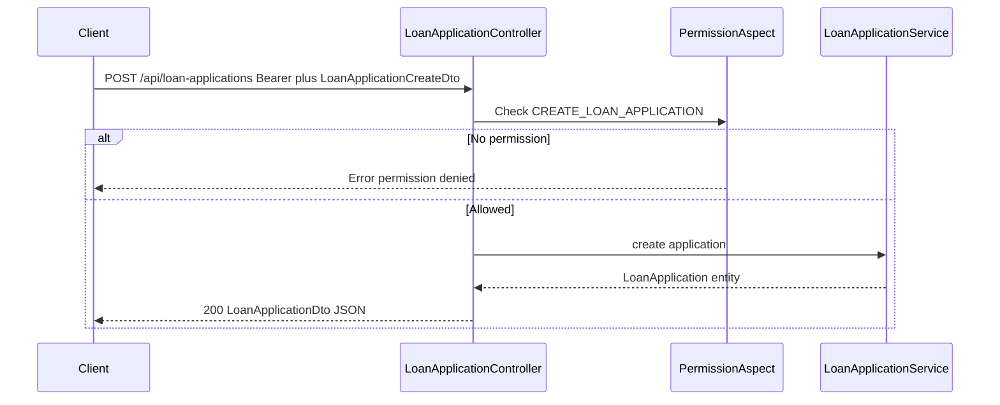
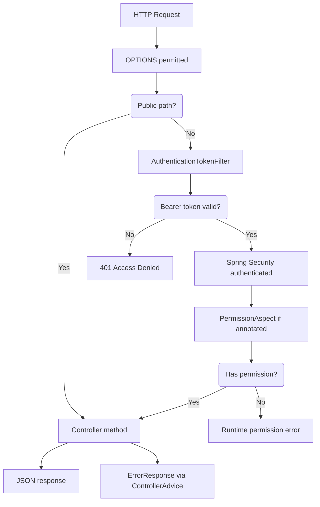

# OpenCBS API Documentation

## 0. Plain Language Overview

This document describes how the OpenCBS banking software exposes its server API: how to sign in, what URLs to call, and what each endpoint does. **Technical readers** (developers, integrators, DevOps) can use it to build clients or automate workflows. **Non-technical readers** (product owners, business analysts, compliance staff) can use the overview and diagrams to understand what the system can do over the network without reading Java code. After reading, you will know where the API runs, how security works, how requests and errors are shaped, and how to find every REST endpoint defined in this repository.

**Legacy / mainframe note:** This repository was searched for COBOL, PL/I, RPG, JCL, VB6, and similar extensions. **No mainframe or desktop-era legacy source files were found.** The active stack is **Java 8 / Spring Boot 1.5.4** (server) and **Angular** (client), which is a mature but dated web stack—plan upgrades and security reviews accordingly.

---

## 1. Overview

**Audience:** Integrators and architects (technical); program managers mapping features to integrations (non-technical).

| Item | Value (from codebase) |
|------|-------------------------|
| API name | OpenCBS API Documentation (`SwaggerConfig.java`) |
| Documented API version | `0.1.0` (`SwaggerConfig.java`) |
| Maven artifact version | `0.0.1-SNAPSHOT` (`server/pom.xml`) |
| Style | **REST** over HTTP/JSON (Spring `@RestController` handlers) |
| Entry point | `com.opencbs.cloud.ServerApplication` (`server/opencbs-server/src/main/java/com/opencbs/cloud/ServerApplication.java`) |
| OpenAPI / Swagger | Springfox Swagger **2.9.2**; JSON at `/v2/api-docs` (permitted without auth in `WebSecurityConfiguration.java`) |
| GraphQL / gRPC | **Not found in codebase** |

### Base URLs and environments

| Environment | Base URL | Source |
|-------------|----------|--------|
| Local dev (Angular → API direct) | `http://localhost:8080/api/` | `client/src/environments/environment.ts` (`API_ENDPOINT`) |
| Production build (relative) | `/api/` (same host as web UI) | `client/src/environments/environment.prod.ts` |
| Docker Compose (browser) | `http://localhost/api/` (nginx proxies `/api` → API container port **8080**) | `docker-compose.yml`, `client/default.conf` |
| Staging | **Not found in codebase** | — |

The API server listens on port **8080** inside the `api` service (`docker-compose.yml`). The web container publishes port **80**.

### Real-time messaging (not REST)

The Angular client uses **STOMP** over WebSocket to RabbitMQ for live updates (`client/src/app/core/store/message-broker/message.service.ts`, `environment.ts` heartbeat settings). RabbitMQ credentials for the client are obtained via authenticated REST: `GET /api/configurations/rabbit-credential` (`ConfigController.java`). This is complementary to the REST API, not a replacement.

---

## 2. Authentication & Authorization

**Audience:** Security engineers and backend developers (technical); auditors verifying access control (non-technical).

### Authentication method

- **Type:** Stateless **JWT**-style bearer token (JJWT / `io.jsonwebtoken`, `TokenHelper.java`).
- **Header:** `Authorization: Bearer <token>`
- **Filter:** `AuthenticationTokenFilter.java` reads the header, validates the token, and sets the Spring Security context.
- **CSRF:** Disabled (`WebSecurityConfiguration.java`).

### Credential acquisition

```http
POST /api/login
Content-Type: application/json

{"username":"<user>","password":"<password>"}
```

**Response (success):** JSON wrapper `ApiResponse` with token string in `data`:

```json
{"data":"<jwt-token>"}
```

Source: `LoginController.java`, `ApiResponse.java`, `BaseDocumentationTest.java` (test uses `admin` / `admin`).

### Token format and expiration

| Aspect | Behavior | Source |
|--------|----------|--------|
| Algorithm | HS512 | `TokenHelper.java` |
| Subject | Username | `TokenHelper.tokenFor()` |
| Issuer | `com.opencbs.core` | `TokenHelper.java` |
| JWT `exp` claim | **Not set** — comment states token does not expire at JWT level | `TokenHelper.java` TODO |
| Session idle timeout | Controlled by system setting `EXPIRATION_SESSION_TIME_IN_MINUTES`; `0` = never expires | `TokenHelper.IsSessionExpired()` |
| Last activity | Updated on each authenticated request via `setEventInformation()` | `TokenHelper.java` |

**Token refresh endpoint:** **Not found in codebase**.

### Public (unauthenticated) REST paths

From `WebSecurityConfiguration.java`:

| Method | Path pattern |
|--------|----------------|
| * | `OPTIONS /**` |
| * | `/api` (root message) |
| POST | `/api/login`, `/api/login/update-password`, `/api/login/password-reset` |
| GET | `/api/info` |
| GET | `/api/system-settings` |
| GET | `/api/utils/**` |
| POST | `/api/utils/**` |
| GET | Selected attachment downloads (people, companies, groups, loan-applications, loans) |

**Note:** `/api/utils/**` is permitted in security config, but **no `UtilsController` or handler mapping `/api/utils` was found** in the server source tree.

### Other auth-related endpoints

| Method | Path | Auth | Description |
|--------|------|------|-------------|
| PUT | `/api/login/update-password` | Public | Change password (`PasswordUpdateDto`) |
| POST | `/api/login/password-reset` | Public | Query param `username`; emails user |
| POST | `/api/logout/{userId}` | Authenticated | Invalidates session server-side (`LoginController.java`) |

### Authorization (RBAC)

**RBAC (role-based access control):** Users carry permissions; methods may require a permission via `@PermissionRequired` (`PermissionRequired.java`). Enforcement is in `PermissionAspect.java` (checks `user.hasPermission(name)`). Users with `id == 2` or `isSystemUser` bypass checks.

Endpoints **without** `@PermissionRequired` still require a **valid authenticated user** unless listed as public above. Permission names are discovered at startup (`PermissionInitializer.java`) and exposed via `GET /api/permissions` (`PermissionController.java`).

**Example permission names** (from controllers): `CREATE_LOAN_APPLICATION`, `GET_LOANS_APPLICATIONS`, `MAKER_FOR_PEOPLE`, `GET_PROFILES`, `OTHER_FEE_CHARGE`, etc.

### Login flow (sequence diagram)



**Diagram Description:** This sequence diagram shows login and a protected call. The client sends username and password to `POST /api/login`. The API validates against the database; failure yields HTTP 401 with message "Access Denied" from `EntryPointUnauthorizedHandler`. Success returns a bearer token inside `{"data":"..."}`. For later calls, the client sends `Authorization: Bearer <token>`. The filter validates the token and user status; missing auth yields 401. If `@PermissionRequired` fails, a runtime permission error can occur (see §5). Success returns business JSON.

### Loan application create flow (sequence diagram)



**Diagram Description:** This diagram shows creating a loan application after login. The client POSTs to `/api/loan-applications` with a JSON body matching `LoanApplicationCreateDto` and a bearer token. `PermissionAspect` requires permission `CREATE_LOAN_APPLICATION`. Denied access throws a runtime exception with a permission message (not always mapped to `ErrorResponse`—see §5). On success, the service persists the application and returns `LoanApplicationDto`.

---

## 3. Request/Response Format

**Audience:** API client developers (technical); data analysts consuming reports (non-technical).

### Content types

- Default Spring MVC JSON: **`application/json`** for `@RequestBody` / JSON responses (inferred from controller usage and tests; no global `consumes` override found).
- File uploads: `multipart/form-data` on attachment endpoints (e.g. `PersonAttachmentController.java`).

### Success envelope

Many endpoints use `ApiResponse<T>`:

```json
{"data": <T>}
```

(`ApiResponse.java`, `BaseController.ReturnResponse()`). **Not all endpoints use this wrapper**—many return DTOs or entities directly (e.g. `LoanApplicationDto`, `Page<...>`).

### Pagination

**Pagination** (splitting large lists into pages) uses Spring Data `Pageable` on many GET endpoints.

| Query parameter | Role |
|-----------------|------|
| `page` | Page index (0-based, Spring Data default) |
| `size` | Page size |
| `sort` | Sort field(s), e.g. `sort=name,asc` |

Response type is typically `Page<T>` (JSON includes `content`, `totalElements`, `totalPages`, etc.—standard Spring Data serialization).

Common extra query params: `search` (e.g. loan applications), `show_all` (loan products).

### Dates and times

| Context | Format | Source |
|---------|--------|--------|
| Client display | `yyyy-MM-dd`, `MMM dd, yyyy HH:mm` | `environment.ts` |
| API | Java `LocalDate` / `LocalDateTime` in DTOs (ISO-8601 in JSON typical for Jackson) | Controller/DTO usage |

Explicit API-wide date format property: **Not found in codebase**.

### Null handling

Jackson default serialization; explicit global null policy: **Not found in codebase**.

---

## 4. Request lifecycle (flowchart)

**Audience:** Developers tracing calls (technical); operations staff understanding failure points (non-technical).



**Diagram Description:** The flowchart shows how an HTTP request is processed. OPTIONS preflight is allowed. Public paths skip authentication and go straight to controllers. Other paths pass through the bearer token filter; invalid or missing tokens result in 401 "Access Denied". Authenticated requests may hit permission checks when `@PermissionRequired` is present; failure throws a runtime exception. Controller success returns JSON; `ApiException` and some other exceptions become structured `ErrorResponse` JSON.

---

## 5. Error Handling

**Audience:** Client developers (technical); support staff interpreting errors (non-technical).

### Error body format

`ExceptionControllerAdvice.java` maps exceptions to `ErrorResponse`:

```json
{
  "httpStatus": 400,
  "errorCode": "invalid",
  "message": "Human-readable message"
}
```

| Handler | HTTP status | errorCode |
|---------|-------------|-----------|
| `ApiException` | From exception | From exception (e.g. `404`, `403`, `invalid`) |
| `IllegalArgumentException` | 400 | `invalid` (via `ValidationException`) |
| Generic `Exception` | 500 | `internal_error` |

### Common `ApiException` subclasses

| Type | Typical HTTP | Source |
|------|--------------|--------|
| `ResourceNotFoundException` | 404 | `errorCode` `404` |
| `ForbiddenException` | 403 | `403` |
| `ValidationException` | 400 | `invalid` or custom code |
| `UnauthorizedException` | 401 | — |
| `InvalidCredentialsException` | Login failure | — |

### Unauthenticated access

`EntryPointUnauthorizedHandler` → **401** with servlet error message **"Access Denied"** (may not be JSON `ErrorResponse`).

### Permission failures

`PermissionAspect` throws `RuntimeException` ("You don't have permissions - …") → handled by generic exception handler → **500** / `internal_error` unless wrapped elsewhere.

**Retry guidance:** **Not found in codebase** (no idempotency keys or retry-after headers). Clients should use standard practices: retry 5xx with backoff; do not retry 401/403/404 without fixing credentials or input.

---

## 6. Rate Limiting & Quotas

**Audience:** Integrators (technical); infrastructure planners (non-technical).

**Not found in codebase** (no rate limit filters, throttling annotations, or quota headers in server code).

---

## 7. Versioning

**Audience:** Architects (technical); release managers (non-technical).

| Mechanism | Finding |
|-----------|---------|
| URL prefix versioning (`/v1/...`) | **Not found** — all routes use `/api/...` |
| Swagger metadata version | `0.1.0` in `SwaggerConfig.java` |
| `Accept` header versioning | **Not found in codebase** |

---

## 8. SDKs & Code Examples

**Audience:** Developers (technical).

**Official SDKs:** **Not found in codebase**.

### cURL — login

```bash
curl -s -X POST 'http://localhost:8080/api/login' \
  -H 'Content-Type: application/json' \
  -d '{"username":"admin","password":"admin"}'
```

### cURL — authenticated GET

```bash
TOKEN='<paste data field from login>'
curl -s 'http://localhost:8080/api/loan-applications?page=0&size=20' \
  -H "Authorization: Bearer ${TOKEN}"
```

### Java (Spring RestTemplate style)

```java
// Pattern mirrors BaseDocumentationTest.java
HttpHeaders headers = new HttpHeaders();
headers.setContentType(MediaType.APPLICATION_JSON);
headers.setBearerAuth(token);
HttpEntity<Void> entity = new HttpEntity<>(headers);
restTemplate.exchange(
    baseUrl + "/api/users/current",
    HttpMethod.GET,
    entity,
    UserDto.class);
```

---

## 9. Testing & Sandbox

**Audience:** QA and developers (technical); business users validating UAT (non-technical).

| Resource | Details |
|----------|---------|
| API contract tests | `server/opencbs-core/src/test/java/com/opencbs/core/apidoc/*DocumentationTest.java` (Spring REST Docs) |
| Default test credentials | `admin` / `admin` (`BaseDocumentationTest.java`) |
| Swagger UI | Springfox 2.9.2; try `/swagger-ui.html` or `/v2/api-docs` when server is running — exact UI path **not verified in this task** |
| Docker sandbox | `docker compose up` — app at `http://localhost`, API proxied at `http://localhost/api/` |
| Postman collection | **Not found in codebase** |

---

## 10. Endpoints Reference

**Audience:** Integrators (technical); business analysts mapping processes to URLs (non-technical).

**Summary:** **428** distinct method+path combinations were extracted from active `@RestController` / `@CustomInfoController` classes under `server/` (excluding abstract base repayment controller). Paths are defined in Java controller source files—there is no separate OpenAPI file checked into the repo; Springfox generates `/v2/api-docs` at runtime.

**Conventions in tables below:**

- **Auth `Public`:** No bearer token (per `WebSecurityConfiguration.java`).
- **Auth `Authenticated`:** Valid bearer token required.
- **Auth `Authenticated + RBAC*`:** Token required; may also need specific permission if method has `@PermissionRequired` (check `/api/permissions` or Swagger for the full list).

**Manually confirmed endpoints not in automated extract** (inherit mappings from `AbstractInfoController`):

| Method | Path | Auth |
|--------|------|------|
| GET | `/api` | Public — welcome string (`ServerInfoController`) |
| GET | `/api/info` | Public — `VersionDto` (`AbstractInfoController`) |

**Loan other fees** (class extends `OtherFeeController` base `/api/other-fees`):

| Method | Path | Auth |
|--------|------|------|
| GET | `/api/other-fees/{loanId}/other-fees` | Authenticated + RBAC* |
| POST | `/api/other-fees/{otherFeeId}/{loanId}/charge` | Authenticated + RBAC* |
| POST | `/api/other-fees/{otherFeeId}/{loanId}/repay` | Authenticated + RBAC* |
| POST | `/api/other-fees/{otherFeeId}/{loanId}/waive-off` | Authenticated + RBAC* |

Global **other-fees** CRUD is on `OtherFeeController` at `/api/other-fees` (GET/POST/PUT).

**Bond products** note: `BondProductController` maps to `api/bond-products` (missing leading slash in source); effective path **`/api/bond-products/default`** (Spring normalizes).

### Request/response schemas

Per-endpoint DTOs live in module `dto` packages (hundreds of types). This document does not duplicate every schema. Use:

1. Swagger UI / `/v2/api-docs` at runtime  
2. Controller method signatures (e.g. `LoanApplicationCreateDto`, `LoginRequest`)  
3. REST Docs tests under `opencbs-core/.../apidoc/`

**Representative schemas:**

| Endpoint | Request body | Response |
|----------|--------------|----------|
| POST `/api/login` | `LoginRequest`: `username`, `password` | `ApiResponse<String>` (token) |
| POST `/api/loan-applications` | `LoanApplicationCreateDto` | `LoanApplicationDto` |
| GET `/api/loan-applications` | Query: `search`, `page`, `size`, `sort` | `Page<LoanApplicationDto>` |
| Errors | — | `ErrorResponse`: `httpStatus`, `errorCode`, `message` |

---

## Appendix A — Full endpoint catalog

The following tables list all extracted endpoints grouped by URL prefix. For parameter and body details, open the cited controller in `server/`.

*RBAC:* Unless marked Public, assume **Authenticated + RBAC***.
### `/api/accounting` (25 endpoints)

| Method | Path | Auth |
|--------|------|------|
| GET | `/api/accounting/accounts/{id}/operations` | Authenticated + RBAC* |
| POST | `/api/accounting/accounts/{id}/transfer-from` | Authenticated + RBAC* |
| POST | `/api/accounting/accounts/{id}/transfer-to` | Authenticated + RBAC* |
| POST | `/api/accounting/balance-sheet/recalculateBalances` | Authenticated + RBAC* |
| GET | `/api/accounting/balance-sheet/root` | Authenticated + RBAC* |
| GET | `/api/accounting/balance-sheet/root/{accountId}/leaves` | Authenticated + RBAC* |
| POST | `/api/accounting/chart-of-accounts` | Authenticated + RBAC* |
| GET | `/api/accounting/chart-of-accounts/root` | Authenticated + RBAC* |
| GET | `/api/accounting/chart-of-accounts/root/branch` | Authenticated + RBAC* |
| GET | `/api/accounting/chart-of-accounts/root/{accountId}/leaves` | Authenticated + RBAC* |
| GET | `/api/accounting/chart-of-accounts/root/{accountId}/leaves/branch` | Authenticated + RBAC* |
| GET | `/api/accounting/chart-of-accounts/{accountId}` | Authenticated + RBAC* |
| PUT | `/api/accounting/chart-of-accounts/{accountId}` | Authenticated + RBAC* |
| GET | `/api/accounting/entries` | Authenticated + RBAC* |
| POST | `/api/accounting/entry` | Authenticated + RBAC* |
| GET | `/api/accounting/get-account-balance/{accountId}` | Authenticated + RBAC* |
| GET | `/api/accounting/lookup` | Authenticated + RBAC* |
| POST | `/api/accounting/lookup/by-tags` | Authenticated + RBAC* |
| GET | `/api/accounting/lookup/current-accounts` | Authenticated + RBAC* |
| POST | `/api/accounting/multiple` | Authenticated + RBAC* |
| GET | `/api/accounting/payee` | Authenticated + RBAC* |
| POST | `/api/accounting/recalculateBalances` | Authenticated + RBAC* |
| GET | `/api/accounting/tags` | Authenticated + RBAC* |
| GET | `/api/accounting/{id}/history` | Authenticated + RBAC* |
| GET | `/api/accounting/{id}/history/last_change` | Authenticated + RBAC* |

### `/api/analytics` (1 endpoints)

| Method | Path | Auth |
|--------|------|------|
| GET | `/api/analytics/active-loans/{loanId}` | Authenticated + RBAC* |

### `/api/audit-trail` (4 endpoints)

| Method | Path | Auth |
|--------|------|------|
| GET | `/api/audit-trail/report/BUSINESS_OBJECT` | Authenticated + RBAC* |
| GET | `/api/audit-trail/report/EVENTS` | Authenticated + RBAC* |
| GET | `/api/audit-trail/report/TRANSACTIONS` | Authenticated + RBAC* |
| GET | `/api/audit-trail/report/USER_SESSIONS` | Authenticated + RBAC* |

### `/api/bond-products` (1 endpoints)

| Method | Path | Auth |
|--------|------|------|
| GET | `/api/bond-products/default` | Authenticated + RBAC* |

### `/api/bonds` (18 endpoints)

| Method | Path | Auth |
|--------|------|------|
| GET | `/api/bonds` | Authenticated + RBAC* |
| POST | `/api/bonds` | Authenticated + RBAC* |
| POST | `/api/bonds/actualize/{bondId}` | Authenticated + RBAC* |
| GET | `/api/bonds/by-profile/{profileId}` | Authenticated + RBAC* |
| GET | `/api/bonds/convert-amount` | Authenticated + RBAC* |
| POST | `/api/bonds/expire-date` | Authenticated + RBAC* |
| POST | `/api/bonds/preview` | Authenticated + RBAC* |
| POST | `/api/bonds/start/{id}` | Authenticated + RBAC* |
| GET | `/api/bonds/{bondId}/events` | Authenticated + RBAC* |
| GET | `/api/bonds/{bondId}/events/{groupKey}` | Authenticated + RBAC* |
| POST | `/api/bonds/{bondId}/repayment/preview` | Authenticated + RBAC* |
| POST | `/api/bonds/{bondId}/repayment/repay` | Authenticated + RBAC* |
| POST | `/api/bonds/{bondId}/repayment/split` | Authenticated + RBAC* |
| POST | `/api/bonds/{bondId}/roll-back` | Authenticated + RBAC* |
| GET | `/api/bonds/{bondId}/schedule` | Authenticated + RBAC* |
| POST | `/api/bonds/{bondId}/valueDate` | Authenticated + RBAC* |
| GET | `/api/bonds/{id}` | Authenticated + RBAC* |
| PUT | `/api/bonds/{id}` | Authenticated + RBAC* |

### `/api/borrowing-products` (5 endpoints)

| Method | Path | Auth |
|--------|------|------|
| GET | `/api/borrowing-products` | Authenticated + RBAC* |
| POST | `/api/borrowing-products` | Authenticated + RBAC* |
| GET | `/api/borrowing-products/account-rules` | Authenticated + RBAC* |
| GET | `/api/borrowing-products/{borrowingId}` | Authenticated + RBAC* |
| PUT | `/api/borrowing-products/{borrowingId}` | Authenticated + RBAC* |

### `/api/borrowings` (15 endpoints)

| Method | Path | Auth |
|--------|------|------|
| GET | `/api/borrowings` | Authenticated + RBAC* |
| POST | `/api/borrowings` | Authenticated + RBAC* |
| POST | `/api/borrowings/actualize/{borrowingId}` | Authenticated + RBAC* |
| GET | `/api/borrowings/by-profile/{profileId}` | Authenticated + RBAC* |
| POST | `/api/borrowings/preview` | Authenticated + RBAC* |
| GET | `/api/borrowings/{borrowingId}` | Authenticated + RBAC* |
| PUT | `/api/borrowings/{borrowingId}` | Authenticated + RBAC* |
| POST | `/api/borrowings/{borrowingId}/disburse` | Authenticated + RBAC* |
| GET | `/api/borrowings/{borrowingId}/events` | Authenticated + RBAC* |
| GET | `/api/borrowings/{borrowingId}/events/{groupKey}` | Authenticated + RBAC* |
| POST | `/api/borrowings/{borrowingId}/repayment/preview` | Authenticated + RBAC* |
| POST | `/api/borrowings/{borrowingId}/repayment/repay` | Authenticated + RBAC* |
| POST | `/api/borrowings/{borrowingId}/repayment/split` | Authenticated + RBAC* |
| POST | `/api/borrowings/{borrowingId}/roll-back` | Authenticated + RBAC* |
| GET | `/api/borrowings/{borrowingId}/schedule` | Authenticated + RBAC* |

### `/api/branches` (8 endpoints)

| Method | Path | Auth |
|--------|------|------|
| GET | `/api/branches/` | Authenticated + RBAC* |
| POST | `/api/branches/` | Authenticated + RBAC* |
| POST | `/api/branches/custom-fields/` | Authenticated + RBAC* |
| DELETE | `/api/branches/custom-fields/{fieldId}` | Authenticated + RBAC* |
| PUT | `/api/branches/custom-fields/{id}` | Authenticated + RBAC* |
| GET | `/api/branches/lookup` | Authenticated + RBAC* |
| GET | `/api/branches/{id}` | Authenticated + RBAC* |
| PUT | `/api/branches/{id}` | Authenticated + RBAC* |

### `/api/business-sectors` (5 endpoints)

| Method | Path | Auth |
|--------|------|------|
| GET | `/api/business-sectors/` | Authenticated + RBAC* |
| POST | `/api/business-sectors/` | Authenticated + RBAC* |
| GET | `/api/business-sectors/lookup` | Authenticated + RBAC* |
| GET | `/api/business-sectors/{id}` | Authenticated + RBAC* |
| PUT | `/api/business-sectors/{id}` | Authenticated + RBAC* |

### `/api/chat` (2 endpoints)

| Method | Path | Auth |
|--------|------|------|
| GET | `/api/chat/{objectType}/{objectId}` | Authenticated + RBAC* |
| POST | `/api/chat/{objectType}/{objectId}` | Authenticated + RBAC* |

### `/api/configurations` (1 endpoints)

| Method | Path | Auth |
|--------|------|------|
| GET | `/api/configurations` | Authenticated + RBAC* |

### `/api/credit-committee-amount-ranges` (4 endpoints)

| Method | Path | Auth |
|--------|------|------|
| GET | `/api/credit-committee-amount-ranges/` | Authenticated + RBAC* |
| POST | `/api/credit-committee-amount-ranges/` | Authenticated + RBAC* |
| GET | `/api/credit-committee-amount-ranges/{id}` | Authenticated + RBAC* |
| PUT | `/api/credit-committee-amount-ranges/{id}` | Authenticated + RBAC* |

### `/api/credit-lines` (5 endpoints)

| Method | Path | Auth |
|--------|------|------|
| POST | `/api/credit-lines` | Authenticated + RBAC* |
| GET | `/api/credit-lines/by-profile/{profileId}` | Authenticated + RBAC* |
| GET | `/api/credit-lines/loan-applications/{profileId}` | Authenticated + RBAC* |
| GET | `/api/credit-lines/{id}` | Authenticated + RBAC* |
| PUT | `/api/credit-lines/{id}` | Authenticated + RBAC* |

### `/api/currencies` (2 endpoints)

| Method | Path | Auth |
|--------|------|------|
| GET | `/api/currencies/` | Authenticated + RBAC* |
| GET | `/api/currencies/lookup` | Authenticated + RBAC* |

### `/api/day-closure` (2 endpoints)

| Method | Path | Auth |
|--------|------|------|
| POST | `/api/day-closure` | Authenticated + RBAC* |
| GET | `/api/day-closure/status` | Authenticated + RBAC* |

### `/api/entry-fees` (5 endpoints)

| Method | Path | Auth |
|--------|------|------|
| GET | `/api/entry-fees` | Authenticated + RBAC* |
| POST | `/api/entry-fees` | Authenticated + RBAC* |
| GET | `/api/entry-fees/by-currency/{currencyId}` | Authenticated + RBAC* |
| GET | `/api/entry-fees/{id}` | Authenticated + RBAC* |
| PUT | `/api/entry-fees/{id}` | Authenticated + RBAC* |

### `/api/global-settings` (2 endpoints)

| Method | Path | Auth |
|--------|------|------|
| GET | `/api/global-settings/` | Authenticated + RBAC* |
| GET | `/api/global-settings/{name}` | Authenticated + RBAC* |

### `/api/group-loans` (2 endpoints)

| Method | Path | Auth |
|--------|------|------|
| GET | `/api/group-loans/by-profile/{profileId}` | Authenticated + RBAC* |
| GET | `/api/group-loans/{loanApplicationId}` | Authenticated + RBAC* |

### `/api/holidays` (4 endpoints)

| Method | Path | Auth |
|--------|------|------|
| GET | `/api/holidays/` | Authenticated + RBAC* |
| POST | `/api/holidays/` | Authenticated + RBAC* |
| GET | `/api/holidays/{id}` | Authenticated + RBAC* |
| PUT | `/api/holidays/{id}` | Authenticated + RBAC* |

### `/api/loan-applications` (49 endpoints)

| Method | Path | Auth |
|--------|------|------|
| GET | `/api/loan-applications` | Authenticated + RBAC* |
| POST | `/api/loan-applications` | Authenticated + RBAC* |
| GET | `/api/loan-applications/by-profile/{profileId}` | Authenticated + RBAC* |
| POST | `/api/loan-applications/calculate-entry-fee` | Authenticated + RBAC* |
| GET | `/api/loan-applications/custom-field-sections/` | Authenticated + RBAC* |
| POST | `/api/loan-applications/custom-field-sections/` | Authenticated + RBAC* |
| GET | `/api/loan-applications/custom-field-sections/{id}` | Authenticated + RBAC* |
| PUT | `/api/loan-applications/custom-field-sections/{id}` | Authenticated + RBAC* |
| POST | `/api/loan-applications/custom-fields/` | Authenticated + RBAC* |
| DELETE | `/api/loan-applications/custom-fields/{fieldId}` | Authenticated + RBAC* |
| PUT | `/api/loan-applications/custom-fields/{id}` | Authenticated + RBAC* |
| GET | `/api/loan-applications/loan-application-payee-events/{payeeId}` | Authenticated + RBAC* |
| GET | `/api/loan-applications/loan-application-payee/{payeeId}` | Authenticated + RBAC* |
| POST | `/api/loan-applications/payees/{payeeId}/refund` | Authenticated + RBAC* |
| POST | `/api/loan-applications/preview` | Authenticated + RBAC* |
| GET | `/api/loan-applications/sorted` | Authenticated + RBAC* |
| GET | `/api/loan-applications/{id}` | Authenticated + RBAC* |
| PUT | `/api/loan-applications/{id}` | Authenticated + RBAC* |
| POST | `/api/loan-applications/{id}/change-status` | Authenticated + RBAC* |
| POST | `/api/loan-applications/{id}/disburse` | Authenticated + RBAC* |
| GET | `/api/loan-applications/{id}/history` | Authenticated + RBAC* |
| GET | `/api/loan-applications/{id}/history/last_change` | Authenticated + RBAC* |
| POST | `/api/loan-applications/{id}/preview` | Authenticated + RBAC* |
| PUT | `/api/loan-applications/{id}/schedule-update` | Authenticated + RBAC* |
| PUT | `/api/loan-applications/{id}/schedule-update-validate` | Authenticated + RBAC* |
| POST | `/api/loan-applications/{id}/submit` | Authenticated + RBAC* |
| GET | `/api/loan-applications/{loanApplicationId}/attachments` | Authenticated + RBAC* |
| POST | `/api/loan-applications/{loanApplicationId}/attachments` | Authenticated + RBAC* |
| DELETE | `/api/loan-applications/{loanApplicationId}/attachments/{attachmentId}` | Authenticated + RBAC* |
| GET | `/api/loan-applications/{loanApplicationId}/attachments/{attachmentId}` | Public (GET attachment) |
| GET | `/api/loan-applications/{loanApplicationId}/collateral/` | Authenticated + RBAC* |
| POST | `/api/loan-applications/{loanApplicationId}/collateral/` | Authenticated + RBAC* |
| DELETE | `/api/loan-applications/{loanApplicationId}/collateral/{id}` | Authenticated + RBAC* |
| GET | `/api/loan-applications/{loanApplicationId}/collateral/{id}` | Authenticated + RBAC* |
| PUT | `/api/loan-applications/{loanApplicationId}/collateral/{id}` | Authenticated + RBAC* |
| GET | `/api/loan-applications/{loanApplicationId}/credit-committee-vote-history/` | Authenticated + RBAC* |
| GET | `/api/loan-applications/{loanApplicationId}/credit-committee-vote-history/id` | Authenticated + RBAC* |
| GET | `/api/loan-applications/{loanApplicationId}/custom-field-values` | Authenticated + RBAC* |
| POST | `/api/loan-applications/{loanApplicationId}/custom-field-values` | Authenticated + RBAC* |
| PUT | `/api/loan-applications/{loanApplicationId}/custom-field-values` | Authenticated + RBAC* |
| GET | `/api/loan-applications/{loanApplicationId}/guarantors/` | Authenticated + RBAC* |
| POST | `/api/loan-applications/{loanApplicationId}/guarantors/` | Authenticated + RBAC* |
| GET | `/api/loan-applications/{loanApplicationId}/guarantors/lookup` | Authenticated + RBAC* |
| DELETE | `/api/loan-applications/{loanApplicationId}/guarantors/{guarantorId}` | Authenticated + RBAC* |
| GET | `/api/loan-applications/{loanApplicationId}/guarantors/{guarantorId}` | Authenticated + RBAC* |
| PUT | `/api/loan-applications/{loanApplicationId}/guarantors/{guarantorId}` | Authenticated + RBAC* |
| DELETE | `/api/loan-applications/{loanApplicationId}/payees` | Authenticated + RBAC* |
| POST | `/api/loan-applications/{loanApplicationId}/payees` | Authenticated + RBAC* |
| PUT | `/api/loan-applications/{loanApplicationId}/payees/{payeeId}/disburse` | Authenticated + RBAC* |

### `/api/loan-products` (8 endpoints)

| Method | Path | Auth |
|--------|------|------|
| GET | `/api/loan-products` | Authenticated + RBAC* |
| POST | `/api/loan-products` | Authenticated + RBAC* |
| GET | `/api/loan-products/account-rules` | Authenticated + RBAC* |
| GET | `/api/loan-products/lookup` | Authenticated + RBAC* |
| GET | `/api/loan-products/{id}` | Authenticated + RBAC* |
| PUT | `/api/loan-products/{id}` | Authenticated + RBAC* |
| GET | `/api/loan-products/{id}/history` | Authenticated + RBAC* |
| GET | `/api/loan-products/{id}/history/last_change` | Authenticated + RBAC* |

### `/api/loan-purposes` (5 endpoints)

| Method | Path | Auth |
|--------|------|------|
| GET | `/api/loan-purposes/` | Authenticated + RBAC* |
| POST | `/api/loan-purposes/` | Authenticated + RBAC* |
| GET | `/api/loan-purposes/lookup` | Authenticated + RBAC* |
| GET | `/api/loan-purposes/{id}` | Authenticated + RBAC* |
| PUT | `/api/loan-purposes/{id}` | Authenticated + RBAC* |

### `/api/loans` (26 endpoints)

| Method | Path | Auth |
|--------|------|------|
| GET | `/api/loans` | Authenticated + RBAC* |
| POST | `/api/loans/actualize/{loanId}` | Authenticated + RBAC* |
| POST | `/api/loans/apply-specific-provision` | Authenticated + RBAC* |
| GET | `/api/loans/by-profile/{profileId}` | Authenticated + RBAC* |
| POST | `/api/loans/group-repayment/repay` | Authenticated + RBAC* |
| POST | `/api/loans/group-repayment/{applicationId}/schedules` | Authenticated + RBAC* |
| GET | `/api/loans/{id}` | Authenticated + RBAC* |
| GET | `/api/loans/{loanId}/attachments` | Authenticated + RBAC* |
| POST | `/api/loans/{loanId}/attachments` | Authenticated + RBAC* |
| DELETE | `/api/loans/{loanId}/attachments/{attachmentId}` | Authenticated + RBAC* |
| GET | `/api/loans/{loanId}/attachments/{attachmentId}` | Public (GET attachment) |
| GET | `/api/loans/{loanId}/events` | Authenticated + RBAC* |
| GET | `/api/loans/{loanId}/events/group` | Authenticated + RBAC* |
| GET | `/api/loans/{loanId}/events/{groupKey}` | Authenticated + RBAC* |
| POST | `/api/loans/{loanId}/reassign-loan-officer/{loanOfficerId}` | Authenticated + RBAC* |
| GET | `/api/loans/{loanId}/recalculate-specific-provision/{value}/{provisionType}/by-amount` | Authenticated + RBAC* |
| GET | `/api/loans/{loanId}/recalculate-specific-provision/{value}/{provisionType}/by-percent` | Authenticated + RBAC* |
| POST | `/api/loans/{loanId}/reschedule/apply` | Authenticated + RBAC* |
| POST | `/api/loans/{loanId}/reschedule/preview` | Authenticated + RBAC* |
| PUT | `/api/loans/{loanId}/reschedule/validate` | Authenticated + RBAC* |
| POST | `/api/loans/{loanId}/roll-back` | Authenticated + RBAC* |
| GET | `/api/loans/{loanId}/schedule` | Authenticated + RBAC* |
| GET | `/api/loans/{loanId}/specific-provision/{provisionType}` | Authenticated + RBAC* |
| POST | `/api/loans/{loanId}/top-up` | Authenticated + RBAC* |
| POST | `/api/loans/{loanId}/write-off` | Authenticated + RBAC* |
| POST | `/api/loans/{loanId}/write-off/calculate` | Authenticated + RBAC* |

### `/api/locations` (5 endpoints)

| Method | Path | Auth |
|--------|------|------|
| GET | `/api/locations/` | Authenticated + RBAC* |
| POST | `/api/locations/` | Authenticated + RBAC* |
| GET | `/api/locations/lookup` | Authenticated + RBAC* |
| GET | `/api/locations/{id}` | Authenticated + RBAC* |
| PUT | `/api/locations/{id}` | Authenticated + RBAC* |

### `/api/login` (3 endpoints)

| Method | Path | Auth |
|--------|------|------|
| POST | `/api/login` | Public |
| POST | `/api/login/password-reset` | Public |
| PUT | `/api/login/update-password` | Public |

### `/api/logout` (1 endpoints)

| Method | Path | Auth |
|--------|------|------|
| POST | `/api/logout/{userId}` | Authenticated + RBAC* |

### `/api/lookup-type` (1 endpoints)

| Method | Path | Auth |
|--------|------|------|
| GET | `/api/lookup-type` | Authenticated + RBAC* |

### `/api/payees` (5 endpoints)

| Method | Path | Auth |
|--------|------|------|
| GET | `/api/payees/` | Authenticated + RBAC* |
| POST | `/api/payees/` | Authenticated + RBAC* |
| GET | `/api/payees/lookup` | Authenticated + RBAC* |
| GET | `/api/payees/{id}` | Authenticated + RBAC* |
| PUT | `/api/payees/{id}` | Authenticated + RBAC* |

### `/api/payment-gateway` (4 endpoints)

| Method | Path | Auth |
|--------|------|------|
| GET | `/api/payment-gateway` | Authenticated + RBAC* |
| POST | `/api/payment-gateway` | Authenticated + RBAC* |
| GET | `/api/payment-gateway/code` | Authenticated + RBAC* |
| POST | `/api/payment-gateway/export` | Authenticated + RBAC* |

### `/api/payment-methods` (5 endpoints)

| Method | Path | Auth |
|--------|------|------|
| GET | `/api/payment-methods` | Authenticated + RBAC* |
| POST | `/api/payment-methods` | Authenticated + RBAC* |
| GET | `/api/payment-methods/lookup` | Authenticated + RBAC* |
| GET | `/api/payment-methods/{id}` | Authenticated + RBAC* |
| PUT | `/api/payment-methods/{id}` | Authenticated + RBAC* |

### `/api/penalties` (4 endpoints)

| Method | Path | Auth |
|--------|------|------|
| GET | `/api/penalties` | Authenticated + RBAC* |
| POST | `/api/penalties` | Authenticated + RBAC* |
| GET | `/api/penalties/{id}` | Authenticated + RBAC* |
| PUT | `/api/penalties/{id}` | Authenticated + RBAC* |

### `/api/permissions` (1 endpoints)

| Method | Path | Auth |
|--------|------|------|
| GET | `/api/permissions/` | Authenticated + RBAC* |

### `/api/printing-forms` (4 endpoints)

| Method | Path | Auth |
|--------|------|------|
| GET | `/api/printing-forms` | Authenticated + RBAC* |
| POST | `/api/printing-forms` | Authenticated + RBAC* |
| POST | `/api/printing-forms/excel` | Authenticated + RBAC* |
| POST | `/api/printing-forms/word` | Authenticated + RBAC* |

### `/api/professions` (5 endpoints)

| Method | Path | Auth |
|--------|------|------|
| GET | `/api/professions/` | Authenticated + RBAC* |
| POST | `/api/professions/` | Authenticated + RBAC* |
| GET | `/api/professions/lookup` | Authenticated + RBAC* |
| GET | `/api/professions/{id}` | Authenticated + RBAC* |
| PUT | `/api/professions/{id}` | Authenticated + RBAC* |

### `/api/profiles` (66 endpoints)

| Method | Path | Auth |
|--------|------|------|
| GET | `/api/profiles/` | Authenticated + RBAC* |
| POST | `/api/profiles/companies` | Authenticated + RBAC* |
| GET | `/api/profiles/companies/custom-field-sections/` | Authenticated + RBAC* |
| POST | `/api/profiles/companies/custom-field-sections/` | Authenticated + RBAC* |
| GET | `/api/profiles/companies/custom-field-sections/{id}` | Authenticated + RBAC* |
| PUT | `/api/profiles/companies/custom-field-sections/{id}` | Authenticated + RBAC* |
| POST | `/api/profiles/companies/custom-fields/` | Authenticated + RBAC* |
| DELETE | `/api/profiles/companies/custom-fields/{fieldId}` | Authenticated + RBAC* |
| GET | `/api/profiles/companies/custom-fields/{fieldId}/{value}` | Authenticated + RBAC* |
| PUT | `/api/profiles/companies/custom-fields/{id}` | Authenticated + RBAC* |
| GET | `/api/profiles/companies/lookup` | Authenticated + RBAC* |
| GET | `/api/profiles/companies/{companyId}/attachments` | Authenticated + RBAC* |
| POST | `/api/profiles/companies/{companyId}/attachments` | Authenticated + RBAC* |
| DELETE | `/api/profiles/companies/{companyId}/attachments/{attachmentId}` | Authenticated + RBAC* |
| GET | `/api/profiles/companies/{companyId}/attachments/{attachmentId}` | Public (GET attachment) |
| POST | `/api/profiles/companies/{companyId}/attachments/{attachmentId}/pin` | Authenticated + RBAC* |
| POST | `/api/profiles/companies/{companyId}/attachments/{attachmentId}/unpin` | Authenticated + RBAC* |
| GET | `/api/profiles/companies/{companyId}/members/lookup` | Authenticated + RBAC* |
| GET | `/api/profiles/companies/{id}` | Authenticated + RBAC* |
| PUT | `/api/profiles/companies/{id}` | Authenticated + RBAC* |
| POST | `/api/profiles/companies/{id}/account` | Authenticated + RBAC* |
| GET | `/api/profiles/companies/{id}/accounts` | Authenticated + RBAC* |
| POST | `/api/profiles/companies/{id}/members/add/{memberId}` | Authenticated + RBAC* |
| POST | `/api/profiles/companies/{id}/members/remove/{memberId}` | Authenticated + RBAC* |
| GET | `/api/profiles/current-account/{profileId}` | Authenticated + RBAC* |
| POST | `/api/profiles/groups` | Authenticated + RBAC* |
| GET | `/api/profiles/groups/custom-field-sections/` | Authenticated + RBAC* |
| POST | `/api/profiles/groups/custom-field-sections/` | Authenticated + RBAC* |
| GET | `/api/profiles/groups/custom-field-sections/{id}` | Authenticated + RBAC* |
| PUT | `/api/profiles/groups/custom-field-sections/{id}` | Authenticated + RBAC* |
| POST | `/api/profiles/groups/custom-fields/` | Authenticated + RBAC* |
| DELETE | `/api/profiles/groups/custom-fields/{fieldId}` | Authenticated + RBAC* |
| PUT | `/api/profiles/groups/custom-fields/{id}` | Authenticated + RBAC* |
| GET | `/api/profiles/groups/lookup` | Authenticated + RBAC* |
| GET | `/api/profiles/groups/{groupId}/attachments` | Authenticated + RBAC* |
| POST | `/api/profiles/groups/{groupId}/attachments` | Authenticated + RBAC* |
| DELETE | `/api/profiles/groups/{groupId}/attachments/{attachmentId}` | Authenticated + RBAC* |
| GET | `/api/profiles/groups/{groupId}/attachments/{attachmentId}` | Public (GET attachment) |
| POST | `/api/profiles/groups/{groupId}/attachments/{attachmentId}/pin` | Authenticated + RBAC* |
| POST | `/api/profiles/groups/{groupId}/attachments/{attachmentId}/unpin` | Authenticated + RBAC* |
| GET | `/api/profiles/groups/{groupId}/members/lookup` | Authenticated + RBAC* |
| GET | `/api/profiles/groups/{id}` | Authenticated + RBAC* |
| PUT | `/api/profiles/groups/{id}` | Authenticated + RBAC* |
| POST | `/api/profiles/groups/{id}/members/add/{memberId}` | Authenticated + RBAC* |
| POST | `/api/profiles/groups/{id}/members/remove/{memberId}` | Authenticated + RBAC* |
| GET | `/api/profiles/people` | Authenticated + RBAC* |
| POST | `/api/profiles/people/` | Authenticated + RBAC* |
| POST | `/api/profiles/people/custom-fields/` | Authenticated + RBAC* |
| DELETE | `/api/profiles/people/custom-fields/{fieldId}` | Authenticated + RBAC* |
| GET | `/api/profiles/people/custom-fields/{fieldId}/{value}` | Authenticated + RBAC* |
| PUT | `/api/profiles/people/custom-fields/{id}` | Authenticated + RBAC* |
| GET | `/api/profiles/people/lookup` | Authenticated + RBAC* |
| GET | `/api/profiles/people/{id}` | Authenticated + RBAC* |
| PUT | `/api/profiles/people/{id}` | Authenticated + RBAC* |
| POST | `/api/profiles/people/{id}/account` | Authenticated + RBAC* |
| GET | `/api/profiles/people/{id}/accounts` | Authenticated + RBAC* |
| GET | `/api/profiles/people/{personId}/attachments/` | Public (GET attachment) |
| POST | `/api/profiles/people/{personId}/attachments/` | Authenticated + RBAC* |
| DELETE | `/api/profiles/people/{personId}/attachments/{attachmentId}` | Authenticated + RBAC* |
| GET | `/api/profiles/people/{personId}/attachments/{attachmentId}` | Public (GET attachment) |
| POST | `/api/profiles/people/{personId}/attachments/{attachmentId}/pin` | Authenticated + RBAC* |
| POST | `/api/profiles/people/{personId}/attachments/{attachmentId}/unpin` | Authenticated + RBAC* |
| GET | `/api/profiles/with-accounts` | Authenticated + RBAC* |
| GET | `/api/profiles/{id}/history` | Authenticated + RBAC* |
| GET | `/api/profiles/{id}/history/last_change` | Authenticated + RBAC* |
| GET | `/api/profiles/{profiledId}/single` | Authenticated + RBAC* |

### `/api/relationships` (1 endpoints)

| Method | Path | Auth |
|--------|------|------|
| GET | `/api/relationships/` | Authenticated + RBAC* |

### `/api/repayment` (1 endpoints)

| Method | Path | Auth |
|--------|------|------|
| GET | `/api/repayment/types/lookup` | Authenticated + RBAC* |

### `/api/reports` (6 endpoints)

| Method | Path | Auth |
|--------|------|------|
| GET | `/api/reports` | Authenticated + RBAC* |
| GET | `/api/reports/by-group` | Authenticated + RBAC* |
| GET | `/api/reports/by-search` | Authenticated + RBAC* |
| POST | `/api/reports/excel` | Authenticated + RBAC* |
| POST | `/api/reports/json` | Authenticated + RBAC* |
| POST | `/api/reports/{reportName}` | Authenticated + RBAC* |

### `/api/requests` (5 endpoints)

| Method | Path | Auth |
|--------|------|------|
| GET | `/api/requests` | Authenticated + RBAC* |
| GET | `/api/requests/{id}` | Authenticated + RBAC* |
| POST | `/api/requests/{id}/approve` | Authenticated + RBAC* |
| GET | `/api/requests/{id}/content` | Authenticated + RBAC* |
| POST | `/api/requests/{id}/delete` | Authenticated + RBAC* |

### `/api/roles` (6 endpoints)

| Method | Path | Auth |
|--------|------|------|
| GET | `/api/roles/` | Authenticated + RBAC* |
| POST | `/api/roles/` | Authenticated + RBAC* |
| GET | `/api/roles/{id}` | Authenticated + RBAC* |
| PUT | `/api/roles/{id}` | Authenticated + RBAC* |
| GET | `/api/roles/{id}/history` | Authenticated + RBAC* |
| GET | `/api/roles/{id}/history/last_change` | Authenticated + RBAC* |

### `/api/saving-products` (6 endpoints)

| Method | Path | Auth |
|--------|------|------|
| GET | `/api/saving-products` | Authenticated + RBAC* |
| POST | `/api/saving-products` | Authenticated + RBAC* |
| GET | `/api/saving-products/{id}` | Authenticated + RBAC* |
| PUT | `/api/saving-products/{id}` | Authenticated + RBAC* |
| GET | `/api/saving-products/{id}/history` | Authenticated + RBAC* |
| GET | `/api/saving-products/{id}/history/last_change` | Authenticated + RBAC* |

### `/api/savings` (13 endpoints)

| Method | Path | Auth |
|--------|------|------|
| GET | `/api/savings` | Authenticated + RBAC* |
| POST | `/api/savings` | Authenticated + RBAC* |
| POST | `/api/savings/actualize/{savingId}` | Authenticated + RBAC* |
| GET | `/api/savings/by-profile/{profileId}` | Authenticated + RBAC* |
| GET | `/api/savings/get-saving-account-id/{id}` | Authenticated + RBAC* |
| GET | `/api/savings/{id}` | Authenticated + RBAC* |
| PUT | `/api/savings/{id}` | Authenticated + RBAC* |
| POST | `/api/savings/{id}/close` | Authenticated + RBAC* |
| POST | `/api/savings/{id}/deposit` | Authenticated + RBAC* |
| GET | `/api/savings/{id}/entries` | Authenticated + RBAC* |
| POST | `/api/savings/{id}/lock` | Authenticated + RBAC* |
| POST | `/api/savings/{id}/open` | Authenticated + RBAC* |
| POST | `/api/savings/{id}/withdraw` | Authenticated + RBAC* |

### `/api/schedule-based-types` (2 endpoints)

| Method | Path | Auth |
|--------|------|------|
| GET | `/api/schedule-based-types` | Authenticated + RBAC* |
| GET | `/api/schedule-based-types/lookup` | Authenticated + RBAC* |

### `/api/schedule-preferred-repayment-dates` (1 endpoints)

| Method | Path | Auth |
|--------|------|------|
| GET | `/api/schedule-preferred-repayment-dates` | Authenticated + RBAC* |

### `/api/schedule-types` (2 endpoints)

| Method | Path | Auth |
|--------|------|------|
| GET | `/api/schedule-types` | Authenticated + RBAC* |
| GET | `/api/schedule-types/lookup` | Authenticated + RBAC* |

### `/api/schedules` (1 endpoints)

| Method | Path | Auth |
|--------|------|------|
| POST | `/api/schedules` | Authenticated + RBAC* |

### `/api/sepa` (6 endpoints)

| Method | Path | Auth |
|--------|------|------|
| POST | `/api/sepa/integration/export/export-xml` | Authenticated + RBAC* |
| GET | `/api/sepa/integration/export/file-list` | Authenticated + RBAC* |
| GET | `/api/sepa/integration/export/generate-for-date` | Authenticated + RBAC* |
| GET | `/api/sepa/integration/import/file-list` | Authenticated + RBAC* |
| POST | `/api/sepa/integration/import/parse-xml` | Authenticated + RBAC* |
| POST | `/api/sepa/integration/import/repay` | Authenticated + RBAC* |

### `/api/system-settings` (2 endpoints)

| Method | Path | Auth |
|--------|------|------|
| GET | `/api/system-settings` | Public |
| PUT | `/api/system-settings` | Authenticated + RBAC* |

### `/api/task-events` (6 endpoints)

| Method | Path | Auth |
|--------|------|------|
| POST | `/api/task-events/` | Authenticated + RBAC* |
| GET | `/api/task-events/by-profile/{profileId}` | Authenticated + RBAC* |
| GET | `/api/task-events/participants` | Authenticated + RBAC* |
| GET | `/api/task-events/{userId}` | Authenticated + RBAC* |
| GET | `/api/task-events/{userId}/{taskEventId}` | Authenticated + RBAC* |
| PUT | `/api/task-events/{userId}/{taskEventId}` | Authenticated + RBAC* |

### `/api/term-deposit-products` (7 endpoints)

| Method | Path | Auth |
|--------|------|------|
| GET | `/api/term-deposit-products` | Authenticated + RBAC* |
| POST | `/api/term-deposit-products` | Authenticated + RBAC* |
| GET | `/api/term-deposit-products/account-rules` | Authenticated + RBAC* |
| GET | `/api/term-deposit-products/{id}` | Authenticated + RBAC* |
| PUT | `/api/term-deposit-products/{id}` | Authenticated + RBAC* |
| GET | `/api/term-deposit-products/{id}/history` | Authenticated + RBAC* |
| GET | `/api/term-deposit-products/{id}/history/last_change` | Authenticated + RBAC* |

### `/api/term-deposits` (10 endpoints)

| Method | Path | Auth |
|--------|------|------|
| GET | `/api/term-deposits` | Authenticated + RBAC* |
| POST | `/api/term-deposits` | Authenticated + RBAC* |
| POST | `/api/term-deposits/actualize/{termDepositId}` | Authenticated + RBAC* |
| GET | `/api/term-deposits/by-profile/{profileId}` | Authenticated + RBAC* |
| GET | `/api/term-deposits/{id}` | Authenticated + RBAC* |
| PUT | `/api/term-deposits/{id}` | Authenticated + RBAC* |
| POST | `/api/term-deposits/{id}/close` | Authenticated + RBAC* |
| POST | `/api/term-deposits/{id}/open` | Authenticated + RBAC* |
| GET | `/api/term-deposits/{termDepositId}/entries` | Authenticated + RBAC* |
| POST | `/api/term-deposits/{termDepositId}/lock-unlock` | Authenticated + RBAC* |

### `/api/tills` (16 endpoints)

| Method | Path | Auth |
|--------|------|------|
| GET | `/api/tills` | Authenticated + RBAC* |
| POST | `/api/tills` | Authenticated + RBAC* |
| GET | `/api/tills/lookup` | Authenticated + RBAC* |
| GET | `/api/tills/savings-with-account` | Authenticated + RBAC* |
| POST | `/api/tills/transfer/till` | Authenticated + RBAC* |
| POST | `/api/tills/transfer/vault` | Authenticated + RBAC* |
| GET | `/api/tills/{id}` | Authenticated + RBAC* |
| PUT | `/api/tills/{id}` | Authenticated + RBAC* |
| GET | `/api/tills/{id}/balance` | Authenticated + RBAC* |
| POST | `/api/tills/{id}/close` | Authenticated + RBAC* |
| POST | `/api/tills/{id}/open` | Authenticated + RBAC* |
| GET | `/api/tills/{id}/operations` | Authenticated + RBAC* |
| POST | `/api/tills/{id}/operations/deposit` | Authenticated + RBAC* |
| POST | `/api/tills/{id}/operations/deposit-saving` | Authenticated + RBAC* |
| POST | `/api/tills/{id}/operations/withdraw` | Authenticated + RBAC* |
| POST | `/api/tills/{id}/operations/withdraw-saving` | Authenticated + RBAC* |

### `/api/transaction-templates` (5 endpoints)

| Method | Path | Auth |
|--------|------|------|
| GET | `/api/transaction-templates` | Authenticated + RBAC* |
| POST | `/api/transaction-templates` | Authenticated + RBAC* |
| GET | `/api/transaction-templates/lookup` | Authenticated + RBAC* |
| GET | `/api/transaction-templates/{id}` | Authenticated + RBAC* |
| PUT | `/api/transaction-templates/{id}` | Authenticated + RBAC* |

### `/api/transfers` (3 endpoints)

| Method | Path | Auth |
|--------|------|------|
| POST | `/api/transfers/between-members` | Authenticated + RBAC* |
| POST | `/api/transfers/from-bank-to-vault` | Authenticated + RBAC* |
| POST | `/api/transfers/from-vault-to-bank` | Authenticated + RBAC* |

### `/api/types-of-collateral` (7 endpoints)

| Method | Path | Auth |
|--------|------|------|
| GET | `/api/types-of-collateral/` | Authenticated + RBAC* |
| POST | `/api/types-of-collateral/` | Authenticated + RBAC* |
| GET | `/api/types-of-collateral/{id}` | Authenticated + RBAC* |
| PUT | `/api/types-of-collateral/{id}` | Authenticated + RBAC* |
| POST | `/api/types-of-collateral/{typeOfCollateralId}/custom-fields/` | Authenticated + RBAC* |
| DELETE | `/api/types-of-collateral/{typeOfCollateralId}/custom-fields/{fieldId}` | Authenticated + RBAC* |
| PUT | `/api/types-of-collateral/{typeOfCollateralId}/custom-fields/{id}` | Authenticated + RBAC* |

### `/api/users` (11 endpoints)

| Method | Path | Auth |
|--------|------|------|
| POST | `/api/users` | Authenticated + RBAC* |
| GET | `/api/users/` | Authenticated + RBAC* |
| GET | `/api/users/current` | Authenticated + RBAC* |
| GET | `/api/users/find-by-username` | Authenticated + RBAC* |
| GET | `/api/users/lookup` | Authenticated + RBAC* |
| GET | `/api/users/tellers` | Authenticated + RBAC* |
| PUT | `/api/users/update-password` | Authenticated + RBAC* |
| GET | `/api/users/{id}` | Authenticated + RBAC* |
| PUT | `/api/users/{id}` | Authenticated + RBAC* |
| GET | `/api/users/{id}/history` | Authenticated + RBAC* |
| GET | `/api/users/{id}/history/last_change` | Authenticated + RBAC* |

### `/api/vaults` (4 endpoints)

| Method | Path | Auth |
|--------|------|------|
| GET | `/api/vaults` | Authenticated + RBAC* |
| POST | `/api/vaults` | Authenticated + RBAC* |
| GET | `/api/vaults/{id}` | Authenticated + RBAC* |
| PUT | `/api/vaults/{id}` | Authenticated + RBAC* |

### `/{loanId}/other-fees` (4 endpoints)

| Method | Path | Auth |
|--------|------|------|
| GET | `/{loanId}/other-fees/{loanId}/other-fees` | Authenticated + RBAC* |
| POST | `/{loanId}/other-fees/{otherFeeId}/{loanId}/charge` | Authenticated + RBAC* |
| POST | `/{loanId}/other-fees/{otherFeeId}/{loanId}/repay` | Authenticated + RBAC* |
| POST | `/{loanId}/other-fees/{otherFeeId}/{loanId}/waive-off` | Authenticated + RBAC* |

---

## Appendix B — Controller index

| Module | Controllers path |
|--------|------------------|
| opencbs-core | `server/opencbs-core/src/main/java/com/opencbs/core/**/**Controller.java` |
| opencbs-loans | `server/opencbs-loans/src/main/java/com/opencbs/loans/**/**Controller.java` |
| opencbs-savings | `server/opencbs-savings/src/main/java/com/opencbs/savings/controllers/` |
| opencbs-term-deposits | `server/opencbs-term-deposits/src/main/java/com/opencbs/termdeposite/controllers/` |
| opencbs-borrowings | `server/opencbs-borrowings/src/main/java/com/opencbs/borrowings/controllers/` |
| opencbs-bonds | `server/opencbs-bonds/src/main/java/com/opencbs/bonds/controllers/` |
| Server entry | `server/opencbs-server/src/main/java/com/opencbs/cloud/ServerApplication.java` |

---

## FILE REPORT

| Item | Status |
|------|--------|
| Document path | `API_DOCUMENTATION.md` (repository root) |
| Generation method | Source inspection of Java controllers, security config, Angular environments, Docker/nginx |
| Endpoint count | 428 automated + 2 info routes + 4 loan other-fee routes documented separately |
| Legacy/mainframe code | **None found** in repository |
| Staging base URL | **Not found in codebase** |
| Rate limiting | **Not found in codebase** |
| `/api/utils` handlers | **Not found in codebase** (only security permit rules) |

