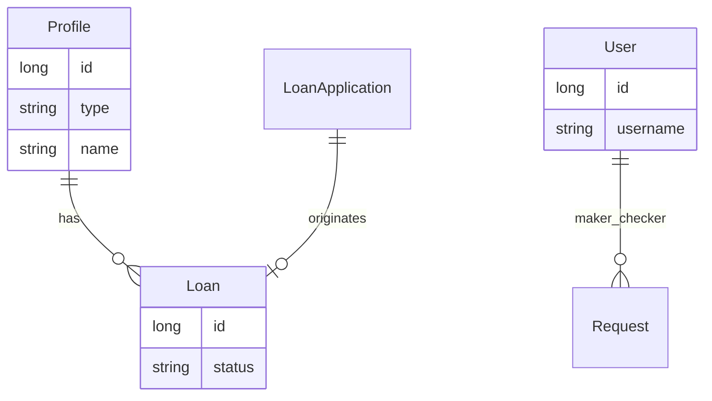
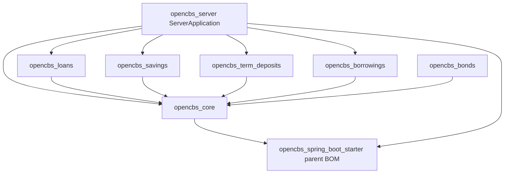
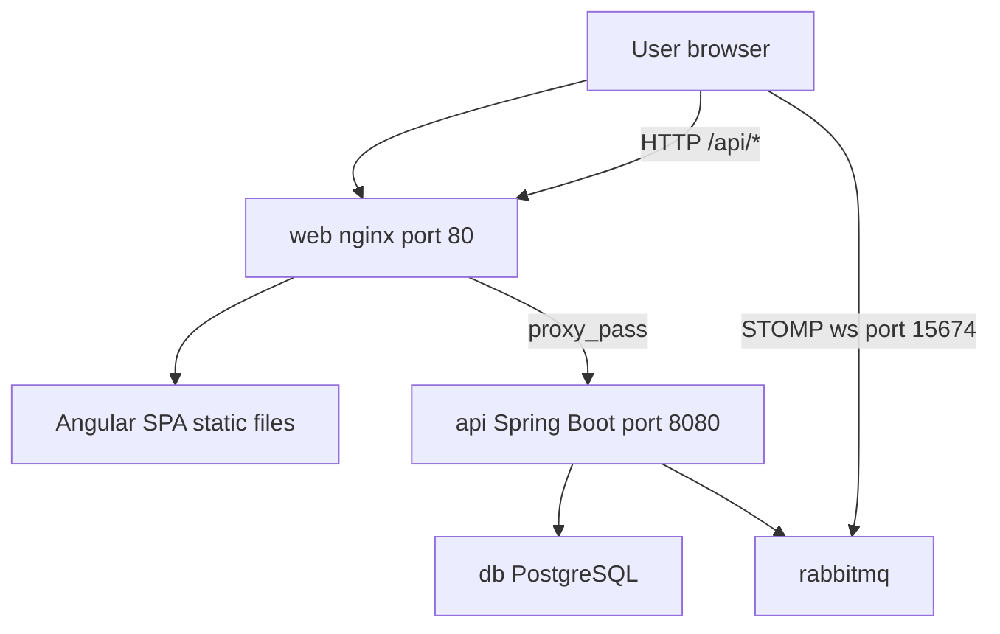
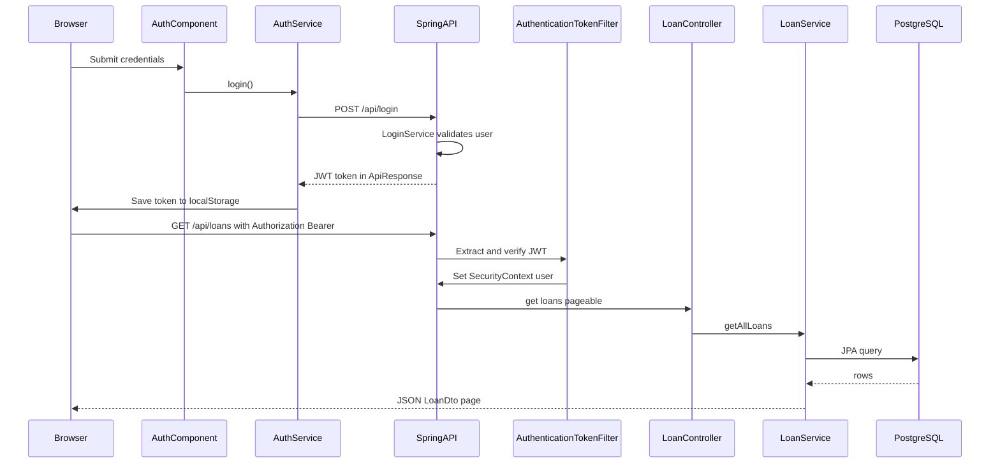

# OpenCBS Cloud — Internal Architecture

## 0. Plain Language Overview

This document explains how the OpenCBS Cloud application is built inside this repository: the web screens users see, the API that processes banking work, the database, and the message broker that sends live updates. **Software architects and developers** will find module boundaries, code layers, and request flows; **engineering managers and product owners** will understand what the system does, how its parts connect, and where older technology may need extra care. After reading, you will know how a user action travels from the browser to the server and database, which business areas (loans, savings, profiles, and so on) live in which modules, and what external software the stack depends on.

---

## 1. Service Overview

**Audience — Technical:** Architects mapping deployable units and integration points.  
**Audience — Non-technical:** Stakeholders confirming product scope and system boundaries.

### Purpose and domain

OpenCBS Cloud is an open-source **Core Banking System (CBS)** — software used by financial institutions to manage customers, loans, savings, accounting, collateral, and reporting. The root `README.md` states development from **2017 onwards**, targeting microfinance institutions, cooperative financial institutions, digital lenders, and medium-sized banks.

### Repository boundaries (this service)

This repository contains a **single deployable product** composed of:

| Part | Location | Role |
|------|----------|------|
| Web client | `client/` | Angular single-page application (SPA), served by nginx in Docker |
| API server | `server/` | Spring Boot multi-module Maven application |
| Runtime orchestration | `docker-compose.yml` | PostgreSQL, RabbitMQ, API (`api`), web (`web`) |
| Report/attachment assets | `server/templates/`, `server/attachments/` | Mounted into API container at runtime |

There is **no separate microservice deployment** per domain module in this repo; domain modules (`opencbs-loans`, `opencbs-savings`, etc.) are **JAR libraries** assembled into one Spring Boot application (`opencbs-server`).

### Service boundaries in Docker

From `docker-compose.yml`:

- **`web`** — Builds from `client/Dockerfile`, publishes host port **80**, depends on `api`.
- **`api`** — Builds from `server/opencbs-server/Dockerfile`, exposes **8080** on the Docker network only (not published to host).
- **`db`** — `postgres:14-alpine`, database name `opencbs`.
- **`rabbitmq`** — `rabbitmq:3-management-alpine`, management UI on host port **15672**.

Nginx in `client/default.conf` proxies HTTP paths starting with `/api` to `api:8080`.

### Legacy / special-attention characteristics

| Finding | Detail |
|---------|--------|
| Mainframe (COBOL, RPG, JCL, PL/I, etc.) | **Not found in codebase** |
| Desktop-era (VB6, Delphi, PowerBuilder) | **Not found in codebase** |
| Legacy web (PHP, Classic ASP, ColdFusion) | **Not found in codebase** |
| **Older active stack (requires attention)** | **Java 8**, **Spring Boot 1.5.4.RELEASE**, **Angular 8** — versions evidenced in `server/opencbs-spring-boot-starter/pom.xml`, `client/package.json` |
| Runtime configuration | `application.properties` and `**/application-*.properties` are gitignored (`server/.gitignore`). Docker references `application-docker.properties` (`server/opencbs-server/Dockerfile`) — **Not found in tracked codebase** |

---

## 2. Core Modules / Layers

**Audience — Technical:** Developers locating code by responsibility.  
**Audience — Non-technical:** Managers understanding functional areas (loans, savings, etc.) without reading Java/TypeScript.

### Top-level folder structure

```
OpenCBS/
├── docker-compose.yml
├── client/                          # Angular 8 SPA
│   └── src/
│       ├── main.ts                  # Browser bootstrap
│       ├── app/
│       │   ├── app.module.ts
│       │   ├── containers/          # Feature modules (loans, savings, …)
│       │   ├── core/                # Shared services, NgRx store, HTTP
│       │   └── shared/              # Reusable UI (forms, components)
│       └── environments/
└── server/                          # Maven multi-module backend
    ├── pom.xml                      # Parent: opencbs-cloud
    ├── opencbs-core/                # Shared platform (security, profiles, accounting, …)
    ├── opencbs-spring-boot-starter/ # Parent POM / dependency BOM
    ├── opencbs-server/              # Executable Spring Boot app
    ├── opencbs-loans/
    ├── opencbs-borrowings/
    ├── opencbs-savings/
    ├── opencbs-term-deposits/
    ├── opencbs-bonds/
    ├── templates/
    └── attachments/
```

### Backend entry point and component scan

`server/opencbs-server/src/main/java/com/opencbs/cloud/ServerApplication.java`:

- `@SpringBootApplication`
- `@ComponentScan("com.opencbs")` — loads beans from **all** domain modules on the classpath
- `@EntityScan("com.opencbs")` — JPA entities from core and domain modules
- `@EnableAsync`, `@EnableScheduling`

The executable module `opencbs-server` depends on domain JARs (`opencbs-server/pom.xml`): `opencbs-loans`, `opencbs-borrowings`, `opencbs-savings`, `opencbs-term-deposits` (bonds module is built in Docker but **not listed** in `opencbs-server/pom.xml` dependencies — verify deployment needs; bonds controllers exist in `opencbs-bonds`).

### Backend layers (evidenced per module)

Each domain Maven module follows a **consistent layered layout** (example: `opencbs-loans`, `opencbs-savings`, `opencbs-term-deposits`, `opencbs-borrowings`, `opencbs-bonds`):

| Layer | Package pattern | Responsibility |
|-------|-----------------|----------------|
| **Controllers / routes** | `*.controllers` | REST endpoints (`@RestController`, `@RequestMapping`) — e.g. `LoanController` at `/api/loans` |
| **Services** | `*.services`, `*.services.impl` | Business logic, orchestration |
| **Repositories** | `*.repositories`, `*.repositories.implementations` | Data access via Spring Data JPA |
| **Domain / models** | `*.domain` | JPA `@Entity` classes — e.g. `Loan`, `Profile` |
| **DTOs** | `*.dto` | API request/response shapes |
| **Mappers** | `*.mappers` | Entity ↔ DTO mapping (often with ModelMapper in core) |
| **Validators** | `*.validators` | Input validation |
| **Processing** | `*.processing` | Batch/day-closure processors (e.g. term deposit interest accrual) |
| **Middleware (filters)** | `com.opencbs.core.security` | `AuthenticationTokenFilter` — runs **before** controller logic on each HTTP request |
| **Security config** | `WebSecurityConfiguration` | URL permit rules, stateless sessions, JWT filter registration |

**`opencbs-core`** additionally provides: profiles (person/company/group), users/roles, accounting, day closure, maker-checker requests, reports (Jasper/Excel), live chat, attachments, global settings, and shared `BaseController`.

### Frontend layers

| Layer | Location | Responsibility |
|-------|----------|----------------|
| **Bootstrap** | `client/src/main.ts` | Bootstraps `AppModule` via `platformBrowserDynamic()` |
| **Root module** | `client/src/app/app.module.ts` | Imports feature modules, registers `HttpHeaderInterceptorService` |
| **Routing** | `client/src/app/app-routing.module.ts` | Hash routing (`useHash: true`), default redirect to `dashboard` |
| **Feature modules** | `client/src/app/containers/*` | Domain UI: `loan`, `savings`, `profile`, `accounting`, `teller-management`, etc. |
| **Core module** | `client/src/app/core/` | NgRx store/effects, auth, HTTP headers, STOMP messaging |
| **Shared UI** | `client/src/app/shared/` | Form components, shared widgets (`cbs-form`, etc.) |
| **HTTP interceptor** | `HttpHeaderInterceptorService` | Attaches `Authorization: Bearer <token>` from `localStorage` on every API call |

**Middleware (client):** `HttpHeaderInterceptorService` implements Angular’s `HttpInterceptor` — code that runs on **every** outgoing HTTP request before it reaches the API.

### Controllers / routes (representative, not exhaustive)

All active REST controllers use the `/api` prefix. Examples verified in source:

| Area | Controller (sample) | Base path |
|------|---------------------|-----------|
| Auth | `LoginController` | `/api/login`, `/api/logout/{userId}` |
| Loans | `LoanController` | `/api/loans` |
| Loan applications | `LoanApplicationController` | `/api/loan-applications` (under `opencbs-loans`) |
| Profiles | `ProfileController`, `PersonController`, `CompanyController`, `GroupController` | `/api/profiles/...` |
| Savings | `SavingController`, `SavingProductController` | `/api/savings`, products |
| Term deposits | `TermDepositController` | `/api/term-deposits` (module package) |
| Borrowings | `BorrowingController` | `/api/borrowings` |
| Bonds | `BondController` | `/api/bonds` |
| Maker-checker | `RequestController` | `/api/requests` |
| Day closure | `DayClosureController` | `/api/day-closure` |
| Server info | `ServerInfoController` | `/api/info` (permitted without auth in security config) |

Approximately **98** `*Controller.java` files exist under `server/` (glob search). Full endpoint catalog: use Swagger (`SwaggerConfig.java`, title version `0.1.0`) when the API is running.

### Repositories

`com.opencbs.core.repositories.Repository<T>` extends `JpaRepository<T, Long>` (`Repository.java`). Domain modules define module-specific repositories (e.g. `TermDepositRepository`, `LoanRepository` patterns). Custom queries use `*RepositoryCustom` + `*RepositoryImpl` and **Querydsl** (`ExQBuilderRepository.java`, `querydsl` `4.2.1` in `opencbs-core/pom.xml`).

### Models / entities

- Base type: `BaseEntity` — `Long id`, `@MappedSuperclass` (`opencbs-core/.../BaseEntity.java`).
- **Profile** — single-table inheritance (`@Inheritance`, `@DiscriminatorColumn`) for person/company/group (`Profile.java`).
- **Loan** — `@Entity` `@Table(name = "loans")`, links to `Profile`, `LoanApplication` (`Loan.java`).

### Utilities / cross-cutting

- `TokenHelper` — JWT creation/validation (used by `LoginController`, `AuthenticationTokenFilter`).
- `UserHelper` — current user from security context.
- `DateHelper`, `ActualizeHelper` — shared helpers in core/loans flows.
- Flyway SQL migrations per module under `src/main/resources/db/migration/{core|loans|savings|termdeposits|...}/`.

### Items not found as separate layers

| Pattern | Status |
|---------|--------|
| Dedicated API gateway | **Not found in codebase** (nginx reverse proxy only) |
| CQRS command/query split | **Not found in codebase** |
| Separate BFF service | **Not found in codebase** |
| GraphQL | **Not found in codebase** |

---

## 3. Design Patterns Used

**Audience — Technical:** Architects assessing maintainability and extension points.  
**Audience — Non-technical:** Managers understanding approval workflows and modular organization.

Only patterns **evidenced in source** are listed.

| Pattern | Evidence |
|---------|----------|
| **Layered / MVC-style (server)** | Controllers → services → repositories → JPA entities (e.g. `LoanController` → `LoanService` → repositories) |
| **Modular monolith** | Domain features as Maven modules; single `ServerApplication` runtime (`server/pom.xml`, `ServerApplication.java`) |
| **Repository** | `Repository<T extends BaseEntity> extends JpaRepository<T, Long>` |
| **Dependency injection (DI)** | Spring `@Autowired`, `@RequiredArgsConstructor`, constructor injection throughout |
| **DTO + Mapper** | `*Dto` classes, `*Mapper` classes, `ModelMapper` in `RequestController` |
| **Maker-checker** | `MakerCheckerWorker`, `RequestController` at `/api/requests`; `@PermissionRequired` on mutating operations |
| **Strategy / plugin (day closure)** | `DayClosureProcessor<T>` interface; module-specific processors (e.g. `TermDepositDayClosureProcessor`) registered in containers |
| **Front-end Flux (NgRx)** | `@ngrx/store`, `@ngrx/effects` in `AppModule` and `core/store/*` (auth, users, tills, vaults, etc.) |
| **HTTP interceptor** | `HttpHeaderInterceptorService` for auth headers |
| **Messaging (async notifications)** | `RabbitSenderServiceImpl` implements `AmpqSenderService`; client `MessageService` uses STOMP over WebSocket |
| **API documentation** | Springfox Swagger 2 (`SwaggerConfig.java`) |

**Not found in codebase:** hexagonal/ports-adapters as explicit structure, event sourcing, CQRS, separate saga orchestrator.

---

## 4. Data Model Overview

**Audience — Technical:** Data modelers and backend developers.  
**Audience — Non-technical:** Product owners understanding core business objects.

### Persistence

- **Database:** PostgreSQL (`docker-compose.yml`: `POSTGRES_DB=opencbs`).
- **ORM:** Spring Data JPA / Hibernate (`spring-boot-starter-data-jpa` in `opencbs-core/pom.xml`).
- **Schema evolution:** Flyway `4.0.3` — versioned SQL per module, e.g.:
  - `opencbs-core/src/main/resources/db/migration/core/` (90+ migration files observed)
  - `opencbs-loans/.../db/migration/loans/`
  - `opencbs-savings/.../db/migration/savings/`
  - `opencbs-term-deposits/.../db/migration/termdeposits/`
- **Auditing:** Hibernate Envers on some entities (e.g. `@Audited` on `Profile.java`); `UserRepository` extends `RevisionRepository`.

### Core entity relationships (simplified)



**Diagram Description:** This entity-relationship diagram shows central banking objects and how they relate. A **Profile** (customer: person, company, or group) can have many **Loans**. A **Loan** may link back to one **LoanApplication** that created it. **Users** (staff) participate in the maker-checker **Request** workflow. The diagram is simplified; the real schema includes accounts, products, accounting entries, savings, term deposits, bonds, borrowings, tills, and branches defined across hundreds of Flyway migrations.

### Domain modules and data ownership

| Module | Example tables / entities (from migrations and entities) |
|--------|----------------------------------------------------------|
| `opencbs-core` | `profiles`, users, roles, accounting, branches, tills, day closure, requests |
| `opencbs-loans` | `loans`, loan applications, schedules, collateral, provisions |
| `opencbs-savings` | savings accounts, saving products |
| `opencbs-term-deposits` | term deposits, term deposit products |
| `opencbs-borrowings` | borrowings, borrowing products |
| `opencbs-bonds` | bonds, bond products |

---

## 5. Internal Dependencies

**Audience — Technical:** Build and module dependency planning.  
**Audience — Non-technical:** Managers seeing how feature areas stack on shared platform code.

### Maven module dependency graph



**Diagram Description:** This flowchart shows how Maven modules depend on each other inside the server. `opencbs-server` is the runnable application and pulls in domain modules (loans, borrowings, savings, term-deposits) plus `opencbs-core`. Each domain module depends only on `opencbs-core` for shared platform capabilities (security, profiles, accounting, maker-checker). `opencbs-spring-boot-starter` is the parent/BOM for Spring Boot version alignment. `opencbs-bonds` is built in Docker but is **not** listed in `opencbs-server/pom.xml` at the time of this documentation — confirm whether bonds APIs are included in your build.

### Frontend internal dependencies

- `AppModule` imports **feature modules** from `containers/*` and **`CoreModule.forRoot()`** for shared providers.
- Feature modules use **`core/store/*`** services and effects for API calls and state.
- **`shared/`** modules provide reusable form/UI pieces consumed by containers.

### Runtime coupling

- API and web are **separate containers** but deployed together via `docker-compose.yml`.
- Client STOMP connection uses RabbitMQ host/credentials from API configuration (fetched via `RabbitService` in client) — **exact API endpoint for Rabbit config: not verified in this task beyond `message.service.ts` using `rabbitConfig` from `RabbitService`**.

---

## 6. External Dependencies

**Audience — Technical:** DevOps and security review.  
**Audience — Non-technical:** Managers assessing infrastructure needs.

### Infrastructure (Docker images from `docker-compose.yml` and Dockerfiles)

| Dependency | Version (from source) | Purpose |
|------------|----------------------|---------|
| PostgreSQL | `postgres:14-alpine` | Primary datastore |
| RabbitMQ | `rabbitmq:3-management-alpine` | Messaging + STOMP WebSocket (port 15674 used by client) |
| Java runtime | `eclipse-temurin:8-jre-alpine` | API container |
| Maven build | `maven:3.8-eclipse-temurin-8` | API build stage |
| Node.js build | `node:14-alpine` | Client build stage |
| nginx | `nginx:1.21-alpine` | Serves Angular static files, proxies `/api` |

### Backend libraries (representative; see `opencbs-core/pom.xml`, `opencbs-spring-boot-starter/pom.xml`)

| Library | Version |
|---------|---------|
| Spring Boot | `1.5.4.RELEASE` |
| Spring Cloud | `Dalston.SR1` |
| PostgreSQL JDBC | `42.2.2` |
| Flyway | `4.0.3` |
| jjwt | `0.9.1` |
| springfox-swagger2 | `2.9.2` |
| Querydsl | `4.2.1` |
| JasperReports | `6.10.0` |
| spring-rabbit | (Spring Boot managed) |
| Lombok, ModelMapper `0.7.5` | |

### Frontend libraries (from `client/package.json`)

| Library | Version |
|---------|---------|
| Angular | `^8.1.4` (core packages) |
| Angular CLI | `^8.3.20` |
| TypeScript | `~3.4.1` |
| NgRx store/effects | `^8.x` |
| RxJS | `6.5.3` |
| PrimeNG | `^7.0.0` |
| @stomp/ng2-stompjs | `6.0.0` |
| @ngx-translate/core | `^10.0.2` |
| moment | `^2.24.0` |

### External services not in this repo

- Email (password reset via `LoginService.passwordReset`) — mail server configuration: **Not found in tracked codebase** (properties gitignored).
- Third-party payment/SEPA networks — SEPA-related migrations/controllers exist in loans module; external network endpoints: **Not found in codebase** as hardcoded integrations beyond domain logic.

---

## 7. Key Flows

**Audience — Technical:** Developers tracing requests end-to-end.  
**Audience — Non-technical:** Managers understanding login, business operations, and end-of-day processing.

### 7.1 Application startup (Docker)



**Diagram Description:** This deployment flowchart shows runtime components. The user opens the app on port 80; nginx serves the Angular application and forwards API calls under `/api` to the Spring Boot service. The API reads and writes PostgreSQL and publishes messages to RabbitMQ. The browser may also open a STOMP WebSocket to RabbitMQ (port 15674 in client code) for real-time notifications, using credentials and host information obtained from the API after login.

### 7.2 User login and authenticated API request



**Diagram Description:** This sequence diagram covers authentication and a sample authenticated read. The user submits credentials in the Angular auth container; `AuthService` posts to `/api/login`. `LoginController` returns a JWT via `TokenHelper`. The token is stored in browser `localStorage`. Later requests pass through `HttpHeaderInterceptorService`, which adds the `Authorization` header. On the server, `AuthenticationTokenFilter` validates the token and sets the Spring Security context before `LoanController` handles `GET /api/loans`, delegating to `LoanService` and the database.

**Key files:** `LoginController.java`, `AuthenticationTokenFilter.java`, `auth.service.ts`, `auth.effect.ts`, `http-client-headers.service.ts`, `LoanController.java`.

### 7.3 Maker-checker request flow (conceptual)

Mutations such as profile or loan changes can create a **Request** instead of applying immediately. `MakerCheckerWorker` coordinates approval; `RequestController` exposes `/api/requests` for checkers. Permissions are enforced with `@PermissionRequired` (e.g. `MAKER_FOR_GROUP` on `GroupController`).

**Diagram Description:** Maker-checker means one user **makes** a change proposal and another **checks** (approves or rejects) it before it takes effect — a common banking control. The server stores pending work in the request tables; the Angular maker-checker module lists and acts on `/requests` routes.

### 7.4 Day closure (end-of-day processing)

`DayClosureController` (`POST /api/day-closure`) invokes `DayClosureProcessWorker`, which runs registered `DayClosureProcessor` implementations across modules (interest accrual, penalties, analytics, auto-repayments per permission description in controller).

**Diagram Description:** Day closure is the banking end-of-day batch: the institution picks a processing date, and the system runs calculators/updaters for loans, savings, term deposits, and related contracts. Status is polled via `GET /api/day-closure/status`.

### 7.5 Real-time notifications (STOMP)

After login, `MessageService.init()` loads current user and RabbitMQ config, connects via `@stomp/ng2-stompjs` to `ws://{host}:15674/ws` (or `wss://` on HTTPS), and subscribes to user-specific exchanges (`message.service.ts`).

**Diagram Description:** When the API publishes events to RabbitMQ, the web client receives JSON messages over STOMP and routes them through `MessageHandlerService` (for example toast notifications). This is separate from REST polling.

---

## 8. Technology Stack

**Audience — Technical:** Stack owners and upgrade planners.  
**Audience — Non-technical:** Managers tracking platform age and risk.

Versions below are taken **only** from files in this repository.

| Layer | Technology | Version / image |
|-------|------------|-----------------|
| Backend language | Java | `1.8` (`java.version` in module POMs) |
| Backend framework | Spring Boot | `1.5.4.RELEASE` |
| Spring Cloud | Dalston | `Dalston.SR1` |
| Frontend framework | Angular | `^8.1.4` |
| Angular CLI | `@angular/cli` | `^8.3.20` |
| TypeScript | TypeScript | `~3.4.1` |
| Database (Docker) | PostgreSQL | `14-alpine` image |
| Message broker (Docker) | RabbitMQ | `3-management-alpine` image |
| API docs | Springfox Swagger | `2.9.2`, API title version `0.1.0` |
| Migrations | Flyway | `4.0.3` |
| Build (API) | Maven | `3.8` (Dockerfile) |
| Build (client) | Node.js | `14-alpine` (Dockerfile) |
| Web server | nginx | `1.21-alpine` |
| Maven artifact version | opencbs-cloud | `0.0.1-SNAPSHOT` (`server/pom.xml`) |
| npm package version | opencbs-client | `0.1.0` (`client/package.json`) |

---

## Appendix: Active execution trace (summary)

1. **Browser** loads `client/src/index.html` → `main.ts` → `AppModule`.
2. **Routing** redirects to `dashboard` (`app-routing.module.ts`, hash URLs).
3. **Login** → `POST {API_ENDPOINT}login` (`auth.service.ts`) → `LoginController` → JWT in `localStorage` key `token`.
4. **API calls** → nginx `/api` proxy (`default.conf`) → Spring controllers.
5. **Security** → `AuthenticationTokenFilter` on protected paths (`WebSecurityConfiguration`).
6. **Persistence** → JPA repositories → PostgreSQL via Flyway-managed schema.
7. **Notifications** → RabbitMQ ← API; STOMP ← Angular `MessageService`.

---

*Generated from source files in `/home/vishal/repos/session_954f8999a61f/OpenCBS`. Unverifiable or gitignored items are marked **Not found in codebase**.*
