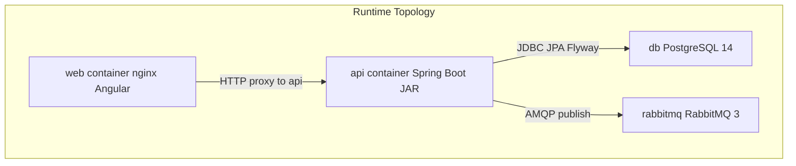
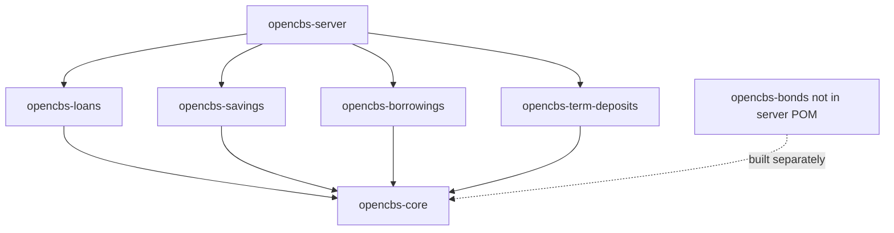
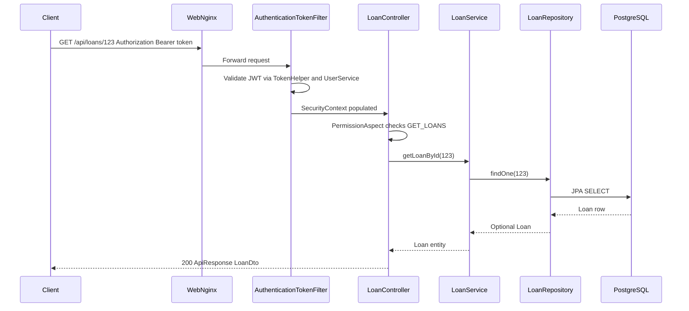

# OpenCBS Backend Documentation

## 0. Plain Language Overview

This document explains how the OpenCBS server works behind the scenes: how it starts, how it talks to the database and message queue, and how it processes banking operations such as loans, savings, and day-end closing. **Technical readers** (backend developers, solution architects) should use it to navigate code and integrations. **Non-technical readers** (engineering managers, product owners) should use it to understand what the API is responsible for and which external systems it depends on. After reading, you will know where business rules live, how a typical API request flows through the system, and which parts of the stack are legacy and need extra care when planning upgrades.

**Legacy stack flag:** The backend is **Java 8** with **Spring Boot 1.5.4.RELEASE** (released 2017). No mainframe languages (COBOL, RPG, JCL, etc.) were found in this repository. The age of the framework and libraries is a system characteristic requiring special attention for security patches, dependency upgrades, and operational support.

---

## 1. Backend Overview

**Audience:** Backend developers and architects (implementation detail); engineering managers and product owners (runtime topology and module boundaries).

### 1.1 What exists in this repository

The backend is a **multi-module Maven monolith** under `server/`, packaged as a single Spring Boot JAR and run as the `api` service in `docker-compose.yml`. The Angular client lives under `client/` and is built separately; it is not the focus of this document.

Evidence from `docker-compose.yml`:

- **`db`**: PostgreSQL 14 (`postgres:14-alpine`), database name `opencbs`
- **`rabbitmq`**: RabbitMQ 3 with management UI (`rabbitmq:3-management-alpine`)
- **`api`**: Spring Boot API built from `server/opencbs-server/Dockerfile`, exposes port **8080** internally
- **`web`**: Nginx + Angular frontend on port **80**, depends on `api`

### 1.2 Framework and language versions (from POM files)

- **Java 1.8** — `server/opencbs-server/pom.xml` (`maven-compiler-plugin` source/target)
- **Spring Boot 1.5.4.RELEASE** — parent in `opencbs-spring-boot-starter/pom.xml` and `opencbs-core/pom.xml`
- **Spring Cloud Dalston.SR1** — property in `opencbs-core/pom.xml`
- **PostgreSQL driver 42.2.2** — `opencbs-spring-boot-starter/pom.xml`
- **Flyway 4.0.3** — `opencbs-core/pom.xml`
- **JWT (jjwt) 0.9.1** — `opencbs-core/pom.xml`
- **Querydsl 4.2.1** — `opencbs-core/pom.xml`
- **Hibernate Envers 5.4.1.Final** — `opencbs-core/pom.xml`

### 1.3 Entry point and component scanning

The JVM entry point is `com.opencbs.cloud.ServerApplication`:

```10:20:server/opencbs-server/src/main/java/com/opencbs/cloud/ServerApplication.java
@SpringBootApplication
@EnableAsync
@ComponentScan("com.opencbs")
@EntityScan("com.opencbs")
@EnableScheduling
public class ServerApplication {

    public static void main(String[] args) {

        SpringApplication.run(ServerApplication.class, args);
    }
}
```

- **`@ComponentScan("com.opencbs")`** loads beans from all packaged modules (`opencbs-core`, `opencbs-loans`, `opencbs-savings`, etc.).
- **`@EnableAsync`** and **`@EnableScheduling`** enable background/async work (for example day closure).
- Docker runs: `java -Dspring.config.location=file:/app/application.properties -jar app.jar` (`server/opencbs-server/Dockerfile`).

### 1.4 Maven module structure

Parent POM: `server/pom.xml` (`artifactId`: `opencbs-cloud`).

- **`opencbs-core`** — Shared domain, security, accounting, profiles, day closure, Flyway core migrations
- **`opencbs-spring-boot-starter`** — Parent BOM-style POM for shared dependencies
- **`opencbs-server`** — Runnable JAR; depends on loans, borrowings, savings, term-deposits
- **`opencbs-loans`** — Loan and loan-application business logic
- **`opencbs-borrowings`** — Borrowing products and repayments
- **`opencbs-savings`** — Savings accounts and till operations
- **`opencbs-term-deposits`** — Term deposit products and contracts
- **`opencbs-bonds`** — Bond module (built in Docker; **not** a dependency of `opencbs-server/pom.xml`)

**Runtime packaging note:** `opencbs-server/pom.xml` declares dependencies on `opencbs-loans`, `opencbs-borrowings`, `opencbs-savings`, and `opencbs-term-deposits` only. `opencbs-bonds` is listed in the root `server/pom.xml` and built in the Dockerfile, but **bond REST controllers are not on the runtime classpath** of the server JAR unless that dependency is added. Bond source exists for optional or future use.

### 1.5 Configuration management

- **`application.properties`** and **`**/application-*.properties`** are **gitignored** (`server/.gitignore`).
- Docker expects **`server/opencbs-server/src/main/resources/application-docker.properties`** at image build time (`server/opencbs-server/Dockerfile` line 31).
- **`application-docker.properties`**: **Not found in codebase** (gitignored or not committed).
- Typed configuration is bound via `@ConfigurationProperties` classes under `com.opencbs.core.configs.properties`, for example `RabbitProperties` (`prefix = "spring.rabbitmq"`), `DayClosureProperties`, `AttachmentProperty`, `TemplateProperty`, `TaskExecutorProperties`, `CoreModuleProperties`, `AccountBalanceCalculationProperties`.

Operational JDBC URL, RabbitMQ host, and cron expressions therefore **cannot be verified from tracked source**; they are expected in the external properties file.

### 1.6 Active execution flow (trace from entry point)

1. `ServerApplication.main` starts Spring context.
2. `GeneralConfig` enables JPA repositories (`com.opencbs`), auditing, and scheduling.
3. `CoreFlywayMigrationStrategy` runs Flyway migrations for `core` and each module `FlywayConfig` bean.
4. HTTP hits Spring MVC `@RestController` classes under `/api/**`.
5. `AuthenticationTokenFilter` (Spring Security) validates JWT `Authorization: Bearer` when present.
6. Controller delegates to `@Service` classes, which use `*Repository` (JPA) and occasionally native SQL.
7. Side effects: RabbitMQ messages via `RabbitSenderServiceImpl` / `AmqMessageHelper`; scheduled day closure via `DayClosureProcessWorker`.



**Diagram Description:** This diagram shows the four Docker Compose services and how they connect. The web container serves the Angular UI and forwards API calls to the api container. The api container is the Spring Boot backend on port 8080. It persists data in PostgreSQL and publishes messages to RabbitMQ. There is no separate microservice split; all backend logic runs inside the single api JAR.

---

## 2. Services / Modules

**Audience:** Backend developers (class-level navigation); product owners (which banking products each module owns).

Business logic lives in Spring `@Service` classes (and related `*Worker`, `*Processor`, `*Container` types), organized by Maven module. The pattern is **controller → service → repository**, with **mappers** (DTO conversion) and **validators** at the edges.

### 2.1 `opencbs-core` — platform and shared banking primitives

**Package roots:** `com.opencbs.core.services`, `com.opencbs.core.accounting.services`, `com.opencbs.core.request.serivce`, `com.opencbs.core.reports`, `com.opencbs.core.officedocuments.services`, `com.opencbs.core.email`, `com.opencbs.core.audit.services`.

Representative services and purpose:

- **`LoginService` / `LoginServiceImpl`**: Authentication, password reset, logout.
- **`UserService`**, **`RoleService`**, **`PermissionService`**: Users, roles, permissions; used by JWT filter and `@PermissionRequired`.
- **`PersonService`**, **`CompanyService`**, **`GroupService`**, **`ProfileService`**, **`BranchService`**: Customer and organization profiles.
- **`GlobalSettingsService`**, **`SystemSettingsService`**, **`ConfigService`**: Institution-wide settings.
- **`DayClosureService`**, **`DayClosureProcessWorker`**: End-of-day processing orchestration.
- **`AccountingEntryService`**, **`AccountService`**, **`TillService`**, **`VaultService`**, **`AccountBalanceService`**, **`RecalculateBalanceService`**: General ledger, tills, vaults, balances.
- **`ContractProcessService` / `ContractProcessServiceImpl`**: Contract-level operation-day processing.
- **`AmpqSenderService` / `RabbitSenderServiceImpl`**: Outbound RabbitMQ messages.
- **`EmailService` / `EmailServiceImpl`**: Email notifications (e.g. day closure errors from templates under `resources/email/`).
- **`MakerCheckerWorker`**, **`RequestService`**, **`CheckerRequestService`**: Maker-checker approval workflow.
- **`JasperReportService`**, **`PrintingFormService`**, **`ExcelReportService`**: Reporting and document generation.
- **`AuditTrailService`**: Audit trail API backing.
- **Custom field services** (`PersonCustomFieldService`, `CompanyCustomFieldService`, etc.): Extensible fields on profiles and branches.
- **`CrudService`**: Generic create/read/update contract implemented by multiple product services.

There are **80+** types matching `*Service*.java` under `opencbs-core/src/main/java` (including accounting and reports).

### 2.2 `opencbs-loans` — loans and applications

**Package root:** `com.opencbs.loans.services`.

Core business services:

- **`LoanService`**: Loan CRUD, schedules, status; uses `LoanRepository`, `LoanEventService`, installment repositories.
- **`LoanApplicationService`**: Loan application lifecycle, history, maker-checker integration.
- **`LoanOperationsService`**: Disbursement, write-off, and operational events.
- **`LoanEventService`**, **`LoanInstallmentsService`**: Events and installment schedules.
- **`LoanAccountingService`**, **`LoanAccountService`**: Loan GL mapping and accounts.
- **`LoanProductService`**, **`LoanPurposeService`**: Product catalog and purposes.
- **`LoanRepaymentService`** hierarchy (`LoanNormalRepaymentServiceImpl`, `EarlyTotalRepaymentService`, `LoanRepaymentServiceFactory`): Repayment strategies.
- **`DefaultCreditCommitteeProcessService`**, **`CreditCommitteeVoteHistoryService`**: Credit committee workflow.
- **`SepaIntegrationService`**, **`SepaDocumentService`**: SEPA XML integration.
- **`ActualizeLoanStarterService`**: Triggers loan actualization during day closure.
- **`LoanContainer`**: Day-closure `Container` implementation for loan module.
- **Workers (orchestration, not HTTP):** `LoanWorker`, `LoanRepaymentWorker`, `LoanBatchRepaymentWorker`, `LoanRescheduleWorker`, `LoanRollBackWorker`.

There are **65+** `*Service*.java` files in this module.

### 2.3 `opencbs-savings`

- **`SavingService`**: Savings account operations.
- **`SavingProductService`**: Product definitions with history.
- **`SavingAccountingService`**, **`SavingAccountService` / `SavingAccountServiceImpl`**: GL and account linkage.
- **`SavingCloseService`**, **`ActualizeSavingStarterService`**: Close and day-closure actualization.
- **`SavingContainer`**: Day-closure container.
- **`SavingWorker`**, **`TillWorker` / `TillWorkerImpl`**: Query/orchestration helpers for controllers.

### 2.4 `opencbs-borrowings`

- **`BorrowingService`**: Borrowing contracts.
- **`BorrowingProductService`**, **`BorrowingAccountService`**, **`BorrowingAccountingService`**: Products and accounting.
- **`BorrowingEventService`**, accrual services (`BorrowingEventInterestAccrualServiceImpl`, etc.).
- **`BorrowingRepaymentService`** hierarchy and **`BorrowingRepaymentStoreService`**: Repayments.
- **`BorrowingOperationsService`**, **`ActualizeBorrowingStarterService`**, **`BorrowingContainer`**.

### 2.5 `opencbs-term-deposits`

- **`TermDepositService` / `TermDepositServiceImpl`**: Term deposit contracts.
- **`TermDepositProductsService` / `TermDepositProductsServiceImpl`**: Products.
- **`TermDepositAccountingService`**, **`TermDepositAccountingEntryService`**, **`TermDepositAccountService`**: Accounting.
- **`TermDepositCloseService`**, **`TermDepositActualizeService`**, processors (`TermDepositDayClosureProcessor`, `TermDepositInterestAccrualProcessor`, `TermDepositCloseProcessor`).
- **`TermDepositContainer`**: Day-closure container.

### 2.6 `opencbs-bonds` (source present; not in server JAR dependencies)

- **`BondService`**, **`BondProductService`**, **`BondEventService`**, repayment services, **`BondContainer`**, **`ActualizeBondStarterService`**, **`DefaultExchangeRateService`** (scheduled FX job).
- Controllers: `BondController`, `BondEventController`, `BondProductController`, `BondRepaymentController` under `/api/...` paths in source — **inactive in default `opencbs-server` build** without adding the Maven dependency.

### 2.7 Utility and helper types (cross-cutting)

- **`AmqMessageHelper`** (`core/helpers/AmqMessageHelper.java`) — Wraps Rabbit sends to users and fanout system notifications
- **`UserHelper`** (`core/helpers/UserHelper.java`) — Current user / system user access
- **`DateHelper`** (`core/helpers/DateHelper.java`) — Date/time utilities for business dates
- **`ActualizeHelper`** (`core/helpers/ActualizeHelper.java`) — Contract actualization helpers
- **`TokenHelper`** (`core/security/TokenHelper.java`) — JWT create/parse/verify (`jjwt`)
- **`FileProvider`** (`core/helpers/FileProvider.java`) — Attachment/file IO
- **`TransferServiceHelper`** (`core/services/TransferServiceHelper.java`) — Transfer operations between accounts



**Diagram Description:** This flowchart shows Maven module dependencies. The runnable server module depends on loans, savings, borrowings, and term-deposits. Each of those modules depends on opencbs-core for shared security, accounting, and infrastructure. The bonds module is shown with a dashed link because it compiles in the repo and Docker build but is not declared as a dependency of opencbs-server, so it does not ship in the default API JAR.

---

## 3. Controllers / Routes

**Audience:** Backend developers (endpoint map); product owners (API surface by business area).

All REST controllers use Spring **`@RestController`** and base path **`/api`** (or `/api/...` subpaths). Approximately **90** controller classes exist under `server/` (grep count of `@RestController`).

Controllers extend **`BaseController`**, which wraps successful payloads in **`ApiResponse<T>`**.

### 3.1 Authentication and system

- **`LoginController`** (`/api`) — `POST /login`, `PUT /login/update-password`, `POST /login/password-reset`, `POST /logout/{userId}`
- **`ServerInfoController`** (`/api`) — Extends `AbstractInfoController`; `GET /`, `GET /info`; instance type `base-server`
- **`SystemSettingsController`** (`/api/system-settings`) — Public GET allowed in security config
- **`UserController`**, **`RoleController`**, **`PermissionController`** (`/api/...`) — Administration
- **`GlobalSettingsController`**, **`ConfigController`** (`/api/...`) — Configuration

### 3.2 Profiles and CRM

Under `com.opencbs.core.controllers.profiles`:

- `PersonController` — `/api/profiles/people`
- `CompanyController` — `/api/profiles/companies`
- `GroupController` — `/api/profiles/groups`
- `ProfileController` — `/api/profiles`
- Attachment and custom-field controllers per entity type

### 3.3 Accounting and treasury

- `AccountingController` — `/api/accounting`
- `AccountController` — `/api/accounting/`
- `TillController` — `/api/tills`
- `VaultController` — `/api/vaults`
- `BalanceSheetController` — `/api/accounting/balance-sheet/`

### 3.4 Loans (sample of many)

- `LoanController` — `/api/loans` (list, get, schedule, events, provisions; permission `GET_LOANS`)
- `LoanApplicationController` — `/api/loan-applications`
- `LoanRepaymentController`, `LoanBatchRepaymentController`, `LoanRescheduleController`
- `LoanProductController`, `CollateralController`, `GuarantorController`, SEPA and analytics controllers

### 3.5 Other product modules

- **Savings:** `SavingController`, `SavingProductController`, `TillSavingController`
- **Borrowings:** `BorrowingController`, `BorrowingProductController`, `BorrowingEventController`, `BorrowingRepaymentController`
- **Term deposits:** `TermDepositController`, `TermDepositProductController`
- **Day closure:** `DayClosureController`
- **Maker-checker:** `RequestController`
- **Reports:** `ExcelReportsController`, `PrintingFormController`
- **Audit:** `AuditTrailController`

Swagger is configured via `SwaggerConfig` in core; security ignores `/v2/api-docs/**` and `/swagger-resources/**`.

Full endpoint list: see `API_DOCUMENTATION.md` if present in repo, or generate from controller source; this document does not duplicate every mapping to avoid stale detail.

---

## 4. Middleware

**Audience:** Backend developers (security and cross-cutting behavior); engineering managers (auth model summary).

There is no separate middleware stack (e.g. Express middleware). Cross-cutting behavior is implemented with **Spring Security**, **servlet filters**, **MVC interceptors**, and **AOP aspects**.

### 4.1 Spring Security (`WebSecurityConfiguration`)

- Extends `WebSecurityConfigurerAdapter` (Spring Security 4.x style for Boot 1.5).
- **CSRF disabled**; **stateless sessions** (`SessionCreationPolicy.STATELESS`).
- **JWT** via `AuthenticationTokenFilter` registered before `UsernamePasswordAuthenticationFilter`.
- Public routes include: `POST /api/login`, password reset paths, selected attachment GETs, `GET /api/info`, `GET /api/system-settings`, `/api/utils/**`.
- All other `/api/**` requests require authentication.
- Static assets and Swagger paths ignored in `configure(WebSecurity)`.

### 4.2 `AuthenticationTokenFilter`

- Reads `Authorization` header, strips `Bearer ` prefix.
- Uses `TokenHelper` + `UserService` to load user and verify token.
- Sets `SecurityContextHolder` authentication for active users only (`StatusType.ACTIVE`).
- Wraps request in `MultiReadRequest` for body re-readability.

### 4.3 `UserSessionHandler` (MVC interceptor)

Registered in `WebMvcConfig` for `/api/login` and `/api/logout/*`:

- Tracks user sessions on login/logout (coordinates with `UserSessionService`).

### 4.4 CORS

`WebMvcConfig.addCorsMappings`: `/api/**` allows all HTTP methods (browser clients).

### 4.5 Permission aspect

- Annotation: `@PermissionRequired(name = "...", moduleType = ModuleType....)`.
- `PermissionAspect` (`@Before`): throws `RuntimeException` if current user lacks permission.
- `PermissionInitializer`: scans methods annotated with `@PermissionRequired` at startup to seed permissions.

### 4.6 Other configuration beans

- **`AuditConfig`**: JPA/Hibernate Envers auditing.
- **`SwaggerConfig`**: API docs.
- **`TaskExecutorConfig`**: `ThreadPoolTaskExecutor` for async tasks (pool sizes from `TaskExecutorProperties`).

---

## 5. Data Access

**Audience:** Backend developers (persistence patterns); product owners (data store and migration strategy).

### 5.1 ORM and repositories

The stack uses **Spring Data JPA** (an ORM-backed repository layer that maps Java entities to database tables).

- Base interface: `com.opencbs.core.repositories.Repository<T extends BaseEntity>` extends **`JpaRepository<T, Long>`**.
- Module-specific repositories extend `Repository` or `ProfileBaseRepository`, often plus custom interfaces (e.g. `LoanRepositoryCustom`, `LoanRepositoryImpl`).
- **Querydsl** support via `ExQBuilderRepository` for dynamic predicates.
- **Hibernate Envers**: `EnversRevisionRepositoryFactoryBean` on selected repositories (e.g. `UserRepository`, `RoleRepository`, `ProfileRepository`).

Example — `LoanRepository` uses JPA and native SQL:

```18:33:server/opencbs-loans/src/main/java/com/opencbs/loans/repositories/LoanRepository.java
public interface LoanRepository extends LoanRepositoryCustom, Repository<Loan> {

    Loan findByLoanApplicationIdAndProfileId(Long loanApplicationId, Long profileId);
    // ...
    @Query(value = scriptActiveIds, nativeQuery = true)
    List<BigInteger> getIdsOfActiveLoans(@Param("dateTime") LocalDateTime dateTime);
```

### 5.2 Database and schemas

- **PostgreSQL 14** in Docker (`docker-compose.yml`).
- **Flyway** migrations:
  - Core: `classpath:db/migration/core` → table `schema_version_core`, schema `public` (`CoreFlywayMigrationStrategy`).
  - Per-module configs implement `FlywayConfig`, e.g. loans → `db/migration/loans`, table `schema_version_loans` (`LoanFlywayConfig`).
  - Similar configs: `SavingFlywayConfig`, `BorrowingFlywayConfig`, `BondFlywayConfig`, `TermsFlywayConfig`.

SQL migration files are versioned (`V1__...`, `V2__...`, etc.) under each module’s `src/main/resources/db/migration/`.

### 5.3 Transactions

Services use `@Transactional` where needed (example: `LoanService` imports `org.springframework.transaction.annotation.Transactional`).

### 5.4 Attachments and templates

Docker mounts:

- `./server/templates` → `/app/templates`
- `./server/attachments` → `/app/attachments`

Properties classes `AttachmentProperty` and `TemplateProperty` bind filesystem paths from configuration (**values not in tracked codebase**).

---

## 6. Background Jobs

**Audience:** Backend developers (scheduling and async); product owners (what runs without user action).

There is **no** `@RabbitListener` in the codebase (grep); RabbitMQ is used for **outbound publish** only. Background work uses **Spring `@Scheduled`**, **`@Async`**, and **worker** classes.

### 6.1 Scheduled jobs

- **`DayClosureProcessWorker.autoStart`** — `@Scheduled(cron="${day-closure.auto-start-time}")`; auto day closure when `day-closure.auto-start` is true
- **`DefaultExchangeRateService`** — `@Scheduled(cron = "0 2 16 * * MON-FRI", zone = "CET")`; exchange rate refresh (bonds module)

Cron property values: **Not found in codebase** (expected in `application-docker.properties`).

### 6.2 Async processing

- `DayClosureProcessWorker.processDayClosure` — `@Async`; iterates **ordered `Container` beans** (`LoanContainer`, `SavingContainer`, `BorrowingContainer`, `TermDepositContainer`, etc.), then recalculates balances and sends Rabbit/email notifications on success or failure.
- `ServerApplication` enables async at application level.

### 6.3 Worker/orchestration classes (non-scheduled)

Used for batching, repayments, rollbacks, and maker-checker flows:

- **Core:** `AccountingEntryWorkerImpl`, `DefaultProfileWorker`, `MakerCheckerWorker`, `LookupWorker`
- **Loans:** `LoanWorker`, `LoanRepaymentWorker`, `LoanBatchRepaymentWorker`, `LoanRollBackWorker`, `LoanRescheduleWorker`
- **Savings:** `SavingWorker`, `TillWorkerImpl`
- **Bonds:** `BondWorker`, `BondEventWorker`, `BondAccountingEntryWorker`, repayment workers

### 6.4 Day-closure pipeline

`Container` implementations (module-specific) are injected as a `List<Container>`, sorted by `getOrder()` in `DayClosureProcessWorker.initialize()`. Each container runs processors for interest accrual, actualization, and close logic for that product line.

### 6.5 Message broker (async notifications to clients)

`RabbitSenderServiceImpl` publishes JSON to configured exchanges (`RabbitProperties.directExchange`, `fanoutExchange`). `AmqMessageHelper` routes user notifications and system broadcasts. Consumers are **not** implemented in this backend repository (likely frontend or another service).

---

## 7. Logging and Monitoring

**Audience:** Backend developers (log libraries and health checks); engineering managers (operational visibility).

### 7.1 Logging libraries

- **SLF4J via Lombok `@Slf4j`**: Used in many classes (e.g. `DayClosureProcessWorker`, `RabbitSenderServiceImpl`, `JasperReportService`).
- **Apache Log4j 1.x** (`org.apache.log4j.Logger`): Still used in `ExceptionControllerAdvice` for error logging.

There is no centralized structured logging configuration in tracked source; log levels and appenders would be in **Not found in codebase** `application.properties`.

### 7.2 What gets logged

- Day closure: start/finish per date and container, errors with message (`DayClosureProcessWorker`).
- RabbitMQ: send failures and health-check errors (`RabbitSenderServiceImpl`).
- Global errors: `ExceptionControllerAdvice.logError` writes message and stack trace at ERROR level.
- Jasper report load/reload warnings (`JasperReportService`).

### 7.3 Monitoring and health

- **Docker Compose healthchecks**: `pg_isready` for PostgreSQL; `rabbitmq-diagnostics ping` for RabbitMQ.
- **API health**: `RabbitSenderServiceImpl.checkConnectionsHealth()` sends a test message to exchange `amq.topic`, routing key `healthQueue`.
- **Instance info**: `GET /api/info` returns `VersionDto` (version/title from JAR manifest or `DEBUG_MODE`).
- **Dedicated metrics/tracing** (Micrometer, Prometheus, etc.): **Not found in codebase**.

`server/.gitignore` lists `/logs` — log directory expected at runtime, not in git.

---

## 8. Error Handling

**Audience:** Backend developers (exception taxonomy); product owners (what clients see on failure).

### 8.1 Global handler

`ExceptionControllerAdvice` (`@ControllerAdvice`):

- **`ApiException`** — HTTP status and body from exception (`ErrorResponse` with `errorCode`, message)
- **`IllegalArgumentException`** — Converted to `ValidationException` handling
- **`Exception`** (catch-all) — **500** with `errorCode` `internal_error`; stack logged server-side

```16:33:server/opencbs-core/src/main/java/com/opencbs/core/controllers/ExceptionControllerAdvice.java
    @ExceptionHandler(ApiException.class)
    public ResponseEntity<ErrorResponse> exceptionHandler(ApiException ex){
        ErrorResponse error = new ErrorResponse(ex.getHttpStatus().value(), ex.getErrorCode(), ex.getMessage());
        return new ResponseEntity<>(error, ex.getHttpStatus());
    }
    // ...
    @ExceptionHandler(Exception.class)
    public ResponseEntity<ErrorResponse> exceptionHandler(Exception ex){
        ErrorResponse error = new ErrorResponse(HttpStatus.INTERNAL_SERVER_ERROR.value(), "internal_error", ex.getMessage());
        logError(ex);
        return new ResponseEntity<>(error, HttpStatus.INTERNAL_SERVER_ERROR);
    }
```

### 8.2 Domain exceptions (`com.opencbs.core.exceptions`)

- `ApiException` — base with `HttpStatus` + `errorCode`
- `ResourceNotFoundException`, `ValidationException`, `InvalidCredentialsException`, `UnauthorizedException`, `ForbiddenException`, `SessionExpiredException`, `AccountNotFoundException`

Controllers and services throw these explicitly (e.g. `LoanService.getLoanById` → `ResourceNotFoundException`).

### 8.3 Security errors

- `EntryPointUnauthorizedHandler` — unauthenticated API access (wired in `WebSecurityConfiguration`).
- `PermissionAspect` — missing permission throws **`RuntimeException`** (handled by catch-all → 500 unless a more specific handler exists). This is a known sharp edge for clients expecting 403.

### 8.4 Failure points in representative request flow

1. Missing/invalid JWT → request may proceed unauthenticated until authorization rule fails → 401 via entry point.
2. Permission denied → `RuntimeException` from aspect → likely 500 `internal_error`.
3. Business rule violation → `ApiException` / `ResourceNotFoundException` → structured 4xx.
4. Rabbit publish failure → logged; some paths throw `RuntimeException` on health check failure.
5. Day closure failure → logged, email template `day_closure_error.html`, status on `DayClosureProcessWorker`.



**Diagram Description:** This sequence diagram follows a authenticated read of a single loan. The client calls the web tier, which forwards to the API. The authentication filter validates the Bearer token and sets the security context. The permission aspect checks GET_LOANS on LoanController. The controller calls LoanService, which uses LoanRepository and JPA to read PostgreSQL. On success, the controller returns a 200 response wrapped in ApiResponse with a LoanDto. Failure can occur at token validation (unauthorized), permission check (runtime error mapped to 500), not found (ResourceNotFoundException), or database errors (500 internal_error).

---

## Appendix A — Evidence index

- **Entry point** — `server/opencbs-server/src/main/java/com/opencbs/cloud/ServerApplication.java`
- **Docker/runtime** — `docker-compose.yml`, `server/opencbs-server/Dockerfile`
- **Security** — `WebSecurityConfiguration.java`, `AuthenticationTokenFilter.java`, `TokenHelper.java` under `opencbs-core`
- **Flyway** — `CoreFlywayMigrationStrategy.java`, `*FlywayConfig.java` per module
- **Day closure** — `DayClosureProcessWorker.java`, `*Container.java`
- **Messaging** — `RabbitSenderServiceImpl.java`, `AmqMessageHelper.java`, `RabbitProperties.java`
- **Errors** — `ExceptionControllerAdvice.java`, `exceptions/*.java`

---

## Appendix B — Items not found in codebase

- `application-docker.properties` / `application.properties` (gitignored; referenced by Dockerfile only)
- JDBC URL, connection pool settings, RabbitMQ host credentials in config files
- `@RabbitListener` consumers (publish-only usage verified)
- Mainframe or legacy web backend languages (PHP, COBOL, etc.)
- Prometheus/application metrics endpoints
- Runtime activation of `opencbs-bonds` in `opencbs-server` JAR (module not in server POM dependencies)

---

*Generated from repository source analysis. Commented-out and unused legacy code paths were excluded per documentation scope.*
