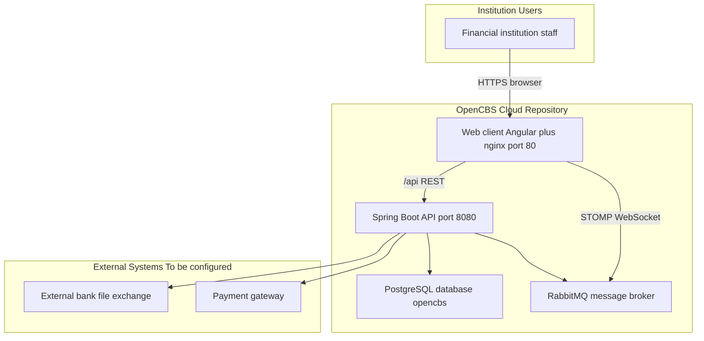

# OpenCBS Cloud — Business Overview

## 0. Plain Language Overview

This document explains what **OpenCBS Cloud** is, who uses it, and what it can do, based on the application’s own documentation, user interface text, and source code. **Technical readers** (developers, architects) will see how the system is built and how it connects to other components. **Non-technical readers** (product owners, executives, operations leads) will understand the business purpose and value without needing to read code. After reading, you will know that OpenCBS Cloud is an open-source **core banking system** (software that runs a financial institution’s main customer, loan, savings, and accounting operations) designed for microfinance institutions, cooperatives, digital lenders, and medium-sized banks.

**Audience:** Developers, business analysts, product owners, executives, compliance officers, and institution operations staff.

---

## 1. What Is This Service

**Audience — Technical:** Developers and architects evaluating or extending the platform.  
**Audience — Non-technical:** Executives and product owners defining scope and fit.

### Application name

| Source | Name |
|--------|------|
| Root `README.md` | **OpenCBS-Cloud** / **OpenCBS Cloud** |
| `client/src/index.html` (`<title>`) | **OpenCBS Cloud** |
| `docker-compose.yml` database name | `opencbs` |
| Maven artifact (`server/pom.xml`) | `opencbs-cloud` |

### What it does (plain English)

OpenCBS Cloud is a **Core Banking System (CBS)** — software that financial institutions use to manage customers, loans, savings, deposits, cash operations, accounting, and reporting in one place. The root README describes it as a “simple, scalable open-source Core Banking System optimised for the Cloud,” developed from **2017 onwards**, with front-office and back-office features.

In operation, staff use a **web application** (Angular) that talks to a **Spring Boot API**, which stores data in **PostgreSQL** and uses **RabbitMQ** for messaging (including real-time updates via STOMP/WebSocket from the client).

### Evidence from entry points and execution flow

1. **Browser entry:** `client/src/index.html` loads `<cbs-app-root>`; title is “OpenCBS Cloud.”
2. **Bootstrap:** `client/src/main.ts` bootstraps `AppModule` (Angular).
3. **Default route:** `client/src/app/app-routing.module.ts` redirects empty path to `dashboard`.
4. **Authentication:** `AppComponent` dispatches `CheckAuth` on init; unauthenticated users are sent to `/login`.
5. **API:** `client/src/environments/environment.ts` sets `API_ENDPOINT` to `http://localhost:8080/api/`; production nginx (`client/default.conf`) proxies `/api` to the `api` service on port 8080.
6. **Server entry:** `server/opencbs-server/src/main/java/com/opencbs/cloud/ServerApplication.java` is the Spring Boot `@SpringBootApplication` main class.
7. **Deployment (Docker):** `docker-compose.yml` defines `db` (PostgreSQL 14), `rabbitmq`, `api` (Spring Boot), and `web` (Angular build + nginx on port 80).

### Target institutions (from README only)

The README states the system is ideal for:

- Microfinance Institutions  
- Cooperative Financial Institutions  
- Digital lenders  
- Medium-sized banks  

**Not found in codebase:** Specific country, regulatory regime, or licensing body. Deployment and compliance context are left to each institution.

### Technology stack (evidenced; not guessed)

| Layer | Evidence |
|-------|----------|
| Frontend | Angular 8 (`client/package.json`: `@angular/core` ^8.1.4) |
| Backend | Java 8, Spring Boot 1.5.4 (`server/opencbs-spring-boot-starter/pom.xml`) |
| Database | PostgreSQL 14 (`docker-compose.yml`: `postgres:14-alpine`) |
| Message broker | RabbitMQ 3 (`docker-compose.yml`: `rabbitmq:3-management-alpine`) |
| Web server (container) | nginx 1.21 (`client/Dockerfile`) |
| License | GNU GPL v3 (`LICENSE`) |

### Legacy / special-attention code

A scan for mainframe or desktop-era extensions (`.cbl`, `.cob`, `.pli`, `.rpg`, `.jcl`, `.vbp`, `.frm`, etc.) found **no such files** in this repository.

**Flag — older but active stack:** The codebase uses **Java 8** and **Spring Boot 1.5.4** (2017-era) and **Angular 8**. These are not mainframe legacy, but they are mature versions that may require extra care for security patches, upgrades, and support planning.

---

## 2. Who Uses It

**Audience — Technical:** Implementers mapping roles to permissions and route guards.  
**Audience — Non-technical:** HR, operations, and executives understanding staffing and access.

### Primary users (evidenced)

Users are **authorized employees of a financial institution** who sign in to the web app (`SIGN_IN`, `USERS`, `ROLES` in `en.json`). The README refers to “financial institutions employees.”

### Role and permission concepts (from UI / i18n)

Access is organized by **roles** and **permissions** (`ROLES`, `ROLE_PERMISSIONS`, `PERMISSIONS`). The application implements a **Maker/Checker** pattern (`MAKER_CHECKER`, `MAKER_CHECKER_STATUS`) where one user creates or changes data and another approves it.

Named role-like labels and permission groups found in `client/src/assets/i18n/en.json` include (non-exhaustive):

| Label / permission area | Typical activity (from labels) |
|-------------------------|--------------------------------|
| **Loan officer** | Loan portfolio work |
| **Saving officer** / **Term deposit officer** / **Bond officer** | Liability product management |
| **Teller** / **Cashier** / **Head teller** | Cash desk, tills, pay in/out |
| **Credit committee** | Approve or decline loan applications |
| **Maker / Checker** (per entity: profile, loan, user, account, etc.) | Submit vs approve changes |
| **Users with assigned roles** | Configuration, operations per `RouteGuard` and `groupName` on routes |

Profile types managed in the system: **Person**, **Company**, and **Group** (`PROFILE_PERSON`, `PROFILE_COMPANY`, `PROFILE_GROUP`).

**Not found in codebase:** End-customer (borrower/saver) self-service portal as a separate product; the documented flows center on institution staff.

---

## 3. Key Features

**Audience — Technical:** Module owners and integrators.  
**Audience — Non-technical:** Product and operations teams prioritizing capabilities.

For each area: **What** it is, **Who** uses it, **Why** it matters (from README, navigation, configuration lists, and i18n).

### 3.1 Client / profile management

- **What:** Manage **profiles** for people, companies, and groups; attachments, custom fields, members, current accounts, credit lines, and related products on a profile.  
- **Who:** Front-office staff, loan officers, profile makers/checkers.  
- **Why:** Central customer record for all banking products (README: “Client management”).  
- **Evidence:** Main nav `PROFILES` → `/profiles`; profile routing includes info, loans, savings, term deposits, borrowings, bonds, credit lines, events, attachments.

### 3.2 Loan applications and loans (assets)

- **What:** **Loan applications** (workflow including credit committee submit/approve/decline), **loan** contracts, schedules, disbursement, repayment, reschedule, write-off, guarantors, collaterals, payees, provisioning.  
- **Who:** Loan officers, credit committee, makers/checkers for disbursement and repayment.  
- **Why:** Core lending operations and portfolio tracking (README: “Loan management,” “Loan schedule generation,” “Loan portfolio tracking,” “Collateral management”).  
- **Evidence:** Nav under `ASSETS`: `LOAN_APPLICATIONS`, `LOANS`; modules `loan-application`, `loan`, `loan-payee`.

### 3.3 Savings, term deposits, borrowings, bonds (liabilities)

- **What:** **Savings** accounts, **term deposits**, institution **borrowings**, and **bonds** with open/close, deposit/withdraw, interest, and product configuration.  
- **Who:** Saving/term deposit/bond officers, tellers (cash movements), makers/checkers.  
- **Why:** Deposit and liability management (README: “Savings management”).  
- **Evidence:** Nav under `LIABILITIES`: `BORROWINGS`, `SAVINGS`, `TERM_DEPOSITS`, `BONDS`; server modules `opencbs-savings`, `opencbs-term-deposits`, `opencbs-borrowings`, `opencbs-bonds`.

### 3.4 Teller management and cash operations

- **What:** **Tills**, vault transfers, pay in/pay out, loan repayments at till, deposit/withdraw to accounts.  
- **Who:** Tellers, cashiers, head teller.  
- **Why:** Branch cash handling and control (`TELLER_MANAGEMENT`, `TILL`, `VAULT`).  
- **Evidence:** Nav `TELLER_MANAGEMENT` → `/till`; configuration for tills and vaults.

### 3.5 Transfers

- **What:** Transfers between bank and vault, vault and bank, and between members; current account transfers.  
- **Who:** Operations and teller staff.  
- **Why:** Move funds between accounts and cash storage (`TRANSFERS`, `TRANSFER_BETWEEN_MEMBERS`).  
- **Evidence:** Nav `TRANSFERS` → `/transfers`.

### 3.6 Accounting

- **What:** **Chart of accounts**, **general ledger** / accounting entries, manual and templated transactions, balances.  
- **Who:** Finance/back-office, accountants, makers/checkers for accounts.  
- **Why:** Financial control and reporting (README: “Accounting”).  
- **Evidence:** Nav `ACCOUNTING` → general ledger and chart of accounts; `accounting` module.

### 3.7 Maker / checker (approvals)

- **What:** Queue of **requests** requiring approval (profiles, products, users, loan actions, etc.).  
- **Who:** Checkers and makers per permission.  
- **Why:** Dual control and auditability for sensitive changes.  
- **Evidence:** Nav `MAKER_CHECKER` → `/requests`; widespread maker/checker permission keys in `en.json`.

### 3.8 Reports

- **What:** Report list and report execution/print (`REPORTS`, `PRINT_OUT`).  
- **Who:** Management, finance, operations.  
- **Why:** Operational and regulatory insight (README: “Reports”).  
- **Evidence:** Nav `REPORTS` → `/report-list`; `reports` module. JasperReports dependency on server (`jasperreports.version` in `opencbs-spring-boot-starter/pom.xml`) supports report generation on the backend.

### 3.9 Configuration (administrative setup)

- **What:** Institution-wide setup: branches, business sectors, collateral types, credit committee rules, custom fields, entry fees, holidays, loan/borrowing/saving/term deposit products, locations, payees, professions, roles, users, vaults, penalties, transaction templates, payment methods, system settings.  
- **Who:** System administrators, product configurators.  
- **Why:** Tailor products and rules without code changes (README: “Custom fields”).  
- **Evidence:** `configuration.component.ts` list; route `/configuration`.

### 3.10 Settings (operational)

- **What:** **Operation day** / day closure, **exchange rates**, **audit trail**, **integration with bank** (import/export files), **payment gateway**.  
- **Who:** Operations managers, compliance, integrations staff.  
- **Why:** Daily processing, FX, audit, and external connectivity.  
- **Evidence:** `settings.component.ts` list; routes under `/settings`.

### 3.11 Dashboard and event manager

- **What:** **Dashboard** as default landing route; **event manager** for calendar-style events and participants.  
- **Who:** All authenticated users (dashboard); staff scheduling follow-ups (events).  
- **Why:** Overview and task coordination.  
- **Evidence:** Default redirect to `dashboard`; `EVENT_MANAGER`, `event-manager` module.

### 3.12 Internationalization

- **What:** UI languages loaded from JSON: **en**, **ru**, **fr**, **ar** (`AppComponent` adds langs; files under `client/src/assets/i18n/`).  
- **Who:** Multilingual institutions.  
- **Why:** Localized staff experience.  
- **Evidence:** `app.component.ts`, i18n file list.

---

## 4. Business Value

**Audience — Technical:** Teams explaining build-vs-buy and integration effort.  
**Audience — Non-technical:** Executives assessing ROI and time-to-market.

| Value theme | Evidence-based statement |
|-------------|---------------------------|
| **Faster deployment** | README: deployable “within weeks” vs “months or years” for legacy core banking systems. |
| **Open source** | GPL v3 license; full source in repository. |
| **Breadth for target segments** | README lists client, loan, savings, collateral, schedules, portfolio, custom fields, accounting, reports — aligned with microfinance, cooperatives, digital lenders, and medium banks. |
| **Operational efficiency** | README: “user-centric interface” for employees; teller, maker/checker, and audit trail features support controlled daily operations. |
| **Configurability** | Extensive configuration module and custom fields reduce need for custom code for products and client data. |
| **Cloud-oriented packaging** | Docker Compose stacks web, API, DB, and message broker for repeatable deployment. |

**Not found in codebase:** Quantified ROI, pricing, SLA, or benchmark studies.

---

## 5. How It Fits in the System

**Audience — Technical:** Integration and infrastructure planners.  
**Audience — Non-technical:** Executives understanding dependencies and external touchpoints.

OpenCBS Cloud is the **institution’s core banking application** in this repository: staff interact with the **web** tier, business logic runs in the **API**, data persists in **PostgreSQL**, and **RabbitMQ** supports asynchronous/real-time messaging. Optional external touchpoints evidenced in settings are **bank file integration** and a **payment gateway**; specific bank or gateway vendors are **not named in the codebase**.

**Diagram Description:** This diagram shows how OpenCBS Cloud fits into a typical deployment. Financial institution staff use a browser to reach the web client (Angular served by nginx on port 80). The web client sends REST calls to `/api`, which nginx proxies to the Spring Boot API on port 8080. The web client also connects to RabbitMQ via STOMP/WebSocket for real-time messages. The API reads and writes the PostgreSQL database named `opencbs` and publishes or consumes messages on RabbitMQ. Dashed conceptual links show two integration points evidenced in settings—bank file import/export and payment gateway—but specific external product names are not defined in the repository and are labeled as to be configured.

### Component summary (evidenced)

| Component | Role |
|-----------|------|
| **Web (`web` service)** | Staff UI; proxies API |
| **API (`api` service)** | Business rules, persistence, integrations |
| **PostgreSQL (`db`)** | System of record |
| **RabbitMQ (`rabbitmq`)** | Messaging; STOMP from client (`message.service.ts`) |
| **Attachments / templates volumes** | Server mounts `./server/templates` and `./server/attachments` in `docker-compose.yml` |

**Not found in codebase:** Mobile apps, separate data warehouse, or named third-party core systems this replaces.

---

## 6. Key Terms

**Audience — Technical:** Onboarding and API/domain alignment.  
**Audience — Non-technical:** Glossary for meetings and requirements.

| Term | Meaning in this system |
|------|-------------------------|
| **CBS (Core Banking System)** | Software that runs a bank or similar institution’s main accounts, loans, savings, and ledger (from README). |
| **OpenCBS Cloud** | This open-source cloud-oriented CBS product (README, UI title). |
| **Profile** | A client record — person, company, or group (`PROFILES`). |
| **Loan application** | A loan request before approval/disbursement; may go to **credit committee** (`LOAN_APPLICATION`, `CREDIT_COMMITTEE`). |
| **Loan** | An active loan contract with schedule, disbursement, repayment (`LOANS`). |
| **Collateral / guarantor** | Security or third-party backing for a loan (`COLLATERALS`, `GUARANTORS`). |
| **Payee** | Entity receiving disbursed loan funds (e.g., supplier) (`PAYEES`). |
| **Savings / term deposit** | Customer deposit products under liabilities (`SAVINGS`, `TERM_DEPOSITS`). |
| **Borrowing** | Institution’s own borrowing product (`BORROWINGS`). |
| **Bond** | Bond instrument managed in the system (`BONDS`, `ISIN` in UI). |
| **Till / vault** | Cash register and secure cash storage (`TILL`, `VAULT`). |
| **Teller management** | Cashier operations at branch (`TELLER_MANAGEMENT`). |
| **Maker/Checker** | Two-step approval: one user submits, another approves (`MAKER_CHECKER`). |
| **General ledger / chart of accounts** | Accounting records and account structure (`GENERAL_LEDGER`, `CHART_OF_ACCOUNTS`). |
| **Operation day / day closure** | End-of-day processing (`OPERATION_DAY`, `DAY_CLOSURE`). |
| **OLB** | Outstanding loan balance (label `OLB` in i18n; used in schedules and top-up limits). |
| **Provisioning** | Loan loss provisioning rules (`PROVISIONING`). |
| **Audit trail** | Logs of business objects, events, transactions, user sessions (`AUDIT_TRAIL`). |
| **Credit line** | Committed credit facility on a profile (`CREDIT_LINES`). |
| **STOMP** | Messaging protocol used by the web client to subscribe to RabbitMQ queues. |
| **API endpoint** | Backend base path `/api/` (environment and nginx config). |

---

## Document metadata

| Field | Value |
|-------|--------|
| **Generated from** | Repository `/home/vishal/repos/session_954f8999a61f/OpenCBS` |
| **Primary sources** | `README.md`, `LICENSE`, `docker-compose.yml`, `client/src/index.html`, `client/src/main.ts`, `client/src/environments/environment.ts`, `client/src/assets/i18n/en.json`, `client/src/app/app.module.ts`, routing and configuration components, `ServerApplication.java` |
| **Claims without repo evidence** | Marked “Not found in codebase” above |
