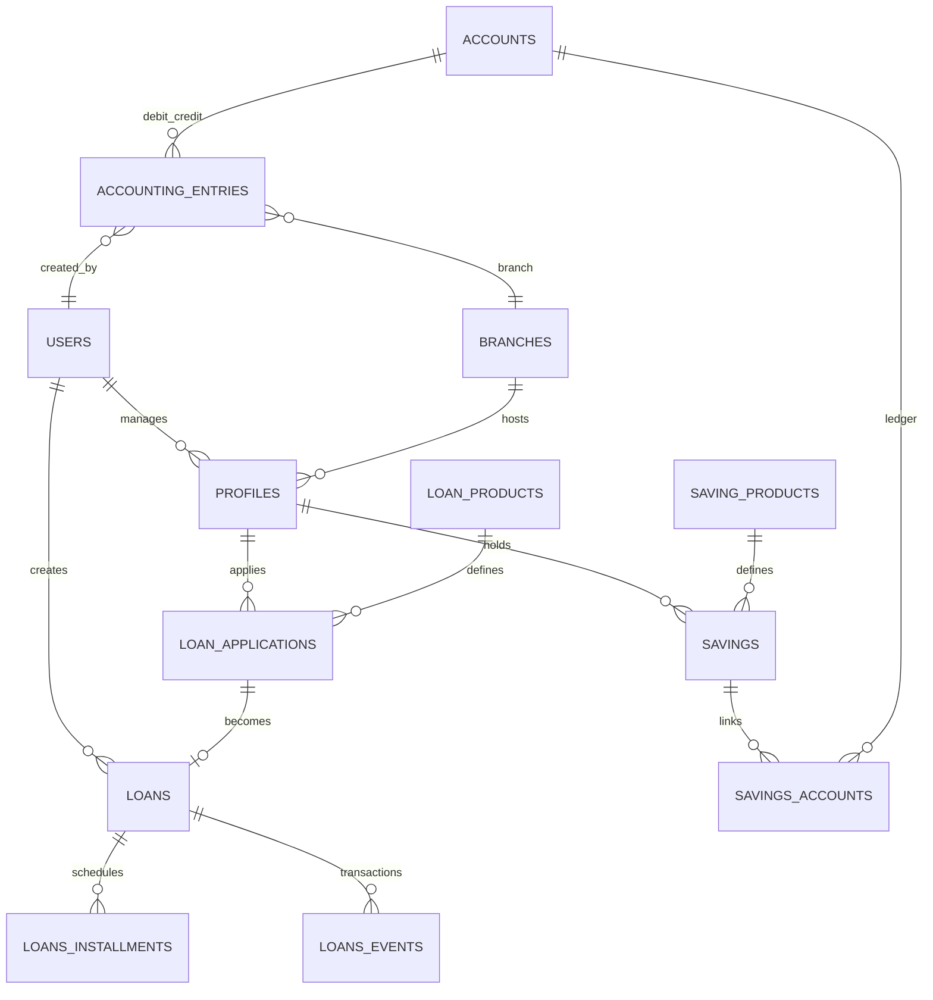
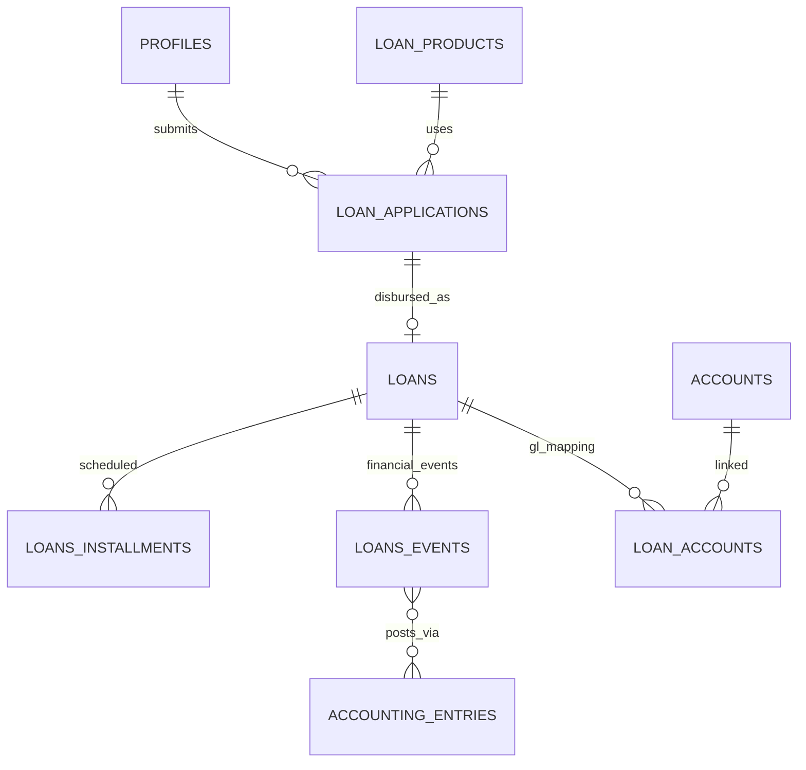
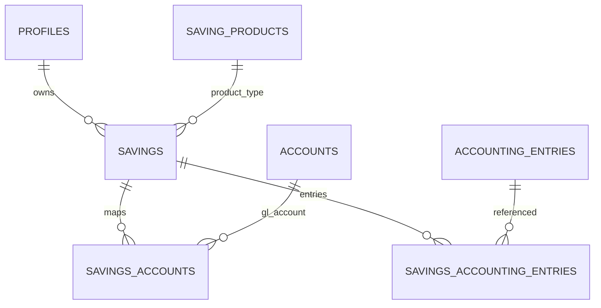

# OpenCBS Cloud — Database Documentation

## Plain Language Overview

This document describes where OpenCBS Cloud stores its data: the PostgreSQL database that holds customers, loans, savings, accounting, and staff settings. **Database administrators, backend developers, and data engineers** will find connection details, schemas, tables, and how changes are applied; **product owners and business analysts** will understand what kinds of information the system keeps (for example profiles, loan contracts, and ledger entries) and how those pieces relate. After reading, you will know which database technology is used, how the schema is organized, and where to look in the codebase for authoritative table definitions.

---

## 1. Database Overview

**Audience:** DBAs and backend developers (technical); product owners (high-level topology).

### 1.1 Database engine and versions

| Item | Value | Source |
|------|--------|--------|
| Database | PostgreSQL | `docker-compose.yml` service `db` |
| Docker image tag | `postgres:14-alpine` | `docker-compose.yml` |
| JDBC driver | `postgresql` `42.2.2` | `server/opencbs-spring-boot-starter/pom.xml` |
| ORM | Spring Data JPA / Hibernate (Spring Boot `1.5.4.RELEASE`) | `server/opencbs-core/pom.xml` |
| Schema migrations | Flyway `4.0.3` | `server/opencbs-core/pom.xml` |
| Application runtime (Docker API) | Java 8 (`eclipse-temurin:8-jre-alpine`) | `server/opencbs-server/Dockerfile` |

**Character set / collation:** Not found in codebase. Maven project encoding is UTF-8 (`project.build.sourceEncoding` in `opencbs-core/pom.xml`). PostgreSQL 14 defaults typically use UTF-8; confirm in a live deployment with `SHOW server_encoding;`.

**Row count estimates:** Not found in codebase.

### 1.2 Legacy and special-attention stack

No mainframe artifacts (COBOL, JCL, RPG, etc.) were found in this repository.

The **application and database access layer use older Java/Spring patterns** that require extra care during upgrades and security reviews:

- **Java 8** and **Spring Boot 1.5.4** (2017-era stack).
- **Flyway 4.0.3** (older migration tooling).
- **Hibernate Envers** for audit history (`hibernate-envers.version` `5.4.1.Final` in `opencbs-core/pom.xml`).
- **Legacy Hibernate Criteria API** in several repository implementations (for example `LoanApplicationRepositoryImpl`, `SavingRepositoryImpl`).
- **Heavy use of PostgreSQL stored functions and views** for loan schedules, balances, and reporting (logic split between SQL and Java).

### 1.3 PostgreSQL schemas

All Flyway module configs target schema `public` except objects explicitly created in other schemas:

| Schema | Purpose | Evidence |
|--------|---------|----------|
| `public` | Primary application tables | `CoreFlywayMigrationStrategy` sets `flyway.setSchemas("public")`; module configs return `"public"` |
| `audit` | Hibernate Envers revision store (`revinfo`) and `*_history` audit tables | `V273__add_tables_for_audits.sql`, `AuditRevisionEntity` (`schema = "audit"`) |
| `chat` | In-app messaging | `V302__create_messages_for_chat.sql`, `Message` entity (`schema = "chat"`) |
| `analytics` | Analytics cash-flow aggregates | `V319__extend_analytics_data.sql` (`create schema if not exists analytics`) |

### 1.4 Connection configuration

**Docker Compose (`docker-compose.yml`):**

| Variable | Value |
|----------|--------|
| `POSTGRES_DB` | `opencbs` |
| `POSTGRES_USER` | `postgres` |
| `POSTGRES_PASSWORD` | `postgres` (development default; do not use in production) |

The `db` service does not publish a host port in `docker-compose.yml`; only the `api` service connects on the internal Docker network.

**JDBC URL format (inferred from Compose service name and database name):**

```
jdbc:postgresql://<host>:5432/opencbs
```

For the Compose stack, `<host>` is typically the service name `db` from inside the `api` container.

**Spring `application.properties` / `application-docker.properties`:** Referenced by `server/opencbs-server/Dockerfile` (`COPY ... application-docker.properties application.properties`) but **not found in this workspace**. Full datasource URL, pool settings, and Flyway toggles are therefore **not found in codebase**.

### 1.5 Flyway history tables (per module)

`CoreFlywayMigrationStrategy` runs migrations in sequence:

1. Core → `schema_version_core` on `public`, location `classpath:db/migration/core`
2. Each `FlywayConfig` bean → its own history table and location

| Module | History table | SQL location | Baseline on migrate |
|--------|---------------|--------------|---------------------|
| Core | `schema_version_core` | `opencbs-core/.../db/migration/core` | No (default) |
| Loans | `schema_version_loans` | `opencbs-loans/.../db/migration/loans` | `true` |
| Savings | `schema_version_savings` | `opencbs-savings/.../db/migration/savings` | `true` |
| Term deposits | `schema_version_terms` | `opencbs-term-deposits/.../db/migration/termdeposits` | `true` |
| Borrowings | `schema_version_borrowings` | `opencbs-borrowings/.../db/migration/borrowings` | `true` |
| Bonds | `schema_version_bonds` | `opencbs-bonds/.../db/migration/bonds` | `true` |

**Migration file counts (`.sql` files in repo):** core 328, loans 22, savings 12, termdeposits 9, borrowings 16, bonds 9 — **396 total**.

### 1.6 ERD overview (core banking entities)



**Diagram Description:** This entity-relationship diagram summarizes the main business links in the `public` schema. `USERS` (staff) create and manage records. `PROFILES` (customers: people, groups, or companies) belong to `BRANCHES` and submit `LOAN_APPLICATIONS` tied to `LOAN_PRODUCTS`. An approved application becomes a `LOANS` contract with `LOANS_INSTALLMENTS` (repayment schedule) and `LOANS_EVENTS` (disbursements, repayments, closures). Customers also hold `SAVINGS` accounts under `SAVING_PRODUCTS`; each saving links to general-ledger `ACCOUNTS` through `SAVINGS_ACCOUNTS`. `ACCOUNTING_ENTRIES` post debits and credits between accounts and reference the creating user and branch. Cardinality uses crow's-foot notation: one profile may have many loans and savings; each loan application maps to at most one live loan in typical flows.

---

## 2. Schema Design

**Audience:** DBAs and backend developers (design rules); product owners (naming and lifecycle concepts).

### 2.1 Philosophy

- **Single shared PostgreSQL database** (`opencbs`) with domain tables predominantly in `public`.
- **Schema changes are versioned in SQL** via Flyway; the application does not rely on Hibernate `ddl-auto` for production schema creation (migrations are the source of truth).
- **Complex financial logic lives in the database** as PostgreSQL functions and views (`get_balance`, `get_loan_schedule`, `get_active_loan`, `view_loans`, etc.), with Java calling these via JPA native queries or reading mapped views.
- **Cross-cutting audit** uses Hibernate Envers (`@Audited` entities, `audit.revinfo`, `audit.*_history` tables).

### 2.2 Naming conventions

- Table and column names: **snake_case** (for example `loan_applications`, `created_by_id`).
- Primary keys: commonly **`bigserial`** / `bigint` `id` (see `V1__Create_users.sql`, `V66__Add_loans.sql`).
- Link tables: `{entity1}_{entity2}` or `{parent}_{child}` (for example `loan_products_entry_fees`, `profiles_accounts`).
- Flyway scripts: `V{version}__{description}.sql` under per-module folders.

### 2.3 Normalization

The model is **largely normalized** to third normal form for master data (users, profiles, products, chart of accounts). Denormalization appears in:

- **SQL views** (`view_loans`, `searchable_profiles`, `view_operation`) for UI and reporting.
- **`account_balances`** snapshot table with `unique(account_id, date)` (`V176__Add_account_balances.sql`).
- **JSONB** on some event tables (for example `loans_penalties_events.extra` in `loans/V4__create_loans_penalty_events.sql`).

### 2.4 Soft delete and status fields

There is **no universal `deleted_at` column**. Patterns vary by domain:

| Pattern | Example | Source |
|---------|---------|--------|
| Status enum on entity | `profiles.status` → `EntityStatus` (`PENDING`, `LIVE`, `REJECTED`, `ARCHIVED`) | `Profile.java`, `EntityStatus.java` |
| Contract status | `loans.status`, `savings.status` (varchar / enums) | `Loan.java`, savings migrations |
| Boolean `deleted` on events/entries | `loans_events.deleted`, `accounting_entries.deleted` | `V279__Create_index_for_accounting_entries.sql`, loan schedule functions |
| `deleted` on custom field definitions | `people_custom_fields.deleted`, etc. | `V326__Add_column_delete_for_tables_custom_fields_.sql` |
| User status | `users.status` → `StatusType` | `User.java` |

**Archiving** for profiles uses `ARCHIVED` status rather than physical row deletion.

### 2.5 Audit and creation metadata

- **`CreationInfoEntity`** (`opencbs-core`): `created_at`, `created_by_id` (foreign key to `users`) on subclasses such as `Profile`.
- **Hibernate Envers:** `@Audited` on entities like `User`, `Profile`, `SavingProduct`, `TermDepositProduct`; history in `audit.*_history` plus `audit.revinfo`.
- **Session tracking:** `user_sessions` table (`V273__add_tables_for_audits.sql`).

---

## 3. Tables / Collections Reference

**Audience:** DBAs and backend developers (full catalog); product owners (domain grouping).

The codebase defines **176 distinct table or view names** extracted from `CREATE TABLE` statements in Flyway SQL and `@Table` annotations in Java. Below, tables are grouped by business area. For tables with many incremental migrations, **the latest shape is spread across multiple `V*.sql` files**; use Flyway history plus JPA entities for column-level truth.

> **Foreign key:** a database constraint that requires values in one table’s column to match existing rows in another table’s primary key, enforcing referential integrity between related records.

### 3.1 Security, organization, and settings

| Table | Key columns / notes | PK / FK (from migrations) |
|-------|---------------------|---------------------------|
| `users` | `username`, `first_name`, `last_name`, `password_hash` (renamed from `password` in `V4`), `role_id`, `branch_id`, `status` | PK `id`; FK to `roles`, `branches` (added in later migrations) |
| `roles` | Role definitions | PK `id` (`V7__Add_roles_and_permissions.sql`) |
| `permissions` | Permission catalog | PK `id` (`V99__Add_permissions_table.sql`) |
| `roles_permissions` | Role–permission join | FKs to `roles`, `permissions` |
| `branches` | Branch master | PK `id` (`V87__add_branches.sql`) |
| `user_sessions` | `user_id`, `ip`, `last_entry_time` | FK → `users` (`V273`) |
| `global_settings` | Name/type/value configuration | `V63__Add_global_settings.sql` |
| `system_settings` | System-level settings | `V262__Add_system_settings_table.sql` |
| `currencies` | Currency master | `V36__Add_currencies.sql` |
| `exchange_rates` | FX rates | `V179__Add_echange_rate.sql` |
| `holidays` | Non-working days | `V27__Create_holidays.sql` |

**`users` initial DDL** (`V1__Create_users.sql`): `id bigserial`, `username`, `first_name`, `last_name`, `password` (later `password_hash`).

### 3.2 Profiles (customers) and custom fields

| Table | Purpose |
|-------|---------|
| `profiles` | Single-table inheritance; discriminator `[type]` for person/company/group (`V2__Create_profiles.sql`, `Profile.java`) |
| `profiles_accounts` | Links profiles to chart-of-accounts `accounts` |
| `searchable_profiles` | **View** for search (not a physical insert target) |
| `people_*`, `companies_*`, `groups_*` | Custom field sections, fields, values, attachments, members |
| `branch_custom_fields*` | Branch-level custom fields (`V309`) |
| `relationships` | Profile relationships (`V49`) |
| `people_pictures` | Profile images (`V13`) |

### 3.3 Chart of accounts and accounting

| Table | Key columns / notes |
|-------|---------------------|
| `accounts` | Chart of accounts: `number`, `name`, `is_debit`, nested set `lft`/`rgt`, `parent_id` (`V93`) |
| `accounting_entries` | `debit_account_id`, `credit_account_id`, `amount`, `effective_at`, `deleted`, `branch_id`, `created_by_id` |
| `account_balances` | Snapshot balances; **unique** `(account_id, date)` |
| `accounting_entries_logs` | Entry change log (`V217`) |
| `accounting_entries_tills` | Till-related entry extension (`V215`) |
| `account_tags`, `accounts_account_tags` | Tagging (`V236`) |
| `current_accounts` | Current account links (`V76`, `V188`) |
| `transaction_template`, `transaction_template_accounts` | Posting templates (`V310`) |
| `events`, `transactions` | Generic event/transaction model (`V77`) |

### 3.4 Loan products and applications

| Table | Key columns / notes |
|-------|---------------------|
| `loan_products` | Product terms, amounts, rates (`V35`) |
| `loan_products_accounts` | GL mapping per product (`V180`) |
| `loan_products_entry_fees`, `loan_products_penalties` | Fees and penalties on products |
| `loan_purposes` | Tree of loan purposes (`V33`) |
| `loan_applications` | `amount`, `grace_period`, `maturity`, `profile_id`, `loan_product_id`, `schedule_type`, `created_at`, `created_by_id` (`V37`) |
| `loan_applications_installments` | Application schedule preview (`V42`) |
| `loan_applications_entry_fees`, `loan_applications_payees`, `loan_applications_attachments` | Fees, payees, files |
| `loan_application_custom_fields*` | Custom fields on applications (`V153`) |
| `loan_application_penalties`, `loan_penalty_accounts` | Penalty setup (`V306`) |
| `group_loan_applications` | Group lending (`V242`) |
| `guarantors`, `collaterals`, `types_of_collateral*` | Security |
| `credit_committee_*` | Committee voting and amount ranges |
| `credit_lines`, `credit_lines_penalties` | Revolving credit (`loans/V22`) |

### 3.5 Active loans and schedules

| Table | Key columns / notes |
|-------|---------------------|
| `loans` | Contract: `amount`, `interest_rate`, `loan_application_id`, `profile_id`, `status`, schedule flags (`V66`, `Loan.java`) |
| `loans_installments` | `number`, `maturity_date`, `interest`, `principal`, `olb`, `loan_id` (`V67`); `deleted` added in `V83` |
| `loans_installments_history` | Historical installments (`V81`) |
| `loans_events` | Loan lifecycle events (disbursement, repayment, close, etc.); altered across many migrations |
| `loans_events_accounting_entries` | Event ↔ GL link (`loans/V2`) |
| `loans_penalties_events`, `loans_penalty_events_accounting_entries` | Penalty events (`loans/V4`) |
| `loan_accounts` | Loan ↔ GL accounts (`V185`) |
| `loan_product_provisions`, `loan_specific_provisions` | Provisions (`loans/V7`, `V8`) |
| `loans_history` | Loan audit trail table (`V203`) |
| `loan_attachments` | Documents (`V163`) |
| `import_payment_history` | Imported payment batch log (`V351`) |
| `sepa_documents` | SEPA integration (`loans/V15`) |
| `view_loans` | **View** exposed as `SimplifiedLoan` JPA entity |

### 3.6 Savings and term deposits

| Table | Module | Key columns |
|-------|--------|-------------|
| `saving_products`, `saving_product_accounts` | savings | Product definition and GL links (`savings/V2`) |
| `savings` | savings | Account contract: fees, rates, status, officer, dates (`savings/V3`) |
| `savings_accounts` | savings | `saving_id` → `accounts` (`savings/V3`) |
| `savings_accounting_entries` | savings | Saving ↔ `accounting_entries` join |
| `term_deposit_products`, `term_deposit_product_accounts` | termdeposits | (`termdeposits/V2`) |
| `term_deposits`, `term_deposit_accounts`, `term_deposit_accounting_entries` | termdeposits | (`termdeposits/V3`) |

Status columns on savings/term-deposit products were added in module migrations (`savings/V13`, `termdeposits/V9`).

### 3.7 Borrowings and bonds (liability instruments)

| Table | Module |
|-------|--------|
| `borrowing_products`, `borrowing_products_accounts`, `borrowings`, `borrowings_installments`, `borrowing_events`, `borrowing_events_accounting_entries`, `borrowing_accounts` | borrowings |
| `bonds_product`, `bonds_product_accounts`, `bonds`, `bonds_installments`, `bonds_events`, `bonds_events_accounting_entries`, `bonds_accounts` | bonds |

**`borrowings`** (`borrowings/V3`): `code`, `amount`, `interest_rate`, `profile_id`, `loan_officer_id`, `status`, FKs to `users`, `profiles`.

**`bonds`** (`bonds/V3`): `isin` (unique), `amount`, `currency_id`, `profile_id`, `bank_account_id`, `product_id`, FKs to `currencies`, `users`, `profiles`, `accounts`, `bonds_product`.

### 3.8 Tills, vaults, day closure, operations

| Table | Purpose |
|-------|---------|
| `tills`, `tills_accounts`, `till_events` | Branch cash tills |
| `vaults`, `vaults_accounts` | Vault cash storage |
| `day_closures`, `day_closure_contracts`, `day_closure_entities` | End-of-day processing |
| `end_of_days` | EOD registry (refactored in `V162`) |
| `view_operation` | **View** for till/operation UI (`Operation.java`) |

### 3.9 Fees, penalties, payees, and ancillary

| Table | Purpose |
|-------|---------|
| `entry_fees`, `other_fees`, `penalties` | Fee masters |
| `payees`, `payees_events`, `payees_accounts` | Disbursement payees |
| `payment_methods`, `branch_payment_methods` | Payment channels |
| `locations`, `business_sectors`, `professions` | Tree / lookup data |
| `request`, `checker_request` | Maker-checker workflow (`V265`) |
| `task_events`, `task_events_participants`, `view_task_event_participants` | Task manager |
| `chat.messages` | Chat messages (`V302`) |
| `analytics.in_out_flow_amounts` | Analytics aggregates (`V319`) |
| `analytics_active_loans` | Mapped by `Analytic` entity |

### 3.10 Audit schema tables (`audit.*`)

Envers and manual history tables include (non-exhaustive): `audit.revinfo`, `audit.users_history`, `audit.roles_history`, `audit.loan_products_history`, `audit.profiles_history`, `audit.saving_products_history`, `audit.term_deposit_products_history`, and per-entity `*_history` for attachments, custom fields, and members (`V273`, `V287`, `V289`, `termdeposits/V10`, `savings/V9`).

### 3.11 Complete table and view catalog

Alphabetical list of **176** relations found in SQL `CREATE TABLE` and JPA `@Table` annotations:

`account_balances`, `account_tags`, `accounting_entries`, `accounting_entries_logs`, `accounting_entries_tills`, `accounts`, `accounts_account_tags`, `analytics.in_out_flow_amounts`, `analytics_active_loans`, `audit.*` (33 history tables — see §3.10), `availabilities`, `bonds`, `bonds_accounts`, `bonds_events`, `bonds_events_accounting_entries`, `bonds_installments`, `bonds_product`, `bonds_product_accounts`, `borrowing_accounts`, `borrowing_events`, `borrowing_events_accounting_entries`, `borrowing_products`, `borrowing_products_accounts`, `borrowings`, `borrowings_installments`, `branch_custom_fields`, `branch_custom_fields_sections`, `branch_custom_fields_values`, `branch_payment_methods`, `branches`, `business_sectors`, `chat.messages`, `checker_request`, `collaterals`, `collaterals_custom_fields`, `collaterals_custom_fields_types`, `collaterals_custom_fields_values`, `companies_attachments`, `companies_custom_fields`, `companies_custom_fields_sections`, `companies_custom_fields_values`, `companies_members`, `credit_committee_amount_range`, `credit_committee_roles`, `credit_committee_votes`, `credit_committee_votes_history`, `credit_lines`, `credit_lines_penalties`, `currencies`, `current_accounts`, `custom_field_values`, `custom_fields`, `day_closure_contracts`, `day_closure_entities`, `day_closures`, `end_of_days`, `entry_fees`, `etalon_balances`, `event_participants`, `events`, `exchange_rates`, `global_settings`, `group_loan_applications`, `groups_attachments`, `groups_custom_fields`, `groups_custom_fields_sections`, `groups_custom_fields_values`, `groups_members`, `guarantors`, `holidays`, `import_payment_history`, `loan_accounts`, `loan_application_custom_fields`, `loan_application_custom_fields_sections`, `loan_application_custom_fields_values`, `loan_application_penalties`, `loan_applications`, `loan_applications_attachments`, `loan_applications_entry_fees`, `loan_applications_installments`, `loan_applications_payees`, `loan_attachments`, `loan_penalty_accounts`, `loan_product_provisions`, `loan_products`, `loan_products_accounts`, `loan_products_entry_fees`, `loan_products_penalties`, `loan_purposes`, `loan_specific_provisions`, `loans`, `loans_events`, `loans_events_accounting_entries`, `loans_history`, `loans_installments`, `loans_installments_history`, `loans_penalties_events`, `loans_penalty_events_accounting_entries`, `locations`, `other_fees`, `payees`, `payees_accounts`, `payees_events`, `payment_methods`, `penalties`, `people_attachments`, `people_custom_fields`, `people_custom_fields_sections`, `people_custom_fields_values`, `people_pictures`, `permissions`, `professions`, `profile_attachments`, `profiles`, `profiles_accounts`, `relationships`, `request`, `roles`, `roles_permissions`, `saving_product_accounts`, `saving_products`, `savings`, `savings_accounting_entries`, `savings_accounts`, `searchable_profiles` (view), `sepa_documents`, `system_settings`, `task_events`, `task_events_participants`, `term_deposit_accounting_entries`, `term_deposit_accounts`, `term_deposit_product_accounts`, `term_deposit_products`, `term_deposits`, `till_events`, `tills`, `tills_accounts`, `transaction_template`, `transaction_template_accounts`, `transactions`, `types_of_collateral`, `types_of_collateral_custom_fields`, `user_sessions`, `users`, `vaults`, `vaults_accounts`, `view_loans` (view), `view_operation` (view), `view_task_event_participants` (view).

---

## 4. Relationships and ERD (domain detail)

**Audience:** DBAs and data modelers (technical); product owners (business relationships).

### 4.1 Core lending flow



**Diagram Description:** Profiles (customers) submit many loan applications over time. Each application references one loan product that defines rules and GL mappings. When approved and disbursed, an application becomes one loan contract. Each loan has many installments (scheduled principal and interest) and many loan events (actual money movements and status changes). Events link to accounting entries for double-entry bookkeeping. Loan accounts connect the loan contract to specific chart-of-accounts rows.

### 4.2 Savings and ledger



**Diagram Description:** A customer profile may hold multiple savings contracts. Each saving is based on one saving product template. Each saving maps to one or more general-ledger accounts through the savings_accounts bridge. Financial movements are recorded as accounting entries and associated with the saving through savings_accounting_entries.

### 4.3 Representative foreign keys (verified in SQL)

| Child table | Column | Parent | Source migration |
|-------------|--------|--------|------------------|
| `loans` | `loan_application_id` | `loan_applications(id)` | `V66__Add_loans.sql` |
| `loans` | `created_by_id` | `users(id)` | `V66` |
| `loan_applications` | `profile_id` | `profiles(id)` | `V37` |
| `loan_applications` | `loan_product_id` | `loan_products(id)` | `V37` |
| `accounting_entries` | `debit_account_id`, `credit_account_id` | `accounts(id)` | `V93` |
| `accounting_entries` | `branch_id` | `branches(id)` | `V93` |
| `savings` | `profile_id` | `profiles(id)` | `savings/V3` |
| `term_deposits` | `profile_id` | `profiles(id)` | `termdeposits/V3` |
| `borrowings` | `profile_id` | `profiles(id)` | `borrowings/V3` |
| `bonds` | `profile_id` | `profiles(id)` | `bonds/V3` |

---

## 5. Indexes

**Audience:** DBAs (performance tuning); backend developers (query plans).

Indexes are added incrementally in migrations. Examples **verified in codebase**:

| Index | Table | Columns | Source |
|-------|-------|---------|--------|
| `accounting_entries_debit_account_id_idx` | `accounting_entries` | `debit_account_id` | `V279` |
| `accounting_entries_credit_account_id_idx` | `accounting_entries` | `credit_account_id` | `V279` |
| `accounting_entries_effective_at_deleted_idx` | `accounting_entries` | `effective_at`, `deleted` | `V279` |
| `account_balances_date_index` | `account_balances` | `date` | `V285` |
| `loans_events_loan_id_index` | `loans_events` | `loan_id` | `V280` |
| `loan_events_loan_id_effective_at_deleted_event_type_idx` | `loans_events` | `loan_id`, `effective_at`, `event_type`, `deleted` | `V282` |
| `saving_accounts_saving_id_type_idx` | `savings_accounts` | `saving_id`, `type` | `savings/V10` |
| `saving_status_branch_id_idx` | `savings` | `status`, `branch_id` | `savings/V10` |
| `term_deposit_accounts_term_deposit_id_type_idx` | `term_deposit_accounts` | `term_deposit_id`, `type` | `termdeposits/V8` |
| `loan_product_id_index` | `loan_product_provisions` | `loan_product_id` | `loans/V7` |
| `loans_penalties_events_idx` | `loans_penalties_events` | `loan_id`, `loan_application_penalty_id` | `loans/V4` |

**Triggers:** No `CREATE TRIGGER` statements were found in migration SQL.

**Full index inventory:** Not exhaustively listed; search `CREATE INDEX` in `server/**/db/migration/**/*.sql` for a complete set.

---

## 6. Stored Procedures and Functions

**Audience:** DBAs and backend developers maintaining financial logic.

PostgreSQL **functions** (not SQL-standard stored procedures) implement core calculations. Many are revised across migrations; the **latest definition** is in the highest-version migration that contains `create or replace function`.

| Function | Purpose (from naming and usage) | Example source |
|----------|----------------------------------|----------------|
| `get_balance(account_id, timestamp)` | Account balance at a point in time | `V248`, called from `AccountRepository.getAccountBalance` |
| `get_loan_schedule(loan_id, timestamp)` | Installment schedule with paid/accrual breakdown | `V355`, returns row set including `deleted`, `rescheduled` |
| `get_active_loan(loan_id, timestamp)` | Active loan snapshot for reporting | `V150` |
| `get_operations(...)` | Operation listing for accounts/tills | `V215` |
| `get_in_cash` / `get_out_cash` | Cash flow for branch/account and date range | `V314` |
| `get_in_cash_recursive` / `get_out_cash_recursive` | Recursive cash-flow aggregation | `V319` |
| `update_in_out_cash_flow(date)` | Batch update analytics cash flow | `V319` |
| `xirr` / `xirr_from_schedule` | Internal rate of return calculations | `V331`, `V347` |
| `_calculate_analitic_` / `_calculate_analitic_by_date` | Analytics loan snapshots | `V330` |
| `_recalculate_balance(timestamp)` | Balance recalculation maintenance | `V324` |
| `get_amount_in_eur_by_date` | Currency conversion helper | `V256` |

**Complete function list:** Not found as a single manifest in codebase; grep `create function` and `create or replace function` under `server/**/db/migration/**/*.sql`.

---

## 7. Views

**Audience:** DBAs and report developers; product owners (read-only reporting surfaces).

| View | Mapped in Java | Purpose |
|------|----------------|---------|
| `view_loans` | `SimplifiedLoan` | Loan list with profile, product, branch, currency |
| `loan_installments` | (read via SQL / functions) | Computed installment state from events |
| `searchable_profiles` | `SearchableProfile` | Profile search |
| `view_operation` | `Operation` | Till/operation display |
| `view_task_event_participants` | `TaskEventParticipantsEntity` | Task participants |

Views are recreated in multiple migrations (for example `view_loans` in `V315`, `V317`, `V318`, `V339`, `loans/V2021_07_28_0142__updata_loan_view.sql`); use the **latest** migration when comparing definitions.

---

## 8. Common Queries

**Audience:** Backend developers; DBAs validating application SQL.

Only queries **evidenced in repository code** are listed below.

### 8.1 Account balance (native function call)

**Source:** `AccountRepository.java`

```sql
select get_balance(:accountId, :dateTime)
```

### 8.2 Active loan IDs at a datetime

**Source:** `LoanRepository.scriptActiveIds`

```sql
select id from loans where id not in (
  select loan_id from loans_events where deleted = false
    and cast(effective_at as timestamp) <= cast(:dateTime as timestamp)
    and event_type in ('CLOSED', 'WRITE_OFF_OLB'))
  and cast(disbursement_date as date) <= cast(:dateTime as date);
```

### 8.3 JPQL search examples

| Repository | Query pattern |
|------------|----------------|
| `UserRepository` | Search users by name, branch, status: `lower(concat(u.firstName, ' ', u.lastName)) LIKE ...` |
| `BranchRepository` | Search branches by name |
| `ActionRequestRepository` | Filter maker-checker requests by date and approver |

**Additional native SQL** exists in `LoanRepository`, `AnalyticRepository`, and custom repository implementations; inspect those classes for full strings.

---

## 9. Migration History

**Audience:** DBAs and release engineers (operational); developers adding schema changes.

### 9.1 Tool and orchestration

- **Tool:** Flyway Core **4.0.3**
- **Orchestration:** `CoreFlywayMigrationStrategy` runs core migrations first, then every Spring bean implementing `FlywayConfig`
- **Test usage:** `BaseDocumentationTest` calls `flyway.clean()` and `flyway.migrate()` (destructive; test-only)

### 9.2 How to add a new migration

1. Identify the **module** (core, loans, savings, termdeposits, borrowings, or bonds).
2. Add a new file under that module’s `src/main/resources/db/migration/{module}/` using the next version prefix, for example `V23__describe_change.sql` for loans.
3. Use idempotent patterns where the codebase already does (`create table if not exists`, `create index if not exists`) when aligning with nearby migrations.
4. Rebuild the affected Maven module and restart the API so Flyway runs on startup.
5. For core schema changes, **do not** rely only on JPA annotations—add matching SQL in `db/migration/core`.

**Creating migrations via Flyway CLI:** Not documented in this repository.

### 9.3 Module timeline (first migrations)

| Module | First migration file (examples) |
|--------|-------------------------------|
| Core | `V1__Create_users.sql`, `V2__Create_profiles.sql` |
| Loans | `V2__create_loans_events_accounting_entries.sql` (loan tables largely in core) |
| Savings | `V2__Create_table_saving_products.sql` |
| Term deposits | `V2__create_termdeposit_product_migration.sql` |
| Borrowings | `V2__Add_borrowing_product.sql` |
| Bonds | `V2__Add_bonds_product.sql` |

Core contains the bulk of historical evolution (**328** SQL files); domain modules add focused tables and adjustments.

---

## 10. Authoritative sources in the repository

| Need | Location |
|------|----------|
| Table DDL and evolution | `server/opencbs-*/src/main/resources/db/migration/**/*.sql` |
| JPA column mapping | `server/opencbs-*/src/main/java/**/domain/**/*.java` |
| Flyway wiring | `CoreFlywayMigrationStrategy.java`, `*FlywayConfig.java` |
| Docker DB service | `docker-compose.yml` |
| JDBC driver version | `server/opencbs-spring-boot-starter/pom.xml` |

---

## 11. Gaps (not found in codebase)

| Item | Status |
|------|--------|
| `application.properties` / `application-docker.properties` with JDBC URL and pool config | Not found in workspace (referenced by Dockerfile only) |
| PostgreSQL `ENCODING` / `LC_COLLATE` settings | Not found |
| Table row counts or production sizing | Not found |
| Single consolidated `schema.sql` dump | Not found (schema is migration-derived) |
| Database triggers | None in migration SQL |
| Mainframe or non-PostgreSQL legacy databases | Not found |

To complete connection documentation in a deployment environment, obtain the runtime `application.properties` from the built API image or deployment secrets management.
