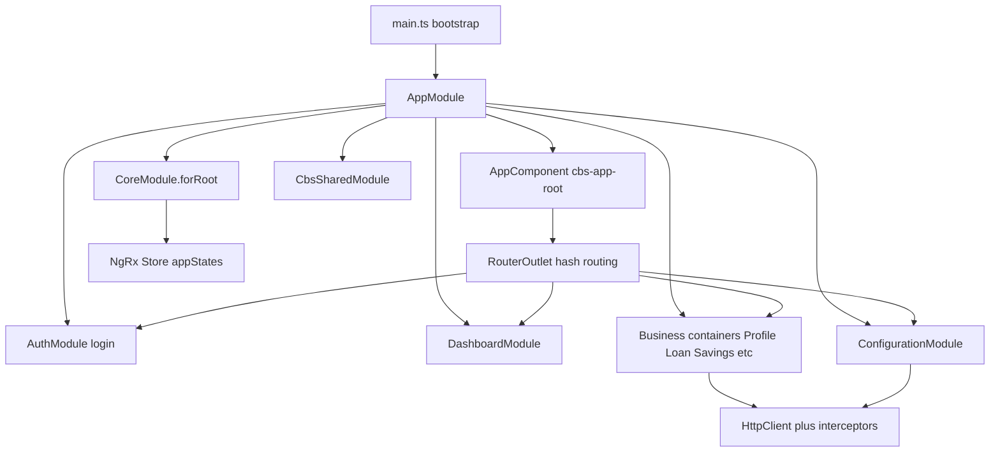
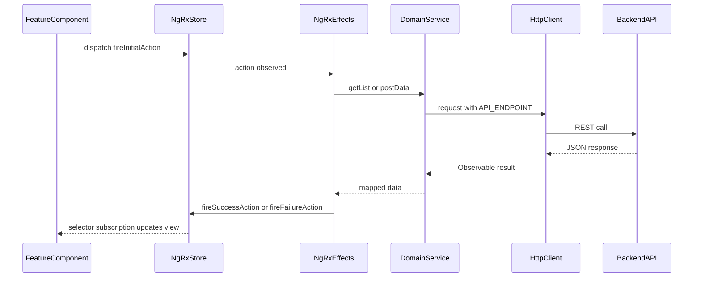

# OpenCBS Frontend Documentation

## 0. Plain Language Overview

This document describes the **OpenCBS Cloud** web application in the `client/` folder: how the user interface is built, how screens connect to the server, and how data flows through the app. **Technical readers** (frontend developers, UI engineers) will find framework versions, module layout, NgRx patterns, and API conventions. **Non-technical readers** (product owners, designers, business analysts) will understand what each major screen area does and how navigation maps to banking features (profiles, loans, savings, configuration, and so on). After reading, you will know how the app starts, which libraries it uses, where UI code lives, and how a typical screen loads data from the backend.

**Legacy / mainframe note:** The `client/` tree contains **only TypeScript/Angular** sources. No COBOL, RPG, JCL, PHP, Classic ASP, or similar legacy UI code was found under this repository. The stack does use some **older-era web dependencies** (jQuery 2, IE9 upgrade notice in `index.html`, ES5 compile target) that warrant attention during upgrades.

---

## 1. Frontend Overview

**Audience — technical:** Frontend developers and UI engineers maintaining or extending the Angular app.  
**Audience — non-technical:** Product owners and designers mapping features to screens and navigation.

### Application entry and bootstrap flow

Active execution starts in `client/src/main.ts`:

1. Imports `AppModule` and `environment`.
2. If `environment.production` is true, calls `enableProdMode()`.
3. Bootstraps `AppModule` via `platformBrowserDynamic().bootstrapModule(AppModule)`.

`client/src/index.html` hosts `<cbs-app-root></cbs-app-root>` plus a pre-bootstrap loading animation that listens for a custom `appready` event (dispatched from `AppReadyService` after `AppComponent` content is checked).

`AppComponent` (`selector: cbs-app-root`) renders only `<router-outlet></router-outlet>`. On init it dispatches `CheckAuth`, subscribes to system settings from the NgRx store, and configures `@ngx-translate` (languages `en`, `ru`, `fr`; default `en`).

### Framework and tooling (verified from `package.json`, `angular.json`, `tsconfig.json`)

| Item | Value (from codebase) |
|------|------------------------|
| Package name | `opencbs-client` v`0.1.0` |
| Framework | Angular `^8.1.4` (core packages); CLI `^8.3.20` |
| Language | TypeScript `~3.4.1`; compile `target`: `es5` |
| Angular project name | `new-client` (`angular.json`) |
| Build tool | `@angular-devkit/build-angular:browser` |
| Output | `client/dist` |
| Dev server | `ng serve` (`npm start`) |
| Production build | `ng build --prod` via `npm run build-prod` |
| UI libraries | `@salesforce-ux/design-system` 2.3.1, `ngx-lightning` ^1.0.2, PrimeNG ^7.0.0, Angular Material ^8.2.3 |
| i18n | `@ngx-translate/core` ^10.0.2 |
| Real-time | `@stomp/ng2-stompjs` 6.0.0 (Rabbit/STOMP via `MessageService`) |
| Other | `rxjs` 6.5.3, `moment`, `lodash`, `big.js`, `pdfmake`, `fullcalendar`, `jquery` 2 |

### Source structure

```
client/
├── src/
│   ├── main.ts              # Bootstrap entry
│   ├── index.html           # Shell + pre-bootstrap loader
│   ├── environments/        # API URL, nav config, date formats
│   ├── styles.scss          # Global style imports
│   ├── assets/              # SCSS, icons, i18n JSON
│   └── app/
│       ├── app.module.ts
│       ├── app-routing.module.ts
│       ├── app.component.*
│       ├── core/            # Layout, guards, services, NgRx store
│       ├── shared/          # Reusable components, pipes, form modules
│       └── containers/      # Feature areas (pages by domain)
├── e2e/                     # Protractor specs
├── karma.conf.js
├── angular.json
└── package.json
```

A **module** (in Angular terms) is a grouped bundle of components, services, and routing for one feature area. A **component** is a single UI unit (template + class) with a selector like `cbs-card`. **Routing** is the mechanism that maps URL hash paths to which component screen is shown.

### Feature containers (top-level modules imported in `AppModule`)

| Container module | Primary business area |
|------------------|----------------------|
| `AuthModule` | Login |
| `DashboardModule` | Home dashboard |
| `ProfileModule` | Customer/member profiles |
| `LoanApplicationModule` | Loan applications |
| `LoanModule` | Active loans |
| `LoanPayeeModule` | Payee detail |
| `BorrowingModule` | Borrowings |
| `SavingsModule` | Savings accounts |
| `TermDepositModule` | Term deposits |
| `BondsModule` | Bonds |
| `TellerManagementModule` | Till / teller operations |
| `TransfersModule` | Transfers |
| `AccountingModule` | General ledger, chart of accounts |
| `MakerCheckerModule` | Approval requests |
| `ReportsModule` | Reports |
| `ConfigurationModule` | Admin configuration (largest UI area) |
| `SettingsModule` | System settings (audit, exchange rate, etc.) |
| `EventManagerModule` | Event management |
| `ErrorModule` | 404 / server error / wildcard |

`EventManagerModule` is imported in `AppModule`; routing for it was not traced in this pass beyond module import.

### Component counts (verified via file search)

| Area | `.component.ts` count |
|------|----------------------|
| `containers/configuration` | 98 |
| `containers/loan` | 38 |
| `containers/loan-application` | 32 |
| `containers/profile` | 23 |
| `containers/settings` | 16 |
| `containers/borrowing` | 13 |
| `containers/bonds` | 13 |
| `containers/term-deposit` | 11 |
| `containers/savings` | 10 |
| `containers/teller-management` | 12 |
| `containers/transfers` | 4 |
| `containers/accounting` | 4 |
| `containers/reports` | 2 |
| `containers/maker-checker` | 1 |
| `containers/dashboard` | 1 |
| `containers/auth` | 1 |
| `shared/` (components + modules) | 55 |
| `core/` | 5 |
| **Total under `src/app`** | **348** |



**Diagram Description:** This flowchart shows how the OpenCBS frontend starts and layers feature code. `main.ts` bootstraps `AppModule`, which declares `AppComponent` with a router outlet. `CoreModule` provides global layout, guards, NgRx feature state (`appStates`), and HTTP services. `CbsSharedModule` supplies reusable widgets. Feature **containers** (profiles, loans, configuration, etc.) register routes that render inside the outlet. Data flows from feature components through NgRx effects/services to the REST API. Auth and dashboard are separate container modules on the same routing tree.

---

## 2. Components

**Audience — technical:** Frontend developers adding or reusing UI pieces.  
**Audience — non-technical:** Designers and product owners identifying shared patterns (cards, nav, forms) vs feature-specific screens.

### Organization

- **`shared/`** — Cross-cutting UI: `shared/components/`, `shared/modules/` (dynamic forms, tree table, file upload, custom fields, schedule), `shared/pipes/`, `shared/directives/`. Exported via `CbsSharedModule` (`shared/shared.module.ts`).
- **`core/components/`** — Application chrome: header, main nav, page header, loan layout, scrollable nav (`core/COMPONENTS.ts`).
- **`containers/<feature>/`** — Feature screens; each feature has a `*.module.ts` and usually `*-routing.module.ts`. Templates are co-located as `*.component.html` / `*.component.scss`.

### Shared components (declared in `shared/COMPONENTS.ts`)

| Component class | Selector | Inputs (`@Input`) | Outputs (`@Output`) |
|-----------------|----------|-------------------|---------------------|
| `CbsLogoSvgComponent` | (see component file) | Not enumerated in barrel export | Not found in grep of barrel |
| `ActivityLogComponent` | — | — | — |
| `HistoryLogComponent` | — | — | — |
| `CbsLogoSvgHorizontalComponent` | — | — | — |
| `TickCrossComponent` | — | — | — |
| `DoctypeComponent` | — | — | — |
| `LoadingIndicatorComponent` | — | — | — |
| `UserDropdownComponent` | — | — | — |
| `FormFieldComponent` | — | — | — |
| `FieldReadonlyComponent` | — | — | — |
| `SearchInputComponent` | `cbs-search-input` | (see template) | `onSearch`, `onClear` |
| `ResponsePopupComponent` | — | — | — |
| `SidebarNavComponent` | — | — | — |
| `BreadcrumbComponent` | — | — | — |
| `HeadingBlockComponent` | — | — | — |
| `CustomFormModalComponent` | — | — | `submitForm` |
| `ImageComponent` | — | — | `onClick` |
| `CardComponent` | `cbs-card` | `cardIcon`, `cardClass`, `cardTitle`, `cardDesc`, `cardLink` | None |
| `IconVerticalNavComponent` | — | — | — |
| `ListSelectComponent` | — | — | `onSelectItem`, `onRemoveItem` |
| `ConfirmPopupComponent` | — | — | `openedChange`, `onSubmitClick`, `onClose` |
| `LoanInstallmentsTableComponent` | — | — | `onCellEdit` |
| `PayeeReadOnlyComponent` | — | — | — |
| `PayeeFormModalComponent` | — | — | `onSubmit` |
| `PayeesBlockComponent` | — | — | `onEditPayee`, `onDeletePayee`, `onAddPayee` |
| `PayeeBlockComponent` | — | — | `onEdit`, `onDelete` |
| `EntryFeesBlockComponent` | — | — | `onDetailsClick` |
| `IconComponent` | — | — | — |
| `CbsMultiselectComponent` | — | — | `selectedOptionsChange` |

Also exported from `CbsSharedModule`: pipes (`DateFormatPipe`, `NumberFormatPipe`, etc.) and directives (`FormFocusDirective`, `MatchHeightDirective`, etc.).

### Shared modules (sub-packages)

| Module | Purpose |
|--------|---------|
| `CbsFormModule` | Dynamic form controls (input, select, date, lookup, grid, mask) |
| `CbsCustomFieldBuilderModule` | Custom field builder UI |
| `CbsTreeTableModule` | Tree table |
| `FileUploadModule` | File upload |
| `ChipsModule` | Chips UI |
| `ScheduleModule` | Schedule display |

### Core layout components (`core/COMPONENTS.ts`)

| Component | Role |
|-----------|------|
| `HeaderComponent` | Top application header |
| `PageHeaderComponent` | Page-level header |
| `MainNavComponent` | Main navigation (driven by `environment.NAVS`) |
| `ScrollableNavComponent` | Scrollable sub-navigation |
| `LoanLayoutComponent` | Layout wrapper for loan flows |

### Naming conventions

- Selectors often prefixed with `cbs-` (e.g. `cbs-app-root`, `cbs-card`).
- Feature components live under `containers/<domain>/<feature-name>/` with files `*.component.ts`, `*.component.html`, `*.component.scss`.
- Module files: `<feature>.module.ts`, `<feature>-routing.module.ts`.

### Storybook

**Not found in codebase.** No Storybook configuration or `*.stories.*` files.

---

## 3. State Management

**Audience — technical:** Developers working with NgRx, effects, and services.  
**Audience — non-technical:** Readers who need to know that “application state” (lists, forms, auth) is centralized rather than only inside each screen.

### Approach (verified)

The app uses **NgRx** (`@ngrx/store`, `@ngrx/effects`, `@ngrx/store-devtools`), not Redux Toolkit or a custom global BehaviorSubject store for domain data.

| Layer | Location | Role |
|-------|----------|------|
| Root store | `AppModule`: `StoreModule.forRoot({}, { metaReducers })` | Empty root; dev uses `ngrx-store-freeze` when `environment.development` in `app.module.ts` is true |
| Feature store | `CoreModule`: `StoreModule.forFeature('appStates', reducers)` | All domain reducers in `core/core.reducer.ts` |
| Effects | `EffectsModule.forRoot(coreEffects)` in `AppModule` | Large set of `@Effect()` classes in `core/core.effects.ts` and per-domain `*.effects.ts` |
| Devtools | `StoreDevtoolsModule.instrument({ maxAge: 10 })` | Redux DevTools integration |

### Redux-base pattern

Many domains use a shared **`ReduxBaseActions`** / **`ReduxBaseEffects`** / **`ReduxBaseReducer`** pattern under `core/store/redux-base/`:

- Actions follow naming: `[ClassName] <COMMAND>`, with `LOADING`, `SUCCESS`, `FAILURE`, `RESET`.
- Effects call injectable `*Service` methods that use `HttpClient`.
- Example: `VaultListEffects` listens for vault list actions and calls `VaultListService.getVaultList()`.

### Auth and current user

- `AuthService` posts to `${environment.API_ENDPOINT}login`.
- `CheckAuth` / `PurgeAuth` actions and `AuthEffects` manage session (see `core/store/auth/`).
- JWT token read from `localStorage` key `token` in `HttpClientHeadersService`.

### Real-time messaging

`StompRService` is provided in `CoreModule`. `MessageService` (`core/store/message-broker/message.service.ts`) configures STOMP using `environment` heartbeat settings and Rabbit config from the backend.

### Router store

`@ngrx/router-store` is listed in `package.json`. **Router-store integration in active `AppModule` imports was not found** beyond the dependency declaration.

---

## 4. Routing

**Audience — technical:** Developers adding routes, guards, or deep links.  
**Audience — non-technical:** Product owners mapping menu items to URLs and screens.

### Global routing (`app-routing.module.ts`)

- **Hash-based URLs:** `useHash: true` (e.g. `http://host/#/dashboard`).
- **Default route:** `''` redirects to `dashboard`.
- **Preloading:** `PreloadAllModules`.

### Auth route (`AuthModule`)

| Path | Component | Guards |
|------|-----------|--------|
| `login` | `AuthComponent` | `NoAuthGuard` |

### Main navigation URLs (`environment.ts` / `environment.prod.ts` → `NAVS.MAIN_NAV`)

| Nav key | URL |
|---------|-----|
| PROFILES | `/profiles` |
| LOAN_APPLICATIONS | `/loan-applications` |
| LOANS | `/loans` |
| BORROWINGS | `/borrowings` |
| SAVINGS | `/savings` |
| TERM_DEPOSITS | `/term-deposits` |
| BONDS | `/bonds` |
| TELLER_MANAGEMENT | `/till` |
| TRANSFERS | `/transfers` |
| GENERAL_LEDGER | `/accounting/accounting-entries` |
| CHART_OF_ACCOUNTS | `/accounting/chart-of-accounts` |
| MAKER_CHECKER | `/requests` |
| REPORTS | `/report-list` |

Configuration and settings routes exist in code but are not listed in `MAIN_NAV` (accessed via configuration UI / permissions).

### Representative feature routes

**Dashboard:** `dashboard` → `DashboardComponent`

**Profiles** (`profile-routing.module.ts`): `profiles`, `profiles/:type/create`, `profiles/:type/:id` with child routes `info`, `info/edit`, `current-accounts`, `attachments`, `loans`, `savings`, etc. Guards: `AuthGuard`, `RouteGuard`; role-based data on some routes.

**Loans:** `loans`, `loans/:id/:loanType` with children `loan-dashboard`, `info`, `schedule`, `payees`, `guarantors`, `collateral`, `operations`, etc.

**Loan applications:** `loan-applications`, `loan-applications/create`, `loan-applications/:id`, maker-checker variants.

**Accounting:** `accounting/accounting-entries`, `accounting/chart-of-accounts`, `accounting/maker-checker/:id`

**Configuration:** `configuration` plus many child paths such as `configuration/users`, `configuration/loan-products`, `configuration/vaults`, `configuration/branches`, `configuration/custom-field`, etc. (see `containers/configuration/containers/*/*-routing.module.ts`).

**Settings:** `settings`, `settings/operation-day`, `settings/exchange-rate`, `settings/audit-trails`, `settings/payment-gateway`, integration-with-bank paths, etc.

**Errors** (`error-routing.module.ts`): `404`, `server-error`, `**` wildcard.

### Guards (verified)

| Guard | Purpose |
|-------|---------|
| `AuthGuard` | Requires authenticated session; redirects to `login` |
| `NoAuthGuard` | Blocks authenticated users from login page |
| `RouteGuard` | Permission / group checks using route `data` |
| `OnEditCanDeactivateGuard` | Unsaved edit protection |

---

## 5. API Integration

**Audience — technical:** Developers calling or mocking backend APIs.  
**Audience — non-technical:** Readers who need to know the UI talks to a REST API under `/api/` and uses login tokens.

### Base URL

| Environment | `API_ENDPOINT` | `DOMAIN` |
|-------------|----------------|----------|
| Development (`environment.ts`) | `http://localhost:8080/api/` | `http://localhost:8080` |
| Production (`environment.prod.ts`) | `/api/` | `/` |

### HTTP stack

1. **`HttpClientModule`** registered in `AppModule`.
2. **`HttpHeaderInterceptorService`** — clones requests with headers from `HttpClientHeadersService` (`Content-Type` and `Accept`: `application/json`; `Authorization: Bearer <token>` when `localStorage.token` exists).
3. **Domain services** in `core/store/**/**.service.ts` — inject `HttpClient`, build URLs as `` `${environment.API_ENDPOINT}<resource>` ``.

### Example endpoints (verified in services)

| Method | Endpoint pattern | Service example |
|--------|------------------|-----------------|
| POST | `login` | `AuthService.login()` |
| GET | `vaults`, `vaults/:id` | `VaultListService`, `VaultInfoService` |
| POST | `vaults` | `VaultCreateService` |
| PUT | `vaults/:id` | `VaultUpdateService` |
| GET | `users/:id` | `UserService` |
| GET | `requests/:id/content` | `UserMakerCheckerService` |
| POST | `requests/:id/approve` | `UserMakerCheckerService` |
| GET | `<entity>/lookup` | Used in lookup form controls (e.g. payees) |

Pagination query helper: `HttpClientHeadersService.buildQueryParams()` decrements `page` by 1 for the API (0-based pages).

Optional **`delay(environment.RESPONSE_DELAY)`** on observables (300 ms dev, 0 prod).

### Typical UI → API flow (NgRx)



**Diagram Description:** This sequence diagram shows a standard data-load path. A feature component dispatches an NgRx action (for example, load vault list). An effect class subscribed to that action calls a domain service method. The service uses Angular `HttpClient` with the configured `API_ENDPOINT` prefix. The backend returns JSON; on success the effect dispatches a success action and the reducer updates store state; the component reads the new state via selectors and refreshes the UI. On failure, a failure action is dispatched and error handling in the reducer or component applies.

### WebSocket / STOMP

`MessageService` connects via `StompRService` after loading user and Rabbit configuration — used for broker-backed notifications (exact queue names defined in message-broker store code).

---

## 6. Styling

**Audience — technical:** Developers theming or overriding styles.  
**Audience — non-technical:** Designers aligning with Salesforce Lightning look-and-feel.

### Global styles (`src/styles.scss`)

Imports (in order):

1. FullCalendar CSS  
2. `@salesforce-ux/design-system` (SLDS)  
3. Angular Material prebuilt theme `indigo-pink`  
4. `assets/style/app.scss` (project SCSS)  
5. `ngx-toastr` styles  

### Project SCSS

- `src/assets/style/app.scss` and partials under `src/assets/style/` (e.g. `base/_base.scss`, vendor overrides for PrimeNG and toast).
- Component-level `*.component.scss` files throughout `shared/` and `containers/`.

### UI kits in templates

- **SLDS** class names (e.g. `slds-spinner`, `slds-text-heading--small` in toasts and loader).
- **ngx-lightning (`NglModule`)** — Salesforce Lightning Angular wrappers.
- **PrimeNG** — tables, multiselect (`DataTableModule`, `TableModule`, etc. in `CbsSharedModule`).
- **Angular Material** — datepicker with Moment adapter in forms.

---

## 7. Testing

**Audience — technical:** Developers running unit and e2e tests.  
**Audience — non-technical:** QA leads planning coverage; note that automated UI test suites are minimal in-repo.

### Unit tests (Karma + Jasmine)

| Item | Detail |
|------|--------|
| Config | `client/karma.conf.js` |
| Runner | Karma `~4.3.0`, Jasmine `jasmine-core ~2.6.2` |
| Browser | Chrome (default) |
| Angular test builder | `@angular-devkit/build-angular:karma` in `angular.json` |
| Spec entry | `src/test.ts` |
| Spec files found | **38** `*.spec.ts` files under `src/app` (e.g. `auth.component.spec.ts`) |

Run: `npm test` → `ng test`.

### End-to-end tests (Protractor)

| Item | Detail |
|------|--------|
| Location | `client/e2e/` |
| Files | `app.e2e-spec.ts`, `auth.e2e-spec.ts`, `app.po.ts` |
| `app.e2e-spec.ts` | Describes suite with `NewClientPage` but **no active `it()` tests** in file body |
| Run script | `npm run e2e` → `ng e2e` |

**Protractor config path:** Referenced by Angular CLI e2e target in `angular.json`; standalone `e2e/protractor.conf.js` **not found** at expected path (CLI may use embedded defaults).

### Lint

`npm run lint` → `ng lint` (TSLint `~5.3.2`, Codelyzer `^5.1.0` per `package.json`).

---

## Appendix: Execution flow summary

1. Browser loads `index.html` → pre-bootstrap spinner.  
2. `main.ts` bootstraps `AppModule`.  
3. `AppComponent` initializes auth check, translations, system settings subscription.  
4. `AppReadyService.trigger()` fires `appready` → loader removed.  
5. Router resolves hash URL → feature module route → guards → container component.  
6. Component dispatches NgRx actions → effects → HTTP services → API.  
7. State updates flow back via reducers; template binds to store selectors or local state.

---

## Appendix: Key file reference

| Concern | Path |
|---------|------|
| Bootstrap | `client/src/main.ts` |
| Root module | `client/src/app/app.module.ts` |
| Root routing | `client/src/app/app-routing.module.ts` |
| Environments | `client/src/environments/environment.ts`, `environment.prod.ts` |
| Shared module | `client/src/app/shared/shared.module.ts` |
| Core module / store | `client/src/app/core/core.module.ts`, `core/core.reducer.ts` |
| HTTP interceptor | `client/src/app/core/services/http-header-interceptor.service.ts` |
| Build config | `client/angular.json`, `client/package.json` |
