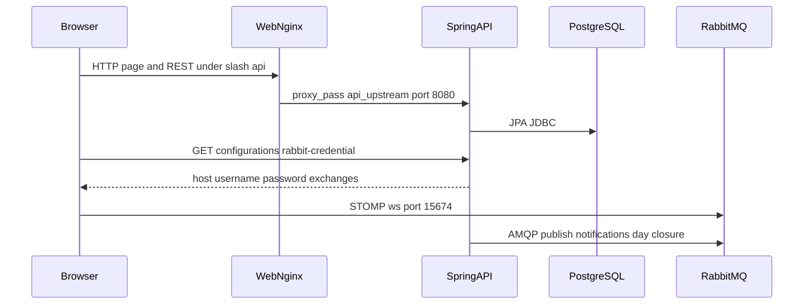
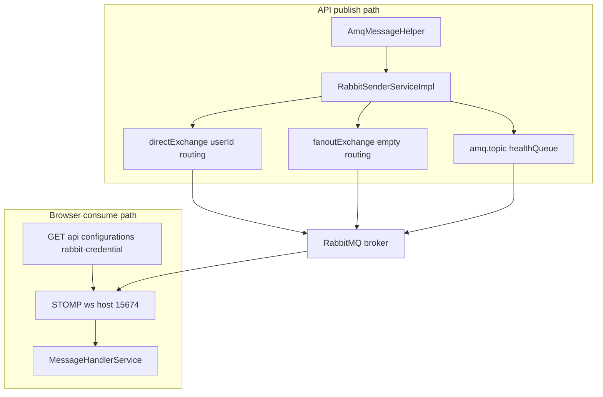

# OpenCBS Cloud — Integrations

## 0. Plain Language Overview

This document explains how OpenCBS Cloud connects to other software: the web app talking to the API, the API talking to the database and message broker, optional email, and file-based bank (SEPA) workflows. **Developers and architects** should use it to trace call paths and configuration keys; **product owners and operations staff** should use it to see what external systems are required in deployment and what is handled inside the product (not a live bank API). After reading, you will know which integrations are evidenced in code, which are file- or settings-driven, and where connection details must be supplied at deploy time.

**Legacy / mainframe code:** Not found in codebase (no COBOL, RPG, Classic ASP, VB6, or similar extensions under this repository). The stack is **Angular 8** (`client/package.json`) and **Spring Boot 1.5.4** on **Java 8** (`server/opencbs-spring-boot-starter/pom.xml`) — older but not mainframe; plan upgrades and security review accordingly.

---

## Entry points and active execution flow

| Layer | Entry | Evidence |
|-------|--------|----------|
| Backend JVM | `ServerApplication.main` → `SpringApplication.run` | `server/opencbs-server/src/main/java/com/opencbs/cloud/ServerApplication.java` |
| Frontend SPA | `main.ts` bootstraps Angular; production build served by Nginx | `client/src/main.ts`, `client/Dockerfile` |
| Compose runtime | `web` → `api` → `db`, `rabbitmq` | `docker-compose.yml` |

**Typical authenticated session (active paths only):**

1. User opens the app on port **80** (`docker-compose.yml` → `web`).
2. Angular calls REST under **`/api/`** (dev: `http://localhost:8080/api/` in `client/src/environments/environment.ts`; prod: relative `/api/` in `environment.prod.ts`). Nginx proxies `/api` to the `api` service (`client/default.conf`).
3. `POST /api/login` returns a JWT; `HttpHeaderInterceptorService` adds `Authorization: Bearer <token>` on subsequent requests (`client/src/app/core/services/http-header-interceptor.service.ts`).
4. On login success, `MessageService.init()` loads `GET /api/users/current` and `GET /api/configurations/rabbit-credential`, then opens a **STOMP** WebSocket to RabbitMQ (`client/src/app/core/store/auth/auth.effect.ts`, `message.service.ts`).
5. API business logic uses **JPA** against PostgreSQL and may **publish** AMQP messages via `RabbitSenderServiceImpl` / `AmqMessageHelper`.

Commented-out or unused integration code is out of scope per task instructions.

**Diagram Description:** The sequence shows a staff user’s browser loading the Angular app from the Nginx `web` container. REST calls under `/api` are forwarded to the Spring Boot `api` service, which reads and writes PostgreSQL. After login, the browser requests RabbitMQ connection settings from the API, then opens a separate STOMP WebSocket connection to RabbitMQ for real-time messages. The API also publishes messages to RabbitMQ (for example day-closure progress and notifications). There is no separate microservice hop in this repository—only these four runtime components plus optional SMTP configured outside the tracked properties files.

---

## 1. Internal service integrations

**Audience:** Developers/architects (protocols, endpoints, contracts); product owners (which boxes must run together in Docker or on-prem).

### 1.1 Web client → API (HTTP REST)

| Attribute | Value |
|-----------|--------|
| Caller | Angular `HttpClient` (many `*.service.ts` under `client/src/app/core/store/`) |
| Callee | Spring Boot API (`api` service, port **8080** internal) |
| Protocol | HTTP/HTTPS (TLS not defined in repo) |
| Base URL (dev) | `http://localhost:8080/api/` (`environment.ts`) |
| Base URL (prod build) | `/api/` relative to host (`environment.prod.ts`) |
| Proxy | Nginx `location /api { proxy_pass http://api_upstream; }` (`client/default.conf`) |
| Auth | `Authorization: Bearer <token>` from `localStorage` (`http-client-headers.service.ts`) |
| Public API examples | `POST /api/login`, `POST /api/login/password-reset` (`WebSecurityConfiguration.java`) |

**Contract expectations:** JSON request/response; `Content-Type` and `Accept` set to `application/json` on authenticated calls. Error handling is per-service (e.g. `PaymentGatewayService` uses `catchError` and returns an `{ error, message }` object — not a global retry policy).

**Rate limits / SLAs:** Not found in codebase.

### 1.2 API → PostgreSQL

| Attribute | Value |
|-----------|--------|
| Caller | Spring Data JPA / `JdbcTemplate` (e.g. `DocumentRepositoryImpl`) |
| Callee | PostgreSQL (`docker-compose.yml`: image `postgres:14-alpine`, database `opencbs`, user `postgres`) |
| Protocol | JDBC (driver `postgresql` **42.2.2** in `opencbs-spring-boot-starter/pom.xml`) |
| Connection config | `spring.datasource.*` — **Not found in codebase** (`application-docker.properties` gitignored, `server/.gitignore`) |
| Migrations | Flyway (`flyway-core` in POM; SQL under `server/**/db/migration/`) |

**Contract expectations:** Relational schema owned by Flyway migrations; no external DB-as-a-service API.

### 1.3 API → RabbitMQ (AMQP publish)

| Attribute | Value |
|-----------|--------|
| Caller | `RabbitSenderServiceImpl` via `AmqMessageHelper` |
| Callee | RabbitMQ (`docker-compose.yml`: `rabbitmq:3-management-alpine`) |
| Client library | `spring-rabbit` (`opencbs-core/pom.xml`) |
| Config prefix | `spring.rabbitmq.*` bound in `RabbitProperties.java` (`host`, `frontHost`, `port`, `username`, `password`, `virtualHost`, `directExchange`, `fanoutExchange`) |
| Actual host/user/password values | **To be configured** (properties file not in repo) |

**Publish patterns evidenced:**

| Use case | Exchange | Routing key | Payload | Source |
|----------|----------|-------------|---------|--------|
| User-specific message | `rabbitProperties.getDirectExchange()` | `user.getId().toString()` | JSON string of `MessageDto` | `AmqMessageHelper.sendMessageToUser` |
| System-wide notification | `rabbitProperties.getFanoutExchange()` | `""` (empty) | JSON string of `MessageDto` | `AmqMessageHelper.sendSystemMessage` |
| Broker health probe | `amq.topic` | `healthQueue` | `"check"` | `RabbitSenderServiceImpl.checkConnectionsHealth` |

**Inbound consumers (`@RabbitListener`):** Not found in codebase — API is **publish-only** for RabbitMQ.

**Beans declared for account balance topic** (`RabbitMQConfiguration.java`): queue, topic exchange, and binding from `account-balance-calculation.*` (`AccountBalanceCalculationProperties`). **Publisher or listener using that queue:** Not found in codebase (no calls to `AmqMessageHelper.sendMessage(exchange, routingKey, o)` outside the helper itself).

### 1.4 Web client → RabbitMQ (STOMP over WebSocket)

| Attribute | Value |
|-----------|--------|
| Caller | `MessageService` / `@stomp/ng2-stompjs` |
| Callee | RabbitMQ STOMP plugin (WebSocket) |
| URL pattern | `ws://{host}:15674/ws` or `wss://{host}:15674/ws` if page is HTTPS (`message.service.ts`) |
| Credentials source | `GET /api/configurations/rabbit-credential` (`ConfigController.java`, `rabbit.service.ts`) |
| Subscriptions | `/exchange/{directExchange}/{userId}` and `/exchange/{fanoutExchange}/{userId}` (`message.service.ts`) |
| Heartbeats | `STOMP_HEARTBEAT_OUT: 1000`, `STOMP_HEARTBEAT_IN: 40000` ms (`environment.ts` / `environment.prod.ts`) |

**Contract expectations:** Message body parsed as JSON into `MessageMQ`; routed by `messageType` to `DayClosureHandler` or `NotificationHandler` (`message.handler.service.ts`).

**Failure behavior:** Connection/setup errors are not centrally retried in `MessageService`; logout calls `unsubscribeMq()` (`auth.effect.ts`).

### 1.5 “Payment gateway” and “Integration with bank” (in-app modules, not separate HTTP services)

These names appear in UI/i18n and map to **internal REST** on the same API — not third-party HTTP clients in server code.

| UI label (i18n) | Client API paths | Server controller | External HTTP to vendor |
|-----------------|------------------|-------------------|-------------------------|
| Payment gateway | `GET/POST /api/payment-gateway`, `POST /api/payment-gateway/export`, `GET /api/payment-gateway/code` | `ImportPaymentHistoryController` (`/api/payment-gateway`, module `OXUS`) | **Not found in codebase** — `ImportPaymentHistoryService` is DB/report oriented |
| Integration with bank | `.../sepa/integration/...` | `SepaIntegrationController` (`/api/sepa/integration`) | **Not found in codebase** — XML file import/export and repayment processing in-process |

---

## 2. External API integrations

**Audience:** Developers/architects (auth and failure modes); product owners (what must be procured outside the repo).

### 2.1 Outbound HTTP/REST from the API to third parties

**Not found in codebase.** Grep for `RestTemplate`, `WebClient`, `HttpURLConnection`, `URL.openConnection` in `server/**/*.java` returned no matches. Integrations with payment networks or core banking hubs are not implemented as live HTTP clients in this tree.

### 2.2 SEPA (file-based bank integration)

| Attribute | Value |
|-----------|--------|
| Type | XML file export/import via authenticated REST |
| Endpoints (examples) | `GET /api/sepa/integration/export/generate-for-date`, `POST /api/sepa/integration/export/export-xml`, `POST /api/sepa/integration/import/parse-xml`, `POST /api/sepa/integration/import/repay` | `SepaIntegrationController.java` |
| Auth | JWT + permission `SEPA` (`@PermissionRequired`) |
| External bank API URL | **Not found in codebase** — operators exchange XML files with their bank outside this app |
| Rate limits / fallback | **Not found in codebase** |

### 2.3 SMTP email

| Attribute | Value |
|-----------|--------|
| Caller | `EmailServiceImpl` (`JavaMailSender`) |
| Config keys | `${email.sender}`, `${spring.mail.username}` (and standard Spring Mail host/port — **Not found in codebase** in tracked files) |
| Uses | Password reset email (`LoginServiceImpl`), day-closure error notification (`DayClosureProcessWorker.sendDayClosureError` with `day-closure.errorToEmails` from `DayClosureProperties`) |
| Auth to mail server | **To be configured** via Spring Mail properties |
| Rate limits / fallback | **Not found in codebase** |

### 2.4 RabbitMQ credentials exposed to browsers

The API returns **username, password, host, virtual host, and exchange names** to any caller authorized for `GET /api/configurations/rabbit-credential` (`ConfigService` → `RabbitCredentials`). This is an architectural integration choice (browser connects directly to the broker), not a third-party SaaS API.

---

## 3. Message-based integrations

**Audience:** Developers/architects (exchanges, formats); product owners (real-time notifications vs batch).

### 3.1 Broker and topology (Docker)

- Service: **`rabbitmq`** — image `rabbitmq:3-management-alpine` (`docker-compose.yml`).
- Management UI port on host: **15672** (comment: default `guest` / `guest` — not overridden in compose).
- STOMP WebSocket port used by client: **15674** (hardcoded in `message.service.ts`, not in compose file).

### 3.2 Message formats

| Path | Format | Content-Type |
|------|--------|----------------|
| `sendMessage` | Jackson JSON string of payload | `application/json` set on AMQP properties | `RabbitSenderServiceImpl` |
| `sendObject` | Java serialized object via `convertAndSend` | Default | `RabbitSenderServiceImpl` (no external callers found) |
| STOMP to browser | JSON in `message.body` → `MessageMQ` | Parsed in `MessageService.onNext` |

**Message types handled in UI:** `MessageType` values consumed by `DayClosureHandler` and `NotificationHandler` — see `message.handler.service.ts`.

### 3.3 Idempotency (safe to retry without double effects)

**Not found in codebase** for AMQP publishing (no message IDs, deduplication keys, or consumer ack strategy documented in code). Day-closure and repayment flows rely on application/database logic; **idempotency guarantees for retried messages are not defined in source.**

### 3.4 Account balance calculation queue

Infrastructure beans exist (`balanceCalculationQueue`, topic exchange, binding) driven by `account-balance-calculation.exchange`, `.queue`, `.routingKey`. **Active producer or consumer in Java:** Not found in codebase. Balance recalculation in day closure uses `RecalculateBalanceService` synchronously in `DayClosureProcessWorker`, not via that queue.

---

## 4. Resilience patterns

**Audience:** Developers/architects (timeouts/retries); product owners (operational expectations).

| Pattern | Finding | Evidence |
|---------|---------|----------|
| HTTP client retries | **Not found in codebase** | No Angular or Spring retry libraries configured globally |
| HTTP timeouts | **Not found in codebase** | No `HttpClient` timeout options in shared interceptor |
| Circuit breaker | **Not found in codebase** | No Resilience4j/Hystrix in POM |
| RabbitMQ publish retry | On `JsonProcessingException`, log error only — **no retry** | `RabbitSenderServiceImpl.sendMessage` |
| RabbitMQ health | Publish to `amq.topic` / `healthQueue`; failure → `RuntimeException` | `checkConnectionsHealth`; used before day closure (`DayClosureValidator`) |
| Docker healthchecks | DB: `pg_isready`; Rabbit: `rabbitmq-diagnostics ping`; interval 10s, timeout 5s, retries 5 | `docker-compose.yml` |
| STOMP heartbeats | 1000 ms out / 40000 ms in | `environment.ts` |
| Day-closure async polling | `future.get(1, TimeUnit.MILLISECONDS)` to count completed tasks — not an external timeout | `DayClosureProcessWorker.getCompletedTaskCount` |
| Client artificial delay | `RESPONSE_DELAY` 300 ms (dev) / 0 (prod) on many RxJS pipes | `environment.ts`, `environment.prod.ts` |
| Email on failure | Sends to `day-closure.errorToEmails` on day-closure exception | `DayClosureProcessWorker` |
| Fallback to alternate API | **Not found in codebase** | — |

**Diagram Description:** The flowchart splits API publishing from browser consumption. `AmqMessageHelper` delegates to `RabbitSenderServiceImpl`, which sends to either the configured direct exchange (routing key = user id), the fanout exchange (empty routing key for system messages), or the built-in `amq.topic` exchange with routing key `healthQueue` for health checks. RabbitMQ delivers messages to STOMP subscribers after the browser obtains credentials via the REST endpoint and connects on port 15674. Incoming messages are dispatched by type in `MessageHandlerService`. If publishing fails during health check, day closure is blocked with a runtime error; ordinary publish failures are logged without automatic retry.

---

## 5. Configuration reference (integration-related keys)

Properties files are **gitignored** (`server/.gitignore`: `application.properties`, `**/application-*.properties`). Docker expects `application-docker.properties` at image build (`server/opencbs-server/Dockerfile`) — **Not found in tracked codebase**. Deployments must supply at least:

| Prefix / key (from `@ConfigurationProperties` / `@Value`) | Purpose |
|-----------------------------------------------------------|---------|
| `spring.datasource.*` | PostgreSQL JDBC (**To be configured**) |
| `spring.rabbitmq.*` | Broker + `directExchange`, `fanoutExchange`, `frontHost` for browser |
| `spring.mail.*`, `email.sender` | SMTP |
| `day-closure.auto-start`, `day-closure.auto-start-time`, `day-closure.error-to-emails` | Scheduled closure + alert emails |
| `account-balance-calculation.exchange`, `.queue`, `.routingKey` | Rabbit topology (**unused publisher/listener in code**) |

---

## 6. Integration inventory summary

| Integration | Direction | Protocol | Third party? | Config in repo |
|-------------|-----------|----------|--------------|----------------|
| Angular ↔ API | Bidirectional | HTTP REST `/api` | No (same product) | `environment*.ts`, `default.conf` |
| API ↔ PostgreSQL | API → DB | JDBC | No (self-hosted DB in compose) | **To be configured** |
| API ↔ RabbitMQ | API → broker | AMQP | No (self-hosted broker) | **To be configured** |
| Browser ↔ RabbitMQ | Browser ↔ broker | STOMP/WebSocket | No | Creds from API; port **15674** in code |
| API ↔ SMTP | API → mail server | SMTP | External mail infra | **To be configured** |
| SEPA XML | User/files ↔ API | REST + XML files | Bank files external to app | Permissions in code |
| OXUS payment history | Client ↔ API | REST `/api/payment-gateway` | **Not found in codebase** as external HTTP | Internal module |
| Outbound payment/bank HTTP APIs | — | — | **Not found in codebase** | — |

---

## 7. Related documentation

Other generated docs in this repo (`ARCHITECTURE.md`, `API_DOCUMENTATION.md`, `SECURITY.md`) may expand endpoint lists and security notes; this file is limited to **integration boundaries** evidenced in source and `docker-compose.yml`.
