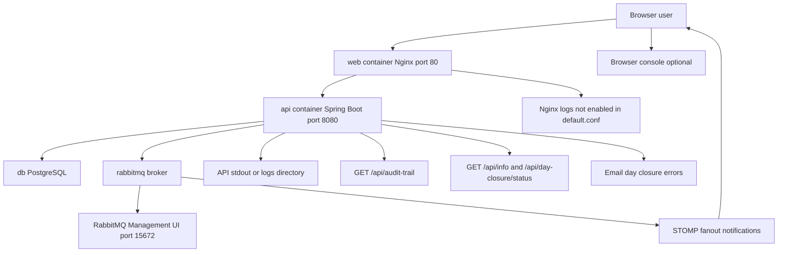

# OpenCBS Observability Guide

## 0. Plain Language Overview

This document explains how you can tell whether OpenCBS (a core banking web application) is healthy, what it records when things go wrong, and where to look for evidence. **Technical readers** (SRE, DevOps, backend and frontend engineers) should use it to find log sources, API status checks, and integration points. **Non-technical readers** (team leads, operations managers, compliance staff) should use it to understand what is monitored today versus what must be added in production. After reading, you will know that observability in this repository is mostly **application logs**, **Docker health checks on database and message broker**, **in-app audit APIs**, and **email/STOMP notifications**—not a full metrics or distributed tracing stack.

**Legacy stack note:** The active codebase is **Spring Boot 1.5.4** on **Java 8** and **Angular 8**. No mainframe (COBOL, RPG, JCL, etc.) or desktop-era source files were found. The stack is older but maintained; production monitoring should account for limited built-in Spring Boot Actuator support in this version.

---

## System entry points and signal flow

| Layer | Entry | Port / path (from codebase) |
|-------|--------|-----------------------------|
| Browser | `client/src/main.ts` → `AppModule` | Dev: `http://localhost:8080` or Angular dev server; Docker: `http://localhost` (port 80) |
| Reverse proxy | `client/default.conf` (Nginx) | `80` → static files; `/api` → `api:8080` |
| API | `server/opencbs-server/src/main/java/com/opencbs/cloud/ServerApplication.java` | `8080` (exposed internally in `docker-compose.yml`; not published to host) |
| Database | PostgreSQL 14 (`docker-compose.yml`) | Internal; healthcheck via `pg_isready` |
| Message broker | RabbitMQ 3 management image | Management UI `15672` on host; STOMP WebSocket `15674` (client code) |



**Diagram Description:** The flowchart shows how observability signals are produced and consumed. Users hit the Nginx `web` container on port 80; API calls under `/api` are proxied to the Spring Boot `api` service on port 8080, which talks to PostgreSQL and RabbitMQ. The API emits logs to standard output or a `logs` path (directory is gitignored, not configured in repo). Nginx access logging is commented out in `default.conf`, so HTTP access logs are not enabled by default. The browser may log to the developer console; structured frontend error reporting is present in code but disabled in providers. Operational checks include audit-trail and info/status HTTP endpoints, RabbitMQ’s management UI on port 15672, email on day-closure failure, and STOMP messages pushed back to the UI for notifications and day-closure progress.

---

## 1. Metrics

**Audience — Technical:** SRE/DevOps engineers sizing alerts and exporters.  
**Audience — Non-technical:** Managers asking whether dashboards exist for uptime and performance.

**Metrics** (numbers measured over time, such as request rate, error rate, or latency) are the usual basis for automated alerting. In this codebase:

| Item | Status |
|------|--------|
| Prometheus / Grafana / Micrometer | **Not found in codebase** |
| Spring Boot Actuator (`/actuator`, `/metrics`) | **Not found in codebase** (no `spring-boot-starter-actuator` in `server/opencbs-core/pom.xml` or `server/opencbs-spring-boot-starter/pom.xml`) |
| Custom `/metrics` HTTP endpoint | **Not found in codebase** |
| Metric names or scrape paths | **Not found in codebase** |
| Alert thresholds | **Not found in codebase** |

### What exists instead of a metrics pipeline

1. **Docker Compose health checks** (`docker-compose.yml`):
   - **PostgreSQL (`db`):** `pg_isready -U postgres` every 10s, 5 retries.
   - **RabbitMQ (`rabbitmq`):** `rabbitmq-diagnostics ping` every 10s, 5 retries.
   - **`api` and `web` services:** No healthcheck defined in `docker-compose.yml`.

2. **Application-level timing (logs, not exported metrics):** `TimeLogAspect` records method duration at **DEBUG** when methods are annotated with `@TimeLog` (e.g. `ProfileService.search`, `AccountBalanceService.create`). This is not a metrics endpoint.

3. **HTTP status endpoints (operational probes, not Prometheus metrics):**
   - `GET /api/info` — version/title/instance metadata (`AbstractInfoController`); permitted without authentication (`WebSecurityConfiguration.java`).
   - `GET /api/day-closure/status` — day-closure process state (`DayClosureController`); requires authentication.

4. **RabbitMQ broker probe in code:** `RabbitSenderServiceImpl.checkConnectionsHealth()` publishes to exchange `amq.topic` with routing key `healthQueue` before day closure; failures throw `RuntimeException` and are logged. This is not an HTTP health URL.

### Typical production configuration (not in repo)

If you add metrics, common choices for Spring Boot 1.5 would be Actuator + Micrometer (newer stacks) or a sidecar scraping logs; none of that is implemented here. Document any future endpoint names and alert rules in deployment config when added.

---

## 2. Logging

**Audience — Technical:** Engineers debugging API, batch, and integration failures.  
**Audience — Non-technical:** Leads who need to know what activity is recorded for audits and incidents.

### Backend (Spring Boot API)

| Topic | Finding in codebase |
|-------|---------------------|
| Logging configuration (`logback.xml`, `logging.level.*` in properties) | **Not found in codebase** — `application.properties` and `**/application-*.properties` are **gitignored** (`server/.gitignore`). Docker copies `application-docker.properties` at build time (`server/opencbs-server/Dockerfile`), but that file is **not present in the tracked workspace**. |
| Log directory | `server/.gitignore` lists `/logs` — implies logs may be written locally in some deployments; path/format **not found in codebase**. |
| Framework | `spring-boot-starter-web` (Spring Boot 1.5.4) — default is typically Logback via Spring Boot, but no explicit config file is committed. |
| SLF4J (`@Slf4j`) | Used across many services (e.g. `DayClosureProcessWorker`, `RabbitSenderServiceImpl`, `JasperReportService`). |
| Apache Log4j 1.x | `ExceptionControllerAdvice` uses `org.apache.log4j.Logger` (mixed with SLF4J elsewhere). |
| Structured JSON logging | **Not found in codebase** |
| Correlation IDs / request IDs (MDC) | **Not found in codebase** |

**Log levels and messages observed in code (examples, not exhaustive):**

| Area | Level | Example content |
|------|-------|-----------------|
| Unhandled API exceptions | ERROR | Banner `-------------- ERROR --------------`, message, stack trace (`ExceptionControllerAdvice`) |
| Day closure batch | INFO / ERROR | Start/end per date and container; duration in seconds; success or `Day closure was done with error` (`DayClosureProcessWorker`) |
| RabbitMQ send failures | ERROR | `e.getMessage()` (`RabbitSenderServiceImpl`) |
| RabbitMQ health check | INFO | `Message broker health check` |
| Jasper reports | INFO / WARN | Report load/reload paths (`JasperReportService`) |
| Balance recalculation | INFO | Start/end with date (`AccountBalanceService`) |
| Method timing (`@TimeLog`) | DEBUG | `{Class}.{method} completed in {n} ms` (`TimeLogAspect`) |

**Business audit vs operational logs:** Hibernate Envers (`@Audited` entities, `AuditRevisionListener`) and `AuditTrailController` (`/api/audit-trail/report/*`) store **business** change history in the database, not centralized operational log streams.

**User session activity:** `UserSessionHandler` persists login/logout-related rows via `UserSessionService` (IP, username, timestamps)—queryable via audit-trail `USER_SESSIONS` report, not application log files.

### Frontend (Angular)

| Topic | Finding |
|-------|---------|
| Global error handler | `LoggingErrorHandler` and `ErrorLogService` exist under `client/src/app/core/services/error-handler/` but are **commented out** in `client/src/app/core/CORE_SERVICES.ts` — not active in default wiring. |
| New Relic browser agent | Declared in `error-log.service.ts`; `newrelic.noticeError` call is **commented out**. |
| Active logging | `console.error`, `console.warn`, `console.group` in error handler and various components (e.g. savings, loan application). |
| HTTP interceptor | `HttpHeaderInterceptorService` adds auth headers only; **no request/response logging**. |

### Nginx (`client/default.conf`)

- `#access_log /var/log/nginx/host.access.log main;` is **commented out** — access logs not enabled in the committed config.
- `error_page` routes 5xx to `/50x.html`.

### How to view logs (Docker Compose)

Commands depend on your environment; typical patterns:

```bash
docker compose logs -f api
docker compose logs -f web
docker compose logs -f db
docker compose logs -f rabbitmq
```

Exact log format and levels require the runtime `application.properties` (not in repo).

---

## 3. Tracing

**Audience — Technical:** Engineers diagnosing slow or failing multi-service requests.  
**Audience — Non-technical:** Managers asking whether a single “trace ID” ties browser clicks to database work.

**Tracing** (linking logs and timings across one user request through API, database, and message broker) is **not implemented** in the tracked codebase.

| Item | Status |
|------|--------|
| OpenTelemetry / Jaeger / Zipkin / Spring Cloud Sleuth | **Not found in codebase** |
| Trace propagation headers | **Not found in codebase** |
| Span naming conventions | **Not found in codebase** |

**Related mechanisms (not distributed tracing):**

- **`TimeLogAspect`:** Local method duration at DEBUG for `@TimeLog` methods only.
- **STOMP messaging:** Client connects via WebSocket to RabbitMQ (`message.service.ts`: `ws://{host}:15674/ws` or `wss://...`) for notifications and day-closure updates—no trace context in message payloads found in code.
- **Exception responses:** `ExceptionControllerAdvice` returns JSON `ErrorResponse` with HTTP status and message; no trace ID field verified in `ErrorResponse` source in this pass.

To find traces today: rely on **timestamps in API logs**, **PostgreSQL audit tables**, and **audit-trail API** reports—not a tracing backend.

---

## 4. Dashboards and alerts

**Audience — Technical:** SRE/DevOps defining on-call and dashboards.  
**Audience — Non-technical:** Managers defining escalation when the banking day cannot close.

| Item | Status |
|------|--------|
| Grafana / Kibana / Datadog dashboard names or URLs | **Not found in codebase** |
| Prometheus alert rules | **Not found in codebase** |
| PagerDuty / Opsgenie integration | **Not found in codebase** |
| Escalation runbooks in repo | **Not found in codebase** |

### In-repo operational surfaces

| Surface | Access | Purpose |
|---------|--------|---------|
| **RabbitMQ Management UI** | `http://localhost:15672` (comment in `docker-compose.yml`; default user `guest` / `guest` per image docs—not overridden in compose) | Queue depth, connections, broker health |
| **Swagger API docs** | `/v2/api-docs` permitted without auth; UI path commonly `/swagger-ui.html` with Springfox 2.9.2 — **exact UI URL not verified by running server** | API exploration, not monitoring |
| **Day closure status API** | `GET /api/day-closure/status` | Process status enum and per-module `ProcessDto` map |
| **Version / instance info** | `GET /api/info` | Deployment identification |
| **Audit trail reports** | `GET /api/audit-trail/report/BUSINESS_OBJECT`, `.../EVENTS`, `.../TRANSACTIONS`, `.../USER_SESSIONS` | Compliance and forensic review (authenticated) |

### Alerting behavior found in code

1. **Email on day closure failure** (`DayClosureProcessWorker.sendDayClosureError`):
   - Recipients: `day-closure.errorToEmails` from `DayClosureProperties` (`@ConfigurationProperties(prefix = "day-closure")`).
   - Property values: **Not found in codebase** (gitignored `application.properties`).
   - Template: `server/opencbs-core/src/main/resources/email/day_closure_error.html` with instance info, message, stack trace, date.

2. **STOMP system notifications** (`AmqMessageHelper.sendSystemMessage`):
   - Types: `info`, `success`, `error`, `warning` (`SystemMessageType`).
   - Example: day closure error broadcasts `SystemMessageType.ERROR` with message text.

3. **Docker healthchecks** (db, rabbitmq only): failing checks block dependent startup (`depends_on: condition: service_healthy` for `api`).

4. **Scheduled day closure** (`@Scheduled(cron="${day-closure.auto-start-time}")`): cron and `day-closure.auto-start` from external properties — values **not found in codebase**.

### Escalation

**Not found in codebase.** A typical operations model would be: Docker/orchestrator alerts on healthcheck failure → API log alerts on ERROR rate → email list for day-closure failure → manual audit-trail review.

---

## 5. How to monitor this service (practical checklist)

**Audience — Technical:** On-call and platform engineers.  
**Audience — Non-technical:** Operations leads validating production readiness.

### Minimum checks available today

1. **Compose stack up:** `db` and `rabbitmq` healthchecks green; `api` and `web` containers running.
2. **User-facing app:** `http://localhost` (port 80) loads; login and a sample API call succeed.
3. **API identity:** `GET /api/info` returns version metadata (unauthenticated).
4. **Broker UI:** RabbitMQ management on port `15672` shows connections and queues.
5. **API logs:** `docker compose logs api` — search for `ERROR`, `Day closure`, `Message broker`.
6. **Long-running batch:** During day closure, poll `GET /api/day-closure/status` and watch STOMP notifications in the UI.
7. **Compliance:** Use audit-trail endpoints for session and transaction history after incidents.

### Gaps to plan for production

| Gap | Typical remediation (not in repo) |
|-----|-----------------------------------|
| No HTTP metrics | Add Actuator or Prometheus exporter; define SLOs on latency and 5xx rate |
| No API container healthcheck | Add `curl`/`wget` to `/api/info` in `docker-compose.yml` |
| No centralized logs | Ship stdout to ELK/Loki/CloudWatch; enable Nginx `access_log` |
| No tracing | Add correlation ID filter + OpenTelemetry or Sleuth |
| Gitignored config | Store `application-docker.properties` in secure deployment pipeline |
| Frontend errors only in console | Re-enable `LOGGING_ERROR_HANDLER_PROVIDERS` or wire RUM (New Relic stub exists) |

---

## 6. Reference: key files

| File | Role |
|------|------|
| `docker-compose.yml` | Service topology; db/rabbitmq healthchecks; RabbitMQ UI port |
| `server/opencbs-server/Dockerfile` | JAR entrypoint; external `application.properties` |
| `server/opencbs-server/src/main/java/com/opencbs/cloud/ServerApplication.java` | API entry point |
| `client/src/main.ts` | Browser entry point |
| `client/default.conf` | Nginx proxy `/api` → `api:8080` |
| `server/opencbs-core/src/main/java/com/opencbs/core/controllers/ExceptionControllerAdvice.java` | API error logging |
| `server/opencbs-core/src/main/java/com/opencbs/core/aspects/TimeLogAspect.java` | DEBUG timing |
| `server/opencbs-core/src/main/java/com/opencbs/core/dayclosure/DayClosureProcessWorker.java` | Batch logging, email, STOMP alerts |
| `server/opencbs-core/src/main/java/com/opencbs/core/services/messages/impl/RabbitSenderServiceImpl.java` | Broker health probe |
| `server/opencbs-core/src/main/java/com/opencbs/core/audit/controllers/AuditTrailController.java` | Audit HTTP API |
| `client/src/app/core/services/error-handler/*` | Optional browser error logging (disabled) |
| `client/src/app/core/store/message-broker/message.service.ts` | STOMP client observability for notifications |

---

## Document metadata

| Field | Value |
|-------|--------|
| Generated from | Tracked source in `/home/vishal/repos/session_954f8999a61f/OpenCBS` |
| Spring Boot version | `1.5.4.RELEASE` (`server/opencbs-spring-boot-starter/pom.xml`) |
| Java version | `1.8` |
| Angular version | `8.x` (`client/package.json`) |
| Mainframe / legacy COBOL-RPG | **Not found in codebase** |
