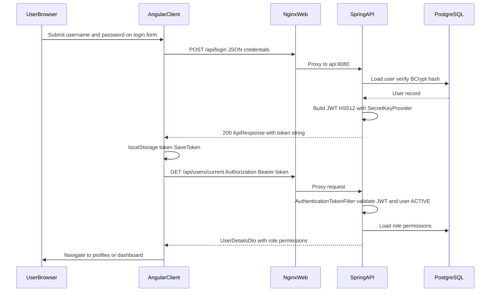

# OpenCBS — Security & Access Model

## 0. Plain Language Overview

This document explains how OpenCBS signs users in, checks what they are allowed to do, and protects sensitive banking data. It is written for **developers and security engineers** who implement or review the system, and for **compliance officers and managers** who need to understand controls without reading code. After reading it, you will know how login works end to end, how permissions are enforced on the server and in the web app, which data is treated as sensitive, and where configuration or hardening may still be required.

**System note:** The stack uses **Spring Boot 1.5.4** (Java 8) and **Angular 8**—mature but dated versions that need extra attention for patching and dependency risk. **No mainframe or legacy COBOL/PHP code** was found in this repository.

---

## Architecture context (entry points)

| Layer | Entry | Role in security |
|-------|--------|------------------|
| Browser | Angular app (`client/`), hash routing (`#/login`) | Login UI, stores JWT in `localStorage`, route guards |
| Reverse proxy | Nginx (`client/default.conf`) | Serves static UI; proxies `/api` to backend |
| API | `ServerApplication` → Spring Security filter chain | JWT validation, authorization, permissions |
| Data | PostgreSQL (`docker-compose.yml` service `db`) | Users, roles, permissions, audit |
| Messaging | RabbitMQ + STOMP (`docker-compose.yml`, client `MessageService`) | Real-time notifications; credentials fetched from API |

**Docker Compose services** (`docker-compose.yml`): `db` (PostgreSQL 14), `rabbitmq` (management UI on port 15672), `api` (Spring Boot, internal port 8080), `web` (Nginx on host port 80). Database and RabbitMQ use **default credentials in Compose** (`postgres`/`postgres`, RabbitMQ `guest`/`guest` per Compose comment)—suitable only for local development.

---

## 1. Authentication

**Audience:** Technical — backend/frontend developers, security reviewers. Non-technical — compliance and IT managers (login requirements and session behavior).

### 1.1 Mechanism summary

OpenCBS uses **username/password login** against the `users` table, with passwords verified using **BCrypt** (`LoginServiceImpl`, `BCrypt.checkpw`). On success the API returns a **JWT (JSON Web Token—a signed string)** built with **JJWT 0.9.1** and **HS512** (`TokenHelper.tokenFor`). The client stores the token in **`window.localStorage`** under the key `token` (`auth.effect.ts`, `JwtService`). Subsequent API calls send **`Authorization: Bearer <token>`** (`HttpClientHeadersService`, `AuthenticationTokenFilter`).

Spring Security is configured for **stateless sessions** (`SessionCreationPolicy.STATELESS` in `WebSecurityConfiguration`). **CSRF (cross-site request forgery) protection is disabled** on the API (`httpSecurity.csrf().disable()`), which is common for token-based SPAs but requires careful browser and CORS policy.

**OAuth, SAML, and external IAM:** Not found in codebase.

### 1.2 Login flow (evidenced)

1. User opens `#/login` (`auth.e2e-spec.ts`, `AuthModule` routes).
2. `AuthComponent` POSTs credentials to `{API_ENDPOINT}login` (e.g. `http://localhost:8080/api/login` in dev — `environment.ts`).
3. `LoginController` (`POST /api/login`) calls `LoginServiceImpl.login`, which validates password, user **ACTIVE** status, optional first-login password change, and password expiry (`expireDate`).
4. Response body includes JWT string via `TokenHelper.tokenFor(user)` wrapped in `ApiResponse`.
5. Client dispatches `Login` → `SaveToken` → stores token → `LoadCurrentUser` → `GET /api/users/current`.
6. E2E success redirects to `#/profiles` with credentials `admin`/`admin` (`auth.e2e-spec.ts`).

**Idle / session timeout:** JWT has **no expiration claim** (`TokenHelper` TODO comment). Optional idle timeout uses system setting `EXPIRATION_SESSION_TIME_IN_MINUTES` compared to `user.lastEntryTime` (`TokenHelper.IsSessionExpired`). When `minutes == 0`, session does not expire by idle time.

### 1.3 Token validation (API)

`AuthenticationTokenFilter` runs before `UsernamePasswordAuthenticationFilter`:

- Reads `Authorization` header; if missing, request continues unauthenticated.
- Strips `Bearer ` prefix, parses username from JWT, loads user, checks **ACTIVE** status and `tokenUtils.verifyToken`.
- Sets `SecurityContext` with `User` principal and authorities from `user.getAuthorities()` (currently fixed `ROLE_USER` in `User.java`).

Unauthenticated access to protected routes yields **401** via `EntryPointUnauthorizedHandler` ("Access Denied").

### 1.4 Public (unauthenticated) API paths

From `WebSecurityConfiguration` (active rules only):

| Pattern | Methods | Purpose |
|---------|---------|---------|
| `/api/login`, `/api/login/update-password`, `/api/login/password-reset` | POST/PUT | Login and password flows |
| `/api`, `/api/info`, `/api/system-settings` | GET | Info/settings |
| `/api/utils/**` | GET, POST | Utility endpoints |
| Selected attachment URLs | GET | Profile/loan attachment download **without auth** |
| `OPTIONS /**` | OPTIONS | CORS preflight |
| Static assets, Swagger paths | — | Ignored by `WebSecurity.ignoring()` |

All other `/api/**` requests require authentication (`.anyRequest().authenticated()`).

### 1.5 Client-side authentication state

- **`AppComponent.ngOnInit`** dispatches `CheckAuth` — restores token from `localStorage` if present.
- **`AuthGuard`** — blocks routes if `AuthService.isAuthenticated` is false; redirects to `login` and saves `redirectUrl`.
- **`NoAuthGuard`** — prevents logged-in users from seeing login; redirects toward `/profiles`.
- **`PurgeAuth`** — clears **entire** `localStorage` and unsubscribes message queues.

**Logout:** `POST /api/logout/{userId}` exists but `LoginServiceImpl.logout` is **empty** (no server-side token revocation). Client-side purge removes the stored token only.

### 1.6 Password reset and first login

- **Reset:** `POST /api/login/password-reset?username=` generates a random password, emails it (`LoginServiceImpl.passwordReset`) — requires valid email (`UserDtoValidator.validateEmail`).
- **First login / forced change:** `UnauthorizedException` with user id as `errorCode` triggers client password modal (`AuthComponent`).
- **Update password (unauthenticated path):** `PUT /api/login/update-password` is permitAll in security config.

### 1.7 JWT signing key

`SecretKeyProvider.getKey()` returns the byte array of the literal string **`"secret"`** with a `TODO: return a real secret string`. **Production must replace this** via code change or externalized configuration—**not found in codebase** as environment-driven secret.

### 1.8 Login audit

`UserSessionHandler` intercepts `/api/login` and `/api/logout/*` to record `UserSession` entries (IP, username, login/logout action).

### 1.9 Sequence diagram — login and API call

**Diagram Description:** The sequence shows a user signing in through the Angular client, which posts credentials to `/api/login` via Nginx. The Spring API validates the password against PostgreSQL using BCrypt, signs a JWT, and returns it to the browser. The client saves the token in `localStorage`, then calls `/api/users/current` with an `Authorization: Bearer` header. Nginx forwards that call to the API, where `AuthenticationTokenFilter` validates the JWT and active user status before returning user and permission data. Trust boundaries: credentials cross the browser network once; the token thereafter represents the session for API calls; the database is only queried server-side.

---

## 2. Authorization

**Audience:** Technical — developers implementing features and API endpoints. Non-technical — managers defining roles and maker-checker policy.

### 2.1 Server-side layers

1. **Spring Security authentication** — must be authenticated for most endpoints (see §1.4).
2. **`@PermissionRequired` AOP** (`PermissionAspect`) — before annotated controller methods, checks `currentUser.hasPermission(name)` unless:
   - `currentUser.getId() == 2`, or
   - `currentUser.getIsSystemUser()` is true  
   Otherwise throws `RuntimeException` with permission name.
3. **Maker-checker** — many create/update operations (users, roles, accounts, profiles, etc.) go through `MakerCheckerWorker` and `RequestType` instead of direct persistence (`UserController.post`, etc.).
4. **`UserHelper.getCurrentUser()`** — business logic uses authenticated `User` from `SecurityContext`; falls back to system user id `1` if no authentication.

Permissions are discovered at startup from `@PermissionRequired` on methods (`PermissionInitializer`) and stored in the database; roles link to permissions via `Role` → `Permission` (`User.hasPermission`).

**Spring `@PreAuthorize` / method-security roles:** Not used; authorities are effectively `ROLE_USER` only (`User.getAuthorities()`).

### 2.2 Representative permission names (from code)

Examples only—not an exhaustive list:

| Module | Example permission names |
|--------|---------------------------|
| Profiles | `GET_PROFILES`, `MAKER_FOR_PEOPLE`, `MAKER_FOR_COMPANY`, `MAKER_FOR_GROUP` |
| Users / roles | `MAKER_FOR_USER`, `MAKER_FOR_ROLE` |
| Teller | `OPEN_TILL`, `CLOSE_TILL`, `DEPOSIT`, `WITHDRAW`, `TRANSFER_TO_VAULT` |
| Transfers | `BANK_TO_VAULT`, `VAULT_TO_BANK`, `BETWEEN_MEMBERS` |
| Audit trail | `AUDIT_TRAIL_BUSINESS_OBJECTS`, `AUDIT_TRAIL_EVENTS`, `AUDIT_TRAIL_USER_SESSIONS` |
| Day closure | Annotated on `DayClosureController` |

Full inventory: scan `@PermissionRequired` across `server/**/controllers/**`.

### 2.3 Client-side authorization

- **`RouteGuard`** — reads `route.data['roles']` or `groupName`; compares to permissions from `CurrentUserService` (grouped permission list). Users with **`isAdmin: true`** bypass checks (`user.getId() == 2` set in `UserMapper.mapToDto`).
- **`AuthGuard`** — authentication only, not fine-grained permissions.
- **`DependentOnRolesGuard`** — loads role list; **always returns `true`** (does not block navigation).
- UI hiding may also use `common.utils` permission helpers—server enforcement remains authoritative.

**Important:** Client checks are for UX only; missing permission on API still fails via `PermissionAspect` or business rules.

### 2.4 Special users

| Id / flag | Behavior evidenced |
|-----------|-------------------|
| User id `1` | System user (`UserHelper.SYSTEM_USER_ID`) |
| User id `2` | Treated as admin (`isAdmin` in DTO); bypasses `@PermissionRequired` |
| `isSystemUser` | Bypasses permission aspect |

### 2.5 Unauthenticated attachment access

`WebSecurityConfiguration` permits **GET** on several attachment paths (people, companies, groups, loan applications, loans) **without a token**. Anyone who can guess or obtain attachment IDs and URLs may download files—treat as a **known exposure** for hardening reviews.

### 2.6 RabbitMQ / STOMP

After login, `MessageService.init()` loads current user and calls **`GET /api/configurations/rabbit-credential`** (requires authentication—under `.anyRequest().authenticated()`). Response includes host, username, password, virtual host, and exchange names (`ConfigService` → `RabbitCredentials`). The browser connects to RabbitMQ via STOMP using those credentials. **Messaging credentials are exposed to any authenticated user** who can call this endpoint.

---

## 3. Sensitive Data

**Audience:** Technical — developers and DBA/security. Non-technical — compliance (PII, credentials, retention).

### 3.1 Fields and storage

| Data | Location | Protection in codebase |
|------|----------|-------------------------|
| Passwords | `users.password_hash` | BCrypt on save (`UserService` + `PasswordEncoder`); `@JsonIgnore` on entity field; login uses `BCrypt.checkpw` |
| JWT | Browser `localStorage['token']` | Not httpOnly; vulnerable to XSS if present |
| PII | `email`, `phone_number`, `id_number`, `address`, names | Returned in APIs for authorized users; validators on create/update (`UserDtoValidator` regex/length) |
| Password reset email | Email body includes **plaintext new password** (`LoginServiceImpl.sendResetPasswordEmail`) |
| RabbitMQ credentials | API response to authenticated clients | Returned in JSON from `ConfigController` |
| Attachments | Filesystem volume `./server/attachments` (Compose) | Some GET paths permitAll (§2.5) |
| Audit history | Hibernate Envers (`@Audited` on `User`, revision APIs) | Access controlled by authenticated APIs |

### 3.2 Configuration secrets

| Item | Status |
|------|--------|
| `application-docker.properties` | Referenced in `server/opencbs-server/Dockerfile`; **not found in tracked codebase** (gitignored per `server/.gitignore`) — datasource, RabbitMQ, mail: **To be configured** |
| JWT secret | Hardcoded `"secret"` in `SecretKeyProvider` — **must not be used in production as-is** |
| Compose `POSTGRES_PASSWORD` | Default `postgres` in `docker-compose.yml` |

### 3.3 Data in transit

- Local Compose: browser → Nginx port 80 → API (internal Docker network). **TLS/HTTPS:** Not configured in `default.conf` or Compose—**To be configured** for production.

---

## 4. External Security Dependencies

**Audience:** Technical — DevOps/platform. Non-technical — managers approving hosting and third-party services.

| Dependency | Use | Security handling in repo |
|------------|-----|---------------------------|
| **PostgreSQL 14** | Primary datastore | Compose env vars; no encryption settings in repo |
| **RabbitMQ 3** | Async/messaging | Management port exposed on host `15672`; credentials via Spring properties (**To be configured** in properties file) |
| **JJWT 0.9.1** | JWT sign/parse | Library version pinned in `opencbs-core/pom.xml` |
| **Spring Security** | Filter chain, BCrypt | Via Spring Boot 1.5.4 BOM |
| **Nginx 1.21** | Static + reverse proxy | No security headers added in `default.conf` |
| **Email (SMTP)** | Password reset | `EmailService` — SMTP settings: **not found in codebase** (expected in gitignored properties) |
| **Cloud IAM (AWS/Azure/GCP)** | — | **Not found in codebase** |
| **API keys in client** | — | **Not found in codebase** |

---

## 5. Security Best Practices (as implemented or gaps)

**Audience:** Technical — security champions and developers. Non-technical — risk/compliance assessing control gaps.

### 5.1 Input validation

- DTO validators (e.g. `UserDtoValidator`) use regex, length limits, and Spring `Assert` for usernames, email, phone, passwords.
- Global handling: `ExceptionControllerAdvice` maps `ApiException`, `IllegalArgumentException`, and generic `Exception` to `ErrorResponse` (generic errors may leak exception messages—review for production).

### 5.2 SQL injection

- Primary data access uses **JPA/Hibernate** and parameterized `@Query` (e.g. `UserRepository`). Custom repositories build JPQL with bound parameters (`ProfileRepositoryImpl`). **No string-concatenated SQL found in reviewed security paths**; continue to audit any native queries separately.

### 5.3 XSS (cross-site scripting)

- Angular templates generally bind data through the framework; **no centralized Content-Security-Policy** in Nginx or Spring. Tokens in `localStorage` increase impact of any XSS.

### 5.4 CSRF

- **Disabled** server-side for API (`WebSecurityConfiguration`). SPA uses bearer tokens, not cookies, for API auth—typical pattern; ensure cookies are not used for session auth without CSRF tokens.

### 5.5 CORS

- `WebMvcConfig.addCorsMappings`: `/api/**` allows **all methods** (`allowedMethods("*")`). Origin restrictions: **not found in codebase** (permissive default).

### 5.6 Security headers

- Nginx `default.conf`: **no** `X-Frame-Options`, `Content-Security-Policy`, `Strict-Transport-Security`, or `X-Content-Type-Options`. **To be configured** at proxy or Spring layer.

### 5.7 Swagger / API docs

- Swagger/webjars paths ignored by security (`WebSecurity.ignoring()`). Restrict exposure in production deployments.

### 5.8 File upload

- `CommonsMultipartResolver` in `GeneralConfig`; attachment paths and size limits depend on properties—**not found in tracked properties files**.

### 5.9 Dependency versions (accuracy)

| Component | Version (from codebase) |
|-----------|---------------------------|
| Spring Boot | 1.5.4.RELEASE (`opencbs-core/pom.xml`) |
| Java | 1.8 |
| jjwt | 0.9.1 |
| Angular | 8.1.x (`client/package.json`) |
| Node (client build) | 14-alpine (`client/Dockerfile`) |
| PostgreSQL image | 14-alpine (`docker-compose.yml`) |

---

## 6. Vulnerability Management

**Audience:** Technical — security/DevOps. Non-technical — management tracking risk and patching.

| Activity | Status in codebase |
|----------|-------------------|
| Dependabot / Renovate | **Not found in codebase** |
| CI security scanning (SAST/DAST/container scan) | **Not found in codebase** (no `.github/workflows` in repo) |
| Documented vulnerability reporting process | **Not found in codebase** |
| OWASP dependency-check in Maven | **Not found in codebase** |

**Recommended operational practices** (outside repo): monitor CVEs for Spring Boot 1.5, Java 8, Angular 8, jjwt 0.9.1, and PostgreSQL; plan upgrades; rotate JWT secret and database/RabbitMQ credentials; enable HTTPS; restrict CORS and public attachment routes; replace hardcoded `SecretKeyProvider` with a managed secret.

---

## 7. Quick reference — key source files

| Concern | Path |
|---------|------|
| Security filter chain | `server/opencbs-core/.../security/WebSecurityConfiguration.java` |
| JWT filter | `server/opencbs-core/.../security/AuthenticationTokenFilter.java` |
| JWT helper / secret | `server/opencbs-core/.../security/TokenHelper.java`, `SecretKeyProvider.java` |
| Login API | `server/opencbs-core/.../controllers/LoginController.java` |
| Login logic | `server/opencbs-core/.../services/LoginServiceImpl.java` |
| Permissions AOP | `server/opencbs-core/.../security/permissions/PermissionAspect.java` |
| Client auth store | `client/src/app/core/store/auth/*` |
| HTTP Bearer header | `client/src/app/core/services/http-client-headers.service.ts` |
| Route guards | `client/src/app/core/guards/auth-guard.service.ts`, `route-guard.service.ts` |
| E2E login | `client/e2e/auth.e2e-spec.ts` |
| Compose / proxy | `docker-compose.yml`, `client/default.conf` |

---

*Document generated from source inspection. Values marked **To be configured** or **Not found in codebase** require deployment-specific files or operational process not present in the tracked repository.*
