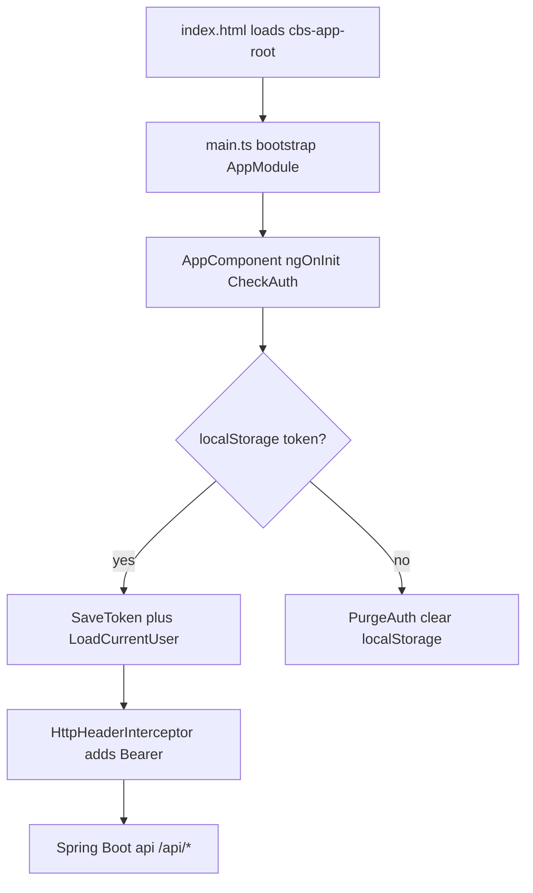
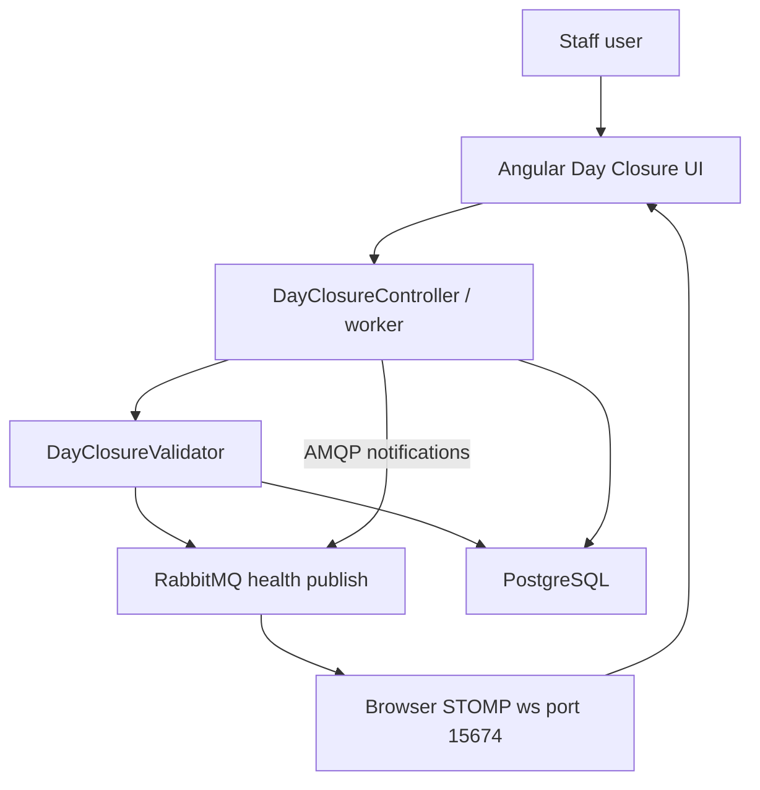
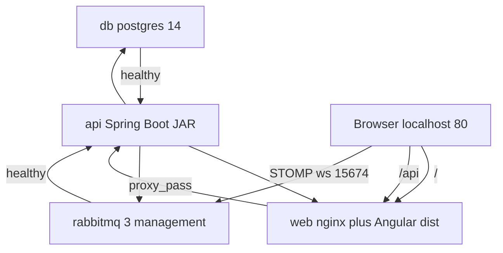

# OpenCBS Cloud — System Gotchas

## 0. Plain Language Overview

This document lists the tricky, fragile, or easy-to-miss behaviors in OpenCBS Cloud—the web-based core banking system in this repository. **Developers and DevOps engineers** use it to avoid production surprises during setup, auth, dates, messaging, and batch jobs; **product managers and new stakeholders** use it to understand operational and security risks that affect timelines and data quality. After reading, you will know where the system can fail silently, which dependencies must be healthy before critical work, and which behaviors are intentional shortcuts versus unfinished work documented in source comments.

**Legacy / mainframe code:** Not found in codebase (no COBOL, RPG, JCL, VB6, or similar). The stack is modern-but-aging web (Angular 8, Spring Boot 1.5.4, Java 8) plus PostgreSQL and RabbitMQ—treat upgrades and security patches as a long-term concern.

---

## 1. Critical Flows

**Audience — Technical:** Engineers tracing runtime behavior from entry points.  
**Audience — Non-technical:** Stakeholders who need to know which user journeys depend on multiple services being up at once.

### 1.1 Application bootstrap and session restore

| Criticality | Gotcha | Why it matters |
|-------------|--------|----------------|
| **High** | On every load, `AppComponent` dispatches `CheckAuth`, which reads `localStorage.token` and either restores the session or purges auth (`app.component.ts`, `auth.effect.ts`). | Users can appear logged in with a stale token; there is an explicit `TODO` to validate the token on save—invalid tokens are not rejected client-side before API calls. |
| **High** | `PurgeAuth` calls `localStorage.clear()` (entire storage, not only `token`) (`auth.effect.ts`). | Logout wipes all browser-stored data for the origin, including `dateFormat` and any other keys—can cause confusing date/format behavior until system settings reload. |
| **Med** | Hash-based routing: `useHash: true` in `app-routing.module.ts`; default redirect is `#/dashboard`. | Deep links and bookmarks always include `#`; server/nginx only serves `index.html` for `/`—API paths are under `/api` proxy. |
| **Med** | Global HTTP interceptor attaches `Authorization: Bearer {token}` from `localStorage` (`http-client-headers.service.ts`). | Any API call after login depends on token presence; no refresh-token flow found in codebase. |

**Diagram Description:** The flowchart shows how the single-page app starts. The browser loads `index.html`, runs `main.ts` to bootstrap `AppModule`, and `AppComponent` immediately checks authentication. If a JWT string exists in `localStorage`, the NgRx store saves it and loads the current user; otherwise auth state is cleared. Subsequent REST calls go through an interceptor that adds the Bearer token header to requests proxied to the Spring Boot API.

### 1.2 Login (UI + API)

| Criticality | Gotcha | Why it matters |
|-------------|--------|----------------|
| **High** | Login POST: `{environment.API_ENDPOINT}login` with JSON credentials; artificial `delay(environment.RESPONSE_DELAY)` (300 ms) on the observable (`auth.service.ts`). | Slower UX in dev; tests using tight timeouts may flake. |
| **High** | After successful login, `Login` action fires; `navigateHome$` connects STOMP (`messageService.init()`) and navigates to `redirectUrl` or, if URL hash contains `login`, to `/dashboard` (`auth.effect.ts`)—not `/profiles`. | Protractor e2e in `auth.e2e-spec.ts` expects `#/profiles` after `admin`/`admin` login—that expectation **does not match** current navigation code. |
| **Med** | Submit button stays disabled until username/password filled (`auth.e2e-spec.ts`); wrong password shows `.cbs-auth__error-message` after ~350 ms sleep in test. | Documents expected UX for onboarding tests. |
| **Med** | `auth.component.ts` sets `dateFormat` in `localStorage` inside `setTimeout(..., 1500)` after login, parallel to `LoadSystemSetting`. | Race: date pickers may run before regional `DATE_FORMAT` is applied. |

**E2E coverage in repo:** Only `auth.e2e-spec.ts` (login UI) and an empty `app.e2e-spec.ts` shell. Full loan journey steps live in `E2E_TEST_SCENARIOS.md` (manual), not in Protractor specs.

### 1.3 Day closure (batch + real-time UI)

| Criticality | Gotcha | Why it matters |
|-------------|--------|----------------|
| **High** | Day closure cannot start if: active maker-checker requests exist, date before last successful closure, closure already in progress, **any till is OPENED**, or RabbitMQ health publish fails (`DayClosureValidator.java`, `AmqMessageHelper.checkConnectionHealth()`). | Operations must close tills and clear pending approvals first; broker outage blocks closure entirely. |
| **High** | UI progress relies on STOMP after login (`MessageService.init` → `GET .../configurations/rabbit-credential` → WebSocket `ws://{host}:15674/ws`). Port **15674** is hardcoded in `message.service.ts`; `docker-compose.yml` only publishes **15672** (management UI). | Docker/default compose may not expose STOMP to the browser unless `spring.rabbitmq.frontHost` and port mapping are configured—notifications/day-closure progress may not appear with no obvious API error. |
| **Med** | Flyway runs core migrations then per-module schemas sequentially on one `Flyway` instance (`CoreFlywayMigrationStrategy.java`). | Long first startup; failure in one module migration blocks the API. |

**Diagram Description:** Day closure is a server-driven batch process triggered from the Angular UI. Before processing, the validator enforces business rules (no open tills, no pending maker-checker requests, valid dates, not already running) and requires RabbitMQ to accept a health message. The API updates PostgreSQL and publishes progress events. The browser must maintain a separate STOMP WebSocket connection to RabbitMQ (port 15674 in client code) to receive live updates; this path is independent of the REST `/api` proxy through nginx.

### 1.4 Maker-checker and permissions

| Criticality | Gotcha | Why it matters |
|-------------|--------|----------------|
| **High** | `RouteGuard` allows all routes if `currentUser.isAdmin`; otherwise checks permission groups on route `data.roles` or `data.groupName` (`route-guard.service.ts`). | Administrator bypasses fine-grained checks—intentional for admins, risky if admin role is over-assigned. |
| **Med** | Credit Committee UI: `E2E_TEST_SCENARIOS.md` documents that user role name must match committee rule role (e.g. `Loan Officer`, not `Administrator`) or vote buttons are hidden. | Product/demo accounts must be set up with correct roles, not only admin. |

---

## 2. Legacy Hacks

**Audience — Technical:** Maintainers judging tech debt and safe refactors.  
**Audience — Non-technical:** Stakeholders understanding why some features behave oddly or carry compliance risk.

| Criticality | Area | Evidence | Why |
|-------------|------|----------|-----|
| **High** | JWT signing secret | `SecretKeyProvider.getKey()` returns bytes of literal `"secret"` with `TODO: return a real secret string` | Tokens are forgeable if this ships unchanged. |
| **High** | JWT lifetime | `TokenHelper.tokenFor()` — `TODO: For now the token does not expire`; optional idle timeout via system setting `EXPIRATION_SESSION_TIME_IN_MINUTES` and `user.lastEntryTime` | No `exp` claim; stolen tokens work until idle policy kicks in (or never if minutes = 0). |
| **High** | Loan write-off penalties | `LoanOperationsService` — multi-penalty loop **commented out** with `TODO ... URGENTLY RELEASE IMPACT FINANCE`; only first `LoanApplicationPenalty` used | Write-off accounting may not match business expectation for multiple penalties. |
| **High** | SEPA export placeholders | `SepaIntegrationMapper` — hardcoded BIC `BGLLLULLXXX` and creditor id `LU59ZZZ000000000LU28524286` with TODOs | Integration output is not institution-specific. |
| **Med** | Loan event “virtual” types | `LoanEventService.setVirtualName()` — `//todo Rewrite this hardcode` switch maps disbursement/repayment/write-off to virtual enum values | UI/history grouping depends on manual mapping when new event types are added. |
| **Med** | SQL analytics mocks | Flyway/scripts (e.g. `V125__Active_loan_function.sql`, `AnalyticScript.sql`) — comments: `todo it's mock, relation loan to purpose are absent` | Reports using these functions may show placeholder logic, not real relationships. |
| **Med** | Current account numbering | `CoreCurrentAccountGenerator` — prefix `001001` + `TODO implement branch code and BIC logic` | Account numbers may not reflect branch/BIC rules. |
| **Med** | Maven Docker build | `opencbs-server/Dockerfile` disables Maven HTTP blocker mirror so JasperReports can pull `itext` over HTTP | Build depends on a fragile mirror override; reproducibility risk. |
| **Low** | Account enrich service | `AccountEnrichService` — comment `TODO need refactoring because full TRASH and UGAR` | Indicates known messy enrichment path. |
| **Low** | Bond service | `BondService` — `magic function, need rewrite without stringbuilder` | Maintenance hazard. |
| **Low** | Client auth token | `auth.effect.ts` — `TODO: add validation rules for token` | Client trusts any non-empty string in `localStorage`. |

**Feature flags (switches that turn functionality on/off):** Not found in codebase as a dedicated feature-flag framework. Behavior toggles are effectively **system settings** and **environment** values (e.g. `environment.ts` nav structure), not named feature flags.

---

## 3. Hard Dependencies

**Audience — Technical:** DevOps and SRE sizing startup order and failure modes.  
**Audience — Non-technical:** Anyone planning hosting—knows which outages stop all banking work vs. only live notifications.

### 3.1 Docker Compose startup chain

From `docker-compose.yml`:

| Service | Image (pinned in file) | Depends on | Health / readiness |
|---------|------------------------|------------|-------------------|
| `db` | `postgres:14-alpine` | — | `pg_isready` healthcheck |
| `rabbitmq` | `rabbitmq:3-management-alpine` | — | `rabbitmq-diagnostics ping` |
| `api` | Built from `server/opencbs-server/Dockerfile` | `db`, `rabbitmq` **healthy** | No healthcheck on `api` |
| `web` | Built from `client/Dockerfile` (Node **14**, nginx **1.21**) | `api` only (no health condition) | No healthcheck |

| Criticality | Gotcha | Why |
|-------------|--------|-----|
| **High** | `application-docker.properties` is **COPY**’d in API Dockerfile but **not present** in tracked tree (`server/.gitignore` ignores `**/application-*.properties`; no `opencbs-server/src/main/resources/` in repo). | `docker compose build` for `api` fails or requires you to add that file locally before build. |
| **High** | `web` starts when `api` container exists, not when API is ready or migrations finished. | Users can hit nginx and get API errors during Flyway migrations or slow JVM start. |
| **High** | API image builds **all** Maven modules in fixed order with `-DskipTests` (Temurin **8**, Spring Boot **1.5.4** from parent POM). | Long builds; skipped tests hide regressions in images. |
| **Med** | DB credentials in compose: `opencbs` / `postgres` / `postgres`. | Must be overridden for production. |
| **Med** | RabbitMQ: only port `15672` published; STOMP **15674** not in compose. | Real-time UI features need extra port/host config (`spring.rabbitmq.frontHost`). |
| **Med** | Client build uses `npm install --legacy-peer-deps` and lodash from a **direct tarball URL** in `package.json`. | Install can break if URL or peer deps change. |

**Diagram Description:** Docker Compose brings up PostgreSQL and RabbitMQ first; the API container waits until both pass health checks. The web container depends on the API container starting but not on API readiness. End users hit port 80 on `web`, which serves static Angular files and proxies `/api` to the API service on 8080. The API uses PostgreSQL and RabbitMQ for AMQP. The browser additionally connects directly to RabbitMQ on STOMP port 15674 for messaging—this leg is not proxied through nginx and is not opened in the default compose file.

### 3.2 Runtime technology pins (from tracked manifests)

| Layer | Version / note | Source |
|-------|----------------|--------|
| Java | 1.8 | `opencbs-spring-boot-starter/pom.xml` |
| Spring Boot | 1.5.4.RELEASE | same |
| PostgreSQL (compose) | 14-alpine | `docker-compose.yml` |
| Angular | 8.1.x | `client/package.json` |
| Node (client Docker build) | 14-alpine | `client/Dockerfile` |
| Flyway (core dep) | 4.0.3 | `opencbs-core/pom.xml` |

### 3.3 Failure modes (symptoms)

| Criticality | Dependency down / misconfigured | Symptom |
|-------------|----------------------------------|---------|
| **High** | PostgreSQL unavailable | API fails startup or 5xx on REST; Flyway migrations do not complete. |
| **High** | RabbitMQ unavailable at day closure | `RuntimeException` from health check; closure blocked. |
| **High** | Missing `application-docker.properties` | API container build or start misconfigured (datasource, exchanges, mail). |
| **Med** | STOMP/WebSocket unreachable | REST works; toasts/day-closure progress via MQ silent. |
| **Med** | Wrong `spring.rabbitmq.frontHost` | Browser connects to wrong host for WebSocket. |
| **Low** | JasperReports template missing | Loan dashboard 500 documented in `E2E_TEST_SCENARIOS.md` (`JasperReportService` NPE). |

---

## 4. Institutional Knowledge

**Audience — Technical:** Day-to-day implementers in shared UI and API layers.  
**Audience — Non-technical:** PMs interpreting UAT bugs around dates, amounts, and roles.

### 4.1 Date and time (multiple sources of truth)

| Criticality | Gotcha | Why |
|-------------|--------|-----|
| **High** | Three format sources: `environment.DATE_FORMAT_MOMENT`, `localStorage.dateFormat`, and `SystemSettingsShareService.getData('DATE_FORMAT')`—updated on login and when system settings load (`system-setting.effect.ts`, `local-storage.service.ts`). | Strict parsing in one component can fail while another displays correctly. |
| **High** | `ParseDateFormatService` splits on `-`, `/`, or `.` and guesses day-first vs year-first by **first segment length === 2** (`parse-date-format.service.ts`). | Ambiguous dates (e.g. `01-02-2023`) depend on segment lengths, not user locale alone. |
| **Med** | `ValidateDatePipe` uses strict moment parse with `environment.DATE_FORMAT_MOMENT` unless args override (`validate-date.pipe.ts`). | Pipe default may disagree with server regional setting until settings load. |
| **Med** | `datepicker.component.ts` `emitOnBlur` formats with `localStorage.getItem('dateFormat')` directly, not `LocalStorageService.getDateFormat()` | If key missing, blur can emit `null` format strings. |
| **Med** | `DATE_PICKER_FORMATS` / `DATE_CONTROL_FORMATS` initially set `dateInput` to `InjectionToken(...).toString()` until `ngOnInit` overwrites (`datepicker.component.ts`, `form-date-control.component.ts`). | Early render frame may use wrong Material date format token string. |
| **Med** | `form-date-control`: `isWeekend()` always returns `true`; `isNotWeekend()` implements weekend check—verify which is wired in template before relying on weekend blocking. | Misleading method names; easy to assume wrong behavior. |
| **Med** | Documented UAT: repayment screen “Invalid date” until PREVIEW clicked twice (`E2E_TEST_SCENARIOS.md`). | Known UX workaround, not fixed in tracked client code. |

### 4.2 Forms, validators, and numbers

| Criticality | Gotcha | Why |
|-------------|--------|-----|
| **Med** | `ValidateNumberField` returns `{validNumber: true}` when regex **matches** (`input-number-validator.ts`)—in Angular, non-null return usually means **error**. | Likely inverted validator semantics; numeric fields may show wrong validation state. |
| **Med** | `atLeastOne` validator passes when `!validator(control)` for **some** control (`at-least-one-validator.ts`). | Behavior depends entirely on the validator fn passed in—easy to misuse. |
| **Low** | `onlyNumber` directive blocks non-numeric keycodes but allows `.` and `-` (`only-number.directive.ts`). | Paste can still introduce invalid numbers. |

### 4.3 API and data conventions

| Criticality | Gotcha | Why |
|-------------|--------|-----|
| **Med** | `HttpClientHeadersService.buildQueryParams` decrements `page` by 1 for API (`http-client-headers.service.ts`). | UI page 1 → API page 0; mismatched if a caller skips this helper. |
| **High** | `AccountBalanceService.getAccountBalances(...)` — comment `TODO DO NOT USE this method for balance calculation!` | Calling it for authoritative balances violates intended design. |
| **Med** | Custom fields: API docs state no single-field fetch; workaround is load all (`api-guide-people-custom-fields.adoc`). | Extra payload and client filtering. |
| **Med** | Loan/saving/term deposit validators: `TODO make null safety` on date range checks (`LoanValidator`, `SavingValidator`, `TermDepositValidator`). | Null boundary dates may throw or validate incorrectly. |

### 4.4 UI architecture notes

| Criticality | Gotcha | Why |
|-------------|--------|-----|
| **Med** | Large shared form layer: `cbs-form` dynamic fields, `cbs-custom-field-builder`, schedule module under `client/src/app/shared/modules`. | Most product screens inherit the same date/lookup quirks. |
| **Med** | `AppComponent.ngAfterContentChecked` logs user out on window `error` events when hash is not `#/login`. | Global error handlers can force logout. |
| **Low** | `storeFreeze` meta-reducer enabled when not production in `app.module.ts` | Dev-only state immutability checks—performance cost in dev. |

### 4.5 Operations and testing lore (documented in repo)

| Criticality | Source | Note |
|-------------|--------|------|
| **Med** | `E2E_TEST_SCENARIOS.md` | Full loan flow requires seeded payment methods, branch, roles, users, loan product, credit committee, person profile—order matters. |
| **Med** | `BaseDocumentationTest` | API tests use `admin` / `admin` login—same as many examples. |
| **Low** | `auth.e2e-spec.ts` vs `auth.effect.ts` | E2E expects `#/profiles`; app navigates to `#/dashboard` after login—tests may be stale. |

### 4.6 What is explicitly not in the codebase

- Committed `application.properties` / `application-docker.properties` (gitignored; required for Docker API image).
- Feature-flag framework.
- Mainframe or legacy desktop source.
- CI workflow definitions (`.github/workflows`): **Not found in codebase**.
- JWT secret from environment variables: **Not found in codebase** (hardcoded class only).

---

## Document metadata

| Item | Value |
|------|--------|
| Generated from | Active source under `/home/vishal/repos/session_954f8999a61f/OpenCBS` (entry points, `docker-compose.yml`, shared client modules, e2e specs, server security/day-closure/loan paths, TODO/FIXME scan) |
| Ignored per task | Commented-out dead code paths |
| Related docs | `README.md`, `E2E_TEST_SCENARIOS.md`, `ARCHITECTURE.md`, `INTEGRATIONS.md`, `SECURITY.md` |
