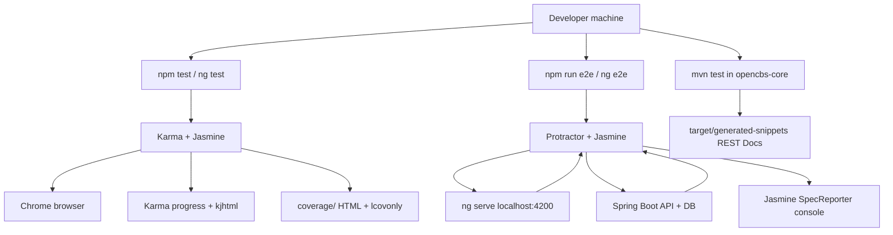

# OpenCBS Cloud — Testing Guide

## 0. Plain Language Overview

This guide explains how OpenCBS Cloud is tested today: automated checks for the web app and API, plus manual loan-flow scenarios documented elsewhere. **Developers and QA engineers** will learn which tools run which tests and how to add new ones; **team leads and managers** will see what quality signals exist (and what is missing, such as CI pipelines). After reading, you will understand how the Angular client and Java server are exercised, what commands to run locally, and where test files live in the repository.

**System note:** The stack uses **legacy-era versions** (Angular 8, Spring Boot 1.5.4, Java 8, Protractor 5, Jasmine 2.6). No mainframe or COBOL/RPG code was found in this repository. Docker release builds **skip all Maven tests** (`-DskipTests` in `server/opencbs-server/Dockerfile`).

---

## Application Entry Points and Test-Relevant Flow

Understanding where the app starts helps you know what must be running before tests.

| Layer | Entry point | Role in testing |
|-------|-------------|-----------------|
| **Browser client** | `client/src/main.ts` → `platformBrowserDynamic().bootstrapModule(AppModule)` | Unit tests load components/services from `AppModule` and feature modules via Karma. E2E tests drive the app at `http://localhost:4200/` (hash routing, e.g. `#/login`). |
| **Routing** | `client/src/app/app-routing.module.ts` — default redirect to `dashboard`, `useHash: true` | Protractor specs navigate with hash URLs (`#/login`, `#/profiles`). |
| **API server** | `server/opencbs-server/src/main/java/com/opencbs/cloud/ServerApplication.java` — `SpringApplication.run` | Spring Boot REST API; documentation tests call `/api/login` and other endpoints via `MockMvc`. Client E2E login (`admin`/`admin`) requires a **live API and database**, not just the Angular dev server. |
| **Compose stack** | `docker-compose.yml` — `web` (port 80), `api` (8080 internal), `db`, `rabbitmq` | Production-like runs; **not wired to automated test scripts** in the repo. |



**Diagram Description:** The flowchart shows how a developer runs three test paths from one machine. Unit tests go through `npm test` into Karma and Jasmine, launching Chrome and producing Karma reporters plus optional Istanbul coverage under `client/coverage/`. End-to-end tests go through `npm run e2e` into Protractor, which depends on both the Angular dev server at port 4200 and the Spring Boot API (for flows like login). Maven tests in `opencbs-core` generate Spring REST Docs snippets under `target/generated-snippets`. Arrows show dependencies: E2E cannot fully validate login without the API backing the client.

**Audience — Technical:** Developers tracing failures across client, API, and DB.  
**Audience — Non-technical:** Managers seeing that UI automation assumes both front-end and back-end are up.

---

## 1. Testing Strategy

**Audience — Technical:** Developers and QA designing or extending tests.  
**Audience — Non-technical:** Leads aligning expectations on release quality.

OpenCBS Cloud uses a **layered but uneven** test strategy:

1. **Client unit tests (primary front-end automation)** — Many `*.spec.ts` files co-located with source; most assert creation or shallow behavior; some (e.g. auth) exercise NgRx dispatch with mocks.
2. **Client E2E (Protractor)** — Two spec files under `client/e2e/`; `auth.e2e-spec.ts` is substantive (login UI and redirect to `#/profiles`); `app.e2e-spec.ts` only sets up a page object with no assertions.
3. **Server tests (limited to `opencbs-core`)** — JUnit tests: one helper unit test, Mockito-structured worker test **without test methods**, and many `@SpringBootTest` REST Docs tests that hit real MVC + Flyway migrate/clean.
4. **Manual / scenario E2E** — `E2E_TEST_SCENARIOS.md` documents loan workflows (not executable by repo scripts).
5. **CI / gates** — **Not found in codebase** (no `.github/workflows`, GitLab CI, Jenkinsfile, or Travis config). Docker builds explicitly skip tests.

There is **no** dedicated client integration test suite (e.g. HttpClientTestingModule against mock API) beyond component `TestBed` setups. There are **no** server tests in modules `opencbs-loans`, `opencbs-savings`, `opencbs-bonds`, etc.—only `opencbs-core/src/test/java/`.

**Coverage policy:** Istanbul reporter is configured in Karma, but **coverage thresholds and enforced gates are not found in codebase**. The `coverage-istanbul` reporter is not listed in Karma `reporters` (only `progress`, `kjhtml`); enabling coverage output may require Angular CLI flags not declared in `package.json` scripts (**Not found in codebase** as a named script).

---

## 2. Test Types Present

**Audience — Technical:** QA and developers choosing the right test layer.  
**Audience — Non-technical:** Managers mapping risk to test types.

| Type | Definition (inline) | Present? | Location / framework |
|------|---------------------|----------|----------------------|
| **Unit test** — checks one class or component in isolation, often with mocks | Yes (client & partial server) | `client/src/**/*.spec.ts` (38 files); `DateHelperTest.java`; `AccountingEntryWorkerTests.java` (setup only, no `@Test` body) |
| **Integration test** — multiple parts wired together (e.g. HTTP + DB) | Partial | Server: `@SpringBootTest` + `MockMvc` + Flyway in `*DocumentationTest.java`; Maven profile `integration` in `opencbs-spring-boot-starter/pom.xml` (properties only—**no integration test classes found**). Client: **Not found in codebase** as a separate suite. |
| **E2E (automated)** — full browser against running app | Minimal | Protractor: `client/e2e/*.e2e-spec.ts` (2 files) |
| **E2E (manual)** — human-driven scenarios | Yes (documentation) | `E2E_TEST_SCENARIOS.md` |
| **API documentation tests** | Yes | Spring REST Docs + MockMvc under `com.opencbs.core.apidoc` |
| **Coverage** — measures which lines ran during tests | Configured, not gated | `karma-coverage-istanbul-reporter` → `client/coverage/` (HTML, `lcovonly`) |

### Client unit test inventory

- **Count:** 38 `*.spec.ts` under `client/src/` (verified via filesystem search).
- **Patterns:** Co-located `*.spec.ts` next to components, pipes, services; loaded by `client/src/test.ts` via `require.context('./', true, /\.spec\.ts$/)`.
- **Typical depth:** Many specs only `expect(service).toBeTruthy()` or `expect(pipe).toBeTruthy()`; richer example: `auth.component.spec.ts` (TestBed, `RouterTestingModule`, `StoreModule`, `spyOn(store, 'dispatch')`).

### Client E2E inventory

| File | Purpose |
|------|---------|
| `client/e2e/auth.e2e-spec.ts` | Login form, validation, error message, successful login → `#/profiles` |
| `client/e2e/app.e2e-spec.ts` | Instantiates `NewClientPage` only; **no `it()` assertions** |

### Server test inventory (`server/opencbs-core/src/test/java/`)

| Category | Files |
|----------|-------|
| REST Docs / MVC | `BaseDocumentationTest.java`, `ProfileDocumentationTest.java`, `CompanyDocumentationTest.java`, … (12 concrete documentation test classes) |
| Unit-style | `DateHelperTest.java` (extends `junit.framework.TestCase`) |
| Mockito scaffold | `unit/worker/AccountingEntryWorkerTests.java` — **no `@Test` methods** |
| Fixtures | `fixtues/AccountingEntryFixtures.java`, `fixtues/CommonFixtures.java` (package name typo: `fixtues`) |

**Backend tests in other Maven modules:** **Not found in codebase**.

---

## 3. Running Tests

**Audience — Technical:** Developers and QA running checks locally or in release pipelines.  
**Audience — Non-technical:** Managers asking “how do we verify a build?”—note CI automation is absent in-repo.

### Prerequisites

| Test type | Prerequisites (from codebase) |
|-----------|-------------------------------|
| Client unit | Node.js/npm; install deps in `client/` (`npm install` — **install command not in repo scripts; standard npm usage**). Chrome (Karma `browsers: ['Chrome']`). |
| Client E2E | `client/README.md`: **serve app before e2e** (`ng serve`). `protractor.conf.js` `baseUrl`: `http://localhost:4200/`. `ng e2e` also starts dev server via `angular.json` `devServerTarget: new-client:serve`. Login scenarios need API + DB with `admin` user. |
| Server unit/docs | JDK 8 (`java.version` 1.8 in `opencbs-core/pom.xml`); Maven; `@ActiveProfiles("test")` on documentation tests — **`application-test` properties/yml: Not found in codebase** |

### Client — all unit tests

From repository root:

```bash
cd client
npm test
```

Equivalent: `ng test` (`client/package.json` scripts).

- **Runner:** Karma (`client/karma.conf.js`, `angular.json` project `new-client`, architect target `test`).
- **Watch mode:** Default — `karma.conf.js` sets `autoWatch: true`, `singleRun: false` (tests re-run on file changes while process is open).
- **Port:** Karma `9876`.

**Single-run / CI-style client command:** **Not found in codebase** (no `ng test --watch=false` script; no headless browser config).

### Client — coverage

`karma.conf.js` configures `coverageIstanbulReporter` with `dir: .../coverage`, reports `html` and `lcovonly`.

**Explicit npm script for coverage:** **Not found in codebase**.  
**Coverage thresholds:** **Not found in codebase**.

### Client — E2E (all)

```bash
cd client
npm run e2e
```

Equivalent: `ng e2e` — uses Protractor (`client/protractor.conf.js`), specs `./e2e/**/*.e2e-spec.ts`, `framework: 'jasmine'`, `directConnect: true`, Chrome.

**Watch E2E (re-run on file changes):**

```bash
cd client
npm run e2e:watch
```

Runs: `watch 'ng e2e -s false' src e2e --wait=1` (`client/package.json`).

### Client — lint (not tests, but related quality)

```bash
cd client
npm run lint
```

Runs `ng lint` (TSLint per `angular.json`).

### Client — run specific tests

**Not found in codebase** (no documented Karma grep / `ng test --include` scripts). Developers typically use Jasmine `fdescribe` / `fit` locally (convention only—not committed in config).

### Server — all tests in core module

```bash
cd server/opencbs-core
mvn test
```

**Not documented in a dedicated TESTING file**; inferred from standard Maven layout and existing `src/test/java`.

**Run all server modules’ tests from parent POM:** Parent `server/pom.xml` is aggregator only with no test plugin config; only `opencbs-core` contains tests.

**Maven profile `integration`:**

```bash
cd server/opencbs-spring-boot-starter
mvn test -Pintegration
```

Profile sets `unit-tests.skip`, `js-tests.skip`, `integration-tests.skip` to `false` — **no integration test sources or surefire configuration referencing these properties were found in codebase**.

### Server — skip tests (release / Docker)

`server/opencbs-server/Dockerfile` uses `-DskipTests` on every `mvn` build step. This is the **shipping default**, not test execution.

### Manual loan-flow scenarios

Follow steps in [E2E_TEST_SCENARIOS.md](./E2E_TEST_SCENARIOS.md). Environment header there (PostgreSQL 16, port 5433) **differs** from `docker-compose.yml` (PostgreSQL 14, no published DB port). Use scenario doc for steps; use Compose for container versions when deploying via Docker.

### CI integration

**Not found in codebase** — no GitHub Actions, GitLab CI, Jenkins, or CircleCI configuration. Badge references in root `README.md` also state CI is not present.

---

## 4. Writing Tests

**Audience — Technical:** Developers adding or improving tests.  
**Audience — Non-technical:** Leads setting expectations for “done” (many existing specs are minimal smoke tests).

### Naming and location

| Stack | Convention | Example |
|-------|------------|---------|
| Angular | Same folder as source, suffix `.spec.ts` | `validate-date.pipe.spec.ts` next to `validate-date.pipe.ts` |
| Angular E2E | `client/e2e/<feature>.e2e-spec.ts` | `auth.e2e-spec.ts` |
| Java | `src/test/java/.../*Test.java` | `DateHelperTest.java` |
| Page objects | `client/e2e/*.po.ts` | `app.po.ts` — `NewClientPage` |

Angular schematic default component prefix: `cbs` (`client/angular.json`).

### AAA pattern (Arrange – Act – Assert)

Use three clear phases in each `it()` / `@Test`:

1. **Arrange** — build TestBed, mocks, or test data.
2. **Act** — call method, submit form, or perform HTTP request.
3. **Assert** — `expect(...)` or JUnit `Assert.assertEquals`.

**Client example (auth component — dispatch on submit):**

```typescript
// Arrange: TestBed in beforeEach (see auth.component.spec.ts)
spyOn(store, 'dispatch');

// Act
component.submitForm({
  value: { username: 'user', password: 'pass' },
  valid: true
});

// Assert
expect(store.dispatch).toHaveBeenCalledWith(
  actions.login({ username: 'user', password: 'pass' })
);
```

**Server example (`DateHelperTest.java`):**

```java
LocalDate start = LocalDate.of(2019, 01, 28);
LocalDate end = LocalDate.of(2019, 04, 01);
Long daysBetweenAs30360 = DateHelper.daysBetweenAs_30_360(start, end);
Assert.assertEquals(17L, daysBetweenAs30360.longValue());
```

### Mocking

| Layer | Tools found in codebase |
|-------|-------------------------|
| Angular unit | `@angular/core/testing` (`TestBed`, `ComponentFixture`), `RouterTestingModule`, `StoreModule`, custom `TranslateLoader` fake, `spyOn` |
| Angular E2E | Protractor `browser`, `element`, `by` — real browser DOM, no mock API |
| Java unit | `org.mockito` (`@Mock`, `@RunWith(MockitoJUnitRunner.class)`) |
| Java API docs | `MockMvc`, `spring-security-test`, Flyway `clean()`/`migrate()`, `@SpringBootTest`, `@ActiveProfiles("test")` |

### Generating new client artifacts

From `client/README.md` (Angular CLI):

```bash
ng generate component component-name
```

Also: `ng generate directive|pipe|service|class|module` — typically creates a `.spec.ts` alongside (CLI default).

### Generating server REST Docs tests

Follow pattern in `ProfileDocumentationTest.java`: extend `BaseDocumentationTest`, call `setup()` in `@Before`, use `login()` for Bearer token, perform `mockMvc.perform(...)`, apply `document(...)` for snippets under `target/generated-snippets` (`snippetsDirectory` in `opencbs-core/pom.xml`).

### What to avoid

- Do not rely on **commented-out** or unused legacy code paths (per project documentation policy).
- Do not assume **Protractor** will stay supported long-term (deprecated in Angular ecosystem; version here is `~5.1.2`).
- `AccountingEntryWorkerTests` shows Mockito setup without assertions—prefer adding real `@Test` methods when extending worker tests.

---

## 5. Test Data and Fixtures

**Audience — Technical:** Developers needing stable data for unit and API tests.  
**Audience — Non-technical:** Managers asking whether test data is centralized—partially, only on the server core module.

### Server Java fixtures

| File | Purpose |
|------|---------|
| `server/opencbs-core/src/test/java/fixtues/AccountingEntryFixtures.java` | Factory methods for `MultipleTransactionDto`, `MultipleTransactionAmountDto` |
| `server/opencbs-core/src/test/java/fixtues/CommonFixtures.java` | Shared values (e.g. `getLocalDateTime()` used by accounting fixtures) |

### Server API documentation tests

- `BaseDocumentationTest.login()` posts to `/api/login` with username/password **`admin` / `admin`** (hardcoded in test sources).
- `setup()` runs **Flyway `clean()` and `migrate()`** before each test class setup—destructive to DB schema/data in test profile.

### Client E2E credentials

From `auth.e2e-spec.ts`:

- Invalid attempt: username `John`, password `eliza55`
- Valid login: `admin` / `admin` → expects URL `browser.baseUrl + '#/profiles'`

### Manual scenario data

`E2E_TEST_SCENARIOS.md` defines seed data (payment methods, branches, roles, users like `john.doe`, loan products, profiles). **Not loaded by automated tests.**

### Client unit test data

Most specs use inline literals; auth spec uses `{username: 'user', password: 'pass'}`. **No shared `fixtures/` folder: Not found in codebase** for TypeScript.

---

## 6. Dependencies for Testing

**Audience — Technical:** Developers installing tooling.  
**Audience — Non-technical:** Managers auditing license/stack risk (legacy versions).

### Client (`client/package.json` devDependencies relevant to testing)

| Package | Version (from package.json) | Role |
|---------|----------------------------|------|
| `@angular/cli` | ^8.3.20 | `ng test`, `ng e2e` |
| `jasmine-core` | ~2.6.2 | Assertion library |
| `@types/jasmine` | 2.5.45 | TypeScript types |
| `karma` | ~4.3.0 | Unit test runner |
| `karma-jasmine` | ^1.1.2 | Karma ↔ Jasmine |
| `karma-chrome-launcher` | ~2.1.1 | Chrome browser |
| `karma-jasmine-html-reporter` | ^0.2.2 | HTML reporter (`kjhtml`) |
| `karma-coverage-istanbul-reporter` | ^1.4.3 | Coverage output |
| `protractor` | ~5.1.2 | E2E driver |
| `jasmine-spec-reporter` | ~4.1.0 | E2E console formatting (`protractor.conf.js`) |
| `ts-node` | ~3.0.4 | E2E TypeScript (`onPrepare` in Protractor) |
| `watch` | ^1.0.2 | `e2e:watch` script |

Runtime test bootstrap: `zone.js` testing bundles in `client/src/test.ts`.

### Server (`opencbs-core/pom.xml` and parent)

| Dependency | Scope | Role |
|------------|-------|------|
| `spring-boot-starter-test` | test | Spring Test, JUnit, AssertJ (via BOM) |
| `spring-security-test` | test | Security mock MVC setup |
| `spring-restdocs-mockmvc` | test | API snippet generation |
| `mockito-core` | test | Mocking (`AccountingEntryWorkerTests`) |

Spring Boot parent version: **1.5.4.RELEASE**. Java: **1.8**.

`opencbs-spring-boot-starter/pom.xml` additionally declares `assertj-core`, `mockito-all`, `rest-assured`, `json-schema-validator` for test scope — **usage in test sources: Not found in codebase** outside starter POM listing.

---

## 7. CI Integration

**Audience — Technical:** DevOps and developers expecting automated gates.  
**Audience — Non-technical:** Managers expecting “green build” badges.

| Item | Status |
|------|--------|
| GitHub Actions / other CI YAML | **Not found in codebase** |
| Automated `npm test` on push | **Not found in codebase** |
| Automated `mvn test` on push | **Not found in codebase** |
| Docker image build runs tests | **No** — `-DskipTests` in `server/opencbs-server/Dockerfile` |
| Coverage upload (Codecov, Sonar, etc.) | **Not found in codebase** |

**Practical implication:** Quality checks are **developer-local** unless your organization adds CI outside this repository.

---

## 8. Troubleshooting

**Audience — Technical:** Developers debugging failing runs.  
**Audience — Non-technical:** Leads interpreting “tests failed in Docker build”—official images do not run them.

| Symptom | Likely cause | What to check |
|---------|--------------|---------------|
| E2E login fails or hangs | API/DB not running | Start Spring Boot + PostgreSQL; `auth.e2e-spec.ts` uses real `form.submit()` and `browser.sleep(350–400)` |
| E2E cannot connect | Wrong URL | `protractor.conf.js` `baseUrl: 'http://localhost:4200/'` |
| `ng e2e` fails immediately | Dev server conflict | `ng e2e` starts `new-client:serve`; avoid duplicate manual `ng serve` on same port or use documented flags |
| Karma opens Chrome but no tests | Spec glob | `test.ts` only loads `*.spec.ts` under `src/` |
| Maven documentation tests fail | DB / Flyway / missing `test` profile config | `@ActiveProfiles("test")` but no `application-test.*` in repo — may need local config **Not found in codebase** |
| `mvn test` fails in other modules | No tests defined | Run from `server/opencbs-core` only |
| Docker “passed” but bugs remain | Tests skipped | Dockerfile `-DskipTests` |
| Coverage folder empty | Reporter not in active reporters | Karma `reporters: ['progress', 'kjhtml']` only — coverage plugin configured but not listed as reporter |
| Worker test never fails | Empty test class | `AccountingEntryWorkerTests` has no `@Test` methods |

### Legacy stack considerations

- **Angular 8 / Protractor 5 / TSLint** — upgrading may break tests; plan migration (e.g. Cypress/Jest) separately.
- **JUnit 3-style** `DateHelperTest extends TestCase` mixed with JUnit 4/Spring tests — inconsistent but runnable under Surefire.
- **Java 8** — align local JDK with `pom.xml` (`1.8`).

---

## Quick Reference

| Goal | Command | Verified in |
|------|---------|-------------|
| Client unit tests | `cd client && npm test` | `client/package.json` |
| Client E2E | `cd client && npm run e2e` | `client/package.json` |
| Client E2E watch | `cd client && npm run e2e:watch` | `client/package.json` |
| Server core tests | `cd server/opencbs-core && mvn test` | Maven layout |
| Manual loan E2E | Follow `E2E_TEST_SCENARIOS.md` | Repo root |
| CI automated tests | **Not found in codebase** | — |

---

## Related Documentation

| Document | Relevance |
|----------|-----------|
| [README.md](./README.md) | High-level test commands summary |
| [client/README.md](./client/README.md) | `ng test`, `ng e2e`, `ng serve` prerequisite |
| [E2E_TEST_SCENARIOS.md](./E2E_TEST_SCENARIOS.md) | Manual loan-flow testing |
| `server/opencbs-core/src/main/asciidoc/` | REST Docs sources fed by documentation tests |

---

*Generated from repository source and configuration files. Commands and versions not listed above were intentionally omitted as **Not found in codebase**.*
