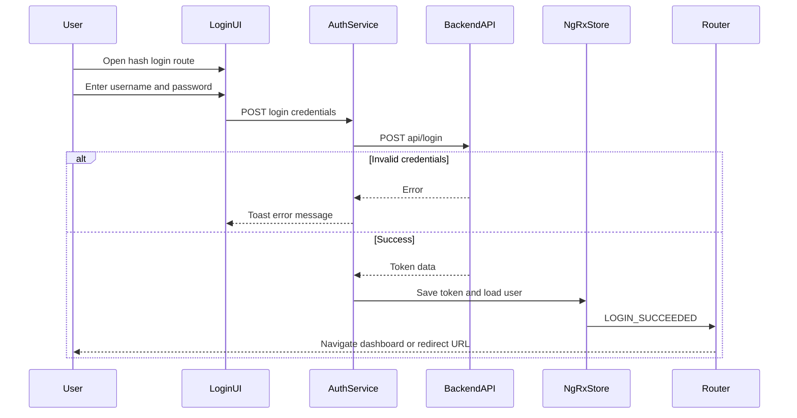
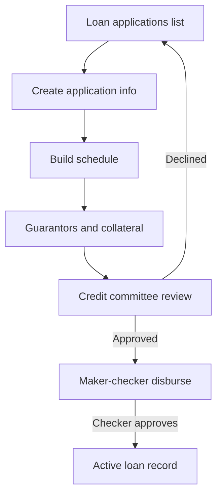

# OpenCBS User Journeys

## 0. Plain Language Overview

This document explains what people can do in the OpenCBS web application—from signing in to managing customers, loans, savings, cash at the teller window, and back-office settings. **Technical readers** (developers, QA engineers) can use it to trace routes, guards, and API touchpoints; **non-technical readers** (product owners, business analysts, UX designers) can use it to understand real user goals and screen flows without reading code. After reading, you will know which journeys exist in this codebase, the step-by-step path for each, who typically performs them, and what happens when something goes wrong.

**Evidence sources:** Angular routing modules under `client/src/app/containers/`, main navigation in `client/src/environments/environment.ts`, UI labels in `client/src/assets/i18n/en.json`, Protractor e2e specs in `client/e2e/`, and component navigation logic.

**Legacy / mainframe code:** Not found in codebase. The active stack is an **Angular 8** single-page client (`client/`) and a **Java/Spring** backend (`server/`). No COBOL, RPG, JCL, PHP, or similar legacy application files were detected in this repository.

---

## 1. Overview of Workflows

A **workflow** is an end-to-end task a user completes in the app (for example, “sign in” or “create a loan application”). A **pre-condition** (spelled out in each journey) is something that must already be true before the user can start—such as having a valid account or permission group.

| Workflow | Primary actor(s) | Description | Criticality |
|----------|------------------|-------------|-------------|
| Sign in / sign out | All users | Authenticate with username and password; land on dashboard or a saved redirect URL | Critical |
| Password recovery & forced password change | User with expired/disabled password policy | Recover password or change password when server returns a user ID error code | High |
| Dashboard landing | All authenticated users | Default home after login (`#/dashboard`) or empty root redirect | Medium |
| Browse & search profiles | Profile staff, loan officers | List customers (person/company/group), search, open profile detail | Critical |
| Create / edit profile | Maker (profile permissions) | Create person, company, or group; edit info; maker-checker approval path | Critical |
| Profile hub (accounts, products per customer) | Profile / lending staff | From one profile: current accounts, loan apps, loans, savings, term deposits, bonds, borrowings, credit lines, attachments, events | Critical |
| Loan applications lifecycle | Loan officer, credit committee | Create, edit, schedule, guarantors, collateral, credit committee, disburse (maker-checker) | Critical |
| Active loans management | Loan officer, checker | View loan, schedule, repay, reschedule, guarantors, collateral, special operations | Critical |
| Borrowings | Treasury / liability staff | Create and manage borrowing contracts with schedule and repayment | High |
| Savings accounts | Deposit staff | Create, view, operate savings accounts | High |
| Term deposits | Deposit staff | Create, view, entries, operations, print-out | High |
| Bonds | Investment / liability staff | Create, schedule, repayment, operations | Medium |
| Teller / till operations | Cashier, teller | Open till, deposits, withdrawals, loan repay at counter, transfers to/from vault | Critical |
| Fund transfers (vault / members) | Finance / operations | Bank↔vault and member-to-member transfers | High |
| Accounting | Finance / accountant | General ledger entries, chart of accounts, account maker-checker | High |
| Maker-checker inbox | Checker, approver | Review pending creates/edits/disbursements/repayments across entity types | Critical |
| Reports | Analyst, management | Report list and report viewer | Medium |
| Configuration (admin) | System administrator | Branches, products, roles, users, tills, vaults, fees, templates, etc. | High |
| Settings (operations) | Operations admin | Operation day, exchange rates, audit trail, bank integration, payment gateway | High |
| Event manager (tasks) | Operations (permission `TASKS_MANAGEMENT`) | Scheduled/event tasks from header | Medium |
| Error pages | Any user | 404 and server-error routes | Low |

Permissions: Most feature routes use `RouteGuard` with `groupName` (e.g. `PROFILES`, `LOANS`) or role lists (e.g. `CREATE_PROFILE`). Users without permission are redirected to `#/dashboard` (see `route-guard.service.ts`). Admins bypass permission checks.

---

## 2. Detailed Journeys

### Journey 1: Sign in and sign out

**Goal:** Access the application securely and end the session.

**Actor:** Any user with credentials (e2e uses `admin` / `admin`; invalid password shows error).

**Pre-conditions:** User is not already authenticated (`NoAuthGuard` on `#/login` redirects authenticated users to `#/profiles`).

**Audience:** Developers/QA (auth API, guards, token storage); product/BA (login UX, error messaging).

**Steps:**

1. User opens the app; hash routing is enabled (`useHash: true` in `app-routing.module.ts`). Root `''` redirects to `#/dashboard`; unauthenticated users hitting protected routes are sent to `#/login` by `AuthGuard`.
2. User navigates to `#/login` and sees `cbs-auth` with username (`#username-id`) and password (`#password-id`) fields and submit button (disabled until form is valid—verified in `auth.e2e-spec.ts`).
3. User enters credentials and submits `form.cbs-auth-form`.
4. Client calls `POST {API_ENDPOINT}login` (`auth.service.ts`), then dispatches login actions; on success token is stored in `localStorage` and current user is loaded.
5. On `LOGIN_SUCCEEDED`, user is redirected to saved `redirectUrl` or, if URL still matches login, to `#/dashboard` (`auth.effect.ts`). E2e successful login expects `#/profiles` (differs from effect default—both routes exist; e2e assertion is `#/profiles`).
6. User works in the app; header provides sign-out via `PurgeAuth` and `navigate(['/login'])`.

**Error paths / edge cases:**

- Invalid credentials: toast error (`invalid_credentials` / 401 message).
- Wrong password with username `John` / `eliza55`: `.cbs-auth__error-message` appears (e2e).
- Server returns `errorCode` that is not `invalid_credentials`, `internal_error`, or `Not Found`, and message is not `User is disabled.`: forced **change password** modal opens (`auth.component.ts`).
- Disabled user message: handled as standard error (no modal).
- User without permission for a route: redirected to dashboard, not login.



**Diagram Description:** The sequence shows a user opening the login screen and submitting credentials. The login UI calls the auth service, which posts to the backend login API. If credentials are invalid, an error is shown on the login form. If login succeeds, the token is saved in application state and the router sends the user to the dashboard or a previously requested URL.

**End state:** Authenticated session with token in `localStorage`; main navigation visible per permissions.

---

### Journey 2: Password recovery and forced password change

**Goal:** Reset a forgotten password or set a new password when the server requires it.

**Actor:** User who forgot password or user flagged by login error code.

**Pre-conditions:** On login screen (`#/login`).

**Audience:** QA (modal flows); BA (password policy UX).

**Steps:**

1. **Recovery:** User clicks “Forgot Your Password?” (`FORGET` i18n key) → recover modal with username/email → `userUpdateService.recover()` on submit.
2. **Forced change:** On login error with numeric `errorCode`, change-password modal opens; user enters password and confirm password → `updateLoginPassword()` with `userId`.

**Error paths:** `passwordNotMatch` disables submit; HTTP 500 on update leaves modal open.

**End state:** Recovery request submitted (loading indicator); or password updated and modal closed.

---

### Journey 3: Dashboard and application entry

**Goal:** Land on the home dashboard after authentication or when visiting the app root.

**Actor:** Any authenticated user.

**Pre-conditions:** Valid session (or user is redirected to login).

**Steps:**

1. `app-routing.module.ts` redirects `''` → `dashboard`.
2. User may click logo in header → `#/dashboard` (`header.component.html`).
3. `DashboardComponent` renders at `#/dashboard` (no extra permission guard on dashboard route).

**End state:** User on dashboard screen.

---

### Journey 4: Browse and open customer profiles

**Goal:** Find a customer (person, company, or group) and open their record.

**Actor:** User with `PROFILES` permission group.

**Pre-conditions:** Authenticated; `RouteGuard` allows `groupName: 'PROFILES'`.

**Steps:**

1. Main nav → **Profiles** → `#/profiles` (`environment.NAVS.MAIN_NAV`, `ProfileListComponent`).
2. Optional: enter search query → updates query params → reloads profile list (`LoadProfiles`).
3. User selects a row → navigates to `#/profiles/{type}/{id}/info` where `type` is `people`, `companies`, or `groups` based on profile type (`profile-list.component.ts`).
4. Default child route redirects to `info` tab (`ProfileInfoComponent`).

**Error paths:** No data shows `NO_DATA` label; permission denied → dashboard.

**End state:** Profile detail on Information tab with sidebar navigation to other profile sections.

---

### Journey 5: Create a new profile (person, company, or group)

**Goal:** Register a new customer profile.

**Actor:** User with roles `MAKER_FOR_PROFILE` and/or `CREATE_PROFILE` on route `profiles/:type/create`.

**Pre-conditions:** Profile type in URL (`people`, `companies`, `groups` pattern from create flow).

**Steps:**

1. From profile list, user initiates create (UI opens create flow → `#/profiles/:type/create`).
2. `NewProfileComponent` loads custom field sections and builds dynamic form.
3. User completes required fields and submits → store dispatches create action → on success navigates to new profile or list (component dispatch pattern in `profile-create.component.ts`).

**Maker-checker path:** Pending profile changes appear in `#/requests`; types `PEOPLE_CREATE`, `COMPANY_CREATE`, `GROUP_CREATE` (and `*_EDIT`) route to `#/profile-maker-checker/:id` for approval (`maker-checker-list.component.ts`).

**End state:** Live profile or pending maker-checker request.

---

### Journey 6: Profile hub — manage customer financial relationships

**Goal:** View and manage all products and data tied to one customer from a single profile.

**Actor:** Profile, lending, and deposit staff.

**Pre-conditions:** Profile exists; user has `PROFILES` access.

**Child routes** (from `profile-routing.module.ts`):

| Tab / section | Route segment | Purpose |
|---------------|---------------|---------|
| Information | `info`, `info/edit` | View/edit core profile |
| Current accounts | `current-accounts`, `.../transactions` | Accounts and transaction history |
| Attachments | `attachments` | Upload/view files |
| Print-out | `print-out` | Printable profile summary |
| Credit lines | `credit-line-list`, `credit-line/:id`, `credit-line-create` | Credit line products |
| Loan applications | `loan-applications` | Apps for this customer |
| Loans | `loans` | Active loans for customer |
| Borrowings | `borrowings` | Borrowings linked to profile |
| Savings | `savings` | Savings accounts |
| Term deposits | `term-deposits` | Term deposits |
| Bonds | `bonds` | Bonds |
| Events | `events` | Customer event history |
| Members | `members` | Group membership (groups) |

**Steps (example — open loan applications for customer):**

1. User is on `#/profiles/{type}/{id}/info`.
2. Sidebar → Loan applications → `#/profiles/{type}/{id}/loan-applications`.
3. User can launch create application flows from profile context (links into global loan-application routes).

**Edge case:** Leaving `info/edit` with unsaved changes triggers `OnEditCanDeactivateGuard` (unsaved warning in i18n: `UNSAVED_WARNING`).

**End state:** User completes work in the selected profile subsection.

---

### Journey 7: Loan applications — create and process

**Goal:** Originate a loan application from draft through schedule, collateral, committee, and disbursement approval.

**Actor:** Loan officer (`LOAN_APPLICATIONS` group); credit committee on `credit-committee` tab; checker on disbursement maker-checker.

**Pre-conditions:** Loan products and related configuration exist; user permissions for loan applications.

**Steps:**

1. Main nav → **Assets** → **Loan applications** → `#/loan-applications` (list).
2. **Create:** Navigate to `#/loan-applications/create` → default child `info` (`LoanAppNewComponent`) → optional `#/loan-applications/create/schedule` for schedule step.
3. **View/edit existing:** `#/loan-applications/:id` with tabs: `info`, `schedule`, `custom-fields`, `attachments`, `guarantors` (`new`, `:id`, `:id/edit`), `collateral` (same pattern), `print-out`, `print-out-preview`, `credit-committee`, `comments`.
4. **Edit mode:** `#/loan-applications/:id/edit` with `info` and `schedule` (role `UPDATE_LOANS_APPLICATIONS`).
5. **Credit committee:** User works on `#/loan-applications/:id/credit-committee` — approve/decline/review (i18n: `APPROVE`, `DECLINE`, `CREDIT_COMMITTEE`).
6. **Disbursement approval:** Pending `LOAN_DISBURSEMENT` in maker-checker → `#/loan-app-maker-checker/:id/maker-checker` (`LoanAppMakerCheckerDisburseComponent`).
7. After disbursement, user may navigate to live loan: `#/loans/{id}/{loanType}/info` (`loan-application-info.component.ts`).

**Error paths:** Create/update errors show `CREATE_ERROR` / `UPDATE_ERROR` toasts; unsaved schedule navigation guarded by `OnEditCanDeactivateGuard`.



**Diagram Description:** This flowchart starts at the loan applications list. The user creates application info, then a repayment schedule, then adds guarantors and collateral. The credit committee reviews the application. If approved, disbursement goes through maker-checker; when the checker approves, the flow ends on an active loan record. If declined, the user returns toward the list level.

**End state:** Application approved and disbursed (loan exists) or declined/rejected.

---

### Journey 8: Active loans — servicing and repayment

**Goal:** Manage an issued loan: view dashboard, schedule, repay, reschedule, fees, guarantors, collateral.

**Actor:** Loan officer (`LOANS` group); checker for rollback/repayment maker-checker.

**Pre-conditions:** Loan exists.

**Steps:**

1. Main nav → **Assets** → **Loans** → `#/loans`.
2. Open loan → `#/loans/:id/:loanType` (loan type segment required in route).
3. Sub-routes include: `loan-dashboard`, `info`, `schedule` (+ `reschedule` with role `LOAN_RESCHEDULE`), `entry-fees-list`, `payees`, `attachments`, `custom-fields`, guarantors, collateral, `print-out`, `events`, `comments`, `operations` (with `other-fees`, `top-up`, `provisioning`).
4. **Repayment:** Under schedule child routes: `schedule/repayment` or `schedule/group-repayment`.
5. **Maker-checker:** `LOAN_ROLLBACK` → `#/loans-maker-checker/:id/maker-checker-rollback`; `LOAN_REPAYMENT` → `.../maker-checker-repayment`.

**End state:** Repayment recorded, schedule updated, or change pending checker approval.

---

### Journey 9: Liabilities — borrowings, savings, term deposits, bonds

**Goal:** Manage non-loan liability and deposit products at institution level (lists are also reachable from profile hub).

**Actor:** Staff with respective module permissions (routes use `AuthGuard` + `RouteGuard` per module).

**Borrowings** (`borrowing-routing.module.ts`):

1. `#/borrowings` → list.
2. `#/borrowings/create` → `info`, `schedule`.
3. `#/borrowings/:id` → `info`, `schedule` (+ `repayment`), `events`, `operations`.
4. `#/borrowings/:id/edit` → edit info/schedule.

**Savings** (`savings-routing.module.ts`): `#/savings`, `#/savings/create`, `#/savings/:id` (info, entries, operations, print-out), edit paths.

**Term deposits** (`term-deposit-routing.module.ts`): `#/term-deposits`, create, detail tabs (`info`, `entries`, `term-deposit-accounts`, `operations`, `print-out`).

**Bonds** (`bonds-routing.module.ts`): `#/bonds`, create with `info`/`schedule`, detail with repayment and operations.

**End state:** Contract created, updated, or operation posted per product rules.

---

### Journey 10: Teller management (till / cashier)

**Goal:** Operate a cash till: open/close, deposits, withdrawals, loan repayments at counter, vault transfers.

**Actor:** Cashier / teller (`TELLER_MANAGEMENT` permission group).

**Pre-conditions:** Till configured under `#/configuration/tills`; till opened for session.

**Steps:**

1. Main nav → **Teller management** → `#/till` (all tills).
2. Select till → `#/till/:id` with operation list and special operations.
3. **New operation:** `#/till/:id/operations/:type` — `OperationsNewComponent` uses `type` route param for operation kind (deposit/withdraw/etc.); posts via `OperationCreateService` and API endpoints such as `profiles/with-accounts`, `tills/savings-with-account`.
4. **Loan repay at till:** `#/till/:id/loans` → `#/till/:id/loans/:loanId/repay` (or `repay-for-kazmicro` variant).
5. **Transfer:** `#/till/:id/transfer/:type` (`TransferComponent`).
6. **View/edit operation:** `#/till/:tillId/operations/info/:id` and `.../edit`.

**End state:** Till operation recorded; balances updated; receipt/print may be triggered (`PrintOutService`).

---

### Journey 11: Transfers (bank, vault, members)

**Goal:** Move funds between bank, vault, and member accounts outside teller counter flow.

**Actor:** User with `TRANSFERS` group.

**Steps:**

1. Main nav → **Transfers** → `#/transfers` hub lists three cards (`transfers.component.ts`).
2. **Bank to vault:** `#/transfers/from-bank-to-vault` → submit → navigate back to `#/transfers` on success.
3. **Vault to bank:** `#/transfers/from-vault-to-bank`.
4. **Between members:** `#/transfers/between-members`.

**End state:** `TRANSFER_SUCCESS` toast (i18n); user on transfers hub.

---

### Journey 12: Accounting

**Goal:** Post and review general ledger activity and maintain chart of accounts.

**Actor:** Finance user (`GENERAL_LEDGER`, `CHART_OF_ACCOUNTS` groups).

**Steps:**

1. Main nav → **Accounting** dropdown.
2. **General ledger:** `#/accounting/accounting-entries`.
3. **Chart of accounts:** `#/accounting/chart-of-accounts`.
4. **Pending account changes:** `#/accounting/maker-checker/:id` for `ACCOUNT_CREATE` / `ACCOUNT_EDIT` requests from maker-checker inbox.

**End state:** Entries viewed or posted; account changes approved via maker-checker when applicable.

---

### Journey 13: Maker-checker inbox

**Goal:** Review and approve or decline pending changes created by makers.

**Actor:** Checker with `MAKER_CHECKER` group (and specific entity permissions).

**Steps:**

1. Main nav → **Maker/Checker** → `#/requests` (`MakerCheckerListComponent`).
2. Optional search/pagination via query params.
3. User opens a request → `goToMakerChecker()` routes by `makerChecker.data.type` to the correct detail screen (roles, users, loan products, saving/term products, accounting, loan disbursement, loan rollback/repayment, profile create/edit).
4. On detail screen, user **Approves** or **Declines** (i18n confirm dialogs: `APPROVE_CONFIRM_TEXT`, `DECLINE_CONFIRM_TEXT`).

**End state:** Request approved (`APPROVE_SUCCESS`) or declined (`DECLINE_SUCCESS`); originating entity becomes live or stays rejected.

---

### Journey 14: Reports

**Goal:** Run institutional reports.

**Actor:** User with `REPORTS` group.

**Steps:**

1. Main nav → **Reports** → `#/report-list`.
2. Select report → `#/report` (`ReportComponent`).

**End state:** Report displayed (parameters depend on report implementation in component—not fully enumerated in routing alone).

---

### Journey 15: Configuration (system setup)

**Goal:** Maintain reference data and products required for daily banking operations.

**Actor:** Administrator (`CONFIGURATIONS` permission via header button and `RouteGuard`).

**Steps:**

1. Header → Configuration → `#/configuration` grid (`ConfigurationComponent` lists all modules).
2. User picks a tile, for example:
   - Branches: `#/configuration/branches`, create, `info/:id`, edit
   - Loan products: `#/configuration/loan-products`, `#/loan-products/:id` (+ maker-checker, history)
   - Users: `#/configuration/users`, `#/users/:id/info`
   - Roles: `#/configuration/roles`, `#/roles/:id/info`
   - Tills, vaults, saving products, term deposit products, transaction templates, payment methods, penalties, holidays, payees, credit committee rules, custom fields, etc. (full list in `configuration.component.ts` `list` array)

**End state:** Configuration entity saved; many creates route through maker-checker types listed in Journey 13.

---

### Journey 16: Settings (operations)

**Goal:** Operate institution-wide settings: business day, FX, audit, integrations.

**Actor:** User with `SETTINGS` / `SETTING` permission (header settings button).

**Steps:**

1. Header → Settings → `#/settings`.
2. Choose tile (`settings.component.ts`):
   - **Operation day:** `#/settings/operation-day`
   - **Exchange rate:** `#/settings/exchange-rate`
   - **Audit trail:** `#/settings/audit-trails` plus `#/audit-trail/business-objects`, `events`, `transactions`, `user-sessions`
   - **Integration with bank:** `#/settings/integration-with-bank` and export/import file sub-routes
   - **Payment gateway:** `#/settings/payment-gateway`

**End state:** Setting updated for the institution (exact fields in respective setting components).

---

### Journey 17: Event manager (tasks)

**Goal:** Manage scheduled tasks/events.

**Actor:** User with `TASKS_MANAGEMENT` permission.

**Steps:**

1. Header → Event manager button → `#/event-manager` (`EventManagerComponent`, `RouteGuard` `TASKS_MANAGEMENT`).
2. User manages events via UI/modal (`ManageEventModalComponent`).

**End state:** Task/event created or updated per event manager UI.

---

### Journey 18: User profile and sign-out from header

**Goal:** View own user record or change session language.

**Actor:** Logged-in user.

**Steps:**

1. Header user menu → navigate to `#/users/{userId}/info` with `type=live` query (`goToUserDetails()`).
2. Language dropdown: `en`, `ru`, `fr`, `ar` (app also registers `en`, `ru`, `fr` in `AppComponent`).
3. Sign out → purge auth → `#/login`.

**End state:** User on own info page or logged out.

---

### Journey 19: Error and not-found handling

**Goal:** Recover from invalid URLs or server failures.

**Actor:** Any user.

**Steps:**

1. Unknown path → wildcard redirects to `#/404` (`error-routing.module.ts`).
2. Server error page at `#/server-error`.

**End state:** User sees error page; can navigate via header if authenticated.

---

## 3. E2E test coverage (evidence)

| Spec file | Workflows evidenced |
|-----------|---------------------|
| `client/e2e/auth.e2e-spec.ts` | Login form presence, disabled/enabled submit, invalid password error, successful login redirect to `#/profiles` |
| `client/e2e/app.e2e-spec.ts` | Scaffold only (`NewClientPage`); **no additional user journeys tested** |

**Not found in codebase:** Automated e2e walkthroughs for profiles, loans, teller, transfers, or configuration. Those journeys are evidenced only by routing and component code.

---

## 4. Technical reference (anti-hallucination)

| Item | Value in codebase |
|------|-------------------|
| Client framework | Angular `^8.1.4` (`client/package.json`) |
| Routing mode | Hash URLs (`#/...`) |
| Default API base (dev) | `http://localhost:8080/api/` (`environment.ts`) |
| Login endpoint | `POST api/login` |
| Main navigation definition | `environment.NAVS.MAIN_NAV` |
| Auth e2e credentials | `admin` / `admin` (success); `John` / `eliza55` (failure) |

Backend route details: Java controllers under `server/` exist but were not exhaustively mapped for this document; frontend journeys above are grounded in Angular routes and components.

---

## FILE REPORT

```
-rw-r--r-- 1 root root 25K May 20 14:55 /home/vishal/repos/session_954f8999a61f/OpenCBS/USER_JOURNEYS.md
```

(File verified after creation with `ls -lh USER_JOURNEYS.md` in the repository root.)
