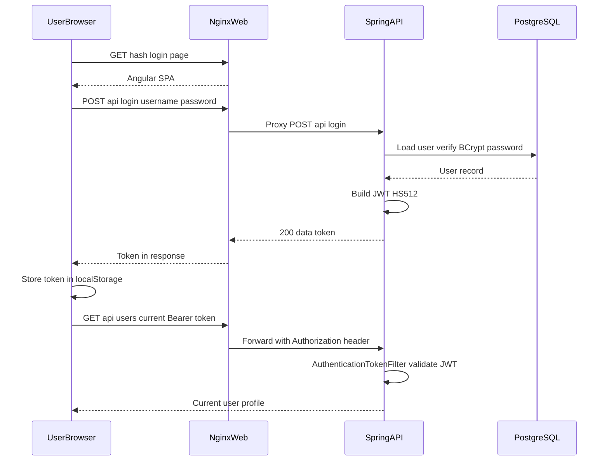
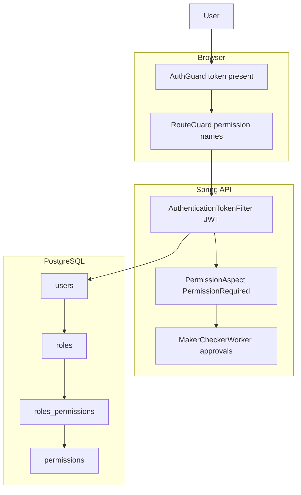

# OpenCBS Security Architecture

## 0. Plain Language Overview

This document explains how OpenCBS controls who can sign in and what they can do inside the core banking application. It is written for security engineers and architects who need technical detail, and for product owners and compliance reviewers who need a clear picture of access control without reading code. After reading it, you will understand how users log in, how the system checks permissions, how services are exposed on the network, how secrets are handled today, and what audit evidence the application produces.

**Legacy stack note:** The codebase uses Java 8, Spring Boot 1.5.4, and an Angular client (Node 14 build). No mainframe or COBOL/PL/I/RPG/JCL legacy code was found in the OpenCBS repository. These older framework versions require extra attention for security patching and hardening.

---

## 1. Authentication Flows

**Audiences:** Security engineers (implementation detail), product owners (login and session behavior), compliance reviewers (session and password policy evidence).

### 1.1 Application entry points

| Layer | Entry point | Source |
|-------|-------------|--------|
| Runtime server | `com.opencbs.cloud.ServerApplication` (`SpringApplication.run`) | `server/opencbs-server/src/main/java/com/opencbs/cloud/ServerApplication.java` |
| Docker web UI | Port `80` on service `web` | `OpenCBS/docker-compose.yml` |
| Docker API | Port `8080` exposed internally on service `api` (not published to host) | `OpenCBS/docker-compose.yml`, `server/opencbs-server/Dockerfile` |
| Angular dev API base | `http://localhost:8080/api/` | `client/src/environments/environment.ts` |
| Angular prod API base | `/api/` (proxied by Nginx) | `client/src/environments/environment.prod.ts`, `client/default.conf` |

On startup, the Angular root component dispatches `CheckAuth`, which reads `localStorage.token` and either restores the session or clears auth state (`client/src/app/app.component.ts`, `client/src/app/core/store/auth/auth.effect.ts`).

### 1.2 Login flow (username and password → JWT)

Authentication is **local username/password** backed by the PostgreSQL `users` table. There is **no** OAuth2, OpenID Connect (OIDC), SAML, LDAP, or external identity provider integration in the codebase (grep found no matches).

**Backend steps:**

1. Client `POST /api/login` with JSON `{ "username", "password" }` (`LoginController`, `LoginRequest`).
2. `LoginServiceImpl.login()` loads the user, verifies password with **BCrypt** (`BCrypt.checkpw`), checks `StatusType.ACTIVE`, optional first-login flag, and password expiry date.
3. On success, `TokenHelper.tokenFor(user)` issues a **JWT** (JSON Web Token — a signed string the client sends on later requests) using `io.jsonwebtoken` (jjwt `0.9.1`), algorithm **HS512**, issuer `com.opencbs.core`, subject = username.
4. `TokenHelper.setEventInformation()` updates `last_entry_time` on the user record (used for idle session timeout).
5. Response shape: `{ "data": "<token string>" }` per API documentation (`api-guide-authentication.adoc`).

**Frontend steps:**

1. User opens hash route `#/login` (`client/e2e/auth.e2e-spec.ts`).
2. `AuthService.login()` posts to `${environment.API_ENDPOINT}login`.
3. On success, NgRx `AuthEffects` saves the token to `localStorage` and loads the current user; successful e2e test expects redirect to `#/profiles`.
4. `HttpHeaderInterceptorService` attaches `Authorization: Bearer <token>` on subsequent HTTP calls via `HttpClientHeadersService`.

**Session / token lifetime:**

- JWT itself has **no expiration claim** in code; a TODO states tokens should get a lifetime later (`TokenHelper.tokenFor`).
- **Idle session** is enforced separately: `EXPIRATION_SESSION_TIME_IN_MINUTES` system setting compared to `user.last_entry_time` in `TokenHelper.verifyToken`. Value `0` means session never expires by idle timeout.
- Spring Security uses **stateless** sessions (`SessionCreationPolicy.STATELESS`).

**Diagram Description:** This sequence shows login and the first authenticated call. The user loads the login page from the Nginx-hosted Angular app, submits credentials to `/api/login`, and Nginx forwards the request to the Spring API. The API checks the password against PostgreSQL, mints a JWT, and returns it. The browser stores the token locally, then calls `/api/users/current` with a Bearer header. The API filter validates the JWT and returns the signed-in user’s details.

### 1.3 Token validation on each API request

`AuthenticationTokenFilter` (extends Spring’s `UsernamePasswordAuthenticationFilter`):

- Reads `Authorization` header; if missing, passes the request through (authorization rules still apply).
- Strips `Bearer ` prefix, parses username from JWT, loads active user, calls `tokenHelper.verifyToken()`.
- Sets `SecurityContext` with the `User` principal and `ROLE_USER` authority.

Unauthenticated access to protected routes yields HTTP **401** with body message `Access Denied` (`EntryPointUnauthorizedHandler`).

### 1.4 Password lifecycle

| Flow | Endpoint | Auth required | Notes |
|------|----------|---------------|-------|
| Login | `POST /api/login` | No (`permitAll`) | |
| Change password (e.g. first login) | `PUT /api/login/update-password` | **No** (`permitAll`) | Accepts `userId` in body |
| Password reset request | `POST /api/login/password-reset?username=` | No | Sends email with **plaintext** new password |
| Logout | `POST /api/logout/{userId}` | Yes (not in permitAll list) | `LoginServiceImpl.logout()` is **empty** — no server-side token revocation |

Password rules (length, complexity) are validated via `UserDtoValidator` against system settings `PASSWORD_LENGTH`, `UPPER_CASE`, `NUMBERS` (`SystemSettingsName`).

### 1.5 Real-time messaging authentication (RabbitMQ / STOMP)

After login, `MessageService.init()` loads RabbitMQ connection settings from **`GET /api/configurations/rabbit-credential`** (requires authenticated API user) and connects via Web STOMP using returned `username`, `password`, `virtualHost`, and host. WebSocket URL is `ws://<host>:15674/ws` or `wss://` when the page is HTTPS (`message.service.ts`).

This is **separate** from API JWT auth: message broker credentials are loaded from server configuration and passed to the browser.

### 1.6 Public (unauthenticated) API paths

Configured in `WebSecurityConfiguration` (CSRF protection is **disabled**):

- `POST /api/login`, `/api/login/update-password`, `/api/login/password-reset`
- `GET /api/info`, `/api/system-settings`
- `GET` and `POST /api/utils/**`
- `GET` attachment URLs for profiles, loan applications, and loans (by ID path)
- `OPTIONS /**`
- Static assets, Swagger-related paths under `web.ignoring()`

Swagger/API docs paths are ignored by Spring Security filters (`/v2/api-docs/**`, etc.).

---

## 2. Authorization Model

**Audiences:** Security architects (permission model), developers (enforcement points), product owners (maker-checker and roles), compliance reviewers (segregation of duties).

### 2.1 Model overview

OpenCBS uses **role-based access control (RBAC)**:

- Each `User` has one `Role`.
- Each `Role` has many `Permission` records (many-to-many `roles_permissions`).
- Permissions are named strings (e.g. `MAKER_FOR_USER`, `AUDIT_TRAIL_EVENTS`) grouped by `ModuleType`.
- Spring Security grants every authenticated user a single authority: **`ROLE_USER`**. Fine-grained control is **not** via Spring Security roles on endpoints; it uses a custom **`@PermissionRequired`** annotation and AOP.

**Diagram Description:** The diagram shows two enforcement layers. In the browser, `AuthGuard` checks only that a token exists; `RouteGuard` checks permission names from the loaded user profile for UI routes. On the server, the JWT filter establishes identity, then `PermissionAspect` checks method-level permissions before business logic runs. User records link to roles and permissions in PostgreSQL. Maker-checker logic adds a second approval step for sensitive changes.

### 2.2 Backend permission enforcement

- **`@PermissionRequired`** on controller methods declares required permission name and module (`PermissionRequired.java`).
- **`PermissionAspect`** runs `@Before` annotated methods: loads current user via `UserHelper.getCurrentUser()`, checks `user.hasPermission(name)`.
- **Bypasses:** User id **`2`** and users with `isSystemUser == true` skip all permission checks.
- **Permission catalog:** `PermissionInitializer` scans the codebase at startup for `@PermissionRequired` methods and syncs the `permissions` table; admin role receives all permissions.

Controllers across loans, savings, term deposits, bonds, borrowings, and core modules use `@PermissionRequired` (dozens of methods).

### 2.3 Maker-checker (four-eyes principle)

Sensitive changes (e.g. user create/edit) go through `MakerCheckerWorker`:

- Maker creates a `Request` with pending content.
- If the current user’s role includes the checker permission for that request type, approval may be automatic; otherwise a separate checker must approve.
- Tied to `ModuleType.MAKER_CHECKER` permissions such as `MAKER_FOR_USER`.

This supports **segregation of duties** for configuration and master-data changes.

### 2.4 Frontend authorization

| Guard | Purpose |
|-------|---------|
| `AuthGuard` | Requires `AuthService.isAuthenticated` (token present in store/localStorage) |
| `NoAuthGuard` | Login routes |
| `RouteGuard` | Checks permission groups from `CurrentUserService.currentUserPermissions$`; admins (`isAdmin`) pass all checks |

**Important:** UI hiding is not a security boundary; server-side `PermissionAspect` is authoritative for API calls.

### 2.5 Branch and user status

- Users have `branch_id` and `status` (`StatusType`); inactive users cannot authenticate.
- Credit committee and teller flows reference role names/constants (e.g. `TELLER`, `HEAD_TELLER` on `User`) — business rules beyond generic permissions.

---

## 3. Identity Providers

**Audiences:** Security architects, IT operations, product owners evaluating SSO.

| Capability | Status in codebase |
|------------|-------------------|
| Local database users | **Implemented** — `users` table, BCrypt passwords |
| JWT issuance | **Implemented** — `TokenHelper`, jjwt |
| OAuth2 / OIDC | **Not found in codebase** |
| SAML / LDAP / Active Directory | **Not found in codebase** |
| External IdP (Keycloak, Okta, etc.) | **Not found in codebase** |

Identity is **fully application-managed**. Integrating enterprise SSO would require new development; nothing in the repository configures an external provider.

---

## 4. Network Security

**Audiences:** Security engineers and network architects (exposure and TLS), operations (Docker Compose), compliance reviewers (segmentation evidence).

### 4.1 Docker Compose topology (`OpenCBS/docker-compose.yml`)

| Service | Image | Host exposure | Internal exposure |
|---------|-------|---------------|-------------------|
| `db` | `postgres:14-alpine` | None (no `ports`) | PostgreSQL default |
| `rabbitmq` | `rabbitmq:3-management-alpine` | **`15672:15672`** (management UI) | AMQP internal |
| `api` | Built Spring Boot JAR | None | **`8080`** (`expose` only) |
| `web` | Nginx + Angular | **`80:80`** | Proxies `/api` → `api:8080` |

Comment in compose file documents RabbitMQ management UI at `http://localhost:15672` with default **`guest` / `guest`**.

Database environment variables in Compose: `POSTGRES_DB=opencbs`, `POSTGRES_USER=postgres`, `POSTGRES_PASSWORD=postgres` (development-style credentials).

### 4.2 Reverse proxy (`client/default.conf`)

- Listens on port **80** only (no TLS/SSL directives in file).
- Serves static Angular build from `/usr/share/nginx/html`.
- `location /api` → `proxy_pass http://api_upstream` (container `api:8080`).

Production Angular build uses relative `/api/` so the browser talks to the same origin on port 80; JWT and cookies (if any) are same-origin to Nginx.

### 4.3 CORS

`WebMvcConfig` allows all HTTP methods on `/api/**` via `allowedMethods("*")`. Specific origins are not restricted in code — **to be configured** for production hardening.

### 4.4 TLS / HTTPS

- **Not found in codebase** for Nginx or Spring Boot (no `server.ssl.*`, no certificate configuration in repository).
- STOMP client chooses `wss://` only when `location.protocol === 'https:'` (`message.service.ts`).
- TLS termination would be **external** (load balancer / ingress) or **to be configured**.

### 4.5 Attachment endpoints without authentication

Several `GET` attachment URLs are `permitAll` in `WebSecurityConfiguration`. Anyone who can reach the API network path and guess or obtain IDs may fetch attachments without a token. Treat as a **known exposure** for security review.

---

## 5. Secrets Management

**Audiences:** Security engineers, DevOps, compliance (credential handling).

### 5.1 JWT signing key

`SecretKeyProvider.getKey()` returns hardcoded bytes for string **`"secret"`** with a TODO to use a real secret (`SecretKeyProvider.java`). This is the HS512 signing key for all JWTs.

**Operational requirement:** Replace with a strong key from environment or secrets manager; **not implemented in repository**.

### 5.2 Database and message broker credentials

- Docker Compose embeds Postgres password in plain environment variables.
- RabbitMQ credentials are bound via `spring.rabbitmq.*` (`RabbitProperties` — prefix `spring.rabbitmq`). The file `application-docker.properties` referenced in `server/opencbs-server/Dockerfile` is **not present** in the repository snapshot analyzed; runtime values are **to be configured** at deploy time.

### 5.3 API exposure of RabbitMQ credentials

Authenticated clients can call `GET /api/configurations/rabbit-credential`, which returns host, username, password, virtual host, and exchange names (`RabbitCredentials`, `ConfigController`). Any user with a valid JWT can retrieve broker credentials for STOMP — scope access by role is **not** applied on this endpoint in code.

### 5.4 Client-side token storage

JWT is stored in **`window.localStorage`** under key `token` (`jwt.service.ts`, `auth.effect.ts`). This is vulnerable to XSS (Cross-Site Scripting) if such flaws exist in the SPA. HttpOnly cookies are **not** used.

### 5.5 Password reset email

`LoginServiceImpl.passwordReset()` generates a random password and emails it in **plaintext** via template `password_reset.html`. Email transport configuration: **Not found in codebase** (depends on deployment `EmailService` config).

### 5.6 Redaction note

This document does not reproduce live secrets. Default Compose and code literals (`postgres`, `guest`, `"secret"`) are **development defaults** and must be rotated for production.

---

## 6. Compliance and Audit

**Audiences:** Compliance officers and auditors (evidence), security teams (gaps), product owners (maker-checker and trails).

### 6.1 Regulatory frameworks

Mappings to PCI-DSS, SOX, GDPR, or local banking regulations: **Not found in codebase**. The application provides technical audit building blocks; organizational compliance is **to be configured** and assessed separately.

### 6.2 Audit and history mechanisms (implemented)

| Mechanism | Purpose | Key components |
|-----------|---------|----------------|
| **Hibernate Envers** | Entity revision history | `@Audited` on entities (e.g. `User`, `Role`, profiles); `EnversRevisionRepositoryFactoryBean`; `AuditRevisionListener` stores username on revision |
| **JPA auditing** | `createdBy` / `modifiedBy` fields | `@EnableJpaAuditing`, `UserAuditorAwareImpl` |
| **User session log** | Login/logout attempts | `UserSession` entity, `UserSessionHandler` interceptor on `/api/login` and `/api/logout/*` (IP, username, status) |
| **Audit trail API** | Reporting | `AuditTrailController` under `/api/audit-trail/report/*` with permissions `AUDIT_TRAIL_*` |
| **Maker-checker requests** | Pending/approved changes | `Request` domain, `MakerCheckerWorker` |

Audit trail report types include business objects, events, transactions, and user sessions (`AuditReportType` usage in controller).

### 6.3 Gaps relevant to compliance reviews

| Topic | Finding |
|-------|---------|
| Logout / session revocation | Server `logout()` is no-op; JWT remains valid until replaced |
| Token expiration in JWT | Not implemented |
| Centralized audit log shipping | **Not found in codebase** (no SIEM integration) |
| Immutable audit storage | Database-backed; immutability guarantees **not found in codebase** |
| PCI / card data | Payment gateway modules exist; cardholder data handling standards **not documented in codebase** |

### 6.4 Security-relevant operational logging

`UserSessionHandler` uses SLF4J (`@Slf4j`) but primary login audit is **database** (`user_sessions`), not structured security event export.

---

## Appendix A: Technology versions (from build files)

| Component | Version / note | Source |
|-----------|----------------|--------|
| Spring Boot | 1.5.4.RELEASE | `server/opencbs-core/pom.xml` |
| Java | 1.8 | `opencbs-core/pom.xml`, JRE `eclipse-temurin:8` in Dockerfile |
| jjwt | 0.9.1 | `opencbs-core/pom.xml` |
| PostgreSQL (Compose) | 14-alpine | `docker-compose.yml` |
| RabbitMQ (Compose) | 3-management-alpine | `docker-compose.yml` |
| Nginx (client image) | 1.21-alpine | `client/Dockerfile` |
| Node (client build) | 14-alpine | `client/Dockerfile` |

---

## Appendix B: Key API endpoints (authentication and configuration)

| Method | Path | Authentication |
|--------|------|----------------|
| POST | `/api/login` | Public |
| PUT | `/api/login/update-password` | Public |
| POST | `/api/login/password-reset` | Public |
| POST | `/api/logout/{userId}` | Authenticated |
| GET | `/api/users/current` | Authenticated |
| GET | `/api/configurations/rabbit-credential` | Authenticated |
| GET | `/api/audit-trail/report/*` | Authenticated + `@PermissionRequired` |

---

## Appendix C: Security hardening checklist (derived from code review)

Items below are observations from source, not an organizational policy:

1. Replace hardcoded JWT secret and enforce JWT `exp` claim aligned with session settings.
2. Require authentication for `update-password` and protect password reset from abuse.
3. Remove or restrict `permitAll` attachment and `/api/utils/**` routes.
4. Enable HTTPS/TLS at Nginx or ingress; disable plain HTTP in production.
5. Do not expose RabbitMQ management port `15672` on untrusted networks; change default `guest` credentials.
6. Stop returning RabbitMQ passwords to all authenticated users; use server-side STOMP proxy or scoped credentials.
7. Implement server-side logout (token denylist or short-lived tokens + refresh).
8. Move tokens from `localStorage` to HttpOnly secure cookies if XSS risk is a concern.
9. Re-enable CSRF or use token-only APIs with strict CORS origins.
10. Upgrade Spring Boot 1.5 / Java 8 stack or apply compensating controls (WAF, network segmentation).

---

*Document generated from OpenCBS source under `/home/vishal/repos/session_954f8999a61f/OpenCBS`. Values marked "Not found in codebase" or "to be configured" were not verified in repository files.*
