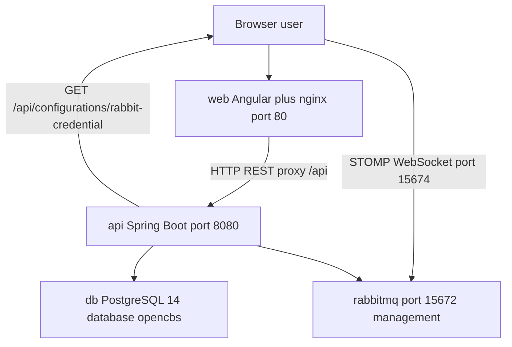

# OpenCBS Cloud — Service Catalog

## 0. Plain Language Overview

This catalog maps everything that runs when you deploy **OpenCBS Cloud**—the web banking application, its API (application programming interface), database, and message broker—and how those pieces connect. **Developers and architects** can use it to see ports, technologies, and where to read more; **product owners and onboarding leads** can see which parts are user-facing versus behind the scenes. After reading, you will know there is one main repository, four Docker Compose services, and several backend code modules that ship inside a single API process (not separate microservices).

**Legacy / mainframe note:** No COBOL, RPG, JCL, VB6, or similar legacy extensions were found in this repository. The stack does use older but active versions (**Java 8**, **Spring Boot 1.5.4**, **Angular 8**) that deserve upgrade and security planning.

---

## 1. Service Table

**Audience — Technical:** Developers, DevOps, and architects mapping runtime topology and dependencies.  
**Audience — Non-technical:** Product and operations stakeholders identifying which components users touch versus infrastructure.

**Repository (single deployable unit):** [https://github.com/Myridius-Git3/OpenCBS](https://github.com/Myridius-Git3/OpenCBS)  
**Runtime descriptor:** `OpenCBS/docker-compose.yml` (only Compose file found in workspace)

| Service Name | Repo URL | Domain / Context | Tech Stack (main languages and frameworks) | Database | Criticality |
|--------------|----------|------------------|--------------------------------------------|----------|-------------|
| **web** | [OpenCBS](https://github.com/Myridius-Git3/OpenCBS) (`client/`, `client/Dockerfile`) | User-facing web UI; serves Angular SPA and proxies `/api` to `api` | Angular 8, TypeScript ~3.4, nginx 1.21-alpine, Node 14 (build only) | None (static assets + reverse proxy) | **Critical** — primary user entry (host port `80`) |
| **api** | [OpenCBS](https://github.com/Myridius-Git3/OpenCBS) (`server/`, `server/opencbs-server/Dockerfile`) | Core banking REST API; Spring Boot monolith packaging Maven modules | Java 8, Spring Boot 1.5.4.RELEASE, Spring Data JPA, Spring Security, Flyway 4.0.3, JasperReports 6.x | Uses **db** (PostgreSQL database `opencbs`) | **Critical** — all business logic and persistence (exposed on Docker network port `8080`, not published to host in Compose) |
| **db** | [OpenCBS](https://github.com/Myridius-Git3/OpenCBS) (`docker-compose.yml` service `db`) | Primary relational data store | PostgreSQL 14 (`postgres:14-alpine` image) | Self: database `opencbs`, user `postgres` (Compose env) | **Critical** — system of record |
| **rabbitmq** | [OpenCBS](https://github.com/Myridius-Git3/OpenCBS) (`docker-compose.yml` service `rabbitmq`) | Message broker for AMQP and browser STOMP/WebSocket notifications | RabbitMQ 3 with management plugin (`rabbitmq:3-management-alpine`) | None (queues/exchanges in broker) | **High** — real-time UI messaging via STOMP; API also configures AMQP exchanges/queues (`RabbitMQConfiguration.java`) |

### Client API and external endpoints (from `environment*.ts`)

| Environment file | `API_ENDPOINT` | `DOMAIN` | Notes |
|------------------|----------------|----------|-------|
| `client/src/environments/environment.ts` (dev) | `http://localhost:8080/api/` | `http://localhost:8080` | Used when running `ng serve` (dev server `http://localhost:4200/` per `client/README.md`) |
| `client/src/environments/environment.prod.ts` (Docker/nginx build) | `/api/` | `/` | nginx (`client/default.conf`) proxies `location /api` to `http://api:8080` |

**Additional runtime endpoints (from code, not `environment.ts`):**

| Endpoint / port | Evidence | Purpose |
|-----------------|----------|---------|
| `GET /api/configurations/rabbit-credential` | `ConfigController.java` | Client fetches RabbitMQ/STOMP connection details after login |
| STOMP WebSocket `ws://{host}:15674/ws` or `wss://{host}:15674/ws` | `message.service.ts` (`getStompConfig`) | Real-time notifications; host comes from API response (`RabbitCredentials.host` / `spring.rabbitmq.frontHost`) |
| RabbitMQ management UI `http://localhost:15672` | `docker-compose.yml` (port `15672:15672`, comment: guest/guest) | Operations monitoring (not the STOMP port) |
| Swagger / OpenAPI | Springfox 2.9.2, title version `0.1.0` (`SwaggerConfig.java`); paths `/v2/api-docs/**` permitted (`WebSecurityConfiguration.java`) | API exploration — exact UI URL **Not verified by running server in this task** |

**Separate deployable workers, schedulers, or additional Compose services:** **Not found in codebase** (scheduling runs in-process: `@EnableScheduling` on `ServerApplication.java`).

### Logical backend modules (Maven JARs inside **api**, not separate containers)

Listed in `server/pom.xml`; packaged into one Spring Boot application (`opencbs-server`). **Not found in codebase:** independent deployment manifests per module.

| Module (artifact) | Domain / Context | In `opencbs-server` runtime JAR? |
|-------------------|------------------|----------------------------------|
| `opencbs-core` | Shared domain: profiles, accounting, security, configurations, maker-checker, reports infrastructure | Yes (transitive via starter) |
| `opencbs-spring-boot-starter` | Parent BOM / shared dependencies | Yes (parent POM) |
| `opencbs-server` | Executable application (`ServerApplication.java`) | Yes (main artifact) |
| `opencbs-loans` | Loans and loan applications | Yes (`opencbs-server/pom.xml` dependency) |
| `opencbs-borrowings` | Institution borrowings | Yes |
| `opencbs-savings` | Savings, till/teller operations | Yes |
| `opencbs-term-deposits` | Term deposits | Yes |
| `opencbs-bonds` | Bonds (`/api/bonds` controllers in module) | **Not found in codebase** as a dependency of `opencbs-server/pom.xml` (module is built in `opencbs-server/Dockerfile` but not declared on server artifact—verify bonds API availability in your build) |

---

## 2. Domain Groupings

**Audience — Technical:** Teams owning modules and tracing cross-service calls.  
**Audience — Non-technical:** Stakeholders grouping capabilities (lending, deposits, accounting) to staffing and roadmaps.

### Platform and delivery

| Group | Components | Cross-domain dependencies |
|-------|------------|---------------------------|
| **Presentation** | `web` (Angular + nginx) | Depends on `api` for `/api/*`; optional STOMP to RabbitMQ host from API config |
| **Application runtime** | `api` (single JVM) | Depends on `db`, `rabbitmq`; mounts `server/templates`, `server/attachments` (Compose volumes) |
| **Data & messaging** | `db`, `rabbitmq` | `api` only |

### Banking domains (implemented inside **api** modules + **web** routes)

Evidence for UI domains: `client/src/environments/environment.ts` → `NAVS.MAIN_NAV`; feature folders under `client/src/app/containers/`.

| Domain | Backend module(s) | Frontend areas (examples) | Depends on |
|--------|-------------------|---------------------------|------------|
| **Customers / profiles** | `opencbs-core` | `/profiles` | `db`; shared auth |
| **Lending (assets)** | `opencbs-loans` | `/loan-applications`, `/loans` | `db`, `opencbs-core` (collateral, profiles) |
| **Liabilities — borrowings** | `opencbs-borrowings` | `/borrowings` | `db`, core accounting |
| **Liabilities — savings** | `opencbs-savings` | `/savings`, `/till` (teller) | `db`, core |
| **Liabilities — term deposits** | `opencbs-term-deposits` | `/term-deposits` | `db`, core |
| **Liabilities — bonds** | `opencbs-bonds` (code present; server dependency gap noted above) | `/bonds`, profile bonds tab | `db`, core — **integration to verify** |
| **Transfers** | `opencbs-core` (and related services) | `/transfers` | `db` |
| **Accounting** | `opencbs-core` | `/accounting/*` | `db` |
| **Maker-checker** | `opencbs-core` (`MakerCheckerWorker` used by domain modules) | `/requests` | `db`, domain modules |
| **Reporting** | JasperReports in core/starter; report controllers in core | `/report-list` | `db`, domain data |

### Real-time notifications

| Group | Flow |
|-------|------|
| **STOMP messaging** | Browser → WebSocket to RabbitMQ (`15674`) using credentials from `GET /api/configurations/rabbit-credential` → subscribes to user-specific exchanges (`message.service.ts`) |

**Ownership boundaries:** **Not found in codebase** (no `CODEOWNERS` or team mapping files).

---

## 3. Quick Links

**Audience — Technical:** Engineers needing READMEs, API docs, and journey references.  
**Audience — Non-technical:** PMs and trainers linking to business-oriented docs.

| Service / area | Document | Path (in repo) |
|----------------|----------|----------------|
| **Whole product** | Root README | [OpenCBS/README.md](OpenCBS/README.md) |
| **Business context** | Business overview | [OpenCBS/BUSINESS_OVERVIEW.md](OpenCBS/BUSINESS_OVERVIEW.md) |
| **User workflows** | User journeys | [OpenCBS/USER_JOURNEYS.md](OpenCBS/USER_JOURNEYS.md) |
| **E2E scenarios** | E2E test scenarios | [OpenCBS/E2E_TEST_SCENARIOS.md](OpenCBS/E2E_TEST_SCENARIOS.md) |
| **web** | Angular CLI README | [OpenCBS/client/README.md](OpenCBS/client/README.md) |
| **api** | Spring REST Docs (AsciiDoc) | [OpenCBS/server/opencbs-core/src/main/asciidoc/](OpenCBS/server/opencbs-core/src/main/asciidoc/) (e.g. `api-guide-authentication.adoc`, `api-guide.adoc`) |
| **api** | Swagger 2 metadata | Runtime: `/v2/api-docs` (per security config); config class `server/opencbs-core/src/main/java/com/opencbs/core/configs/SwaggerConfig.java` |
| **api** | Docker runtime config | `application-docker.properties` referenced in `server/opencbs-server/Dockerfile` — **Not found in tracked codebase** (gitignored per `server/.gitignore`) |
| **Architecture / ADRs / service-level runbooks** | — | **Not found in codebase** |

---

## Runtime topology (at a glance)

**Diagram Description:** This top-to-bottom flowchart shows how OpenCBS Cloud components relate at runtime. The browser connects to the `web` service on port 80 for the Angular application; nginx forwards API calls under `/api` to the `api` service on port 8080 inside the Docker network. The same browser may open a STOMP WebSocket to RabbitMQ on port 15674 (URL built in `message.service.ts`) after receiving broker credentials from the API endpoint `/api/configurations/rabbit-credential`. The Spring Boot `api` service reads and writes the PostgreSQL `db` database and publishes or consumes messages via `rabbitmq`. RabbitMQ’s management UI is exposed on host port 15672 per `docker-compose.yml`.

### Active execution flow (entry points)

1. **Production Docker:** User opens `http://localhost` → `web` serves `index.html` / `<cbs-app-root>` → Angular bootstraps via `client/src/main.ts` → routes default to `dashboard` (`app-routing.module.ts`).
2. **API calls:** HTTP client uses `environment.prod.ts` → `API_ENDPOINT` `/api/` → nginx `client/default.conf` → `api:8080`.
3. **Development:** `ng serve` on port 4200 (`client/README.md`) with `environment.ts` pointing to `http://localhost:8080/api/` (API must run separately).
4. **Server start:** `ServerApplication.java` runs Spring Boot with `@ComponentScan("com.opencbs")` and `@EnableScheduling`.

---

## Configuration and operational notes

| Topic | Value / status |
|-------|----------------|
| Compose file location | `OpenCBS/docker-compose.yml` |
| PostgreSQL DB name | `opencbs` |
| API container build | Multi-stage: Maven 3.8 + Temurin 8 → JRE 8 Alpine (`server/opencbs-server/Dockerfile`) |
| Web container build | Node 14 Alpine build → nginx 1.21 Alpine (`client/Dockerfile`) |
| CI/CD workflows | **Not found in codebase** |
| Second repository for this system | **Not found in codebase** (single repo `OpenCBS`) |

---

## FILE REPORT

| Item | Detail |
|------|--------|
| **Created file** | `SERVICE_CATALOG.md` |
| **Location** | `/home/vishal/repos/session_954f8999a61f/SERVICE_CATALOG.md` |
| **Source of truth** | `OpenCBS/docker-compose.yml`, `OpenCBS/client/src/environments/environment*.ts`, `OpenCBS/server/pom.xml`, Dockerfiles, README and in-repo docs |
| **Verification** | Run `ls -lh SERVICE_CATALOG.md` from workspace root after save |

---

*Generated from repository source only. Unknown values are marked **Not found in codebase**.*
