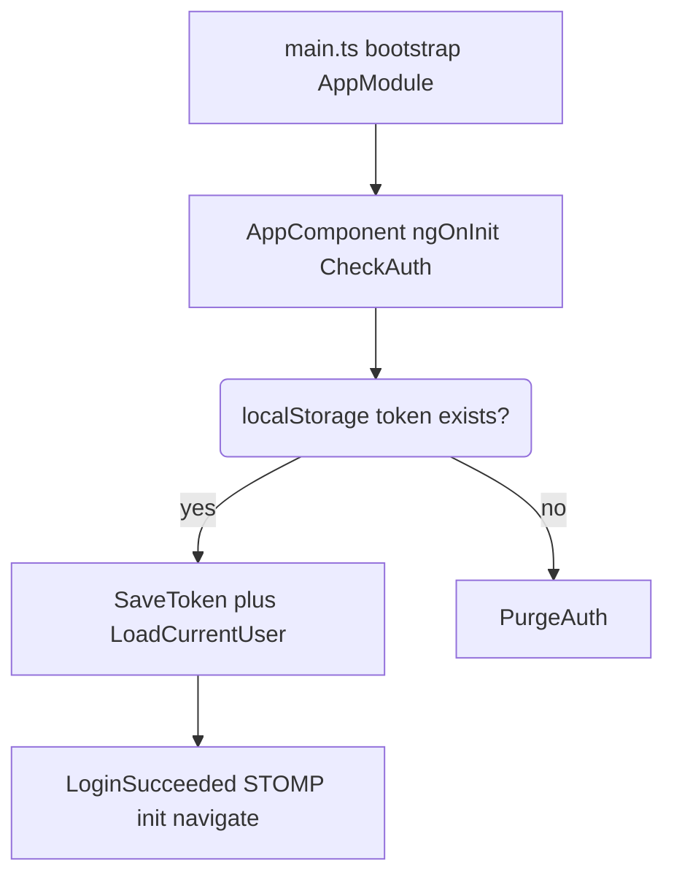
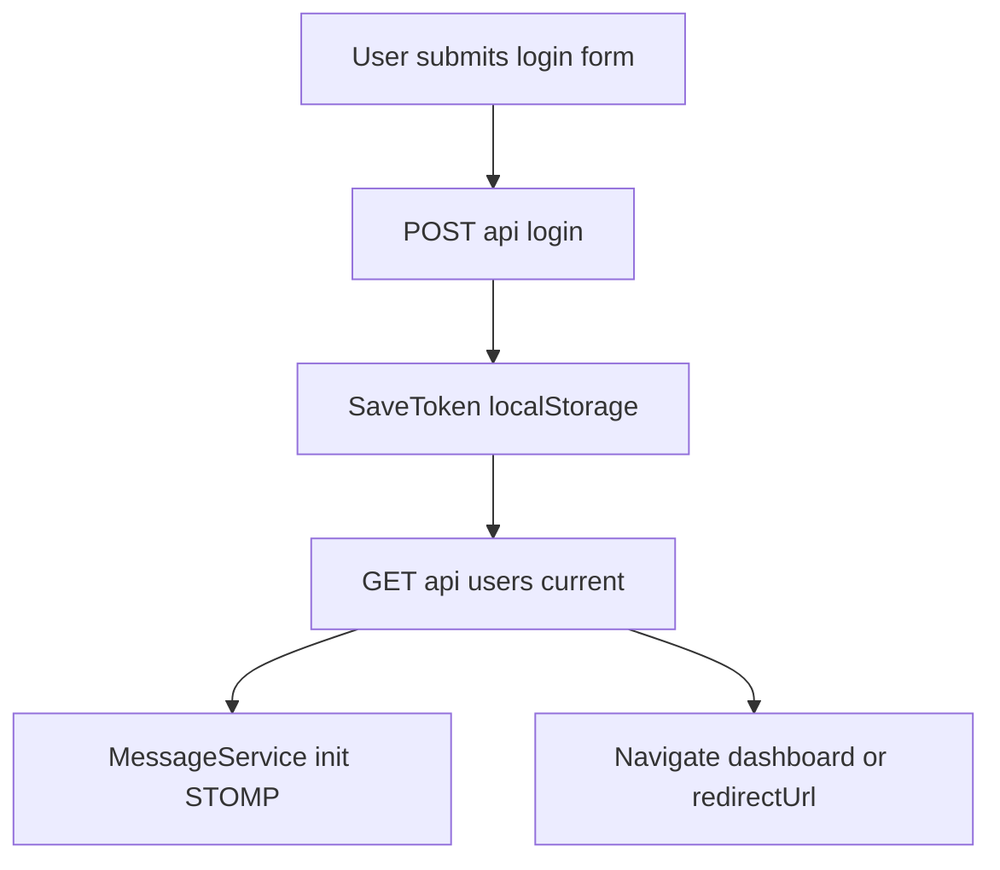
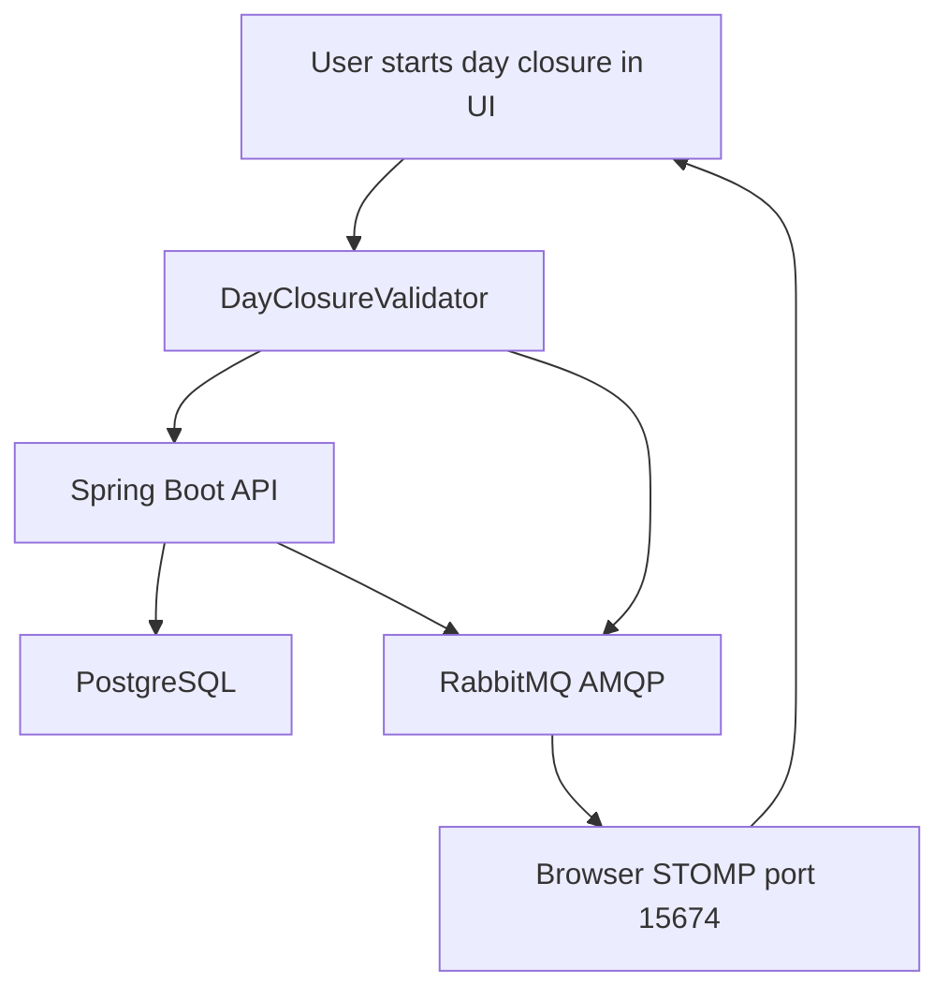
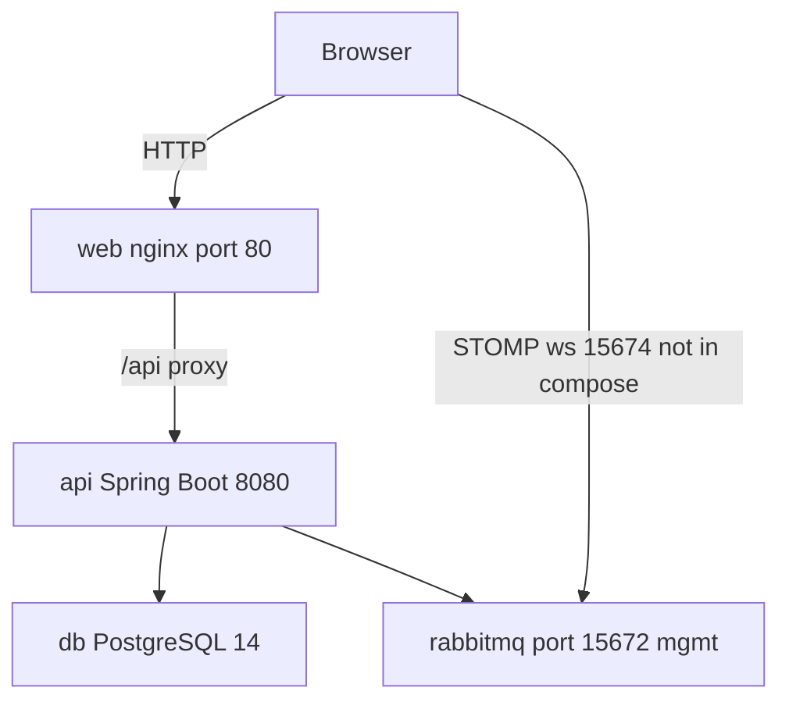

# OpenCBS Cloud — System Gotchas

## 0. Plain Language Overview

This document lists tricky behaviors, risks, and workarounds in the **OpenCBS Cloud** core banking application (customer profiles, loans, savings, accounting, and day-end processing). **Developers and DevOps engineers** should use it for onboarding and debugging; **product managers and operations leads** should use it to understand where demos, deployments, or UAT can fail even when “the app looks fine.” After reading, you will know which user flows are fragile, what infrastructure must be up, and which issues are documented shortcuts versus bugs.

**Legacy / mainframe code:** Not found in codebase (no COBOL, RPG, JCL, VB6, PHP, or similar). The active stack is **Angular 8**, **Spring Boot 1.5.4**, **Java 8**, **PostgreSQL 14** (Docker), and **RabbitMQ 3**—dated but modern web technology, not mainframe.

---

## 1. Critical Flows

**Audience — Technical:** Frontend/backend developers tracing runtime behavior.  
**Audience — Non-technical:** PMs and QA leads validating demos, UAT, and go-live checklists.

### 1.1 Application bootstrap and session restore

| Criticality | Gotcha | Why it matters |
|-------------|--------|----------------|
| **High** | On every load, `AppComponent.ngOnInit()` dispatches `CheckAuth`, which reads `localStorage.token` and either dispatches `SaveToken` or `PurgeAuth`—there is no server round-trip to validate the token first (`app.component.ts`, `auth.effect.ts`). | Users can appear logged in with a stale or forged token until an API call fails. |
| **High** | `save_token$` has `// TODO: add validation rules for token` and stores any non-empty payload (`auth.effect.ts`). | Client trusts arbitrary strings in `localStorage`. |
| **Med** | `AppComponent.ngAfterContentChecked()` calls `appReadyService.trigger()` and, on `window` `error` events with a non-login hash, dispatches `PurgeAuth` and navigates to `/login`. | Global JS errors force logout; can surprise users during unrelated UI bugs. |
| **Med** | Default route redirects empty path to `dashboard` with **hash routing** (`app-routing.module.ts`: `useHash: true`). | URLs use `#/...`; bookmarks and proxies must account for hash mode. |

**Verified entry chain:** `client/src/main.ts` → `AppModule` → `AppComponent` → `CheckAuth` → (`SaveToken` → `LoadCurrentUser`) or `PurgeAuth`.

**Diagram Description:** The flowchart shows how the Angular app starts. `main.ts` bootstraps `AppModule`, then `AppComponent` runs `CheckAuth`. If a token exists in browser storage, the app saves it and loads the current user; otherwise it clears auth. After a successful user load, `LoginSucceeded` runs messaging setup and navigation (see login flow below). There is no upfront token validation step in this chain.

### 1.2 Login and post-login navigation

| Criticality | Gotcha | Why it matters |
|-------------|--------|----------------|
| **High** | Successful login: `AUTHENTICATE` → `SaveToken` → `LOAD_CURRENT_USER` → `LoginSucceeded` → `navigateHome$` connects STOMP (`messageService.init()`) and navigates to `redirectUrl`, or if hash matches `login`, to **`/dashboard`** (`auth.effect.ts`, `currentUser.effect.ts`)—not `/profiles`. | Protractor `auth.e2e-spec.ts` expects `#/profiles` after `admin`/`admin` login; that **does not match** current navigation code. |
| **High** | `AuthGuard` only checks `authService.isAuthenticated` (in-memory flag), not token validity (`auth-guard.service.ts`). | Deep links can render until an API returns 401. |
| **Med** | Dev login uses `environment.API_ENDPOINT` (`http://localhost:8080/api/`); production build uses relative `/api/` (`environment.ts`, `environment.prod.ts`). | Wrong build/env breaks login behind nginx. |
| **Med** | `login()` pipes `delay(environment.RESPONSE_DELAY)` (300 ms dev, 0 prod). | Artificial latency in dev only. |

**Diagram Description:** Login posts credentials to the API, stores the returned token, fetches the current user, then initializes RabbitMQ/STOMP messaging and navigates away from the login screen. REST and WebSocket setup are separate steps; REST can succeed while real-time messaging still fails.

### 1.3 Day closure (end-of-day batch)

| Criticality | Gotcha | Why it matters |
|-------------|--------|----------------|
| **High** | `DayClosureValidator.validateTryCloseDay()` blocks start when: active maker-checker requests exist, date before last successful closure, closure already `IN_PROGRESS`, **any till is `OPENED`**, or RabbitMQ health publish fails (`DayClosureValidator.java`, `AmqMessageHelper.checkConnectionHealth()`). | Operations must approve pending requests and close all tills first; broker outage blocks closure entirely. |
| **High** | Rabbit health check only **publishes** to `amq.topic` / `healthQueue`; receive-side check is commented out (`RabbitSenderServiceImpl.checkConnectionsHealth()`). | “Healthy” means publish succeeded, not full round-trip. |
| **High** | UI progress depends on STOMP after login (`MessageService.init` → `GET .../configurations/rabbit-credential` → WebSocket `ws://{host}:15674/ws`). Port **15674** is hardcoded in `message.service.ts`; `docker-compose.yml` only publishes **15672** (management UI). | Default Docker may not expose STOMP to the browser; day-closure toasts/progress can be silent while REST still works. |
| **Med** | `ConfigService.getRabbitProperties()` exposes `rabbitProperties.getFrontHost()` to the browser as STOMP host—not `host` (`ConfigService.java`). | Misconfigured `spring.rabbitmq.frontHost` breaks WebSocket even when the API reaches RabbitMQ internally. |

**Diagram Description:** Day closure starts from the UI and passes server-side validation (tills closed, no blocking requests, dates valid, message broker reachable). The API updates PostgreSQL and publishes AMQP messages. The browser must maintain a separate STOMP WebSocket on port 15674 to receive live updates; that path is not proxied through nginx and is not opened in the default Compose file.

### 1.4 Loan flow (manual E2E vs automated tests)

| Criticality | Gotcha | Why it matters |
|-------------|--------|----------------|
| **High** | Full loan journey (payment methods → branch → roles → users → product → credit committee → profile → application → disburse → repay) is documented in `E2E_TEST_SCENARIOS.md` with **ordered seed data**; not loaded by automated tests. | Fresh environments fail mid-flow without manual setup. |
| **High** | Credit committee voting: `isCurrentUserAbleToChangeStatus()` requires `ccMember.role.name === currentUser.role` (string match on role **name**, e.g. `Loan Officer`) (`loan-application-credit-committee.component.ts`). | `Administrator` cannot vote; use `john.doe` / Loan Officer per scenarios doc. |
| **Med** | `E2E_TEST_SCENARIOS.md` header lists PostgreSQL 16 / port 5433 / RabbitMQ 3.12.1; `docker-compose.yml` uses **PostgreSQL 14-alpine** and does not publish DB port. | Environment doc and Compose differ—use Compose for container versions when deploying via Docker. |
| **Low** | Protractor: `auth.e2e-spec.ts` covers login UI; `app.e2e-spec.ts` is an empty shell. | Automated e2e does not guard regression on loan flows. |

### 1.5 Shared UI: dates, numbers, and formats

| Criticality | Gotcha | Why it matters |
|-------------|--------|----------------|
| **High** | `ValidateNumberField` returns `{validNumber: true}` when the regex **matches**, and `null` when it does not (`input-number-validator.ts`)—opposite of typical Angular validators (error object = invalid). | Numeric fields can show valid when invalid if this validator is wired incorrectly. |
| **Med** | `DateFormatPipe` / `NumberFormatPipe` / `TimeFormatPipe` read `SystemSettingsShareService` in the **constructor**; settings are populated asynchronously in `AppComponent` from the store. | First render may use undefined format until settings load. |
| **Med** | `LocalStorageService.getDateFormat()` treats `localStorage` value `'undefined'` as missing and falls back to `environment.DATE_FORMAT_MOMENT` (`local-storage.service.ts`). | Stale literal string `'undefined'` in storage affects all date controls. |
| **Med** | `form-date-control` `dateValidator` accepts strict format from settings **or** ISO-8601 (`form-date-control.component.ts`). | Mixed formats can pass validation unexpectedly. |
| **Med** | Documented UAT workaround: repayment screen “Invalid date” until **PREVIEW** clicked twice (`E2E_TEST_SCENARIOS.md` Known Issues)—root cause described as date picker emitting invalid format before interaction; fix not found in tracked repayment component code beyond scenario notes. | QA must know the double-PREVIEW workaround. |
| **Low** | `validateDate` pipe uses strict `moment(value, format, true)` (`validate-date.pipe.ts`). | Template-level date checks depend on `DATE_FORMAT_MOMENT` / args alignment. |

**Pagination convention:** `HttpClientHeadersService.buildQueryParams` and several services send `page - 1` to the API (0-based server paging).

---

## 2. Legacy Hacks

**Audience — Technical:** Maintainers changing security, integrations, or accounting.  
**Audience — Non-technical:** Risk owners assessing production readiness and regulatory exposure.

| Criticality | Area | Evidence | Why |
|-------------|------|----------|-----|
| **High** | JWT signing secret | `SecretKeyProvider.getKey()` returns bytes of literal `"secret"` with `// TODO: return a real secret string` | Tokens are forgeable if this ships unchanged. |
| **High** | JWT lifetime | `TokenHelper.tokenFor()` — `// TODO: For now the token does not expire`; idle timeout only via system setting `EXPIRATION_SESSION_TIME_IN_MINUTES` and `user.lastEntryTime`; `minutes == 0` means never idle-expire (`TokenHelper.java`) | No `exp` claim; stolen tokens work until idle policy applies (or never). |
| **High** | Loan write-off penalties | `LoanOperationsService` — multi-penalty loop **commented out** with `///TODO Commetn this code becouse need URGENTLY RELEASE IMPACT FINANCE`; only first `LoanApplicationPenalty` used | Write-off accounting may not match business expectation for multiple penalties. |
| **High** | SEPA export placeholders | `SepaIntegrationMapper` — hardcoded BIC `BGLLLULLXXX` and creditor id `LU59ZZZ000000000LU28524286` with TODOs | Integration output is not institution-specific. |
| **High** | Jasper missing template handling | `JasperReportService.getReport()` creates `IllegalArgumentException` when template is null but **does not throw**; later NPE possible (`JasperReportService.java` ~147–156) | Loan dashboard 500 when no template (`E2E_TEST_SCENARIOS.md`). |
| **Med** | Loan event “virtual” types | `LoanEventService.setVirtualName()` — `//todo Rewrite this hardcode` switch maps disbursement/repayment/write-off to virtual enum values | UI/history grouping depends on manual mapping when new event types are added. |
| **Med** | SQL analytics mocks | Flyway migrations (e.g. `V125__Active_loan_function.sql`) — comments: `todo it's mock, relation loan to purpose are absent` | Reports using these functions may use placeholder logic. |
| **Med** | Current account numbering | `CoreCurrentAccountGenerator` — prefix `001001` + `// TODO implement branch code and BIC logic` | Account numbers may not reflect branch/BIC rules. |
| **Med** | Maven Docker build | `opencbs-server/Dockerfile` disables Maven HTTP blocker mirror so JasperReports can pull `itext` over HTTP | Build depends on fragile mirror override. |
| **Med** | Date range validators (server) | `LoanValidator`, `SavingValidator`, `TermDepositValidator` — `//TODO make null safety` on `compareTo` date bounds | Null boundary dates may throw or validate incorrectly. |
| **Med** | Account balances | `AccountBalanceService.getAccountBalances(...)` — `//TODO DO NOT USE this method for balance calculation!` | Authoritative balances should use other paths. |
| **Low** | `AccountEnrichService` — `/// TODO need refactoring because full TRASH and UGAR` | Known messy enrichment path. |
| **Low** | Client auth token | `auth.effect.ts` — `TODO: add validation rules for token` | Client-side trust of storage. |

**Feature flag (a switch that turns functionality on/off):** Not found in codebase as a dedicated feature-flag framework. Behavior toggles use **system settings** and **environment** values (e.g. `environment.ts` `NAVS`), not named feature flags.

**Commented-out / unused legacy code:** Per task scope, not catalogued here.

---

## 3. Hard Dependencies

**Audience — Technical:** DevOps and platform engineers.  
**Audience — Non-technical:** Stakeholders planning uptime, security, and infrastructure cost.

### 3.1 Docker Compose topology (`docker-compose.yml`)

| Service | Image / build | Host ports | Waits on | Healthcheck |
|---------|---------------|------------|----------|-------------|
| `db` | `postgres:14-alpine` | none published | — | `pg_isready` |
| `rabbitmq` | `rabbitmq:3-management-alpine` | `15672` (management UI) | — | `rabbitmq-diagnostics ping` |
| `api` | `server/opencbs-server/Dockerfile` | `8080` exposed only | `db`, `rabbitmq` **healthy** | **None** |
| `web` | `client/Dockerfile` | `80` | `api` started (not healthy) | **None** |

| Criticality | Gotcha | Why |
|-------------|--------|-----|
| **High** | `web` `depends_on: api` without API readiness probe | Nginx can proxy to a JVM still starting → 502 on first requests. |
| **High** | `application-docker.properties` is **COPY**’d in `opencbs-server/Dockerfile` but file is **gitignored** (`server/.gitignore`: `**/application-*.properties`) and **not present** in the workspace tree | Docker API image build/runtime config may be missing unless supplied locally. |
| **Med** | RabbitMQ: only `15672` published; STOMP **15674** not in compose | Browser real-time features need extra port mapping and `spring.rabbitmq.frontHost`. |
| **Med** | API not published on host in compose (`expose: 8080` only) | Local dev hits API via nginx on port 80, not direct 8080, unless compose is customized. |
| **Low** | Postgres volume `postgres_data` only persistence | Broker/attachments rely on bind mounts under `./server/templates`, `./server/attachments`. |

**Verified stack versions (from repo files):**

| Component | Version / source |
|-----------|------------------|
| Spring Boot | `1.5.4.RELEASE` (`opencbs-spring-boot-starter/pom.xml`) |
| Java | `1.8` (Maven property; Docker `eclipse-temurin:8-jre-alpine`) |
| Angular | `^8.1.4` (`client/package.json`) |
| Node (client build) | `node:14-alpine` (`client/Dockerfile`) |
| PostgreSQL (Compose) | `14-alpine` |
| RabbitMQ (Compose) | `3-management-alpine` |
| Nginx | `1.21-alpine` |

**Diagram Description:** Docker Compose starts PostgreSQL and RabbitMQ first; the API waits for both health checks. The web container starts after the API container is created but not necessarily ready. Users reach the app on port 80; REST goes through nginx to the API. The browser may also connect directly to RabbitMQ on STOMP port 15674 for messaging—that leg is not in the default compose port list.

### 3.2 Failure modes

| Criticality | Dependency down / misconfigured | Symptom |
|-------------|----------------------------------|---------|
| **High** | PostgreSQL unavailable | API fails; Flyway migrations per module do not run. |
| **High** | RabbitMQ unavailable at day closure | `RuntimeException`: `Connection to Message broker is failed!` |
| **High** | Missing or wrong `application-docker.properties` | API container may not start or cannot reach DB/MQ. |
| **Med** | STOMP/WebSocket unreachable | REST works; notifications and day-closure progress via MQ silent. |
| **Med** | Wrong `spring.rabbitmq.frontHost` | Browser STOMP connects to wrong host (`ConfigService` uses `frontHost`). |
| **Med** | Default JWT secret `"secret"` | Acceptable only for local dev; critical in production. |
| **Low** | JasperReports template missing | Loan dashboard error; other tabs may work (`E2E_TEST_SCENARIOS.md`). |

**RabbitMQ `@RabbitListener` consumers:** Not found in codebase — API appears **publish-oriented** for messaging.

---

## 4. Institutional Knowledge

**Audience — Technical:** Developers extending modules and APIs.  
**Audience — Non-technical:** PMs and business analysts interpreting reports, roles, and UAT notes.

| Criticality | Topic | Detail |
|-------------|-------|--------|
| **High** | Maker-checker vs day closure | Active requests block day closure (`DayClosureValidator` + `requestService.isActiveRequests()`). |
| **High** | Till status | Open tills block day closure (`checkTills()` lists open till names in exception message). |
| **Med** | Browser messaging credentials | Any authenticated user can call `GET /api/configurations/rabbit-credential` (`ConfigController.java`); credentials used for direct browser→broker STOMP. |
| **Med** | Custom fields API | AsciiDoc states no single-field fetch; workaround is load all (`api-guide-people-custom-fields.adoc`, `api-guide-companies-custom-fields.adoc`). |
| **Med** | Open tills / credit committee / repayment | See `E2E_TEST_SCENARIOS.md` Known Issues table (dashboard 500, role voting, double PREVIEW, password field note). |
| **Med** | Multi-module Flyway | Separate Flyway configs per domain module (`LoanFlywayConfig`, `SavingFlywayConfig`, `TermsFlywayConfig`, etc.) under `com.opencbs`. |
| **Med** | Attachments GET endpoints | Several profile/loan attachment GET paths are **permitAll** in `WebSecurityConfiguration.java`—know before security reviews. |
| **Low** | IE9 notice | `client/src/index.html` includes outdated-browser conditional for IE ≤ 9. |
| **Low** | `cbs-schedule` | Wraps **FullCalendar** via global `jQuery` (`schedule.component.ts`)—legacy jQuery 2 dependency in `package.json`. |

**Not found in codebase:**

- Dedicated feature-flag framework.
- `application-docker.properties` or `spring.datasource.*` values in tracked files (gitignored).
- Mainframe or legacy web application sources.
- Automated Protractor coverage beyond auth login UI.

**Related local docs (not duplicated here):** `OpenCBS/README.md`, `OpenCBS/E2E_TEST_SCENARIOS.md`, `OpenCBS/ARCHITECTURE.md`, `OpenCBS/INTEGRATIONS.md`, `OpenCBS/SECURITY.md`.

---

## FILE REPORT

| Item | Value |
|------|--------|
| **Path** | `/home/vishal/repos/session_954f8999a61f/SYSTEM_GOTCHAS.md` |
| **Generated from** | Active sources under `/home/vishal/repos/session_954f8999a61f/OpenCBS` (entry points, `docker-compose.yml`, shared client validators/pipes, e2e specs, server security/day-closure/loan paths, TODO/FIXME scan) |
