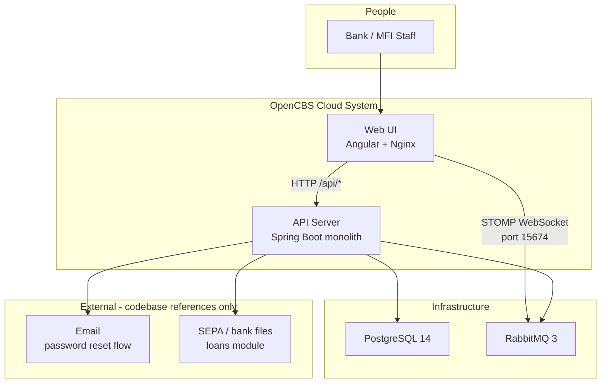
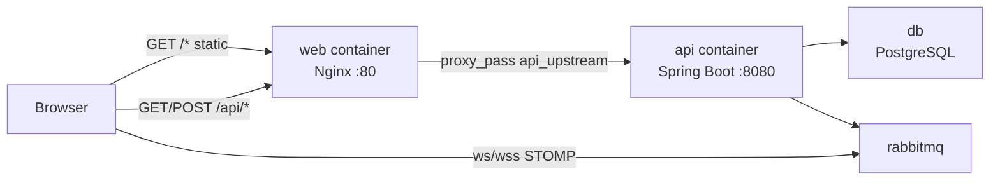
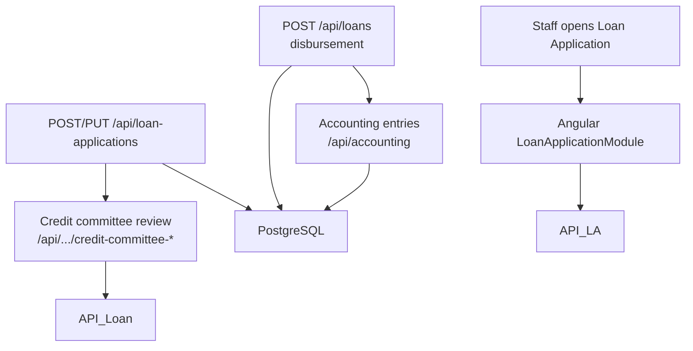

# OpenCBS Cloud — System Overview (30,000 ft)

**Repository path:** `/home/vishal/repos/session_954f8999a61f/OpenCBS`  
**Workspace root:** `/home/vishal/repos/session_954f8999a61f` (application code lives under `OpenCBS/`)

---

## (0) Plain Language Overview

This document describes **OpenCBS Cloud**, an open-source core banking platform that helps financial institutions manage customers, loans, savings, cash at the teller window, accounting, and reports through a web application. **Developers and architects** will learn how the browser app, API server, database, and message broker fit together; **product owners and managers** will learn what business problems the platform solves, who uses it, and which major capabilities exist. After reading, both audiences should have a shared, accurate picture of the whole system without needing to read source code.

---

## (1) Business Context

**Audience:** Product owners and operations leaders (non-technical); solution architects and engineering leads (technical).

### Platform purpose

From `OpenCBS/README.md`, **OpenCBS Cloud** (also named **OpenCBS-Cloud** in Maven metadata) is a flexible, scalable **Core Banking System** (software that runs day-to-day banking operations) optimized for cloud deployment, developed from 2017 onward. It is positioned as simpler to deploy than traditional core banking systems and emphasizes a user-centric interface for institution staff.

### Target organizations and personas

| Persona / segment | Evidence |
|-------------------|----------|
| Microfinance institutions, cooperative financial institutions, digital lenders, medium-sized banks | `OpenCBS/README.md` |
| Financial institution **employees** (operators) | `OpenCBS/README.md` |
| Staff roles reflected in UI/i18n | `client/src/assets/i18n/en.json` (e.g. Users, Roles, Teller, Loan officer, Credit committee, Cashier) |

End **customers** of the institution are modeled as **profiles** (people, companies, groups) managed by staff; the codebase is operator-facing, not a retail customer self-service portal.

### Verified capabilities

**From root README:**

- Client management  
- Loan management  
- Savings management  
- Collateral management  
- Loan schedule generation  
- Loan portfolio tracking  
- Custom fields  
- Accounting  
- Reports  

**From web navigation** (`client/src/environments/environment.ts` and `environment.prod.ts`, keys in `en.json`):

| Area | Route (hash-based) |
|------|-------------------|
| Profiles | `/profiles` |
| Loan applications | `/loan-applications` |
| Loans | `/loans` |
| Borrowings | `/borrowings` |
| Savings | `/savings` |
| Term deposits | `/term-deposits` |
| Bonds | `/bonds` |
| Teller management | `/till` |
| Transfers | `/transfers` |
| Accounting (general ledger, chart of accounts) | `/accounting/accounting-entries`, `/accounting/chart-of-accounts` |
| Maker/checker (approvals) | `/requests` |
| Reports | `/report-list` |

**Configuration and settings** (Angular modules under `client/src/app/containers/configuration/` and `settings/`): branches, users, roles, loan/savings/borrowing/term-deposit products, tills, vaults, holidays, custom fields, payment methods, credit committee, audit trail, operation day, exchange rates, payment gateway, bank integration.

### Legacy and modernization notes

| Finding | Detail |
|---------|--------|
| **Mainframe / COBOL / JCL / RPG / VB6** | **Not found in codebase** (search across legacy extensions returned no files). |
| **Older enterprise stack** | **Present** — requires operational attention: Java 8 (`opencbs-spring-boot-starter/pom.xml`, Docker JRE), Spring Boot **1.5.4.RELEASE**, Angular **8.1.x**, TypeScript compile target **es5** (`client/tsconfig.json`), jQuery **2** (`client/package.json`). |

---

## (2) Service Inventory

**Audience:** Infrastructure and platform engineers (technical); program managers tracking dependencies (non-technical).

The deployment model in this repository is a **modular monolith** (one API process composed of Maven modules), not separate microservice repositories. Runtime **containers** are defined in `OpenCBS/docker-compose.yml`.

### Docker Compose runtime services

| Compose service | Image / build | Role | Host exposure | Criticality |
|-----------------|---------------|------|---------------|-------------|
| **db** | `postgres:14-alpine` | Primary relational database (`POSTGRES_DB=opencbs`) | Internal to compose network | Critical |
| **rabbitmq** | `rabbitmq:3-management-alpine` | Message broker for real-time UI notifications | Management UI `15672:15672` | High (UI messaging) |
| **api** | Built from `server/opencbs-server/Dockerfile` | Spring Boot REST API on port **8080** | `expose: 8080` only (not published to host) | Critical |
| **web** | Built from `client/Dockerfile` (Nginx **1.21-alpine**) | Serves Angular static assets; proxies `/api` to **api** | **80:80** → `http://localhost` | Critical |

**Volume mounts (api):** `./server/templates` → `/app/templates`, `./server/attachments` → `/app/attachments`  
**Named volume:** `postgres_data` for database persistence.

**Team ownership / repo links:** Not found in codebase.

### Backend Maven modules (logical boundaries inside the API)

From `server/pom.xml`:

| Module | Purpose (from structure and controllers) |
|--------|------------------------------------------|
| **opencbs-core** | Profiles, users, roles, branches, accounting, tills/vaults, transfers, maker-checker requests, reports, day closure, audit, system settings, Flyway core migrations |
| **opencbs-loans** | Loan applications, loans, collateral, credit committee, repayments, SEPA integration (`/api/sepa/integration`) |
| **opencbs-borrowings** | Institution borrowings (`/api/borrowings`, products, events, repayment) |
| **opencbs-savings** | Savings accounts and products (`/api/savings`, `/api/saving-products`) |
| **opencbs-term-deposits** | Term deposits and products (`/api/term-deposits`, `/api/term-deposit-products`) |
| **opencbs-bonds** | Bonds domain (`/api/bonds`, bond products, events, repayment) — **see wiring note below** |
| **opencbs-spring-boot-starter** | Parent POM: shared dependencies (PostgreSQL driver, Flyway, JasperReports, Lombok) |
| **opencbs-server** | Runnable JAR; entry point `ServerApplication` |

**Wiring note (verified):** `opencbs-server/pom.xml` declares dependencies on **loans, borrowings, savings, term-deposits** but **not** `opencbs-bonds`. The Docker build still compiles `opencbs-bonds` (`server/opencbs-server/Dockerfile`). The Angular UI includes a **Bonds** module and navigation. Whether bond APIs are active in a given deployment depends on classpath wiring — **bonds backend may be incomplete in default server packaging**.

### Frontend application

| Component | Location | Description |
|-----------|----------|-------------|
| **opencbs-client** | `OpenCBS/client/` | Angular app (`package.json` name `opencbs-client`, project `new-client` in `angular.json`) |

### Workspace-level artifacts outside OpenCBS

| File | Note |
|------|------|
| `EXECUTIVE_SUMMARY.md` | Companion summary at workspace root; not part of application runtime |

---

## (3) High-Level Architecture

**Audience:** Architects and senior developers (technical); business analysts mapping systems (non-technical).

### C4 Context-level view

The diagram below is a **C4 Context diagram** (a simple map of people, the software system, and external technical dependencies).

**Diagram Description:** Staff users interact with the OpenCBS web application in a browser. The web tier serves the Angular UI and forwards REST calls under `/api` to the Spring Boot API server. The API persists data in PostgreSQL and publishes or consumes messages via RabbitMQ; the browser also connects to RabbitMQ over STOMP WebSockets for real-time notifications. The loans module includes SEPA integration endpoints and related database artifacts; password reset in `LoginController` implies email delivery, but specific mail server configuration was **not found in codebase** (missing `application*.properties` files in this workspace snapshot).

### Request path (production Docker)

**Diagram Description:** In the Docker Compose layout, users hit port 80 on the **web** container. Nginx serves the compiled Angular app from `/usr/share/nginx/html` and proxies paths starting with `/api` to the **api** service (`client/default.conf` defines `upstream api_upstream { server api:8080; }`). The API container talks to PostgreSQL and RabbitMQ on the internal Docker network. The browser may connect directly to RabbitMQ’s Web STOMP plugin (client builds URL with host and port **15674** in `message.service.ts`); RabbitMQ STOMP port exposure in `docker-compose.yml` is **not** explicitly mapped (only **15672** management UI is published).

### Application entry points and active execution flow

#### Browser client

1. **`client/src/main.ts`** — bootstraps `AppModule` via `platformBrowserDynamic()`; enables production mode when `environment.production` is true.  
2. **`AppModule`** (`client/src/app/app.module.ts`) — loads feature modules (profiles, loans, savings, accounting, etc.), NgRx store/effects, HTTP interceptor, i18n.  
3. **`AppComponent`** — on init dispatches `CheckAuth`; loads system settings; supports languages `en`, `ru`, `fr` (and `ar.json` exists under `assets/i18n/`).  
4. **Routing** — `AppRoutingModule` uses **hash routing** (`useHash: true`) and redirects `''` → `dashboard`. Feature routes live in child routing modules (e.g. `dashboard-routing.module.ts`).  
5. **API access** — `environment.prod.ts` sets `API_ENDPOINT: '/api/'` (proxied by Nginx); dev `environment.ts` uses `http://localhost:8080/api/`.  
6. **Auth** — `HttpClientHeadersService` attaches `Authorization: Bearer <token>` from `localStorage` key `token`. Login endpoints: `POST /api/login`, etc. (`LoginController`).  
7. **Real-time** — `MessageService` connects STOMP to RabbitMQ exchanges after user and Rabbit config are loaded.

#### API server

1. **`com.opencbs.cloud.ServerApplication`** — `@SpringBootApplication`, `@ComponentScan("com.opencbs")`, `@EntityScan("com.opencbs")`, `@EnableAsync`, `@EnableScheduling`.  
2. **HTTP security** — `WebSecurityConfiguration`: stateless sessions; JWT/filter via `AuthenticationTokenFilter`; most `/api/**` routes require authentication; public routes include `/api/login`, some attachment GETs, `/api/info`, `/api/system-settings`, `/api/utils/**`.  
3. **Schema** — `CoreFlywayMigrationStrategy` runs Flyway for `classpath:db/migration/core` then per-module configs (e.g. loans, savings, term deposits, borrowings).  
4. **REST surface** — Controllers use `/api/...` prefixes (examples in section 5).

### Configuration gap (anti-hallucination)

| Item | Status |
|------|--------|
| `application-docker.properties` | Referenced in `server/opencbs-server/Dockerfile` but **`opencbs-server/src/main/resources/` not present** in this workspace — datasource URLs, Rabbit credentials, JWT secrets: **Not found in codebase** |
| Other `application*.properties` / `.yml` under `server/` | **Not found in codebase** |

---

## (4) Technology Landscape

**Audience:** Developers and DevOps (technical); IT procurement / risk reviewers (non-technical summary).

### Languages and runtimes

| Layer | Technology | Source |
|-------|------------|--------|
| Frontend | TypeScript (target **es5**), Angular **8.1.x**, RxJS **6.5.3** | `client/package.json`, `client/tsconfig.json` |
| Backend | Java **1.8**, Spring Boot **1.5.4.RELEASE** | `opencbs-spring-boot-starter/pom.xml`, Dockerfiles |
| Build | Maven **3.8**, Node **14** (client Docker build), npm | Dockerfiles |
| SQL migrations | Flyway **4.0.3** | `opencbs-spring-boot-starter/pom.xml` |

### Frontend libraries (selected, verified)

| Library | Version (package.json) | Use |
|---------|------------------------|-----|
| @ngrx/store, effects, router-store | ^8.x | Application state |
| @ngx-translate/core | ^10.0.2 | i18n (`assets/i18n/en.json`, `ru.json`, `fr.json`, `ar.json`) |
| @salesforce-ux/design-system | 2.3.1 | UI styling (SLDS classes in environment toast config) |
| ngx-lightning | ^1.0.2 | Lightning Design System Angular wrappers |
| primeng | ^7.0.0 | Tables, UI widgets |
| @stomp/ng2-stompjs | 6.0.0 | RabbitMQ STOMP client |
| pdfmake | ^0.1.57 | PDF generation |
| moment | ^2.24.0 | Dates |
| big.js | ^3.1.3 | Decimal arithmetic |

**Lint / test:** TSLint (`client/tslint.json`), Karma + Jasmine (`client/karma.conf.js`), Protractor e2e (`client/package.json` scripts).

### Backend libraries (selected, verified)

| Library | Version | Use |
|---------|---------|-----|
| PostgreSQL JDBC | 42.2.2 | Database driver |
| Lombok | (managed by Spring Boot parent) | Boilerplate reduction |
| JasperReports | 6.10.0 (parent) / 6.9.0 (server plugin) | Report templates compiled to `.jasper` |
| Spring Cloud | Dalston.SR1 (property in bonds POM; parent starter) | Not further detailed in read files |

### Data stores and messaging

| Component | Technology | Evidence |
|-----------|------------|----------|
| Primary database | **PostgreSQL 14** (Docker image) | `docker-compose.yml` |
| Message broker | **RabbitMQ 3** (management image) | `docker-compose.yml`, `RabbitMQConfiguration.java` |
| File storage | Host-mounted **templates** and **attachments** directories | `docker-compose.yml` volumes |

### Cloud and CI/CD

**Cloud provider, Kubernetes manifests, Terraform:** Not found in codebase (only `docker-compose.yml` for local/container deployment).

### API documentation

`WebSecurityConfiguration` permits `/v2/api-docs/**` and `/swagger-resources/**` — Swagger-related paths exist; full Swagger setup not verified in read files.

---

## (5) Key Business Flows

**Audience:** Business analysts and product managers (non-technical); full-stack engineers implementing or integrating (technical).

Each flow lists **participating parts** (UI module → REST prefix → data store). All REST paths are verified from `@RequestMapping` on controllers.

### Flow A — Staff sign-in and session

| Step | Component |
|------|-----------|
| 1 | User opens web app (`web` container or `ng serve` on port 4200 per `client/README.md`) |
| 2 | `AppComponent` / NgRx `CheckAuth` |
| 3 | `POST /api/login` with credentials (`LoginController`) |
| 4 | Response token stored in `localStorage` as `token`; subsequent requests use Bearer header |
| 5 | `MessageService.init()` loads Rabbit config and opens STOMP subscriptions per user |

**Security model:** Stateless Spring Security; token filter on protected routes (`WebSecurityConfiguration`).

### Flow B — Customer profile lifecycle

| Step | Component |
|------|-----------|
| 1 | UI: **Profiles** (`ProfileModule`, `/profiles`) |
| 2 | API: `/api/profiles`, `/api/profiles/people`, `/api/profiles/companies`, `/api/profiles/groups` and custom-field/attachment sub-resources |
| 3 | Data: Flyway **core** migrations under `opencbs-core/.../db/migration/core/` (e.g. `V2__Create_profiles.sql`) |

Supports custom fields (dynamic forms in `client/src/app/shared/modules/cbs-form/` and `cbs-custom-field-builder`).

### Flow C — Loan application to active loan

| Step | Component |
|------|-----------|
| 1 | UI: **Loan applications** (`LoanApplicationModule`), **Loans** (`LoanModule`) |
| 2 | API: `/api/loan-applications`, `/api/loan-products`, collateral/guarantor/credit-committee endpoints; `/api/loans`, repayments, reschedule |
| 3 | Credit committee voting: `/api/loan-applications/{id}/credit-committee-vote-history` |
| 4 | Data: core + **loans** Flyway schemas |
| 5 | Optional: **SEPA integration** `/api/sepa/integration` (loans module XML/Java under `com.opencbs.loans.xml.sepa`) |

### Flow D — Savings and term deposits (liabilities)

| Step | Component |
|------|-----------|
| 1 | UI: **Savings**, **Term deposits** modules |
| 2 | API: `/api/savings`, `/api/saving-products`; `/api/term-deposits`, `/api/term-deposit-products` |
| 3 | Processing: term deposit day closure / interest accrual processors in `opencbs-term-deposits` Java package `processing` |

### Flow E — Cash operations (teller)

| Step | Component |
|------|-----------|
| 1 | UI: **Teller management** (`TellerManagementModule`, `/till`) |
| 2 | API: `/api/tills` (`TillController`, `TillSavingController`) |
| 3 | Related: vaults `/api/accounting` area, till events in core migrations |

### Flow F — Transfers and accounting

| Step | Component |
|------|-----------|
| 1 | UI: **Transfers**, **Accounting** modules |
| 2 | API: `/api/transfers`; `/api/accounting`, `/api/accounting/` (accounts, balance sheet) |
| 3 | Reports: `/api/reports`, printing forms `/api/printing-forms` |

### Flow G — Maker / checker approvals

| Step | Component |
|------|-----------|
| 1 | UI: **Maker checker** (`MakerCheckerModule`, `/requests`) |
| 2 | API: `/api/requests` (`RequestController`) |
| 3 | Data: maker-checker related core migrations (e.g. `V278__maker_checker_people.sql`) |

### Flow H — End-of-day / operation day

| Step | Component |
|------|-----------|
| 1 | UI: Settings → operation day (`operation-day-routing.module.ts`) |
| 2 | API: `/api/day-closure` (`DayClosureController`) |
| 3 | Module processors (e.g. term deposit day closure) participate in batch logic |

### End-to-end diagram (simplified loan disbursement)

**Diagram Description:** A staff member works in the loan application area of the web UI. The UI calls loan-application REST endpoints to create and update applications. Credit committee endpoints support review and approval steps. After approval, loan creation/disbursement endpoints activate the loan and trigger accounting entries. All steps persist state in PostgreSQL through the Spring Boot monolith; exact disbursement endpoint names and payloads are defined on `LoanController` and related controllers (not enumerated here).

---

## Appendix A — UI module map (feature containers)

**Audience:** Frontend developers (technical); trainers documenting menus (non-technical).

Angular feature areas under `client/src/app/containers/` (each typically has `*-routing.module.ts`):

| Folder | Domain |
|--------|--------|
| `auth` | Login / authentication |
| `dashboard` | Landing dashboard |
| `profile` | Customer profiles |
| `loan-application`, `loan`, `loan-payee` | Lending |
| `borrowing` | Borrowings |
| `savings` | Savings |
| `term-deposit` | Term deposits |
| `bonds` | Bonds |
| `teller-management` | Tills / cashier |
| `transfers` | Transfers |
| `accounting` | GL and chart of accounts |
| `maker-checker` | Approval requests |
| `reports` | Reporting |
| `configuration` | Admin setup (products, branches, roles, etc.) |
| `settings` | Operation day, audit, integrations |
| `event-manager` | Event handling UI |
| `error` | Error pages |

Shared UI building blocks: `client/src/app/shared/` (`CbsSharedModule`, dynamic forms, tree table, file upload, schedule).

---

## Appendix B — Verified REST API prefixes (sample)

**Audience:** Integration developers (technical).

| Prefix | Module |
|--------|--------|
| `/api/login` | opencbs-core |
| `/api/profiles/**` | opencbs-core |
| `/api/users`, `/api/roles` | opencbs-core (controllers present) |
| `/api/loan-applications`, `/api/loans` | opencbs-loans |
| `/api/borrowings` | opencbs-borrowings |
| `/api/savings`, `/api/saving-products` | opencbs-savings |
| `/api/term-deposits`, `/api/term-deposit-products` | opencbs-term-deposits |
| `/api/bonds` | opencbs-bonds |
| `/api/transfers` | opencbs-core |
| `/api/tills` | opencbs-core / opencbs-savings |
| `/api/accounting` | opencbs-core |
| `/api/requests` | opencbs-core (maker-checker) |
| `/api/reports` | opencbs-core |
| `/api/day-closure` | opencbs-core |
| `/api/sepa/integration` | opencbs-loans |

Full controller count: **91** classes annotated with `@RestController` under `server/` (grep count).

---

## Appendix C — Document provenance

| Item | Value |
|------|-------|
| Generated from | Source files under `OpenCBS/` only |
| Mainframe/legacy source | None detected |
| Intentionally ignored | Commented-out code per task instructions |
| Missing config files | `application-docker.properties` and other Spring config files absent from workspace snapshot |

---

*End of System Overview*
